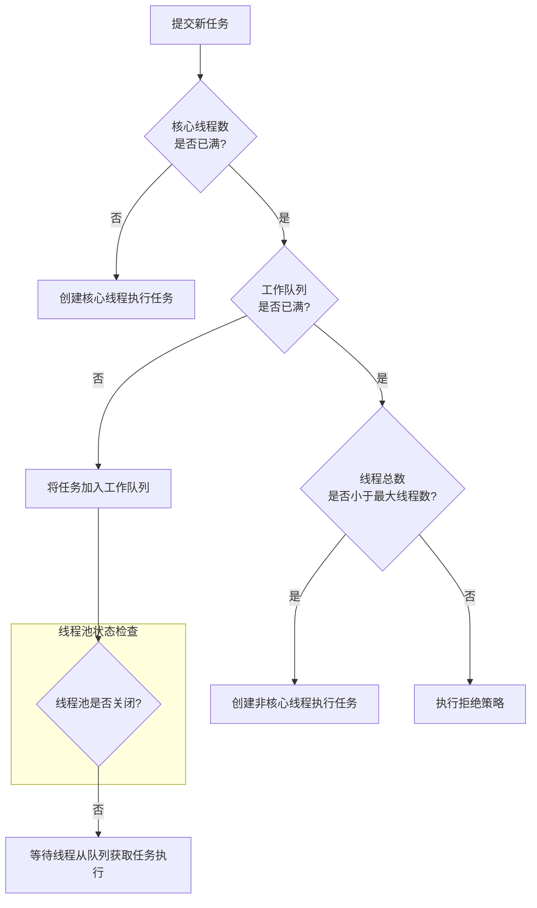

- 特点
	- 平台无关性：Java编译器将源代码编译成字节码（bytecode），该字节码可以在任何安装了Java虚拟机（JVM）的系统上运行
	- 面向对象：使代码更易于维护和重用，包括类（class）、对象（object）、继承（inheritance）、多态（polymorphism）、抽象（abstract）、封装（encapsulation）
	- 内存管理：有自己的垃圾回收机制，自动管理内存和回收不再使用的对象。开发者不需要手动管理内存，减少内存泄漏和其他内存相关的问题
	- 支持多线程，提供封装好多线程支持
	- 支持JIT编译，即时编译器
- 优势
	- 跨平台：JVM，字节码转换为机器码执行。
		- java程序从源代码到运行
			1. 编译：将源代码文件.java编译成JVM可以执行的字节码文件.class
			2. 解释：将字节码翻译成机器码
			3. 执行：操作系统执行二进制的机器码
	- 面向对象
	- 强大的生态系统：spring框架，各种库和工具，舍去支持大，企业应用广泛
	- 内存管理：自动垃圾回收机制，减少内存泄漏问题，对开发者友好
	- 多线程支持：内置的线程机制，方便并发编程
	- 安全性：Java有安全模型。比如沙箱机制，适合网络环境
	- 稳定性：
- 劣势：
	- 性能：启动时间（微服务场景下不如go快）
	- 语法繁琐，样板代码多，不如Python简洁
	- 内存消耗：JVM本身占内存，
	- 面向对象过于严格
	- 开发效率比Python慢
- JVM
	- 编写的Java源码编译后生成一种字节码文件（.class），字节码不能直接运行，必须通过JVM的再次翻译才能执行
	- JVM是c/c++开发的，是编译后的机器码，不能跨平台
- JVM。JDK。JRE三者关系
	- JVM：Java虚拟机，是**Java程序运行的环境**。将Java字节码编译成机器码并执行程序。提供内存管理，垃圾回收，安全性等功能，使Java程序具有跨平台的优势
	- **JRE是Java运行时环境**，是**Java程序运行所需的最小环境**，包含了JVM和一组Java类库，用于支持Java程序的执行。不包含开发工具，只提供Java程序运行所需的运行环境
	- JDK：Java开发工具包，是**开发Java程序所需的工具集合**。包含JVM。编译器（javac），调试器（jdb）等开发工具，以及一系列类库（Java标准库和开发工具库）。**JDK提供了开发、编译、调试和运行Java程序所需的全部工具和环境**
	- 
	

### JVM

#### 内存区域

[JVM内存区域](JVM内存区域.md)
#### 1. 程序计数器
- **作用**：可以看作是当前线程所执行的**字节码的行号指示器**。字节码解释器通过改变这个计数器的值来选取下一条需要执行的字节码指令。
    
- **特性**：**线程私有**。这是唯一一个在《Java虚拟机规范》中**没有规定任何 `OutOfMemoryError`** 情况的区域。
    
#### 2. Java 虚拟机栈
- **作用**：描述 Java **方法执行的内存模型**。每个方法在执行的同时都会创建一个**栈帧**，用于存储：
    
    - **局部变量表**：存放基本数据类型（`int`, `double`, `boolean` 等）、对象引用（`reference` 类型）。
        
    - **操作数栈**：用于方法执行过程中的计算。
        
    - **动态链接**：指向运行时常量池中该栈帧所属方法的引用。
        
    - **方法出口**：返回地址等。
        
- **特性**：**线程私有**。
    
- **异常**：
    
    - `StackOverflowError`：如果线程请求的栈深度大于虚拟机所允许的深度（例如无限递归）。
        
    - `OutOfMemoryError`：如果虚拟机栈可以动态扩展，但在扩展时无法申请到足够的内存。
        
#### 3. 本地方法栈

- **作用**：与虚拟机栈非常相似，其区别不过是**为虚拟机使用到的 Native 方法服务**（如用 C/C++ 编写的方法）。
    
- **异常**：同样会抛出 `StackOverflowError` 和 `OutOfMemoryError`。
    
#### 4. 堆

- **作用**：**此内存区域的唯一目的就是存放对象实例和数组**。几乎所有通过 `new` 关键字创建的对象都会在这里分配内存。它是**垃圾收集器管理的主要区域**，因此也被称为“GC 堆”。
    
- **特性**：**线程共享**。
    
- **异常**：`OutOfMemoryError`：如果在堆中没有内存完成实例分配，并且堆也无法再扩展时。
    
#### 5. 方法区

- **作用**：存储已被虚拟机加载的：
    
    - **类型信息**（类名、访问修饰符、常量、字段描述、方法描述等）
        
    - **运行时常量池**
        
    - **静态变量**（`static`）
        
    - **即时编译器编译后的代码缓存**等。
        
- **特性**：**线程共享**。
    
- **实现**：
    
    - **JDK 7 之前**：被称为“永久代”，是堆的一部分。
        
    - **JDK 8+**：被称为“**元空间**”，使用**本地内存**，不再受JVM堆大小的直接限制，避免了永久代的OOM问题。
        

---

#### 二、堆的分区 (Generations)

Java 堆是垃圾回收的重点区域，为了更高效地进行内存回收，JVM 将堆划分为**新生代**和**老年代**。


1. **新生代**
    
    - **Eden 区**：对象**首次创建**时分配内存的区域。是对象诞生的地方。
        
    - **Survivor 区**：分为 **From Survivor (S0)** 和 **To Survivor (S1)** 两个区域，它们大小相等，并且同一时间总有一个是空的。
        
2. **老年代**
    
    - 存放**长期存活的对象**和**大对象**（如很大的数组，可能直接分配在老年代）。
        

**对象晋升流程**：

1. 新对象首先在 **Eden** 区分配。
    
2. 当 Eden 区满时，会触发一次 **Minor GC**。存活下来的对象会被移动到 **Survivor0**。
    
3. 下一次 Minor GC 时，会同时清理 Eden 和 Survivor0 区。存活下来的对象会被移动到 **Survivor1**，同时将其**年龄**（Age）加 1。
    
4. 此后，每次 Minor GC，存活对象都会在 **S0 和 S1 之间来回移动**，同时年龄增加。
    
5. 当对象的年龄增加到一定阈值（默认为 **15**，可通过 `-XX:MaxTenuringThreshold` 设置）时，它就会被晋升到**老年代**。
    

---

#### 三、新生代与老年代的垃圾回收

JVM 的垃圾回收行为因对象所在区域而异，主要分为两种：**Minor GC** 和 **Major GC / Full GC**。

#### 1. 新生代垃圾回收 (Minor GC)

- **触发条件**：当 **Eden 区空间不足**时触发。
    
- **算法**：使用 **复制算法**。
    
- **过程**：
    
    1. 把 Eden + **一个** Survivor (例如 S0) 中**所有存活的对象**，一次性复制到**另一个空的** Survivor (例如 S1) 中。
        
    2. 然后直接**清空** Eden 和刚才使用的那个 Survivor (S0)。
        
- **为什么高效**：
    
    - 新生代的对象 **“朝生夕死”**（死亡率高），每次 GC 后存活的对象很少，复制这些少量对象的成本很低。
        
    - 复制算法在**存活率低**的场景下效率最高。
        

#### 2. 老年代垃圾回收 (Major GC / Full GC)

- **触发条件**：
    
    1. 老年代空间不足。
        
    2. 方法区（元空间）空间不足。
        
    3. 调用 `System.gc()`，建议 JVM 执行 GC（不保证执行）。
        
    4. Minor GC 后存活的对象大小超过老年代的剩余空间（**晋升担保失败**）。
        
- **算法**：通常使用 **标记-清除** 或 **标记-整理** 算法。
    
    - **标记-清除**：先标记出所有需要回收的对象，然后统一回收。**会产生内存碎片**。
        
    - **标记-整理**：标记过程与“标记-清除”一样，但后续不是直接清理，而是让所有存活的对象都向一端移动，然后直接清理掉边界以外的内存。**解决了内存碎片问题**。
        
- **特点**：
    
    - **速度慢**：因为老年代存活对象多，需要处理的数据量大。
        
    - **STW时间长**：Full GC 会暂停所有应用线程（Stop-The-World），对应用性能影响非常大，是调优的重点规避对象。
        

#### 总结

|区域|特点|GC 类型|GC 算法|目标|
|---|---|---|---|---|
|**新生代**|对象死亡率高|**Minor GC**|**复制算法**|快速清理短期对象，效率高|
|**老年代**|对象存活率高|**Major GC / Full GC**|**标记-清除/整理**|清理长期对象，减少碎片，减少STW|

理解这些分区和回收机制，是进行 JVM 性能调优（如调整 `-Xms`, `-Xmx`, `-XX:NewRatio`, `-XX:SurvivorRatio` 等参数）的基础。优化的核心目标通常是：**减少 Full GC 的发生频率和持续时间**。
### 堆和栈

| 特性       | 堆 (Heap)                  | 栈 (Stack)                               |
| -------- | ------------------------- | --------------------------------------- |
| **物理内存** | **不连续**的内存空间              | **连续**的内存空间                             |
| **功能**   | 存放所有**对象实例**和**数组**       | 存放**局部变量表**、**操作数栈**、**动态链接**、**方法出口**等 |
| **共享性**  | 被所有**线程共享**               | 每个**线程私有**，生命周期与线程相同                    |
| **内存分配** | 在 JVM 启动时创建，空间较大          | 在线程创建时创建，空间较小（默认通常 **1M**）              |
| **生命周期** | 对象的生命周期不确定，由 GC 决定        | 方法调用开始分配，调用结束立即释放（弹出栈帧）                 |
| **错误类型** | `OutOfMemoryError`（堆内存不足） | `StackOverflowError`（通常因为无限递归或调用层次太深）   |
| **访问速度** | **较慢**（需要指针寻址）            | **非常快**（位于缓存中，分配释放只是指针移动）               |
| **管理方式** | **GC（垃圾回收）** 自动管理         | **JVM 自动分配和释放**，无需程序员干预                 |
##### 代码示例与分析

让我们通过一段代码来具体看看堆和栈是如何协作的：

```java
public class HeapStackExample {
    public static void main(String[] args) {
        int localVar = 10; // 1. 基本类型局部变量 -> 栈
        Sample sample = new Sample(); // 2. 创建对象
        sample.setValue(20); // 3. 调用方法
        System.out.println("Local: " + localVar);
        System.out.println("Sample value: " + sample.getValue());
    }
}

class Sample {
    private int value; // 4. 成员变量 -> 在堆中的对象内部

    public void setValue(int value) {
        this.value = value; // 5. 方法参数和this引用 -> 栈
    }

    public int getValue() {
        return value;
    }
}
```

**内存分配过程分析：**

1. **`main` 方法开始执行**：JVM 为 `main` 方法创建一个**栈帧**，压入当前线程的栈中。
    
2. **`int localVar = 10;`**：局部变量 `localVar` 是基本类型，其**值 `10`** 直接存储在 `main` 方法的栈帧的**局部变量表**中。
    
3. **`Sample sample = new Sample();`**：
    
    - `new Sample()`：在**堆**中开辟一块内存，创建一个 `Sample` 对象。对象中包含其成员变量 `value`（此时为默认值 `0`）。
        
    - `Sample sample`：这是一个**引用变量**，它本身存储在 `main` 方法的栈帧中。
        
    -  = 将**堆中 `Sample` 对象的内存地址**赋值给栈中的 `sample` 引用变量。现在，`sample` 这个“便签”指向了“仓库”中的那个 `Sample` 对象。
        
4. **`sample.setValue(20);`**：
    
    - JVM 为 `setValue` 方法创建一个新的**栈帧**，压入栈中。
        
    - 将实参 `20` 传递到 `setValue` 栈帧的局部变量表中（形参 `int value` 的值为 `20`）。
        
    - `this` 引用也存储在 `setValue` 栈帧中，它指向调用该方法的对象（即堆中的那个 `Sample` 对象）。
        
    - `this.value = value;`：通过 `this` 引用找到**堆中的对象**，并将其 `value` 字段的值修改为 `20`。
        
    - `setValue` 方法执行完毕，其栈帧**被弹出并销毁**，其中的局部变量 `value` 和 `this` 也随之消失。
        
5. **方法调用结束**：
    
    - `main` 方法执行完毕，它的栈帧也被弹出。
        
    - 此时，栈为空。
        
    - **堆**中的 `Sample` 对象**不再被任何栈中的引用所指向**，它变成了“垃圾”，等待**垃圾回收器（GC）** 在某个时刻将其从堆中清除。
        
##### 常见错误

1. **`java.lang.StackOverflowError`**
    
    - **原因**：栈空间不足。几乎总是由**无限递归**或方法调用层次过深导致。
    ```java
    // 经典的StackOverflowError例子
    public class StackOverflowDemo {
        public static void recursiveMethod() {
            recursiveMethod(); // 无限递归调用自己
        }
        public static void main(String[] args) {
            recursiveMethod();
        }
    }
    ```
    
2. **`java.lang.OutOfMemoryError: Java heap space`**
    
    - **原因**：堆内存不足。无法再创建新的对象实例。通常是内存泄漏（对象无法被GC回收）或堆空间设置太小（`-Xmx`）导致。
    ```java
    // 可能引发OutOfMemoryError的例子
    import java.util.ArrayList;
    import java.util.List;
    
    public class OutOfMemoryDemo {
        public static void main(String[] args) {
            List<Object> list = new ArrayList<>();
            while (true) {
                list.add(new Object()); // 无限循环创建对象，耗尽堆空间
            }
        }
    }
    ```
    

##### 总结与关键点

- **栈**：管**运行**。存放方法调用、局部变量（基本类型值和对象引用）。速度快，线程私有。
    
- **堆**：管**存储**。存放所有对象本身和数组。速度慢，线程共享，由 GC 管理。
    
- **引用**：存储在**栈**中，指向**堆**中的具体对象。这就像一张写着地址的纸条（栈上的引用）指向一栋实际的房子（堆中的对象）。
    
- **成员变量**（无论是基本类型还是引用类型）都随着对象存储在**堆**中。
    
- **错误**：`StackOverflowError` 是**栈**的错；`OutOfMemoryError` 是**堆**的错。
	
### OOM

##### 一、什么情况下会发生 OOM？

OOM 的本质是 **JVM 内存管理中各个区域无法再满足新的内存分配请求**。根据报错信息的不同，可以分为以下几种主要情况：

 1. Java 堆空间溢出 (`java.lang.OutOfMemoryError: Java heap space`)
	- **原因**：这是**最常见**的 OOM。创建新对象时，堆内存不足。
	- **根本原因**：
	    - ==**内存泄漏**==：对象被无意地（如通过静态集合、错误的作用域）持有引用，无法被垃圾回收器回收，导致可用内存逐渐耗尽。
	    - ==**内存溢出**==：**不是泄漏**。应用确实需要这么多内存来处理业务（如处理一个超大的文件、加载大量数据做计算），但**分配的堆空间不够**。
        
2. 元空间溢出 (`java.lang.OutOfMemoryError: Metaspace`)
	- **原因**：JDK 8+ 中，**加载的类太多**，超出了元空间（Metaspace）的大小限制。
	- **根本原因**：
	    - 动态生成大量类（如使用 CGLib、ASM、JSP 等）。
	    - 同一个类被不同的类加载器多次加载（常见于 Tomcat 等应用服务器，应用重启后未清理）。
	    - 第三方库或框架大量使用反射。
        
3. GC 开销限制超出 (`java.lang.OutOfMemoryError: GC overhead limit exceeded`)
	- **原因**：这是一种“保护性”的 OOM。JVM 发现 GC 花费了**超过 98% 的时间**，但只回收了**不到 2% 的堆内存**。这意味着 GC 在徒劳地工作，应用基本已经卡死。
	- **根本原因**：通常是**内存泄漏**的晚期症状。堆几乎满了，GC 线程疯狂工作但几乎清理不出任何空间。
    
 4. 无法创建新 native 线程 (`java.lang.OutOfMemoryError: unable to create new native thread`)
	- **原因**：操作系统限制或内存不足，导致无法创建新的线程。
	- **根本原因**：
	    - 应用创建了**太多线程**（如线程池配置不合理）。
	    - 操作系统的**进程线程数限制**（如 Linux 的 `ulimit -u`）太低。
	    - 服务器**内存不足**，无法为线程分配栈空间（每个线程都需要独立的栈内存）。
        
5. 直接内存溢出 (`java.lang.OutOfMemoryError: Direct buffer memory`)
- **原因**：NIO 使用的**堆外内存（Direct Memory）** 不足。
- **根本原因**：
    - 使用了 `ByteBuffer.allocateDirect()` 申请了大量堆外内存，但未及时释放。
    - 使用了 NIO 框架（如 Netty），其内存池配置不合理。
        

---

##### 二、如何定位问题？

1.  第 1 步：立即保留现场（最关键！）

在 JVM 启动参数中添加以下参数，以便在发生 OOM 时自动生成堆转储文件（Heap Dump）。
```bash
-XX:+HeapDumpOnOutOfMemoryError # 在发生OOM时自动生成堆转储文件
-XX:HeapDumpPath=/path/to/heap/dump.hprof # 指定堆转储文件的保存路径
-XX:+PrintGCDetails # 打印详细的GC日志
-Xloggc:/path/to/gc.log # 将GC日志输出到文件
```

2. 第 2 步：分析堆转储文件
	使用强大的内存分析工具（如 **Eclipse MAT** 或 **JProfiler**）打开生成的 `.hprof` 文件。
	
	1. **寻找大对象**：查看 `Histogram`（直方图）或 `Biggest Objects`，找到占用内存最多的对象类型。
	    
	2. **分析支配树**：使用 `Dominator Tree`（支配树）功能，找到内存中存活的最大对象块，并查看是谁在引用它们（GC Roots）。
	    
	3. **查找内存泄漏线索**：
	    
	    - 检查是否有**意外的静态集合**（如 `static Map`）引用了大量对象。
	        
	    - 检查是否有**线程局部变量**（`ThreadLocal`）使用后未清理。
	        
	    - 检查数据库连接、网络连接、文件流等资源是否未正确关闭。
        
3. 第 3 步：辅助分析工具

- **`jps`**：列出当前系统上的所有 Java 进程 PID。
    
- **`jstat`**：查看 GC 统计信息，观察各个内存区域的使用趋势和 GC 频率。
    
    ```
    jstat -gcutil <pid> 1000 # 每1秒打印一次GC统计信息
	 - **`jmap`**：可以手动生成堆转储文件或查看堆内存摘要。
	    
	
	jmap -heap <pid> # 查看堆概要信息
	jmap -histo:live <pid> # 查看堆中对象统计（直方图）
	jmap -dump:format=b,file=dump.hprof <pid> # 手动生成堆转储文件
	- **`jstack`**：打印线程快照，用于排查线程数过多的问题。
	
	jstack <pid> # 查看线程栈信息
    ```
    

##### 三、如何解决？

根据定位到的根本原因，采取相应的解决方案。

#### 针对堆内存溢出 (`Java heap space`)

1. **如果是内存泄漏**：
    
    - **修复代码**：找到并切断那些本不该存在的引用链。例如：
        
        - 清理静态集合中不再需要的条目。
            
        - 确保正确关闭资源（使用 try-with-resources）。
            
        - 及时清理 `ThreadLocal` 变量（`remove()`）。
            
2. **如果是内存溢出（业务需要）**：
    
    - **增加堆大小**：调整 JVM 参数 `-Xms`（初始堆大小）和 `-Xmx`（最大堆大小）。但这只是权宜之计，无法根治。
        
    - **优化程序**：
        
        - **减少数据体积**：是否可以通过分页、分批处理来避免一次性加载所有数据？
            
        - **使用流式处理**：对于大数据集，使用流（Streaming）来处理，而不是全部加载到内存。
            
        - **优化数据结构**：使用更节省内存的数据结构（如使用原始类型集合库：Eclipse Collections, fastutil）。
            

#### 针对元空间溢出 (`Metaspace`)

1. **增加元空间大小**：`-XX:MaxMetaspaceSize=256m`。
    
2. **优化应用**：
    
    - 检查是否有类加载器泄漏（特别是在应用热部署、重启频繁的场景）。
        
    - 减少动态类的生成（如评估 CGLib 代理的使用是否必要）。
        

#### 针对 GC 开销限制超出 (`GC overhead limit exceeded`)

此错误通常是堆内存溢出的结果。**按照解决堆内存溢出的方法先进行排查**，它通常是内存泄漏的最终表现。

#### 针对无法创建新线程 (`unable to create new native thread`)

1. **优化线程使用**：
    
    - 检查代码，避免无限制地创建线程。**使用线程池**来管理线程资源。
        
    - 合理配置线程池参数（核心线程数、最大线程数、队列大小）。
        
2. **调整系统限制**：在 Linux 下，可以适当调高用户可创建进程数限制（`ulimit -u`）。
    
3. **减少线程栈大小**：如果线程不需要很深的调用栈，可以减小每个线程的栈大小以节省内存（`-Xss256k`），从而允许创建更多线程。但这需谨慎，可能引发 `StackOverflowError`。
    

#### 针对直接内存溢出 (`Direct buffer memory`)

1. **增加直接内存大小**：`-XX:MaxDirectMemorySize=256m`。
    
2. **确保及时释放**：检查使用直接内存的代码（如 Netty 的 `ByteBuf`），确保调用了 `release()` 等方法将内存归还到池中。
    

##### 总结：通用解决流程

1. **设防**：首先在 JVM 参数中配置 `-XX:+HeapDumpOnOutOfMemoryError`，这是最重要的“黑匣子”。
    
2. **复现**：尝试在测试环境复现问题。
    
3. **分析**：使用 MAT 等工具分析生成的堆转储文件，找到“罪魁祸首”的对象和引用链。
    
4. **解决**：
    
    - **治标**：临时增加对应内存区域的大小。
        
    - **治本**：修复代码中的 bug（如内存泄漏）、优化程序和算法（如分批处理）。
        
5. **验证**：修复后，再次进行压测，确认问题是否解决。
    

记住，**盲目调大内存参数只能暂时掩盖问题，并不能根除它**。真正的解决方案几乎总是来自于对代码的深入分析和优化。
#### 
### 数据类型

| 数据类型    | 默认值      | 大小         |
| ------- | -------- | ---------- |
| boolean | false    | 1 字节或 4 字节 |
| char    | '\u0000' | 2 字节       |
| byte    | 0        | 1 字节       |
| short   | 0        | 2 字节       |
| int     | 0        | 4 字节       |
| long    | 0L       | 8 字节       |
| float   | 0.0f     | 4 字节       |
| double  | 0.0      | 8 字节       |

| 类别      | 数据类型      | 大小（位） | 默认值      | 取值范围             | 说明                 |
| ------- | --------- | ----- | -------- | ---------------- | ------------------ |
| **整型**  | `byte`    | 8     | 0        | -128 ~ 127       | 最小单位，用于二进制数据       |
|         | `short`   | 16    | 0        | -2^15 ~ 2^15-1   | 不常用                |
|         | `int`     | 32    | 0        | -2^31 ~ 2^31-1   | **最常用**的整型         |
|         | `long`    | 64    | 0L       | -2^63 ~ 2^63-1   | 数值后加 `L` 或 `l`     |
| **浮点型** | `float`   | 32    | 0.0f     | 遵循 IEEE 754      | 单精度，数值后加 `F` 或 `f` |
|         | `double`  | 64    | 0.0d     | 遵循 IEEE 754      | **默认**的浮点型，双精度     |
| **字符型** | `char`    | 16    | `\u0000` | 0 ~ 65535        | 存储单个 Unicode 字符    |
| **布尔型** | `boolean` | 未精确定义 | `false`  | `true` / `false` | 表示逻辑真或假            |

| 特性       | 基本数据类型                  | 引用数据类型                                                   |
| -------- | ----------------------- | -------------------------------------------------------- |
| **本质**   | 存储的是**数据值本身**           | 存储的是对象的**内存地址（引用）**                                      |
| **内存分配** | 在**栈内存**中直接分配空间存储值      | 在**堆内存**中分配空间创建对象，栈内存中存储对象的地址                            |
| **默认值**  | 有默认值（见上表）               | 默认值为 `null`                                              |
| **比较操作** |  == 比较的是**值**是否相等       | == 比较的是**内存地址**是否相同（即是否为同一个对象）。比较内容是否相等需使用 `equals()` 方法 |
| **传递方式** | **按值传递**：方法调用时，传递的是值的副本 | **按引用值传递**：方法调用时，传递的是对象地址的副本（所以可以修改对象内容，但不能改变原引用指向的对象）   |
| **示例**   | `int a = 10;`           | `String s = "Hello";`  <br>`Object obj = new Object();`  |


①、`float f=3.4`，对吗？

不正确。3.4 默认是双精度，将双精度赋值给浮点型属于下转型（down-casting，也称窄化）会造成精度丢失，因此需要强制类型转换`float f =(float)3.4;`或者写成`float f =3.4F`

②、`short s1 = 1; s1 = s1 + 1；`对吗？`short s1 = 1; s1 += 1;`对吗？

`short s1 = 1; s1 = s1 + 1;` 会编译出错，由于 1 是 int 类型，因此 s1+1 运算结果也是 int 型，需要强制转换类型才能赋值给 short 型。

而 `short s1 = 1; s1 += 1;`可以正确编译，因为 `s1+= 1;`相当于 `s1 = (short(s1 + 1);` 其中有隐含的强制类型转换。

- 用BigDecimal确保精确的十进制数值计算，创建对象时使用字符串作为参数
	```
	BigDecimal num = new BigDecimal("0.1");
	```

- 装箱和拆箱
	- 装箱：将基本类型转换为包装类型
	- 拆箱：将包装类型转换为基本数据类型。
	- 类或者方法传入的参数是Integer，返回值类型也是Integer；使用的时候传入int，会自动装箱，把int转换为Integer， 返回为int类型，会自动拆箱，把Integer转换为int

- 为什么Java要有Integer
	- Integer对应是int类型的包装类，把int类型包装成object对象。可以把数据跟处理这些数据的方法结合在一起
	- Java中绝大部分方法或类都是以类作为对象，只有把int类型的数据包装为Integer才能被类接受
	- Java中的基本类型不能直接进行转换，要包装成类，比如int类型要转换为String类型，需要先包装成Integer类再转换成String
	- **Java集合中只能存储对象，不能存储基本数据类型**，
		```java
		List<Integer> list = new ArrayList<>();
		list.add(3); list.add(2);
		int sum = list.stream().mapToInt(Integer::intValue).sum();
		System.out.println(sum); //sum=5
		```
- Integer和int的区别
	- int是基本数据类型，Integer是引用类型，需要通过实例化对象来使用，必须为对象分配内存。一个int对象占用4字节的内存空间，一个Integer对象占用16字节的内存
	- 自动装箱和拆箱：Integer是int的包装类，
	- 空指针异常：int变量可以直接赋值为0，而Integer不能未经初始化就进行操作，会出现空指针异常，因为Integer未初始化时为null值，null值无法进行自动拆箱
- Integer缓存
	- 有一个静态缓存池，存储int对象，范围为-128到127，当通过Integer.valueOf(int)创建一个整数对象的时候，不会每次都创建一个实例，而是复用缓存池中的对象，
- 当给 Integer.MAX_VALUE 加 1 时，会发生溢出，变成 Integer.MIN_VALUE。因为 Java 的整数类型采用的是二进制补码表示法，溢出时值会变成最小值。


### 数据结构
1. **==HashMap的原理==**
	1. 数据结构：数组（存储键值对，通过索引（通过对键的进一步hash处理得到）拿到）+链表（解决哈希冲突）+红黑树（链表长度超过8，数组长度大于64，链表转换为红黑树，查询效率logn）。底层数值长度都是2的幂次方
		
	2. 扩容机制：初始容量16，阈值是容量* 0.75。扩容后是原来的两倍，把原来的元素重新计算哈希放到新的数组。
		1. 如果设置得太低，如 0.5，会浪费空间；如果设置得太高，如 0.9，会增加哈希冲突。0.75 是 JDK 作者经过大量验证后得出的最优解，能够最大限度减少 rehash 的次数
	3. 为什么使用红黑树，而不是二叉树，平衡二叉树
		1. 查找插入删除的复杂度是logn
		2. 二叉树每个节点最多有两个子节点，容易出现极端情况，退化为链表，查询效率On
		3. 平衡二叉树比红黑树的要求更高，每个节点的左右字数的高度最多相差1，保证了极佳的查询效率，但是插入删除操作是需要频繁进行旋转类维持树的平衡，维护成本更高
	4. ==put流程==
		1. 哈希寻址，处理哈希冲突（链表还是红黑树），判断是否需要扩容，插入节点
		
		2. 通过==hash方法==进一步扰动哈希值，减少哈希冲突
			1. 先调用 key 自身的 `hashCode()` 方法得到一个整数值 `h`。然后将 `h` 的**高16位**与**低16位**进行**异或**操作。
			```Java
			static final int hash(Object key) {
			    int h;
			    return (key == null) ? 0 : (h = key.hashCode()) ^ (h >>> 16);
			}
			```
			2. **为什么能减少哈希冲突**
				1. 问题根源：高位缺失
					1. HashMap如何根据哈希值定位数组下标：index = (table.length - 1) & hashValue;
						1. `&` 操作符的特性是，只有双方都为 1 时结果才为 1。这意味着，**最终决定下标位置的，只是哈希值的低几位**，高位信息完全被 `(table.length - 1)` 的 `0` 给屏蔽掉了！
				2. 解决：扰动哈希
					1. `h >>> 16`：将原生哈希码 `h` **无符号右移 16 位**。这相当于把原来的**高 16 位**移动到了**低 16 位**的位置上。
					2. `h ^ (h >>> 16)`：将**原始哈希码** `h` 与**移位后的结果**进行**异或**操作
					3. 混合后的新哈希值，其低位同时包含了原始高、低位的信息。
					4. **即使原生哈希码低位相同，只要其高位不同，混合后的新低位有很大概率会不同**，从而被映射到不同的数组下标，极大减少了冲突概率。
		3. 第一次数组扩容，使用哈希值和数组长度进行取模运算，确定索引位置
			1. 如果当前位置为空，直接将键值对插入该位置；否则判断当前位置的第一个节点是否与新节点的 key 相同，如果相同直接覆盖 value，如果不同，说明发生哈希冲突。
			2. 如果是链表，将新节点添加到链表的尾部；如果链表长度大于等于 8，则将链表转换为红黑树
		4. 每次插入新元素后，检查是否需要扩容，如果当前元素个数大于阈值（`capacity * loadFactor`），则进行扩容，扩容后的数组大小是原来的 2 倍；并且重新计算每个节点的索引，进行数据重新分布。
	5. 查找元素
		1. 通过哈希值定位索引，定位桶，检查第一个节点，遍历链表或红黑树，返回结果
			1. 
	6. 解决哈希冲突的方法，HashMap使用拉链法
		1. 再哈希法：准备两台哈希算法，发生冲突时所使用另外一种哈希算法，直到找到空槽为止，对哈希算法的设计要求比较高
		2. 开放地址法：从冲突的位置开始往后找直到空槽（线性：依次，二次：二次方）
		3. **拉链法**：用链表将冲突元素串起来
	7. 判断key相等
		1. **hashCode()** ：使用`key`的`hashCode()`方法计算`key`的哈希码
		2. **equals()** ：当两个`key`的哈希码相同时，`HashMap`还会调用`key`的`equals()`方法进行精确比较。只有当`equals()`方法返回`true`时，两个`key`才被认为是完全相同的
	8. 为什么HashMap链表转红黑树的阈值为8？
		1. 红黑树节点的大小大概是普通节点大小的两倍，所以转红黑树，牺牲了空间换时间，更多的是一种兜底的策略，保证极端情况下的查找效率。
		2. 理想情况下，使用随机哈希码，链表里的节点符合泊松分布，出现节点个数的概率是递减的，节点个数为 8 的情况，发生概率仅为`0.00000006`。
		3. 红黑树转回链表的阈值为什么是 6，而不是 8？是因为如果这个阈值也设置成 8，假如发生碰撞，节点增减刚好在 8 附近，会发生链表和红黑树的不断转换，导致资源浪费
	9. **==HashMap的扩容机制==**
		1. 扩容时，HashMap 会创建一个新的数组，其容量是原来的两倍。然后遍历旧哈希表中的元素，将其重新分配到新的哈希表中
			1. 如果当前桶中只有一个元素，那么直接通过键的哈希值与数组大小取模锁定新的索引位置：`e.hash & (newCap - 1)`。
			2. 如果当前桶是红黑树，那么会调用 `split()` 方法分裂树节点，以保证树的平衡。
			3. 如果当前桶是链表，会通过旧键的哈希值与旧的数组大小取模 `(e.hash & oldCap) == 0` 来作为判断条件，如果条件为真，元素保留在原索引的位置；否则元素移动到原索引 + 旧数组大小的位置。
		2. JDK 7 在扩容的时候使用头插法来重新插入链表节点，这样会导致链表无法保持原有的顺序
		3. JDK 8 改用了尾插法，并且当 `(e.hash & oldCap) == 0` 时，元素保留在原索引的位置；否则元素移动到原索引 + 旧数组大小的位置。避免了 hashCode 的重新计算，大大提升了扩容的性能。
			1. 原索引 `index = (n - 1) & hash`，扩容后的新索引就是 `index = (2n - 1) & hash`
			2. 假设扩容前的数组长度为 16（n-1 也就是二进制的 0000 1111，1X+1X+1X+1X=1+2+4+8=15），key1 为 5（二进制为 0000 0101），key2 为 21（二进制为 0001 0101）。
				- key1 和 n-1 做 & 运算后为 0000 0101，也就是 5；
				- key2 和 n-1 做 & 运算后为 0000 0101，也就是 5。
				- 此时哈希冲突了，用拉链法来解决哈希冲突。
				
				现在，HashMap 进行了扩容，容量为原来的 2 倍，也就是 32（n-1 也就是二进制的 0001 1111，1+2+4+8+16=31）。
				
				- key1 和 n-1 做 & 运算后为 0000 0101，也就是 5；
				- key2 和 n-1 做 & 运算后为 0001 0101，也就是 21=5+16，就是数组扩容前的位置+原数组的长度。
				
				- 这样可以避免重新计算所有元素的哈希值，只需检查高位的某一位，就可以快速确定新位置。
				- 
	1. **JDK8对HashMap做的优化**
		1. 底层数据结构由数组+链表改成了数组+链表+红黑树
		2. 链表插入方式由头插法改为了尾插法
		3. 扩容的时机由插入时判断改为插入后判断，避免在每次插入时进行不必要的扩容检查
		4. 哈希扰动算法优化。7是通过多次移位和异或运算来实现的。8让hash值的高16位和低16位进行异或运算，极大程度减少哈希碰撞
	2. 设计HashMap
		1. 实现hash函数，对键的hashCode进行扰动
		2. 实现一个拉链法解决哈希冲突
		3. 扩容后重新计算哈希，将元素放到新的数组
			
	3. **==HashMap是线程安全的吗？不是==**
		1. 多线程下扩容会死循环：7中的HashMap使用头插法处理链表，多线程环境下扩容会出现环形链表造成死循环。8通过尾插法修复了，扩容时保持链表原来的顺序
		2. 多线程进行put元素使可能导致元素丢失。因为计算出来的位置可能会被其他线程覆盖掉
		3. put和get并发时可能导致get为null。线程 1 执行 put 时，因为元素个数超出阈值而扩容，线程 2 此时执行 get，就有可能出现这个问题。为线程 1 执行完 table = newTab 之后，线程 2 中的 table 已经发生了改变，比如说索引 3 的键值对移动到了索引 7 的位置，此时线程 2 去 get 索引 3 的元素就 get 不到了
	4. **==怎么解决线程不安全问题==**
		1. 使用并发工具包下的ConcurrentHashMap，使用CAS+synchronized关键字来保证线程安全
			1. 
	5. TreeMap和HashMap的区别，两者的应用场景
		1. TreeMap是基于红黑树实现的，put元素时会先判断根节点是否为空，为空直接插入到根节点，否则通过key比较器来判断元素插入左子树还是右子树。查找效率是Ologn，保证了元素的顺序，适用于大量范围查找或者有序遍历的场景
		2. HashMap是基于数组链表红黑树实现的，put元素时会先计算key的哈希值，通过hash值计算出元素在数组中存放的下标，将元素插入到指定位置。如果发生哈希冲突，会使用链表解决。链表长度大于8会转换为红黑树。查找效率为O1.适用于查找操作比较频繁的场景。

2. **==常见的集合框架==**
	1. Collection（继承iterable）
		1. set：无序无重复的集合，HashSet ，TreeSet
		2. Queue：队列，双端队列ArrayDeque，优先队列PriorityQueue
		3. List：有序可重复的集合，动态数组ArrayList，封装了链表的LinkedList
	2. Map键值对集合
		1. sortedMap
			1. TreeMap
		2. abstractMap
			1. HashMap
				1. LinkedHashMap
	
	3. 集合框架常见的工具类
		1. Collections：对集合进行排序。二分查找
		2. Arrays：对数组进行排序、打印和List转换
	4. 队列
		1. 优先级队列PriorityQueue：无界队列，按照自然顺序排序或者comparator比较器进行排序
			
		2. 双端队列：实现了Queue接口，基于数组的，可以在两端插入或删除元素的队列
		3. LinkedList实现了Queue接口的子类Deque，可以当做双端队列来使用
	5. 常用的集合类
		1. HashMap：基于哈希表的键值对集合，优点是可以根据键的哈希值快速查找到值，但是可能会发生哈希冲突，并且不保留键值对的插入顺序
		2. LinkedHashMap：在HashMap的基础上增加了一个双向链表来保存键值对的插入顺序
		3. ArrayList：动态数组，可以在需要时进行动态扩容，需要复制元素到新的数组。优点是访问速度快，可以通过索引直接查到元素，确缺点是插入和删除元素可能需要移动或复制元素
		4. LinkedList：双向链表，适合频繁插入或删除操作。缺点是访问元素的时候需要遍历链表
	6. 线程安全的容器
		1. vector
		2. HashTable
		3. ConcurrentHashMap
		4. CopyOnWriteArrayList
3. **==ArrayList和LinkedList的区别==**
	1. ArrayList基于数组，利于查找O（1）。支持随机访问。连续内存空间，扩容是重新分配内存为原来的1.5倍，内存占用紧凑。
		1. 序列化：只序列化有效数据
		2. 实现线程安全的方法
			1. Collections.synchonizedList（）：SynchronizedList list = Collections.synchronizedList(new ArrayList());
			2. CopyOnWriteArrayList：CopyOnWriteArrayList list = new CopyOnWriteArrayList();CopyOnWrite 
				1. 就是当我们往一个容器添加元素的时候，不直接往容器中添加，而是先复制出一个新的容器，然后在新的容器里添加元素，添加完之后，再将原容器的引用指向新的容器。多个线程在读的时候，不需要加锁，因为当前容器不会添加任何元素。这样就实现了线程安全。
				2. 
	2. LinkedList基于链表，利于增删，头部尾部增删O1，中间增删On，不支持随机访问。内存不连续，
### 面向对象

**SOLID** 原则:不是一项具体的技术，而是面向对象编程（OOP）和软件设计中的**五大基本原则**的首字母缩写。这些原则旨在使软件更易于理解、灵活和维护，是编写高质量、可扩展代码的基石。

| 原则                  | 核心思想                                                                                                                                        | 要解决的问题               |
| ------------------- | ------------------------------------------------------------------------------------------------------------------------------------------- | -------------------- |
| **S**RP  <br>单一职责原则 | **一个类应该有且仅有一个引起它变化的原因**。                                                                                                                    | 防止上帝类，降低复杂度，提高可读性。   |
| **O**CP  <br>开闭原则   | **软件实体应该对扩展开放，对修改关闭**。一个类应该通过扩展来实现新的功能，而不是通过修改已有的代码来实现。                                                                                     | 不修改现有代码即可添加新功能，降低风险。 |
| **L**SP  <br>里氏替换原则 | **子类必须能够完全替代其父类，而不改变程序的正确性**。规定任何父类可以出现的地方，子类也一定可以出现。是继承复用的基石，只有当子类可以替换掉父类，并且单位功能不受到影响时，父类才能真正被复用，而子类也能够在父类的基础上增加新的行为。子类在扩展父类时，不应改变父类原有的行为。 | 确保继承被正确使用，保证多态的可靠性。  |
| **I**SP  <br>接口隔离原则 | **不应该强迫客户端依赖于它们不使用的接口**。设计接口时应该尽量精简，不应该设计臃肿庞大的接口。                                                                                           | 避免“胖接口”，减少不必要的依赖和耦合。 |
| **D**IP  <br>依赖倒置原则 | **高层模块不应依赖低层模块，两者都应依赖于抽象**。抽象不应该依赖细节，细节应该依赖抽象。这意味着设计时应该尽量依赖接口或抽象类，而不是实现类。                                                                   | 解耦模块，提高灵活性，便于单元测试。   |
#### 1. S - 单一职责原则

- **错误示例**：一个 `UserService` 类，既负责用户信息的增删改查，又负责发送邮件、记录日志、验证数据。
    
- **问题**：这个类会因为“用户管理”、“邮件服务”、“日志服务”等多个原因而发生变化，非常不稳定，难以维护。
    
- **正确做法**：将其拆分为 `UserService`（只负责用户业务）、`EmailService`（只负责发邮件）、`Logger`（只负责日志）。每个类各司其职。
    

#### 2. O - 开闭原则

- **错误示例**：有一个 `AreaCalculator` 类，里面有一个 `calculate` 方法，里面用 `if (shape == “circle”) {...} else if (shape == “square”) {...}` 来计算不同形状的面积。
    
- **问题**：每增加一种新形状（如三角形），都必须**修改**这个类的 `calculate` 方法，违反了“对修改关闭”。
    
- **正确做法**：定义一个 `Shape` 接口，包含 `calculateArea()` 方法。让 `Circle`, `Square` 等类实现这个接口。`AreaCalculator` 只依赖于 `Shape` 接口。要新增三角形，只需创建 `Triangle` 类实现 `Shape` 接口即可，**无需修改** `AreaCalculator`。这是**对扩展开放**。
    

#### 3. L - 里氏替换原则

- **错误示例**：`Rectangle` 类有 `setWidth` 和 `setHeight` 方法。你创建了一个子类 `Square`（正方形），重写了 setter 方法，使得设置宽度时高度自动改变，反之亦然。
    
- **问题**：从行为上看，`Square` 已经不是一个 `Rectangle` 了。如果一个函数期望 `Rectangle` 的行为（独立设置宽高），传入 `Square` 就会得到错误的结果。**子类无法替换父类**。
    
- **正确做法**：不要滥用继承。`Square` 和 `Rectangle` 不应是继承关系，而应是组合关系，或者都实现同一个 `Shape` 接口。
    

#### 4. I - 接口隔离原则

- **错误示例**：一个庞大的 `Animal` 接口，包含了 `eat()`, `sleep()`, `fly()`, `swim()` 等方法。
    
- **问题**：`Dog` 类实现 `Animal` 接口时，必须实现 `fly()` 方法，即使狗不会飞。这强迫客户端（`Dog`）依赖于它不需要的方法。
    
- **正确做法**：将大接口拆分为更小、更具体的接口，如 `Eatable`, `Sleepable`, `Flyable`, `Swimmable`。`Dog` 类只需要实现 `Eatable` 和 `Sleepable`，而 `Bird` 可以实现 `Eatable`, `Sleepable`, `Flyable`。
    

#### 5. D - 依赖倒置原则

- **错误示例**：高层模块 `UserService` 直接依赖于低层模块 `MySQLUserRepository`。
    
    java
    
    public class UserService {
        private MySQLUserRepository userRepo = new MySQLUserRepository(); // 直接依赖具体实现
    }
    
- **问题**：如果想更换数据库为 `PostgreSQLUserRepository`，就必须修改 `UserService` 的代码。
    
- **正确做法**：`UserService` 应该依赖于一个抽象的 `UserRepository` 接口，而不是具体的实现。具体实现通过构造函数注入（依赖注入）。
    
    java
    
    public class UserService {
        private UserRepository userRepo; // 依赖于抽象
    
        // 依赖通过构造函数注入
        public UserService(UserRepository userRepo) {
            this.userRepo = userRepo;
        }
    }
    
    // 配置时（如Spring容器）决定注入MySQL还是PostgreSQL的实现
    @Bean
    public UserService userService() {
        return new UserService(new MySQLUserRepository());
    }
    

---

#### SOLID 在项目中的应用与价值

SOLID 原则不是死板的教条，而是贯穿于优秀框架和项目设计中的灵魂。

1. **Spring 框架**是实践 SOLID 的典范：
    
    - **DIP**：其核心**控制反转（IoC）** 和**依赖注入（DI）** 就是 DIP 的直接体现。你依赖 `@Autowired` 的接口，而不是 `new` 一个具体类。
        
    - **OCP**：Spring Boot 的自动配置、各种 `Template` 模式（如 `JdbcTemplate`），都允许你通过扩展和配置来改变行为，而无需修改框架源码。
        
    - **SRP**：`@Service`, `@Repository`, `@Controller` 等注解就是在引导你按职责划分类。
        
2. **实际项目价值**：
    
    - **可维护性**：代码更清晰，更易于理解和修改。
        
    - **可测试性**：依赖接口而非实现，使得单元测试可以轻松使用 Mock 对象。
        
    - **灵活性/可扩展性**：通过组合和扩展而非修改来应对需求变化，降低了添加新功能的成本和风险。
        
    - **降低耦合**：模块之间通过抽象接口交互，彼此影响小。
        

**总结来说**，SOLID 是一组帮助我们构建更健壮、更灵活软件系统的指导原则。理解并应用这些原则，能够显著提升代码质量，是从“能干活”的程序员迈向“会设计”的软件工程师的关键一步。它们虽然有时会增加前期设计的复杂度，但从长期来看，其带来的可维护性和可扩展性收益是巨大的。


- 多态：允许不同类的对象对同一消息作出响应

- 向上转型：父类引用指向子类对象
- 向下转型：父类引用转回子类类型

###  ==抽象类==

| 特性       | 普通类 (Concrete Class)       | 抽象类 (Abstract Class)           |
| -------- | -------------------------- | ------------------------------ |
| **实例化**  | **可以直接创建对象**（使用 `new` 关键字） | **不能直接实例化**（无法使用 `new` 创建对象）   |
| **抽象方法** | **不能**包含抽象方法（没有方法体的方法）     | **可以**包含抽象方法（使用 `abstract` 修饰） |
| **关键字**  | 使用 `class` 关键字定义           | 使用 **`abstract class`** 关键字定义  |
| **设计目的** | 提供完整的实现，代表一个具体的实体          | 作为其他类的**基类/模板**，定义公共结构和契约      |
| **继承要求** | 子类继承普通类时，**无需**实现任何方法      | 子类（除非也是抽象类）**必须实现**父类的所有抽象方法   |
| **完整性**  | 是一个**完整**的类，所有方法都有实现       | 是一个**不完整**的类，可能包含未实现的抽象方法      |
```java
class Cat extends Animal {
    // ✅ 必须实现父类的抽象方法
    @Override
    public void makeSound() {
        System.out.println("Meow!");
    }
    
    // 可以继承父类的普通方法
    // 也可以添加自己的新方法
}
// 使用
Animal myCat = new Cat(); // ✅ 正确：通过子类实例化
myCat.makeSound();        // 输出: Meow!
myCat.breathe();          // 输出: Breathing... (继承自Animal)
```

|选择依据|使用普通类|使用抽象类|
|---|---|---|
|**是否需要直接实例化**|✅ 需要|❌ 不需要|
|**是否有未实现的方法**|❌ 没有|✅ 有|
|**是否是具体实体**|✅ 是|❌ 否（是概念/模板）|
|**是否要强制子类实现特定方法**|❌ 不要|✅ 要|
|**是否要提供部分实现**|❌ 不提供|✅ 提供|

**简单记忆**：

- **普通类**：用于创建**具体对象**（如：一个人、一条狗、一辆车）
    
- **抽象类**：用于定义**类别模板**（如：动物、车辆、支付网关的通用行为）

- 抽象类和接口的区别

| 特性       | 抽象类extends                                                                                          | 接口imolements                                                   |
| -------- | --------------------------------------------------------------------------------------------------- | -------------------------------------------------------------- |
| **状态**   | 可以包含字段（属性）                                                                                          | Java 8前只能有常量，之后可以有默认方法                                         |
| **构造方法** | 有构造方法                                                                                               | 没有构造方法                                                         |
| **多重继承** | 单继承（一个类只能继承一个抽象类）                                                                                   | 多实现（一个类可实现多个接口）                                                |
| **设计目的** | **"是一个"** 的关系，代码复用                                                                                  | **"具有"** 的能力，定义行为契约                                            |
| 访问修饰符    | 抽象类成员变量默认default，可在子类被重新定义和赋值<br>抽象方法被abstract修饰，不能被private，static，sychornized，native修饰，不带花括号，以分号结束 | 接口成员变量默认public static final，必须赋初始值，不能修改。<br>成员方法是public，static |
| 变量       | 可以包含实例变量和静态变量                                                                                       | 只能包含常量                                                         |
### static
static 关键字可以用来修饰变量、方法、代码块和内部类，以及导入包。

| 修饰对象 | 作用                                   |
| ---- | ------------------------------------ |
| 变量   | 静态变量，类级别变量，所有实例共享同一份数据。              |
| 方法   | 静态方法，类级别方法，与实例无关。                    |
| 代码块  | 在类加载时初始化一些数据，只执行一次。                  |
| 内部类  | 与外部类绑定但独立于外部类实例。                     |
| 导入   | 可以直接访问静态成员，无需通过类名引用，简化代码书写，但会降低代码可读性 |
- **静态变量**
	- 在一个类中，共享一个静态变量。一个实例修改了静态变量，其他实例也能看到
	- 静态变量在类被加载时初始化，只会对其进行一次分配内存
	- 通过类名访问
	- 类变量，它属于类，不属于类的任何一个对象，一个类不管创建多少个对象，静态变量在内存中有且仅有一个副本。
- **实例变量:** 必须依存于某一实例，需要先创建对象然后通过对象才能访问到它。静态变量可以实现让多个对象共享内存。
- **静态方法**
	- 可以在没有创建类实例的情况下调用，不能直接访问非静态的成员变量或方法，因为静态方法没有上下文的实例
	- 可以直接调用其他静态变量和静态方法
	- 不支持重写，但可以被隐藏
	- 在外部调⽤静态⽅法时，可以使⽤"**类名.⽅法名**"的⽅式，也可以使⽤"**对象名.⽅法名**"的⽅式。静态方法里不能访问类的非静态成员变量和方法。
- **实例⽅法**：依存于类的实例，需要使用"**对象名.⽅法名**"的⽅式调用；可以访问类的所有成员变量和方法


### Static方法和普通方法被synchronized加锁，有什么区别？
#### 核心结论

*   **普通 `synchronized` 方法**：使用的是 **当前实例对象锁（this）**。即，一个线程访问一个对象的同步普通方法时，会阻塞其他线程访问**同一个实例**的**所有**同步普通方法，但不会影响不同实例的方法或静态方法。
*   **静态 `synchronized` 方法**：使用的是 **当前类的 Class 对象锁**。即，一个线程访问一个类的同步静态方法时，会阻塞其他线程访问**这个类的所有**同步静态方法，但不会影响普通方法。

---

#### 详细解析与对比

我们通过一个例子来彻底理解。

```java
public class SynchronizedExample {

    // 普通同步方法
    public synchronized void normalSyncMethod() {
        System.out.println("进入普通同步方法，线程：" + Thread.currentThread().getName());
        try {
            Thread.sleep(3000); // 模拟方法执行需要3秒
        } catch (InterruptedException e) {
            e.printStackTrace();
        }
        System.out.println("离开普通同步方法，线程：" + Thread.currentThread().getName());
    }

    // 静态同步方法
    public static synchronized void staticSyncMethod() {
        System.out.println("进入静态同步方法，线程：" + Thread.currentThread().getName());
        try {
            Thread.sleep(3000);
        } catch (InterruptedException e) {
            e.printStackTrace();
        }
        System.out.println("离开静态同步方法，线程：" + Thread.currentThread().getName());
    }

    // 普通非同步方法
    public void normalMethod() {
        System.out.println("进入普通非同步方法，线程：" + Thread.currentThread().getName());
    }
}
```

#### 场景一：同一个实例，不同线程调用普通同步方法

```java
public static void main(String[] args) {
    SynchronizedExample example1 = new SynchronizedExample();

    Thread t1 = new Thread(() -> example1.normalSyncMethod());
    Thread t2 = new Thread(() -> example1.normalSyncMethod());

    t1.start();
    t2.start();
}
```

**输出结果：**
```
进入普通同步方法，线程：Thread-0
（等待3秒...）
离开普通同步方法，线程：Thread-0
进入普通同步方法，线程：Thread-1
（等待3秒...）
离开普通同步方法，线程：Thread-1
```

**解释**：
*   线程 t1 和 t2 竞争的是 **`example1` 这个实例的对象锁**。
*   t1 先获取到锁，进入方法并休眠3秒。
*   t2 必须等待 t1 释放 `example1` 的锁后，才能进入方法。
*   **结论：普通同步方法锁的是当前对象实例。**

#### 场景二：不同实例，不同线程调用普通同步方法

```java
public static void main(String[] args) {
    SynchronizedExample example1 = new SynchronizedExample();
    SynchronizedExample example2 = new SynchronizedExample();

    Thread t1 = new Thread(() -> example1.normalSyncMethod());
    Thread t2 = new Thread(() -> example2.normalSyncMethod());

    t1.start();
    t2.start();
}
```

**输出结果：**
```
进入普通同步方法，线程：Thread-0
进入普通同步方法，线程：Thread-1
（等待3秒...）
离开普通同步方法，线程：Thread-0
离开普通同步方法，线程：Thread-1
```

**解释**：
*   线程 t1 竞争的是 `example1` 的对象锁。
*   线程 t2 竞争的是 `example2` 的对象锁。
*   这是**两把不同的锁**，因此不存在竞争关系。两个线程同时执行。
*   **结论：不同实例的普通同步方法之间互不干扰。**

#### 场景三：同一个类，不同线程调用静态同步方法

```java
public static void main(String[] args) {
    // 注意：即使创建不同的实例，静态方法也属于类本身
    SynchronizedExample example1 = new SynchronizedExample();
    SynchronizedExample example2 = new SynchronizedExample();

    Thread t1 = new Thread(() -> example1.staticSyncMethod()); // 通过实例调用，但锁的是类
    Thread t2 = new Thread(() -> example2.staticSyncMethod()); // 通过另一个实例调用

    t1.start();
    t2.start();
}
```

**输出结果：**
```
进入静态同步方法，线程：Thread-0
（等待3秒...）
离开静态同步方法，线程：Thread-0
进入静态同步方法，线程：Thread-1
（等待3秒...）
离开静态同步方法，线程：Thread-1
```

**解释**：
*   静态同步方法锁的是 **`SynchronizedExample.class`** 这个 Class 对象。
*   无论你通过 `example1` 还是 `example2` 去调用静态方法，它们争夺的都是**同一把类锁**。
*   因此 t1 和 t2 是互斥的。
*   **结论：静态同步方法锁的是当前类的 Class 对象。**

#### 场景四：同一个实例，一个线程调用普通同步方法，另一个调用静态同步方法

```java
public static void main(String[] args) {
    SynchronizedExample example1 = new SynchronizedExample();

    Thread t1 = new Thread(() -> example1.normalSyncMethod());
    Thread t2 = new Thread(() -> example1.staticSyncMethod());

    t1.start();
    t2.start();
}
```

**输出结果：**
```
进入普通同步方法，线程：Thread-0
进入静态同步方法，线程：Thread-1
（等待3秒...）
离开普通同步方法，线程：Thread-0
离开静态同步方法，线程：Thread-1
```

**解释**：
*   线程 t1 争夺的是 **`example1` 的对象锁**。
*   线程 t2 争夺的是 **`SynchronizedExample.class` 的类锁**。
*   **这是两把完全不同的锁**，因此不存在任何竞争关系。两个线程同时执行。
*   **结论：普通同步方法和静态同步方法使用的锁不同，它们之间不会互斥。**

---

#### 总结对比表

| 特性 | 普通 `synchronized` 方法 | 静态 `synchronized` 方法 |
| :--- | :--- | :--- |
| **锁的对象** | **当前实例对象（this）** | **当前类的 Class 对象** |
| **锁的作用范围** | 同一个实例内的所有普通同步方法 | 该类的所有实例的所有静态同步方法 |
| **不同实例间** | **不互斥**，各用各的锁 | **互斥**，共用同一把类锁 |
| **与对方的关系** | 和静态同步方法**不互斥** | 和普通同步方法**不互斥** |
| **等效的同步代码块** | `synchronized(this) { ... }` | `synchronized(Xxx.class) { ... }` |

**简单记忆**：
*   **普通方法** -> **锁实例** -> 保护的是**单个对象实例**内的数据。
*   **静态方法** -> **锁类** -> 保护的是**所有实例共享**的静态数据。

好的，简述 Java 中 synchronized 的锁升级过程。

Java 为了优化 synchronized 的性能，从 JDK 1.6 开始引入了**偏向锁**和**轻量级锁**，使得锁的状态可以根据竞争情况动态升级。这个过程是单向的，旨在减少获得锁和释放锁带来的性能开销。

锁的升级路径是：**无锁 -> 偏向锁 -> 轻量级锁 -> 重量级锁**。

---

### 锁的四种状态（由低到高）

1.  **无锁状态**
2.  **偏向锁状态**
3.  **轻量级锁状态**
4.  **重量级锁状态**

#### 升级过程详解

##### 步骤一：无锁 -> 偏向锁

*   **触发条件**：当一个线程第一次访问同步块时。
*   **核心思想**：在大多数情况下，锁不仅不存在多线程竞争，而且总是由**同一线程**多次获得。偏向锁就是为了在只有一个线程执行同步块时提高性能。
*   **实现机制**：
    *   虚拟机在对象头中的 Mark Word 部分**记录获得锁的线程ID**。
    *   之后，这个线程再次进入和退出同步块时，**不需要进行CAS操作来加锁和解锁**，只需简单测试一下对象头的 Mark Word 里是否存储着指向当前线程的偏向锁。
    *   如果测试成功，表示线程已经获得了锁，直接进入同步块。
*   **优点**：加锁和解锁不需要额外的消耗，和非同步方法的时间差距微乎其微。

##### 步骤二：偏向锁 -> 轻量级锁

*   **触发条件**：当**另一个线程**也来尝试获取这个锁时（即发生锁竞争）。
*   **核心思想**：当存在轻微的锁竞争时（即线程交替执行同步块），避免直接使用重量级锁（操作系统互斥量）带来的性能消耗。
*   **实现机制**：
    1.  偏向锁的撤销：JVM 会首先**等待一个全局安全点**（此时没有字节码正在执行），然后暂停拥有偏向锁的线程。
    2.  检查原持有偏向锁的线程是否还活着：
        *   **如果已退出同步块或已死亡**：则将对象头设置为**无锁状态**，然后新的线程以轻量级锁的方式竞争。
        *   **如果仍然需要持有锁**：则**升级为轻量级锁**。
    3.  轻量级锁的加锁过程：JVM 会在当前线程的栈帧中创建一个名为**锁记录（Lock Record）** 的空间，用于存储锁对象目前的 Mark Word 的拷贝。然后，使用 **CAS 操作**尝试将对象头的 Mark Word 更新为指向锁记录的指针。
        *   如果**成功**，当前线程获得锁。
        *   如果**失败**，表示其他线程已经抢先争夺了锁（即发生了竞争），会**自旋**等待一小段时间（自适应自旋）再次尝试获取。如果自旋后仍然失败，则升级为重量级锁。

##### 步骤三：轻量级锁 -> 重量级锁

*   **触发条件**：轻量级锁在自旋等待后，如果还是**无法获取到锁**（说明竞争比较激烈，比如有多个线程同时在竞争），或者**自旋的线程数超过CPU核心数的一半**，就会进行锁升级。
*   **核心思想**：当竞争激烈时，继续自旋只会空耗 CPU，不如直接挂起线程，交由操作系统管理，让出CPU资源给其他线程使用。
*   **实现机制**：
    *   锁标志位变为重量级锁的状态。
    *   指向一个**互斥量（Mutex）**，这个互斥量由操作系统内核管理。
    *   此时，其他未获取到锁的线程会被**挂起**（进入阻塞状态），进入操作系统的等待队列。等待锁被释放后，由操作系统唤醒。
*   **缺点**：线程的挂起和唤醒需要从用户态切换到内核态，这个操作成本很高，导致执行速度慢。

---

#### 总结与图示

**升级路径：**
`无锁` --(第一个线程访问)--> `偏向锁` --(第二个线程竞争)--> `轻量级锁` --(竞争加剧/自旋失败)--> `重量级锁`

**核心思想：**
*   **无竞争或单线程**：使用**偏向锁**，开销最小。
*   **轻微竞争（线程交替执行）**：使用**轻量级锁**，通过CAS和自旋避免阻塞。
*   **激烈竞争**：使用**重量级锁**，避免空转消耗CPU，将线程挂起。

**重要提示：** 锁的升级是**不可逆**的。一旦升级为重量级锁，就无法再降级。这是因为在激烈竞争环境下，降级的意义不大，且降级操作本身也有开销。

这个精巧的升级机制使得 synchronized 在无竞争和低竞争场景下性能表现非常好，同时也能应对高竞争场景，这也是为什么现代Java程序中 synchronized 的性能已经不逊于甚至优于 Lock 接口的实现（如 ReentrantLock）的原因。

### 请简述final、finalize和finally的区别
final：
	当 final 修饰一个类时，表明这个类不能被继承。比如，String 类、Integer 类和其他包装类都是用 final 修饰的。
	当 final 修饰一个方法时，表明这个方法不能被重写（Override）。也就是说，如果一个类继承了某个类，并且想要改变父类中被 final 修饰的方法的行为，是不被允许的。
	当 final 修饰一个变量时，表明这个变量的值一旦被初始化就不能被修改。

如果是基本数据类型的变量，其数值一旦在初始化之后就不能更改；如果是引用类型的变量，在对其初始化之后就不能再让其指向另一个对象。但是引用指向的对象内容可以改变。

| 特性        | final                                                                                            | finally                                                                  | finalize                                     |
| --------- | ------------------------------------------------------------------------------------------------ | ------------------------------------------------------------------------ | -------------------------------------------- |
| **本质**    | **关键字** (修饰符)                                                                                    | **关键字** (用于定义代码块)                                                        | **方法名** (属于 `Object` 类)                      |
| **用途**    | 修饰变量、方法、类，表示“不可变”                                                                                | 与 `try-catch` 搭配，构成异常处理逻辑                                                | 对象被垃圾回收器回收前调用的方法                             |
| **作用阶段**  | **编译时**和运行时                                                                                      | **运行时**（异常处理时）                                                           | **运行时**（垃圾回收时）                               |
| **是否可重写** | 不适用                                                                                              | 不适用                                                                      | **可以**重写，但不建议                                |
| **现状**    | 常用且重要                                                                                            | 常用且重要                                                                    | **已废弃** (Deprecated since Java 9)            |
|           | 当 final 修饰一个类时，表明这个类不能被继承；当 final 修饰一个方法时，表明这个方法不能被重写；当 final 修饰一个变量时，表明这个变量是个常量，一旦赋值后，就不能再被修改了。 | 无论 try 块中的代码是否抛出异常，finally 块中的代码总是会被执行。通常，finally 块被用来释放资源，如关闭文件、数据库连接等。 | 我们不能显式地调用 finalize 方法，因为它总是由垃圾回收器在适当的时间自动调用。 |
### 成员变量与局部变量的区别
| 特征        | 成员变量 (Instance Variable)                                   | 局部变量 (Local Variable)                    |
| --------- | ---------------------------------------------------------- | ---------------------------------------- |
| **声明位置**  | 在**类内部**，**方法外部**                                          | 在**方法内部**、**方法的形参**或**代码块内部**            |
| **作用域**   | 在整个类中都有效                                                   | 仅限于定义它的**方法**、**构造器**或**代码块**内部          |
| **初始值**   | 有**默认初始化值**。  <br>（如：`int` 为 `0`，`Object` 为 `null`）        | **没有默认值**，**必须手动初始化**后才能使用。              |
| **生命周期**  | 随着**对象的创建**而产生，随着**对象的垃圾回收**而消亡。                           | 随着**方法的调用**而创建，随着**方法的执行结束**而消亡。         |
| **存储位置**  | 存储在**堆内存 (Heap)** 中（因为对象在堆里）                               | 存储在**栈内存 (Stack)** 中                     |
| **访问修饰符** | 可以使用 `public`, `protected`, `private`, `static`, `final` 等 | **不能**使用任何访问修饰符（如 `public`, `private` 等） |
| **关键字**   | 可以用 `static` 修饰，变为静态变量（类变量）                                | **不能**用 `static` 修饰                      |

### Java 中的线程池

---

#### 一、为什么要使用线程池？

在理解线程池之前，先看看如果不使用线程池会有什么问题：

1.  **资源消耗大**：频繁地**创建和销毁线程**非常消耗系统资源。创建线程需要分配内存、注册线程等操作，销毁线程需要回收资源。
2.  **响应速度慢**：当任务到达时，需要等待线程创建完成才能执行，**无法做到即时响应**。
3.  **稳定性差**：无限制地创建线程可能导致**内存溢出**（OOM）。每个线程都需要一定的栈空间（默认1MB左右），大量线程会耗尽内存。
4.  **管理困难**：无法统一管理线程的**生命周期、并发数量、执行状态**等。

**线程池的优势**：
- **降低资源消耗**：通过复用已创建的线程，减少频繁创建和销毁的开销。
- **提高响应速度**：任务到达时，无需等待线程创建，可以立即执行。
- **提高线程的可管理性**：可以统一分配、调优和监控线程。
- **提供更强大的功能**：支持定时执行、定期执行、线程中断等功能。

---

#### 二、Java 线程池的核心架构

Java 的线程池主要通过 `java.util.concurrent` 包中的 `Executor` 框架实现。

**核心接口和类**：
- `Executor`：执行器的根接口，定义了 `execute(Runnable)` 方法
- `ExecutorService`：扩展了 `Executor`，提供了更丰富的生命周期管理方法
- `ThreadPoolExecutor`：**线程池的核心实现类**
- `Executors`：**线程池工厂类**，提供创建各种线程池的静态方法

---

#### 三、线程池的七大参数（理解线程池的关键）

要真正理解线程池，必须掌握 `ThreadPoolExecutor` 的构造函数参数：

```java
public ThreadPoolExecutor(
    int corePoolSize,      // 核心线程数
    int maximumPoolSize,   // 最大线程数
    long keepAliveTime,    // 空闲线程存活时间
    TimeUnit unit,         // 时间单位
    BlockingQueue<Runnable> workQueue, // 工作队列
    ThreadFactory threadFactory,       // 线程工厂
    RejectedExecutionHandler handler   // 拒绝策略
)
```

1.  **`corePoolSize`**：核心线程数，即使线程空闲也不会被回收，除非设置 `allowCoreThreadTimeOut`
2.  **`maximumPoolSize`**：线程池允许创建的最大线程数
3.  **`keepAliveTime`**：非核心线程空闲时的存活时间
4.  **`unit`**：存活时间单位（秒、毫秒等）
5.  **`workQueue`**：用于保存等待执行的任务的阻塞队列
6.  **`threadFactory`**：用于创建新线程的工厂
7.  **`handler`**：当线程池和队列都满了时的拒绝策略

---

#### 四、线程池的工作流程



---

#### 五、常用的线程池（通过 `Executors` 工厂创建）

##### 1. **FixedThreadPool（固定大小线程池）**

```java
// 创建固定大小为5的线程池
ExecutorService fixedThreadPool = Executors.newFixedThreadPool(5);

// 特点：
// - 核心线程数 = 最大线程数 = nThreads（参数）
// - 使用无界队列 LinkedBlockingQueue（队列容量为 Integer.MAX_VALUE）
// - keepAliveTime = 0（无效，因为都是核心线程）

// 适用场景：
// 适用于处理长期任务，负载较重的服务器，可以控制线程最大并发数
```

##### 2. **CachedThreadPool（可缓存线程池）**

```java
// 创建可缓存线程池
ExecutorService cachedThreadPool = Executors.newCachedThreadPool();

// 特点：
// - 核心线程数 = 0
// - 最大线程数 = Integer.MAX_VALUE（理论上无限制）
// - 使用 SynchronousQueue（不存储元素的阻塞队列）
// - keepAliveTime = 60秒（空闲线程60秒后终止）

// 适用场景：
// 适用于执行很多短期异步任务，或者负载较轻的服务器
// 线程池会根据需要创建新线程，空闲线程会被及时回收
```

##### 3. **SingleThreadExecutor（单线程线程池）**

```java
// 创建单线程线程池
ExecutorService singleThreadExecutor = Executors.newSingleThreadExecutor();
```
// 特点：
// - 核心线程数 = 最大线程数 = 1
// - 使用无界队列 LinkedBlockingQueue
// - 保证所有任务按顺序执行

// 适用场景：
// 需要保证任务顺序执行的场景，如日志记录、事务处理等
	
##### 4. **ScheduledThreadPool（定时任务线程池）**

```java
// 创建定时任务线程池，核心线程数为3
ScheduledExecutorService scheduledThreadPool = Executors.newScheduledThreadPool(3);

// 安排任务在延迟后执行
scheduledThreadPool.schedule(() -> {
    System.out.println("延迟3秒执行");
}, 3, TimeUnit.SECONDS);

// 安排任务定期执行
scheduledThreadPool.scheduleAtFixedRate(() -> {
    System.out.println("延迟1秒后，每3秒执行一次");
}, 1, 3, TimeUnit.SECONDS);

// 适用场景：
// 需要定时或延迟执行任务的场景
```

---

#### 六、线程池的拒绝策略

当线程池和队列都满了时，会触发拒绝策略：

1.  **AbortPolicy**（默认）：直接抛出 `RejectedExecutionException` 异常
2.  **CallerRunsPolicy**：用调用者所在线程来运行任务
3.  **DiscardOldestPolicy**：丢弃队列中最旧的任务，然后重新尝试执行
4.  **DiscardPolicy**：直接丢弃任务，不抛出异常

```java
// 自定义拒绝策略
ThreadPoolExecutor executor = new ThreadPoolExecutor(
    2, 5, 60, TimeUnit.SECONDS,
    new ArrayBlockingQueue<>(10),
    Executors.defaultThreadFactory(),
    new ThreadPoolExecutor.CallerRunsPolicy() // 使用调用者线程执行
);
```

---

#### 七、实际开发建议

1.  **不建议使用 `Executors` 创建线程池**：
    - `FixedThreadPool` 和 `SingleThreadExecutor` 使用无界队列，可能堆积大量请求导致 OOM
    - `CachedThreadPool` 和 `ScheduledThreadPool` 允许创建无限数量的线程，可能创建大量线程导致 OOM

2.  **推荐手动创建 `ThreadPoolExecutor`**：
    ```java
    // 推荐的方式：根据业务需求手动配置参数
    ThreadPoolExecutor executor = new ThreadPoolExecutor(
        5, // corePoolSize：根据CPU核心数设置（Runtime.getRuntime().availableProcessors()）
        10, // maximumPoolSize：根据业务峰值设置
        60L, TimeUnit.SECONDS, // keepAliveTime
        new ArrayBlockingQueue<>(100), // 使用有界队列
        new ThreadPoolExecutor.CallerRunsPolicy() // 合理的拒绝策略
    );
    ```

3.  **合理配置线程数**：
    - **CPU密集型任务**：线程数 ≈ CPU核心数 + 1
    - **IO密集型任务**：线程数 ≈ CPU核心数 × 2 或更多

---

#### 总结

**线程池是 Java 并发编程的核心组件**，它通过池化技术有效管理线程生命周期，提供了以下主要好处：
- ✅ **降低资源消耗**（线程复用）
- ✅ **提高响应速度**（避免线程创建延迟）
- ✅ **提高线程可管理性**（统一监控和调优）
- ✅ **防止资源耗尽**（通过队列和拒绝策略）

**两个常用线程池**：
1.  **`FixedThreadPool`**：固定大小，适合负载稳定的长期任务
2.  **`CachedThreadPool`**：弹性大小，适合大量短期异步任务

在实际项目中，建议根据具体业务场景手动配置 `ThreadPoolExecutor` 参数，以获得最佳性能和稳定性。


	
### 实现深拷贝的几种主要方法：
深拷贝是指创建一个新对象，并**递归地复制原对象的所有字段及其引用的所有对象**，使得拷贝对象与原对象完全独立，修改其中一个不会影响另一个。

---

#### 方法一：手动实现 Cloneable 接口并重写 clone() 方法

这是最经典的方式，但需要手动编写所有层次的复制代码。

```java
class Address implements Cloneable {
    private String city;
    private String street;

    public Address(String city, String street) {
        this.city = city;
        this.street = street;
    }

    // 重写 clone 方法
    @Override
    protected Object clone() throws CloneNotSupportedException {
        return super.clone(); // 对于基本类型字段，这样就可以了
    }

    // getters and setters
}

class Person implements Cloneable {
    private String name;
    private int age;
    private Address address; // 引用类型字段

    public Person(String name, int age, Address address) {
        this.name = name;
        this.age = age;
        this.address = address;
    }

    // 深拷贝的 clone 方法
    @Override
    protected Object clone() throws CloneNotSupportedException {
        Person cloned = (Person) super.clone();
        cloned.address = (Address) address.clone(); // 手动复制引用对象
        return cloned;
    }

    // getters and setters
}

// 使用示例
public class Main {
    public static void main(String[] args) throws CloneNotSupportedException {
        Address addr = new Address("北京", "长安街");
        Person original = new Person("张三", 25, addr);
        
        Person cloned = (Person) original.clone();
        
        // 修改拷贝对象的地址不会影响原对象
        cloned.getAddress().setCity("上海");
        
        System.out.println(original.getAddress().getCity()); // 输出：北京
        System.out.println(cloned.getAddress().getCity());    // 输出：上海
    }
}
```

**优缺点**：
- ✅ 完全控制复制过程
- ✅ 性能较好
- ❌ 代码繁琐，需要修改每个类
- ❌ 容易出错，如果忘记复制某个引用字段就是浅拷贝

---

#### 方法二：通过序列化实现深拷贝（推荐）

利用 Java 的序列化机制，将对象写入字节流后再读回来，自动实现深拷贝。

```java
import java.io.*;

class SerializationUtil {
    // 通过序列化实现深拷贝的通用方法
    @SuppressWarnings("unchecked")
    public static <T extends Serializable> T deepCopy(T object) {
        try {
            // 将对象写入字节数组输出流
            ByteArrayOutputStream baos = new ByteArrayOutputStream();
            ObjectOutputStream oos = new ObjectOutputStream(baos);
            oos.writeObject(object);
            oos.close();
            
            // 从字节数组输入流读取对象
            ByteArrayInputStream bais = new ByteArrayInputStream(baos.toByteArray());
            ObjectInputStream ois = new ObjectInputStream(bais);
            T copied = (T) ois.readObject();
            ois.close();
            
            return copied;
        } catch (IOException | ClassNotFoundException e) {
            throw new RuntimeException("深拷贝失败", e);
        }
    }
}

// 需要实现 Serializable 接口
class Address implements Serializable {
    private String city;
    private String street;
    // 构造方法、getters、setters
}

class Person implements Serializable {
    private String name;
    private int age;
    private Address address;
    // 构造方法、getters、setters
}

// 使用示例
public class Main {
    public static void main(String[] args) {
        Address addr = new Address("北京", "长安街");
        Person original = new Person("张三", 25, addr);
        
        Person cloned = SerializationUtil.deepCopy(original);
        
        // 修改拷贝对象不会影响原对象
        cloned.getAddress().setCity("上海");
        
        System.out.println(original.getAddress().getCity()); // 输出：北京
        System.out.println(cloned.getAddress().getCity());    // 输出：上海
    }
}
```

**优缺点**：
- ✅ 简单通用，无需修改每个类
- ✅ 自动处理所有层次的引用
- ❌ 需要所有相关类实现 `Serializable` 接口
- ❌ 性能较差（序列化/反序列化开销）
- ❌ 无法复制 `transient` 字段

---

#### 方法三：使用复制构造函数

为每个类创建接受自身类型参数的构造函数。

```java
class Address {
    private String city;
    private String street;

    public Address(String city, String street) {
        this.city = city;
        this.street = street;
    }

    // 复制构造函数
    public Address(Address other) {
        this.city = other.city;
        this.street = other.street;
    }
    // getters and setters
}

class Person {
    private String name;
    private int age;
    private Address address;

    public Person(String name, int age, Address address) {
        this.name = name;
        this.age = age;
        this.address = address;
    }

    // 复制构造函数
    public Person(Person other) {
        this.name = other.name;
        this.age = other.age;
        this.address = new Address(other.address); // 深拷贝引用对象
    }
    // getters and setters
}

// 使用示例
public class Main {
    public static void main(String[] args) {
        Address addr = new Address("北京", "长安街");
        Person original = new Person("张三", 25, addr);
        
        Person cloned = new Person(original); // 使用复制构造函数
        
        cloned.getAddress().setCity("上海");
        
        System.out.println(original.getAddress().getCity()); // 北京
        System.out.println(cloned.getAddress().getCity());    // 上海
    }
}
```

**优缺点**：
- ✅ 代码清晰，意图明确
- ✅ 不需要实现任何接口
- ❌ 需要为每个类创建复制构造函数
- ❌ 仍然需要手动处理所有引用字段

---

#### 方法四：使用第三方库

许多流行的第三方库提供了深拷贝功能：

##### 1. Apache Commons Lang
```java
import org.apache.commons.lang3.SerializationUtils;

Person cloned = SerializationUtils.clone(original);
```

##### 2. JSON 序列化（如 Jackson、Gson）
```java
import com.fasterxml.jackson.databind.ObjectMapper;

ObjectMapper mapper = new ObjectMapper();
Person cloned = mapper.readValue(mapper.writeValueAsString(original), Person.class);
```

##### 3. Spring Framework
```java
import org.springframework.util.SerializationUtils;

Person cloned = (Person) SerializationUtils.deserialize(SerializationUtils.serialize(original));
```

**优缺点**：
- ✅ 使用简单，功能强大
- ✅ 通常经过充分测试
- ❌ 需要引入外部依赖
- ❌ 可能有过度的功能开销

---

#### 方法五：Java 8+ 的复制方法

对于记录类（Record）或简单对象，可以使用更现代的方式：

```java
// 对于Java 14+的Record
record Address(String city, String street) {}
record Person(String name, int age, Address address) {}

// 使用构造函数复制
Person original = new Person("张三", 25, new Address("北京", "长安街"));
Person cloned = new Person(original.name(), original.age(), 
                          new Address(original.address().city(), original.address().street()));
```

---

#### 总结与选择建议

| 方法 | 适用场景 | 优点 | 缺点 |
| :--- | :--- | :--- | :--- |
| **手动 Cloneable** | 性能要求高，对象结构稳定 | 性能最好，完全控制 | 代码繁琐，易出错 |
| **序列化** | 通用场景，对象结构复杂 | 简单通用，自动处理 | 性能差，需实现接口 |
| **复制构造函数** | 代码可读性要求高 | 意图明确，无需接口 | 需要修改每个类 |
| **第三方库** | 企业级应用，快速开发 | 功能强大，经过测试 | 外部依赖，可能臃肿 |

**最佳实践建议**：
1.  **简单对象**：使用**复制构造函数**或**手动 clone**
2.  **复杂对象图**：使用**序列化**方法
3.  **企业项目**：使用**第三方库**如 Apache Commons Lang
4.  **Java 14+**：考虑使用 **Record** 配合复制构造函数

**重要注意事项**：
- 确保所有引用的对象都是可复制的
- 注意处理循环引用问题
- 考虑使用不可变对象来避免深拷贝的需要
- 对于集合类，使用 `new ArrayList<>(originalList)` 等方式进行深拷贝


### **泛型（Generics）**。

泛型是 Java 5 引入的一个极其重要的特性，它允许在定义类、接口和方法时使用**类型参数**（Type Parameters），从而编写出更**安全**、更**灵活**、更**可读**的代码。

---

#### 一、为什么需要泛型？—— 没有泛型的问题

在泛型出现之前，我们使用 Object 类来实现“通用”编程，但这带来了很多问题：

```java
// 1. 一个可以存放任何对象的容器（泛型前）
List list = new ArrayList();
list.add("Hello");
list.add(123); // 可以放任何类型

// 2. 取出元素时需要强制类型转换（容易出错）
String str = (String) list.get(0); // OK
Integer num = (Integer) list.get(1); // OK

// 3. 但如果在编译时放错了类型，运行时才会报错！
String wrong = (String) list.get(1); // ❌ 运行时抛出 ClassCastException
```

**没有泛型的问题**：
1.  **类型不安全**：编译器无法检查类型是否正确
2.  **需要强制转换**：每次取出元素都需要显式类型转换
3.  **运行时错误**：类型错误只能在运行时发现，而不是编译时

---

#### 二、什么是泛型？—— 核心概念

泛型的本质是**参数化类型**，即把类型当作参数一样传递。就像方法的参数是值，而泛型的参数是类型。

**基本语法**：在类名、接口名或方法名后面加上 `<类型参数>`

```java
// 泛型类
class ClassName<T> { ... }

// 泛型接口  
interface InterfaceName<T> { ... }

// 泛型方法
<T> ReturnType methodName(T parameter) { ... }
```

---

#### 三、泛型的使用示例

##### 1. 泛型类

```java
// 定义一个泛型类
public class Box<T> {
    private T content;

    public void setContent(T content) {
        this.content = content;
    }

    public T getContent() {
        return content;
    }
}

// 使用泛型类
public class Main {
    public static void main(String[] args) {
        // 创建一个存放String的Box
        Box<String> stringBox = new Box<>();
        stringBox.setContent("Hello");
        String str = stringBox.getContent(); // ✅ 不需要强制转换
        
        // 创建一个存放Integer的Box
        Box<Integer> intBox = new Box<>();
        intBox.setContent(123);
        int num = intBox.getContent(); // ✅ 不需要强制转换
        
        // stringBox.setContent(123); // ❌ 编译错误！类型安全检查
    }
}
```

##### 2. 泛型接口

```java
// 定义泛型接口
public interface Repository<T> {
    void save(T entity);
    T findById(int id);
}

// 实现泛型接口
public class UserRepository implements Repository<User> {
    @Override
    public void save(User entity) {
        // 实现保存逻辑
    }
    
    @Override
    public User findById(int id) {
        // 实现查询逻辑
        return new User();
    }
}

// 使用
Repository<User> userRepo = new UserRepository();
User user = userRepo.findById(1); // ✅ 返回的就是User类型
```

##### 3. 泛型方法

```java
public class Utility {
    // 泛型方法：在返回类型前声明类型参数 <T>
    public static <T> T getFirstElement(List<T> list) {
        if (list == null || list.isEmpty()) {
            return null;
        }
        return list.get(0);
    }
    
    // 多个类型参数
    public static <K, V> void printPair(K key, V value) {
        System.out.println(key + ": " + value);
    }
}

// 使用泛型方法
List<String> names = Arrays.asList("Alice", "Bob", "Charlie");
String first = Utility.getFirstElement(names); // ✅ 自动推断类型为String

List<Integer> numbers = Arrays.asList(1, 2, 3);
Integer firstNum = Utility.getFirstElement(numbers); // ✅ 自动推断类型为Integer

Utility.printPair("Name", "Alice"); // ✅ K=String, V=String
Utility.printPair("Age", 25);       // ✅ K=String, V=Integer
```

---

#### 四、泛型的高级特性

##### 1. 类型通配符

用于表示未知类型，提高API的灵活性。

```java
// 1. 无界通配符：?
public void processList(List<?> list) {
    // 可以处理任何类型的List
    for (Object item : list) {
        System.out.println(item);
    }
    // list.add(new Object()); // ❌ 不能添加元素（除了null）
}

// 2. 上界通配符：? extends T
public void processNumbers(List<? extends Number> list) {
    // 可以处理Number及其子类（Integer, Double等）的List
    for (Number num : list) {
        System.out.println(num.doubleValue());
    }
    // list.add(new Integer(1)); // ❌ 仍然不能添加（编译器不知道具体类型）
}

// 3. 下界通配符：? super T  
public void addNumbers(List<? super Integer> list) {
    // 可以处理Integer及其父类（Number, Object）的List
    list.add(123); // ✅ 可以添加Integer
    list.add(456); // ✅ 可以添加Integer
}
```

##### 2. 类型擦除

Java 的泛型是在**编译期**实现的，在**运行期**会进行**类型擦除**（Type Erasure），即泛型信息会被移除。

```java
// 编译前
List<String> stringList = new ArrayList<>();
List<Integer> intList = new ArrayList<>();

// 编译后（类型擦除）
List stringList = new ArrayList(); // 原始类型
List intList = new ArrayList();    // 原始类型

// 所以以下表达式在运行时都为true
System.out.println(stringList.getClass() == intList.getClass()); // true
System.out.println(stringList.getClass() == ArrayList.class);    // true
```

**类型擦除的后果**：
- 运行时无法获取泛型的具体类型信息
- 不能创建泛型数组：`new T[size]` 是不允许的
- 不能使用基本类型作为泛型参数：只能用 `Integer` 而不是 `int`

---

#### 五、泛型的好处

1.  **类型安全**：在编译时检查类型错误，避免 `ClassCastException`
2.  **消除强制转换**：代码更简洁，更易读
3.  **代码复用**：可以编写通用的算法和数据结构
4.  **更好的API设计**：使API更加灵活和表达力强

---

#### 六、实际应用场景

##### 1. 集合框架（最典型的应用）
```java
// 没有泛型（旧方式）
List oldList = new ArrayList();
oldList.add("test");
String s = (String) oldList.get(0); // 需要强制转换

// 使用泛型（新方式）
List<String> newList = new ArrayList<>();
newList.add("test");
String s = newList.get(0); // 自动类型转换
```

##### 2. 自定义数据结构
```java
// 泛型栈
public class Stack<T> {
    private List<T> elements = new ArrayList<>();
    
    public void push(T item) {
        elements.add(item);
    }
    
    public T pop() {
        if (elements.isEmpty()) {
            return null;
        }
        return elements.remove(elements.size() - 1);
    }
}

// 使用
Stack<String> stringStack = new Stack<>();
stringStack.push("Hello");
String value = stringStack.pop();

Stack<Integer> intStack = new Stack<>();
intStack.push(123);
int num = intStack.pop();
```

##### 3. 工具类和方法
```java
// 泛型工具方法
public class CollectionUtils {
    public static <T> boolean contains(List<T> list, T item) {
        return list.contains(item);
    }
    
    public static <T extends Comparable<T>> T max(List<T> list) {
        if (list.isEmpty()) throw new IllegalArgumentException();
        T max = list.get(0);
        for (T item : list) {
            if (item.compareTo(max) > 0) {
                max = item;
            }
        }
        return max;
    }
}
```

---

#### 总结

**泛型**是 Java 中实现**参数化类型**的机制，它：
- ✅ 提供了编译时类型安全检查
- ✅ 消除了强制类型转换
- ✅ 使代码更通用、更可读、更安全
- ⚠️ 在运行时会发生类型擦除

**核心概念**：
- `Box<T>` - 泛型类/接口
- `<T>` - 类型参数
- `Box<String>` - 参数化类型
- `<? extends T>` - 上界通配符
- `<? super T>` - 下界通配符

泛型是现代 Java 编程的基础，几乎在所有重要的 API 和框架中都有广泛应用。

### 对象

### 反射（Reflection）


反射是 Java 中一个非常强大且重要的特性，它允许程序在**运行时**（Runtime）动态地：
- 检查/获取类的信息（类名、方法、字段、构造方法等）
- 操作类的字段和方法（包括私有成员！）
- 创建对象、调用方法

反射就是**在程序运行期间，能够观察和修改程序自身行为的能力**。

---

#### 一、为什么需要反射？—— 没有反射的问题

在没有反射的情况下，代码在编译时就必须知道要操作的确切类和方法。

```java
// 常规方式：编译时必须知道具体的类
User user = new User(); // 必须明确知道User类
user.setName("Alice");  // 必须明确知道setName方法
```

但如果需要编写**通用的、动态的**代码时，这种方式就受限了。例如：
- 开发框架（Spring、Hibernate）
- 动态加载插件或模块
- 对象序列化/反序列化工具
- IDE 的代码提示功能

---

#### 二、反射的核心类

Java 反射 API 主要在 `java.lang.reflect` 包中，核心类有：

| 类 | 作用 |
| :--- | :--- |
| `Class` | 代表一个类或接口，是反射的入口 |
| `Field` | 代表类的成员变量（字段） |
| `Method` | 代表类的方法 |
| `Constructor` | 代表类的构造方法 |
| `Array` | 提供动态创建和访问数组的静态方法 |

---

#### 三、获取 Class 对象的三种方式

`Class` 对象是反射的起点，有三种方式获取它：

##### 1. 通过类的 `.class` 属性
```java
Class<User> userClass = User.class;
```
- 方式简单，编译时就知道类型
- 性能最好

##### 2. 通过对象的 `getClass()` 方法
```java
User user = new User();
Class<? extends User> userClass = user.getClass();
```
- 需要已有对象实例

##### 3. 通过 `Class.forName()` 方法（最常用）
```java
Class<?> userClass = Class.forName("com.example.User");
```
- **最灵活**，可以通过字符串动态加载类
- 需要完整的类名（包名 + 类名）

---

#### 四、反射的常用操作

##### 1. 创建对象实例

```java
// 方式1：通过newInstance()（已过时，不推荐）
Class<?> clazz = Class.forName("com.example.User");
User user = (User) clazz.newInstance(); // 调用无参构造

// 方式2：通过Constructor对象（推荐）
Class<?> clazz = Class.forName("com.example.User");
Constructor<?> constructor = clazz.getConstructor(); // 获取无参构造
User user = (User) constructor.newInstance();

// 方式3：通过有参构造
Constructor<?> constructor = clazz.getConstructor(String.class, int.class);
User user = (User) constructor.newInstance("Alice", 25);
```

##### 2. 获取和操作字段

```java
Class<?> clazz = Class.forName("com.example.User");
Object user = clazz.newInstance();

// 获取公有字段
Field nameField = clazz.getField("name"); // 只能获取public字段
nameField.set(user, "Bob"); // 设置字段值
String name = (String) nameField.get(user); // 获取字段值

// 获取私有字段（需要设置可访问性）
Field privateField = clazz.getDeclaredField("secret"); // 获取声明字段（包括private）
privateField.setAccessible(true); // 突破封装性，设置可访问
privateField.set(user, "confidential");
String secret = (String) privateField.get(user);
```

##### 3. 调用方法

```java
Class<?> clazz = Class.forName("com.example.User");
Object user = clazz.newInstance();

// 获取公有方法
Method setNameMethod = clazz.getMethod("setName", String.class); // 方法名 + 参数类型
setNameMethod.invoke(user, "Charlie"); // 调用方法，传入对象实例和参数

// 获取私有方法
Method privateMethod = clazz.getDeclaredMethod("privateMethod");
privateMethod.setAccessible(true); // 突破封装性
privateMethod.invoke(user);

// 调用静态方法
Method staticMethod = clazz.getMethod("staticMethod");
staticMethod.invoke(null); // 静态方法不需要实例，传入null
```

##### 4. 获取类信息

```java
Class<?> clazz = Class.forName("com.example.User");

// 获取类名
System.out.println("类名: " + clazz.getName());
System.out.println("简单类名: " + clazz.getSimpleName());

// 获取所有公有方法
Method[] methods = clazz.getMethods();
for (Method method : methods) {
    System.out.println("方法: " + method.getName());
}

// 获取所有声明字段（包括私有）
Field[] fields = clazz.getDeclaredFields();
for (Field field : fields) {
    System.out.println("字段: " + field.getName() + ", 类型: " + field.getType());
}

// 获取接口
Class<?>[] interfaces = clazz.getInterfaces();
// 获取父类
Class<?> superClass = clazz.getSuperclass();
```

---

#### 五、反射的实际应用场景

##### 1. Spring 框架的依赖注入
```java
// Spring通过反射创建Bean并注入依赖
Class<?> beanClass = Class.forName(className);
Object bean = beanClass.newInstance();

// 通过反射注入依赖字段
Field[] fields = beanClass.getDeclaredFields();
for (Field field : fields) {
    if (field.isAnnotationPresent(Autowired.class)) {
        field.setAccessible(true);
        Object dependency = applicationContext.getBean(field.getType());
        field.set(bean, dependency);
    }
}
```

##### 2. JDBC 数据库驱动加载
```java
// 传统方式：需要明确知道驱动类
// DriverManager.registerDriver(new com.mysql.cj.jdbc.Driver());

// 反射方式：通过配置文件动态加载
Class.forName("com.mysql.cj.jdbc.Driver"); // 动态加载驱动类
Connection conn = DriverManager.getConnection(url, user, password);
```

##### 3. 对象序列化/反序列化
```java
// JSON序列化库（如Jackson、Gson）使用反射获取字段信息
public String toJson(Object obj) throws Exception {
    Class<?> clazz = obj.getClass();
    Field[] fields = clazz.getDeclaredFields();
    
    StringBuilder json = new StringBuilder("{");
    for (Field field : fields) {
        field.setAccessible(true);
        json.append("\"").append(field.getName()).append("\":")
            .append("\"").append(field.get(obj)).append("\",");
    }
    json.deleteCharAt(json.length() - 1).append("}");
    return json.toString();
}
```

##### 4. 单元测试框架
```java
// JUnit通过反射查找带有@Test注解的方法并执行
Class<?> testClass = Class.forName("TestClass");
Object testInstance = testClass.newInstance();

Method[] methods = testClass.getDeclaredMethods();
for (Method method : methods) {
    if (method.isAnnotationPresent(Test.class)) {
        method.invoke(testInstance); // 执行测试方法
    }
}
```

---

#### 六、反射的优缺点

##### 优点：
1.  **灵活性**：可以动态创建对象、调用方法，实现高度灵活的代码
2.  **通用性**：可以编写通用的框架和工具
3.  **突破封装**：可以访问私有成员（但应谨慎使用）

##### 缺点：
1.  **性能开销**：反射操作比直接调用慢很多，因为需要动态解析
2.  **安全性问题**：可以突破封装性，访问私有成员，破坏安全性
3.  **代码复杂度**：反射代码更复杂，可读性较差
4.  **调试困难**：运行时错误难以调试，编译期无法检查

**性能优化建议**：
- 缓存 `Class`、`Method`、`Field` 等对象，避免重复查找
- 对于需要高频调用的方法，可以考虑使用 `MethodHandle`（Java 7+）

---

#### 七、总结

**反射**是 Java 提供的**在运行时动态检查和修改程序行为**的能力。

**核心步骤**：
1.  获取类的 `Class` 对象（`Class.forName()`）
2.  通过 `Class` 对象获取字段（`getField()`）、方法（`getMethod()`）、构造方法（`getConstructor()`）
3.  操作这些对象：创建实例（`newInstance()`）、设置字段值（`set()`）、调用方法（`invoke()`）

**适用场景**：
- 开发通用框架（Spring、Hibernate）
- 动态加载和调用代码
- 编写测试工具、监控工具
- 实现注解处理器

**谨慎使用**：
- 性能敏感的场景
- 需要保持封装性的场景
- 简单的业务逻辑（优先使用常规方式）

反射是 Java 高级编程和框架开发的基石，正确理解和使用反射对于成为高级 Java 开发者至关重要。

### 注解

### 异常


| 特性        | 受检异常 (Checked Exception)                                                                                                                          | 非受检异常 (Unchecked Exception)                                                                                                                                                                                                                                                                                                                                                 |
| --------- | ------------------------------------------------------------------------------------------------------------------------------------------------- | --------------------------------------------------------------------------------------------------------------------------------------------------------------------------------------------------------------------------------------------------------------------------------------------------------------------------------------------------------------------------- |
| **继承自**   | `Exception`                                                                                                                                       | `RuntimeException`                                                                                                                                                                                                                                                                                                                                                          |
| **编译器检查** | **是**（必须处理或声明）                                                                                                                                    | **否**                                                                                                                                                                                                                                                                                                                                                                       |
| **处理要求**  | 强制性                                                                                                                                               | 可选性                                                                                                                                                                                                                                                                                                                                                                         |
| **代表性质**  | 可预见的、正常程序流程外的**问题**                                                                                                                               | 程序中的**错误（Bug）** 或逻辑错误通常是由代码本身的缺陷引起的。                                                                                                                                                                                                                                                                                                                                        |
| **可恢复性**  | 通常希望调用者能**恢复**或处理                                                                                                                                 | 通常**不可恢复**，需要中止当前操作                                                                                                                                                                                                                                                                                                                                                         |
| **调用者责任** | 明确知晓并处理可能发生的异常                                                                                                                                    | 不强制知晓，但应避免引发异常的条件                                                                                                                                                                                                                                                                                                                                                           |
| **常见例子**  | `IOException`, `SQLException`                                                                                                                     | `NPE`, `IllegalArgumentException`                                                                                                                                                                                                                                                                                                                                           |
| 典型场景      | 在用户注册时，检查用户名是否已存在。这是一个预期的、正常的业务逻辑检查结果，但它违反了“成功注册”的规则。你可以定义一个受检异常 `UsernameAlreadyExistsException`，强制调用者（比如Controller层）必须捕获并处理这个异常（比如返回给前端一个错误提示）。 | - Spring、Hibernate 等框架大量使用非受检异常。例如，`DataAccessException` 是Spring对数据库操作异常的包装，它是非受检的。因为框架认为，在DAO层出现的绝大多数数据库错误是**无法在本地恢复**的，通常需要事务回滚，并统一由上层（如AOP异常处理器）进行日志记录和返回友好错误信息。强制每个DAO方法都捕获`try-catch`会非常繁琐。                                                                                                                                                                            |
|           | 1. **如果调用者可以并且应该采取有意义的措施来恢复**，使用**受检异常**。<br>    - _场景_：从配置文件中读取设置。文件可能不存在，调用者可以捕获`FileNotFoundException`，然后使用默认配置继续运行。这是一个可恢复的场景。                | 1. **如果发生了一个错误，调用者除了记录日志、向上抛出或中止任务外几乎无能为力**，使用**非受检异常**。<br>    - _场景_：数据库连接突然中断。在DAO层，你无法处理这个错误（比如重连可能由连接池管理），最好的方式是抛出非受检异常，让事务回滚，并由全局处理器记录错误并返回500错误给用户。<br>2. **如果错误是由于API被错误地使用（错误的参数、错误的状态）**，使用**非受检异常**（如`IllegalArgumentException`, `IllegalStateException`）。<br>    - _场景_：一个计算平方根的方法收到了一个负数参数。这是调用者的bug，应该立即失败并报告。<br>3. **在设计和开发框架时，倾向于使用非受检异常**，以避免对框架用户代码的侵入性。 |

1. **受检异常 (Checked Exception)**
    
    - 继承自 `Exception`，但不继承 `RuntimeException`。
        
    - **编译器会检查**它们。这意味着你必须处理它们，要么用 `try-catch` 块捕获，要么用 `throws` 关键字在方法签名上声明抛出。如果不处理，代码将无法编译。
        
    - 例子：`IOException`, `SQLException`, `ClassNotFoundException`。
        
2. **非受检异常 (Unchecked Exception)**
    
    - 继承自 `RuntimeException`。
        
    - **编译器不会检查**它们。你可以处理它们，但这不是强制性的。
        
    - 例子：`NullPointerException`, `ArrayIndexOutOfBoundsException`, `IllegalArgumentException`, `ArithmeticException`。

### object

### Java新特性

### Stream
是collection集合类提供的方法，将集合转化为流Stream，进行函数式操作
不是数据结构，是对数据源（集合，数组）元素序列进行函数式操作的管道

1. 创建：Stream< String> stream = xxx.stream();   // xxx可以为集合数组list，arrays
    直接创建：Stream< String> stream = Stream.of("a", "b"); 
2. stream操作管道的组成
	```Java
	List<String> result = list.stream()    //源操作，顺序流
		.parallel()                        //并行流，根据情况选择，并不总是最快
		.filter(s -> s.length() > 3)       //中间操作（无状态
		.map(String::toUpperCase)         //中间操作（只构建不执行
		.collect(Collectors.toList());   //终端操作
	```
3. 终端操作
	```java
	List<String> names = Arrays.asList("Alice", "Bob", "Charlie", "David");
	 // forEach - 遍历
	names.stream().forEach(System.out::println);

	// collect - 收集为集合
	List<String> result = names.stream()
    .filter(name -> name.startsWith("A"))
    .collect(Collectors.toList());

	// count - 计数
	long count = names.stream().count();

	// anyMatch/allMatch/noneMatch - 匹配检查
	boolean hasA = names.stream().anyMatch(name -> name.startsWith("A"));

	// reduce - 归约
	Optional<String> concatenated = names.stream()
    .reduce((a, b) -> a + ", " + b);
	```
4. 中间操作
```java
List<String> names = Arrays.asList("Alice", "Bob", "Charlie", "David");

// filter - 过滤
Stream<String> filtered = names.stream()
    .filter(name -> name.length() > 3);

// map - 转换
Stream<Integer> lengths = names.stream()
    .map(String::length);

// sorted - 排序
Stream<String> sorted = names.stream()
    .sorted();

// distinct - 去重
Stream<String> distinct = names.stream()
    .distinct();

// limit - 限制数量
Stream<String> limited = names.stream()
    .limit(2);
```
5. 流只能使用一次
6. 空值处理：Optional
7. 并行流（ParallelStream）就是将源数据分为多个子流对象进行多线程操作，然后将处理的结果再汇总为一个流对象，底层是使用通用的 fork/join 池来实现，即将一个任务拆分成多个“小任务”并行计算，再把多个“小任务”的结果合并成总的计算结果
	1. Stream串行流与并行流的主要区别：
	2. 对CPU密集型的任务来说，并行流使用ForkJoinPool线程池，为每个CPU分配一个任务，这是非常有效率的，但是如果任务不是CPU密集的，而是I/O密集的，并且任务数相对线程数比较大，那么直接用ParallelStream并不是很好的选择。


### 序列化

### 设计模式

### IO
### 访问修饰符private、default、protected、public
- **default** （即默认，什么也不写）: 在同一包内可见，不使用任何修饰符。可以修饰在类、接口、变量、方法。
- **private** : 在同一类内可见。可以修饰变量、方法。**注意：不能修饰类（外部类）**
- **public** : 对所有类可见。可以修饰类、接口、变量、方法
- **protected** : 对同一包内的类和所有子类可见。可以修饰变量、方法。**注意：不能修饰类（外部类）**。

### 一、Java 的类加载机制

Java 的类加载机制是指 Java 虚拟机（JVM）将 `.class` 文件中的二进制数据读入内存，对其进行校验、解析和初始化，最终形成可以被 JVM 直接使用的 Java 类型的过程。这个过程以**动态性**和**可靠性**为核心。

#### 1. 核心过程：类加载的生命周期

类加载的过程主要分为三个大阶段：**加载** -> **连接** -> **初始化**。其中连接又细分为三步：验证、准备、解析。

*   **1. 加载 (Loading)**
    *   **任务**：通过类的全限定名获取定义此类的二进制字节流；将这个字节流所代表的静态存储结构转换为**方法区**的运行时数据结构；在内存中生成一个代表这个类的 `java.lang.Class` 对象，作为方法区这个类的各种数据的访问入口。
    *   **特点**：数组类本身不通过类加载器创建，由 JVM 直接生成。但数组的元素类型最终还是要靠类加载器加载。

*   **2. 连接 (Linking)**
    *   **验证 (Verification)**：确保 Class 文件的字节流包含的信息符合《Java虚拟机规范》的全部约束要求，保证其不会危害 JVM 自身安全。包括文件格式验证、元数据验证、字节码验证、符号引用验证等。
    *   **准备 (Preparation)**：为**类变量（静态变量）** 在方法区分配内存并设置变量的**初始零值**（如 `0`, `false`, `null`）。注意，这里是零值，不是代码中赋予的值（`public static int value = 123;` 在此阶段后 `value` 是 `0`，而非 `123`）。
    *   **解析 (Resolution)**：将常量池内的**符号引用**替换为**直接引用**的过程。例如，将“全限定名”这样的符号，解析为具体的内存地址或句柄。

*   **3. 初始化 (Initialization)**
    *   **任务**：执行类构造器 `<clinit>()` 方法的过程。`<clinit>()` 方法是由编译器自动收集类中的所有**类变量的赋值动作**和**静态语句块**中的语句合并产生的。
    *   **时机**：这才是真正开始执行类中定义的 Java 程序代码（字节码）的阶段。上面的 `value` 变量在此阶段才会被赋值为 `123`。

#### 2. 核心原则：双亲委派模型 (Parent Delegation Model)

这是类加载机制中最重要的原则，它解决了类的一致性和安全性问题。

*   **工作流程**：当一个类加载器收到类加载请求时，它首先**不会**自己去尝试加载这个类，而是把这个请求**委派给父类加载器**去完成。每一层的类加载器都是如此。只有当父类加载器反馈自己无法完成这个加载请求（它的搜索范围中没有找到所需的类）时，子加载器才会尝试自己去加载。
*   **加载器层次**（自上而下）：
    1.  **启动类加载器 (Bootstrap ClassLoader)**：加载 `JAVA_HOME/lib` 下的核心库（如 `rt.jar`），由 C++ 实现，是 JVM 的一部分。
    2.  **扩展类加载器 (Extension ClassLoader)**：加载 `JAVA_HOME/lib/ext` 目录下的类库。
    3.  **应用程序类加载器 (Application ClassLoader)**：加载用户类路径（ClassPath）上的所有类库。如果程序中没有自定义类加载器，这个就是默认的类加载器。
    4.  **自定义类加载器 (User-Defined ClassLoader)**：用户自己实现的类加载器。

*   **双亲委派的优点**：
    *   **安全性**：防止核心 API 被随意篡改。比如用户自定义一个 `java.lang.Object` 类，由于双亲委派机制，这个请求会最终委派给启动类加载器，而启动类加载器加载的是核心库里的 `Object` 类，从而保证了基础类型的一致性。
    *   **避免重复加载**：父加载器加载过的类，子加载器就不会再加载一次。


