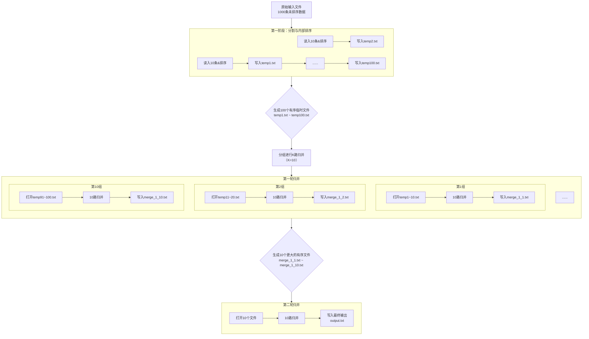
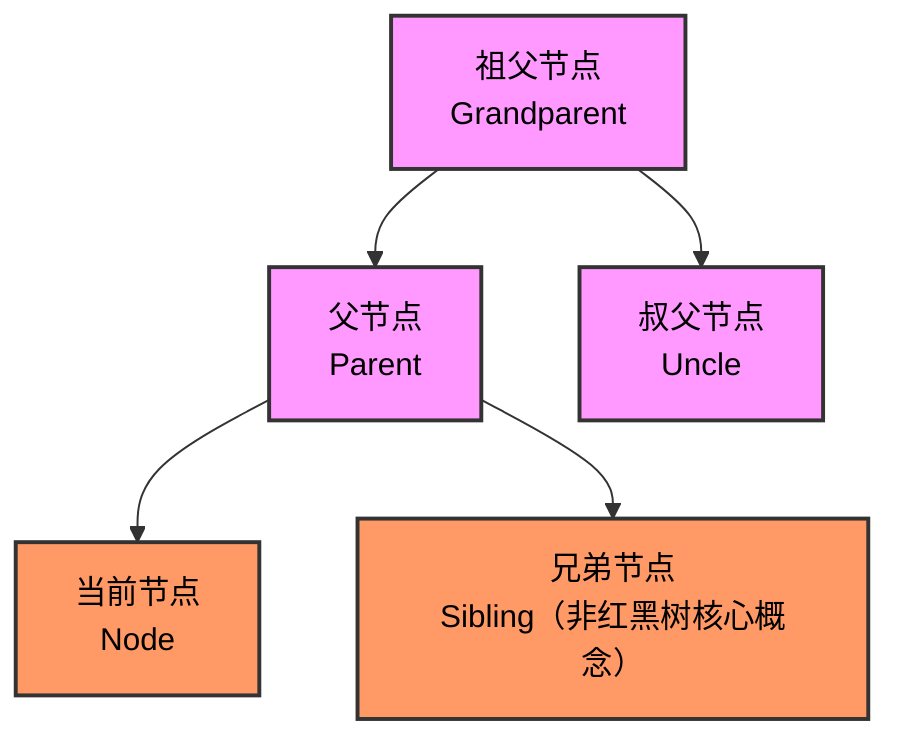
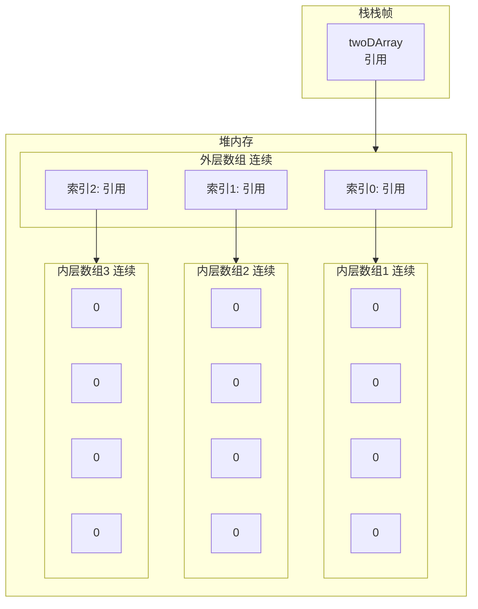

Checked Exception 必须被捕获或在方法上声明抛出，不能不处理
Error 和 Exception 确实都是 Throwable 的直接子类
# 代理模式
- 在静态代理中确实需要实现相同接口（或继承相同类，如果是继承方式）。
    
- 但动态代理（如 JDK 动态代理）是通过 InvocationHandler 实现的，代理类在运行时生成，并不需要手动实现相同接口。
    
- 此外，CGLIB 代理可以通过继承方式代理无接口的类，此时不需要接口相同。
# ThreadLocal
好的，我们来详细、深入地讲解 `ThreadLocal`。这是一个在Java多线程编程中非常重要但又容易被误解的类。

### 1. 什么是 ThreadLocal？

**核心概念：**
`ThreadLocal` 提供了一个机制，使得**每个线程都可以拥有一个独立的变量副本**，而不是所有线程共享同一个变量。这样，多个线程可以同时操作这个“变量”而不会发生冲突，因为每个线程操作的都是自己的副本。

**官方定义：** 该类提供了线程局部变量。这些变量与普通变量不同，每个访问该变量的线程（通过其 `get` 或 `set` 方法）都有自己独立初始化的变量副本。

**简单比喻：**
想象一个教室（进程），里面有多个学生（线程）。老师给每个学生发了一张完全相同的试卷（`ThreadLocal`变量），但每个学生在自己的试卷上答题（修改变量值）。学生A在自己的试卷上修改答案，完全不会影响学生B的试卷。这张“试卷”就是每个线程的独立副本。

### 2. 核心工作原理

`ThreadLocal` 的工作原理是其最精妙的部分。很多人误以为 `ThreadLocal` 是一个 `Map<Thread, T>`，但实际上，**它的设计正好相反**。

**真实结构：`Thread` 类内部维护了一个 `Map`，而这个 `Map` 的 Key 是 `ThreadLocal` 对象本身。**

具体来看：

1.  在 `Thread` 类中，有一个关键属性：
    ```java
    ThreadLocal.ThreadLocalMap threadLocals = null;
    ```

2.  `ThreadLocalMap` 是 `ThreadLocal` 的一个静态内部类，它是一个定制化的、用于维护线程局部变量的 Hash Map。它的 Key 是 **`ThreadLocal` 对象**（使用弱引用，后面会讲），Value 是线程需要存储的变量副本。

3.  当你调用 `threadLocal.set(value)` 时，它做了以下事情：
    *   获取当前正在执行的线程（`Thread.currentThread()`）。
    *   获取该线程的 `ThreadLocalMap`。
    *   以 **当前的 `ThreadLocal` 实例** 作为 Key，将要存储的值作为 Value，存入这个 Map。
    ```java
    public void set(T value) {
        Thread t = Thread.currentThread();
        ThreadLocalMap map = getMap(t); // 获取线程的ThreadLocalMap
        if (map != null) {
            map.set(this, value); // this 指当前ThreadLocal对象
        } else {
            createMap(t, value); // 为线程创建第一个ThreadLocalMap
        }
    }
    ```

4.  当你调用 `threadLocal.get()` 时：
    *   获取当前线程。
    *   获取当前线程的 `ThreadLocalMap`。
    *   以 **当前的 `ThreadLocal` 实例** 作为 Key，去 Map 中查找对应的 Value 并返回。
    ```java
    public T get() {
        Thread t = Thread.currentThread();
        ThreadLocalMap map = getMap(t);
        if (map != null) {
            ThreadLocalMap.Entry e = map.getEntry(this); // this 指当前ThreadLocal对象
            if (e != null) {
                @SuppressWarnings("unchecked")
                T result = (T)e.value;
                return result;
            }
        }
        return setInitialValue(); // 如果Map不存在或找不到值，则设置初始值
    }
    ```

**结构图简化表示：**

```
Thread-1 (线程1) ---> ThreadLocalMap
                      Key: ThreadLocalA --> Value: "ValueForThread1"
                      Key: ThreadLocalB --> Value: 123

Thread-2 (线程2) ---> ThreadLocalMap
                      Key: ThreadLocalA --> Value: "ValueForThread2"
                      Key: ThreadLocalC --> Value: true
```

从上图可以看出：
*   同一个 `ThreadLocal` 对象（例如 `ThreadLocalA`）在不同的线程（Thread-1和Thread-2）中关联了不同的值。
*   一个线程的 `ThreadLocalMap` 可以存储多个不同的 `ThreadLocal` 对象。

### 3. 主要用途

`ThreadLocal` 的典型使用场景是解决多线程环境下数据的隔离问题。

1.  **用户会话（Session）管理：**
    在Web应用中，一个请求可能由一个线程全程处理。我们可以将用户会话信息（如UserID）存储在 `ThreadLocal` 中，这样在控制器、服务层、DAO层等任何地方，都可以方便地获取当前用户信息，而无需在每个方法签名中传递。
    ```java
    public class UserContextHolder {
        private static final ThreadLocal<User> currentUser = new ThreadLocal<>();

        public static void setCurrentUser(User user) {
            currentUser.set(user);
        }

        public static User getCurrentUser() {
            return currentUser.get();
        }

        public static void clear() {
            currentUser.remove(); // 非常重要！
        }
    }

    // 在拦截器或过滤器中
    public boolean preHandle(...) {
        User user = ... // 从请求中解析用户
        UserContextHolder.setCurrentUser(user);
        return true;
    }

    public void afterCompletion(...) {
        // 请求结束后，必须清理，防止内存泄漏和旧数据干扰下一个请求
        UserContextHolder.clear();
    }
    ```

2.  **数据库连接管理：**
    在一些框架中，为了保证事务的一致性，需要让一个事务中的所有数据库操作使用同一个连接。可以将这个连接绑定到当前线程的 `ThreadLocal` 中。这样，在任何需要获取连接的地方，都能从 `ThreadLocal` 中拿到同一个连接。

3.  **全局参数传递：**
    对于一些需要跨多层方法调用的参数（如跟踪ID、语言环境等），使用 `ThreadLocal` 可以避免在每一层方法上都添加这个参数，使代码更简洁。

### 4. 内存泄漏问题与解决方案

这是 `ThreadLocal` 最核心、最需要注意的问题。

**为什么会发生内存泄漏？**

1.  **引用链分析：**
    *   `Thread` 对象强引用 -> `ThreadLocalMap` 实例。
    *   `ThreadLocalMap` 中的 Entry，其 **Key 是 `ThreadLocal` 对象，并且是弱引用**，其 **Value 是存储的数据，是强引用**。

2.  **弱引用的作用：**
    *   当我们在业务代码中将 `threadLocal = null` 时，由于 `ThreadLocalMap` 的 Key 只对 `ThreadLocal` 对象是弱引用，所以下一次GC发生时，这个 `ThreadLocal` 对象就会被回收。此时，Entry 的 Key 变为 `null`。

3.  **泄漏点：**
    *   虽然 Key 被回收了，但 Entry 本身和 Value 仍然被 `ThreadLocalMap` 强引用着。
    *   只要线程不死（例如使用线程池时，线程会被复用，不会销毁），这个 `ThreadLocalMap` 就会一直存在，那么这些 Key 为 `null` 的 Entry 的 Value 就永远无法被访问到，但也永远无法被GC回收，造成内存泄漏。

**解决方案：**

`ThreadLocal` 的设计者已经考虑到了这个问题。在 `ThreadLocal` 的 `get()`, `set()`, `remove()` 方法中，都会主动去清理当前线程 `ThreadLocalMap` 中所有 Key 为 `null` 的 Entry。

**因此，最佳实践是：**

**当你不再需要使用 `ThreadLocal` 存储的数据时，必须主动调用其 `remove()` 方法！**

尤其是在Web等使用线程池的环境中，一个线程处理完一个请求后会被放回池中以待重用。如果你不调用 `remove()` 清理，那么下一个处理请求的线程可能会读到上一个请求遗留下来的数据，导致非常诡异的业务bug，同时内存泄漏也会持续发生。

### 5. 使用示例

```java
public class ThreadLocalDemo {

    private static ThreadLocal<Integer> threadLocalCounter = ThreadLocal.withInitial(() -> 0);

    public static void main(String[] args) throws InterruptedException {
        // 创建并启动3个线程
        Thread[] threads = new Thread[3];
        for (int i = 0; i < threads.length; i++) {
            threads[i] = new Thread(new Worker(), "Thread-" + (i + 1));
            threads[i].start();
        }

        // 等待所有线程执行完毕
        for (Thread t : threads) {
            t.join();
        }
    }

    static class Worker implements Runnable {
        @Override
        public void run() {
            // 每个线程都会操作自己独立的 threadLocalCounter 副本
            int value = threadLocalCounter.get();
            for (int i = 0; i < 3; i++) {
                value++;
                threadLocalCounter.set(value);
            }
            // 打印结果，每个线程的最终值都是3，互不干扰
            System.out.println(Thread.currentThread().getName() + " final value: " + threadLocalCounter.get());

            // !!! 重要：使用完后清理，防止内存泄漏
            threadLocalCounter.remove();
        }
    }
}
```
输出（顺序可能不同）：
```
Thread-1 final value: 3
Thread-2 final value: 3
Thread-3 final value: 3
```

### 总结

| 特性 | 说明 |
| :--- | :--- |
| **核心目的** | 实现线程隔离，为每个线程提供独立的变量副本。 |
| **工作原理** | 每个 `Thread` 对象内部维护一个 `ThreadLocalMap`，Key 是 `ThreadLocal` 对象，Value 是变量副本。 |
| **主要优势** | 避免多线程竞争，简化在同一个线程内跨类、跨方法的参数传递。 |
| **关键风险** | **内存泄漏**，尤其是在线程池环境中。 |
| **最佳实践** | **务必在使用完毕后调用 `remove()` 方法**，通常放在 `finally` 代码块中以确保执行。 |
| **适用场景** | 用户上下文、数据库连接、事务管理、全局跟踪ID等需要线程隔离数据的场景。 |

理解并正确使用 `ThreadLocal`，是编写健壮、高效Java多线程应用程序的重要一步。
# 对一千条数据进行排序，内存一次只能处理十条

好的，这是一个经典的**外部排序（External Sorting）** 问题。当数据量太大，无法一次性装入内存时，就需要使用外部排序算法。最常用的外部排序算法是**归并排序（Merge Sort）** 的变种，因为它非常适合处理顺序访问的数据（如磁盘文件），而非随机访问。

其核心思想是：**“分而治之”** —— 先将大数据集分割成多个能在内存中处理的小块，分别排序这些小塊，最后再将所有有序的小块合并成一个大的有序数据集。

---

### 外部排序详细步骤（以你的场景为例：1000条数据，内存一次处理10条）

假设数据存储在 `input.txt` 文件中。

#### 第1步：分割 & 内部排序（Sort Phase）

1.  从 `input.txt` 中读取前 **10** 条数据到内存。
2.  使用高效的内部排序算法（如 `Arrays.sort()`，快速排序）在内存中对这10条数据进行排序。
3.  将排序好的这10条数据作为一个**有序块（Sorted Run）** 写入一个临时文件（例如 `temp1.txt`）。
4.  重复步骤 1-3，直到处理完所有1000条数据。这将生成 **100 个**有序的临时文件 (`temp1.txt`, `temp2.txt`, ..., `temp100.txt`)。每个文件包含10条有序的数据。

**此阶段结束后，你有了100个有序的小段。**

#### 第2步：K路归并（Merge Phase）

现在需要将这100个有序文件合并成一个完整的有序文件 `output.txt`。由于内存有限（只能容纳10条数据），我们无法一次性打开100个文件进行归并。我们需要进行**多轮归并（Multi-pass Merge）**。

**策略：每次归并 `K` 个文件，`K` 是内存允许同时打开的最大文件数。** 假设 `K=10`（即内存除了放数据，还能维护10个文件的读取缓冲区）。

*   **第一轮归并**：
    *   将100个临时文件分成10组，每组10个文件。
    *   对于每一组（10个文件）：
        *   同时打开这10个文件，每个文件读入第一条数据到内存的**缓冲区**（此时内存中有10条数据，来自10个不同文件）。
        *   在内存的这10条数据中，找到**最小值**（或最大值，取决于排序顺序）。
        *   将这个最小值写入新的临时合并文件（例如 `merge_pass_1_group_1.txt`）。
        *   从刚才提供最小值的那个文件中，读取**下一条**数据来补充缓冲区。
        *   重复“找最小值-写入-补充数据”的过程，直到这一组（10个文件）的所有数据都处理完毕。
        *   关闭这10个输入文件和新生成的合并文件。
    *   对10组文件都执行上述操作后，第一轮归并结束。现在你生成了 **10 个**新的临时文件 (`merge_pass_1_group_1.txt` ... `merge_pass_1_group_10.txt`)。每个新文件包含了100条有序的数据（因为是由10个10条数据的文件合并而来）。

*   **第二轮归并**：
    *   现在你只剩下10个更大的有序文件了。
    *   同时打开这10个文件，每个文件读入一条数据到内存缓冲区。
    *   同样，在内存中不断找最小值、写入最终输出文件 `output.txt`、补充数据。
    *   直到这10个文件的所有数据都写入 `output.txt`，排序完成。

**这个过程可视化如下：**



---

### 关键优化与代码思路

1.  **缓冲区（Buffer）**：在实际代码中，不会一次只读一条数据。我们会为每个打开的文件设置一个缓冲区（例如，一次读取4KB的数据到内存），然后从缓冲区中逐条取数据，这可以极大减少磁盘I/O次数。
2.  **堆（Heap / PriorityQueue）**：在归并阶段，**使用最小堆（Min-Heap）来高效地找到K个缓冲区中的最小值**是标准做法。

    **代码思路（伪代码）**：
    ```java
    // 假设每个临时文件都是一个 BufferedReader
    class BufferElement {
        String value; // 当前从文件读出的值
        BufferedReader reader; // 对应的文件读取器
    }

    // 创建最小堆，根据value排序
    PriorityQueue<BufferElement> minHeap = new PriorityQueue<>(Comparator.comparing(e -> e.value));

    // 初始化：打开K个文件，每个文件读第一行，放入堆中
    for (BufferedReader reader : listOfReaders) {
        String firstLine = reader.readLine();
        if (firstLine != null) {
            minHeap.offer(new BufferElement(firstLine, reader));
        }
    }

    // 开始归并
    try (BufferedWriter writer = new BufferedWriter(new FileWriter("output.txt"))) {
        while (!minHeap.isEmpty()) {
            // 弹出最小值
            BufferElement min = minHeap.poll();
            writer.write(min.value);
            writer.newLine();

            // 从刚才弹出的元素对应的文件中，读取下一行来补充堆
            String nextLine = min.reader.readLine();
            if (nextLine != null) {
                minHeap.offer(new BufferElement(nextLine, min.reader));
            }
        }
    }
    ```
3.  **临时文件管理**：在每一轮归并后，记得删除上一轮的临时文件，以免磁盘空间被占满。

### 总结

对于你一千条数据，内存十条的限制，外部排序是标准解决方案。其过程可概括为：

1.  **分**：将大文件切割成多个能装入内存的小块，并在内存中排序后写回磁盘。
2.  **合**：使用 **K路归并**算法，利用**最小堆**作为核心数据结构，多轮合并这些有序小块，最终得到一个完整有序的大文件。

这种方法的磁盘I/O次数是性能的关键，而通过缓冲区和对数级的归并轮数，它可以高效地处理远大于内存的数据集。数据库中的 `ORDER BY` 操作在背后通常就是使用这种算法。


# 排序

### 1. 选择排序 (Selection Sort)

#### 核心思想
不断从未排序序列中**选择最小（或最大）元素**，放到已排序序列的末尾。

#### 详细步骤（升序为例）
1.  从数组 `arr[0...n-1]` 中找到最小元素，与 `arr[0]` 交换。
2.  从 `arr[1...n-1]` 中找到最小元素，与 `arr[1]` 交换。
3.  ...
4.  重复以上过程，直到所有元素排序完成。


#### Java 代码实现
```java
public class SelectionSort {
    public static void selectionSort(int[] arr) {
        int n = arr.length;
        
        for (int i = 0; i < n - 1; i++) {
            // 1. 找到未排序部分的最小元素索引
            int minIndex = i;
            for (int j = i + 1; j < n; j++) {
                if (arr[j] < arr[minIndex]) {
                    minIndex = j;
                }
            }
            
            // 2. 将找到的最小元素与第i个元素交换
            int temp = arr[i];
            arr[i] = arr[minIndex];
            arr[minIndex] = temp;
        }
    }
}
```

#### 复杂度分析
*   **时间复杂度**：O(n²) - 无论数据是否有序，都需要进行 n(n-1)/2 次比较
*   **空间复杂度**：O(1) - 原地排序，只需要常数级别的额外空间
*   **稳定性**：**不稳定**（交换可能改变相等元素的相对顺序）

---

### 2. 快速排序 (Quick Sort)

#### 核心思想
**分治法** - 选取一个基准元素，将数组分成两部分，使得左边都小于等于基准，右边都大于等于基准，然后递归地对左右两部分进行排序。

#### 详细步骤
1.  从数列中挑出一个元素，称为"基准"（pivot）
2.  重新排序数列，所有比基准值小的元素摆放在基准前面，所有比基准值大的元素摆在基准后面（相同的数可以到任一边）。在这个分区结束之后，该基准就处于数列的中间位置。这个称为分区（partition）操作
3.  递归地（recursive）把小于基准值元素的子数列和大于基准值元素的子数列排序
### 超详细分步演示

假设我们要排序这个数组：`[5, 3, 8, 4, 2]`

#### 第一轮分区（Partition）

**步骤 1：选择基准（Pivot）**  
我们选择最右边的元素 `2` 作为基准。  
数组：`[5, 3, 8, 4, 2]` ← 基准

**步骤 2：初始化**

- `i` = -1（指向小于基准的区域的边界）
    
- 从 `j` = 0 开始遍历
    

**步骤 3：开始遍历**

- `j=0`: 元素是 `5`，比基准 `2` 大，什么都不做
    
- `j=1`: 元素是 `3`，比基准 `2` 大，什么都不做
    
- `j=2`: 元素是 `8`，比基准 `2` 大，什么都不做
    
- `j=3`: 元素是 `4`，比基准 `2` 大，什么都不做
    
- `j=4`: 到达基准，停止遍历
    

**步骤 4：放置基准**  
将基准 `2` 与 `i+1` 位置（即位置0）的元素交换：  
交换后：`[2, 3, 8, 4, 5]`

现在基准 `2` 已经在正确的位置了！

#### 递归排序左右部分

现在数组：`[2, 3, 8, 4, 5]`

- 基准 `2` 左边：`[]`（空，已经有序）
    
- 基准 `2` 右边：`[3, 8, 4, 5]`（需要继续排序）
    

#### 排序右边部分 `[3, 8, 4, 5]`

**选择基准**：最右边的 `5`  
数组：`[3, 8, 4, 5]` ← 基准

**开始分区**：

- `i` = -1
    
- `j=0`: 元素 `3` < `5`，`i++` (=0)，交换 `arr[0]` 与 `arr[0]`（实际没变化）
    
- `j=1`: 元素 `8` > `5`，什么都不做
    
- `j=2`: 元素 `4` < `5`，`i++` (=1)，交换 `arr[1]` 和 `arr[2]`  
    交换后：`[3, 4, 8, 5]`
    
- `j=3`: 到达基准，停止
    

**放置基准**：交换 `arr[i+1]` (即 `arr[2]`) 和基准 `arr[3]`  
交换后：`[3, 4, 5, 8]`

现在基准 `5` 已经在正确位置！

#### 继续递归

现在右边部分：`[3, 4, 5, 8]`

- 基准 `5` 左边：`[3, 4]`（需要排序）
    
- 基准 `5` 右边：`[8]`（只有一个元素，已经有序）
    

#### 排序 `[3, 4]`

**选择基准**：最右边的 `4`  
数组：`[3, 4]` ← 基准

**分区**：

- `i` = -1
    
- `j=0`: 元素 `3` < `4`，`i++` (=0)，交换 `arr[0]` 与 `arr[0]`（没变化）
    
- `j=1`: 到达基准，停止
    

**放置基准**：交换 `arr[i+1]` (即 `arr[1]`) 和基准 `arr[1]`（没变化）  
结果：`[3, 4]` ← 已经有序！
#### 动画演示


#### Java 代码实现
```java
public class QuickSort {
    public static void quickSort(int[] arr, int low, int high) {
        if (low < high) {
            // 获取分区点索引
            int pi = partition(arr, low, high);
            
            // 递归排序分区的前后两部分
            quickSort(arr, low, pi - 1);
            quickSort(arr, pi + 1, high);
        }
    }
    
    private static int partition(int[] arr, int low, int high) {
        // 选择最右边的元素作为基准
        int pivot = arr[high];
        int i = low - 1; // 小于基准的元素的边界索引
        
        for (int j = low; j < high; j++) {
            if (arr[j] <= pivot) {
                i++;
                // 交换 arr[i] 和 arr[j]
                int temp = arr[i];
                arr[i] = arr[j];
                arr[j] = temp;
            }
        }
        
        // 将基准元素放到正确位置
        int temp = arr[i + 1];
        arr[i + 1] = arr[high];
        arr[high] = temp;
        
        return i + 1;
    }
}
```

#### 复杂度分析
*   **平均时间复杂度**：O(n log n)
*   **最坏时间复杂度**：O(n²) - 当数组已经有序或逆序时
*   **空间复杂度**：O(log n) - 递归调用的栈空间
*   **稳定性**：**不稳定**

#### 优化策略
*   随机选择基准元素
*   三数取中法选择基准
*   对于小数组使用插入排序

---

### 3. 冒泡排序 (Bubble Sort)

#### 核心思想
重复地遍历要排序的数列，一次比较两个元素，如果它们的顺序错误就把它们交换过来。

#### 详细步骤
1.  比较相邻的元素。如果第一个比第二个大，就交换它们两个
2.  对每一对相邻元素作同样的工作，从开始第一对到结尾的最后一对，这样在最后的元素应该会是最大的数
3.  针对所有的元素重复以上的步骤，除了最后一个
4.  重复步骤1~3，直到排序完成

#### 动画演示


#### Java 代码实现
```java
public class BubbleSort {
    public static void bubbleSort(int[] arr) {
        int n = arr.length;
        
        for (int i = 0; i < n - 1; i++) {
            // 优化：如果本轮没有发生交换，说明已经有序
            boolean swapped = false;
            
            for (int j = 0; j < n - 1 - i; j++) {
                if (arr[j] > arr[j + 1]) {
                    // 交换 arr[j] 和 arr[j+1]
                    int temp = arr[j];
                    arr[j] = arr[j + 1];
                    arr[j + 1] = temp;
                    swapped = true;
                }
            }
            
            // 如果没有发生交换，提前结束
            if (!swapped) break;
        }
    }
}
```

#### 复杂度分析
*   **最好时间复杂度**：O(n) - 当数组已经有序时（使用优化版本）
*   **平均/最坏时间复杂度**：O(n²)
*   **空间复杂度**：O(1) - 原地排序
*   **稳定性**：**稳定**（相等元素不会交换）

---

### 4. 其他重要排序方法

#### 插入排序 (Insertion Sort)
```java
public static void insertionSort(int[] arr) {
    for (int i = 1; i < arr.length; i++) {
        int key = arr[i];
        int j = i - 1;
        
        // 将大于key的元素向后移动
        while (j >= 0 && arr[j] > key) {
            arr[j + 1] = arr[j];
            j--;
        }
        arr[j + 1] = key; // 插入到正确位置
    }
}
```
*   **特点**：对几乎有序的数组效率很高，O(n)时间复杂度
*   **复杂度**：平均O(n²)，最好O(n)，最坏O(n²)
*   **稳定性**：稳定

#### 归并排序 (Merge Sort)
```java
public static void mergeSort(int[] arr, int left, int right) {
    if (left < right) {
        int mid = left + (right - left) / 2;
        
        mergeSort(arr, left, mid);      // 排序左半部分
        mergeSort(arr, mid + 1, right); // 排序右半部分
        merge(arr, left, mid, right);   // 合并两个有序数组
    }
}

private static void merge(int[] arr, int left, int mid, int right) {
    // 创建临时数组存放合并结果
    int[] temp = new int[right - left + 1];
    int i = left, j = mid + 1, k = 0;
    
    while (i <= mid && j <= right) {
        if (arr[i] <= arr[j]) {
            temp[k++] = arr[i++];
        } else {
            temp[k++] = arr[j++];
        }
    }
    
    // 拷贝剩余元素
    while (i <= mid) temp[k++] = arr[i++];
    while (j <= right) temp[k++] = arr[j++];
    
    // 将临时数组拷贝回原数组
    System.arraycopy(temp, 0, arr, left, temp.length);
}
```
*   **特点**：稳定，适合外部排序，需要额外空间
*   **复杂度**：始终是O(n log n)
*   **稳定性**：稳定

#### 堆排序 (Heap Sort)
```java
public static void heapSort(int[] arr) {
    int n = arr.length;
    
    // 构建最大堆
    for (int i = n / 2 - 1; i >= 0; i--) {
        heapify(arr, n, i);
    }
    
    // 逐个提取堆顶元素
    for (int i = n - 1; i > 0; i--) {
        // 将当前堆顶元素（最大值）与末尾元素交换
        int temp = arr[0];
        arr[0] = arr[i];
        arr[i] = temp;
        
        // 对剩余元素重新堆化
        heapify(arr, i, 0);
    }
}

private static void heapify(int[] arr, int n, int i) {
    int largest = i;       // 初始化最大值为根节点
    int left = 2 * i + 1;  // 左子节点
    int right = 2 * i + 2; // 右子节点
    
    // 如果左子节点大于根节点
    if (left < n && arr[left] > arr[largest]) {
        largest = left;
    }
    
    // 如果右子节点大于当前最大值
    if (right < n && arr[right] > arr[largest]) {
        largest = right;
    }
    
    // 如果最大值不是根节点
    if (largest != i) {
        int swap = arr[i];
        arr[i] = arr[largest];
        arr[largest] = swap;
        
        // 递归地堆化受影响的子树
        heapify(arr, n, largest);
    }
}
```
*   **特点**：原地排序，不需要递归栈
*   **复杂度**：O(n log n)
*   **稳定性**：不稳定

---

### 总结对比表

| 排序算法 | 平均时间复杂度 | 最好情况 | 最坏情况 | 空间复杂度 | 稳定性 | 特点 |
|---------|---------------|---------|---------|-----------|--------|------|
| **选择排序** | O(n²) | O(n²) | O(n²) | O(1) | 不稳定 | 简单，交换次数少 |
| **快速排序** | O(n log n) | O(n log n) | O(n²) | O(log n) | 不稳定 | 平均性能最好，实际应用多 |
| **冒泡排序** | O(n²) | O(n) | O(n²) | O(1) | 稳定 | 简单，效率低，教学用 |
| **插入排序** | O(n²) | O(n) | O(n²) | O(1) | 稳定 | 对小规模或基本有序数据高效 |
| **归并排序** | O(n log n) | O(n log n) | O(n log n) | O(n) | 稳定 | 稳定，适合外部排序 |
| **堆排序** | O(n log n) | O(n log n) | O(n log n) | O(1) | 不稳定 | 原地排序，最坏情况也好 |

### 选择建议

1.  **小规模数据**：插入排序（实现简单，常数因子小）
2.  **一般用途**：快速排序（平均性能最佳）
3.  **需要稳定性**：归并排序
4.  **关注最坏情况**：堆排序
5.  **数据基本有序**：插入排序或冒泡排序（优化版）
6.  **教学演示**：选择排序、冒泡排序（算法简单易懂）

每种算法都有其适用的场景，理解它们的原理和特性有助于在实际问题中选择最合适的排序方法。


# 计算子网掩码

为一个C类网络划分20个子网，需要确定最适合的子网掩码。

**C类网络默认掩码**：255.255.255.0（即/24）

**步骤1：计算需要多少个子网位**

- 需要划分20个子网，因此需要至少满足2^n >= 20。
    
- 2^4 = 16 < 20（不够）
    
- 2^5 = 32 >= 20（满足）
    

所以需要**5位**作为子网位。

**步骤2：计算新的子网掩码**

- 原始C类掩码：255.255.255.0（二进制：11111111.11111111.11111111.00000000）
    
- 借用5位主机位作为子网位后，子网掩码变为：  
    11111111.11111111.11111111.11111000
    
- 即255.255.255.248（因为最后一段11111000的十进制是248）

# Linux

sed 命令是利用脚本来处理文本文件，sed 可依照脚本的指令来处理、编辑文本文件，主要用来自动编辑一个或多个文件、简化对文件的反复操作、编写转换程序等。  

s 表示替换命令，/AAA 表示匹配 "AAA"，/BBB 表示把匹配替换成 "BBB"，/g 表示全局匹配。

> xyz 表示将内容重定向到 xyz 文件中。


# 红黑树
**红黑树（Red-Black Tree）**。这是一种非常重要的自平衡二叉查找树，在Java的`TreeMap`、`TreeSet`以及C++的STL`map`、`set`等中都有广泛应用。
### 一、红黑树是什么？

红黑树是一种**近似平衡**的二叉搜索树（BST），它通过在节点中增加一个存储位（颜色：红或黑）和一套严格的规则，来确保树的高度始终保持在O(log n)级别，从而保证了最坏情况下的查找、插入和删除效率。

**核心设计目标**：在保持二叉搜索树性质的同时，通过相对较少的旋转操作（相比AVL树）来维持树的平衡，从而在查询和修改性能之间取得良好的折衷。

---

### 二、红黑树的五大性质（规则）

一棵有效的红黑树必须满足以下性质：

1.  **节点是红色或黑色**。
2.  **根节点是黑色**。
3.  **所有叶子节点（NIL节点）都是黑色**。（通常将空指针视为NIL叶子节点，并规定为黑色）
4.  **红色节点的两个子节点必须是黑色**（即不能有连续的红色节点）。
5.  **从任意节点到其所有后代叶子节点的简单路径上，均包含相同数目的黑色节点**（这条路径上的黑色节点数称为该节点的**黑高**）。

这些规则共同保证了红黑树的关键特性：**从根到最远叶子的路径不会超过从根到最近叶子路径的两倍**。因此，树是近似平衡的。

---

### 三、红黑树的操作

为了维持上述性质，在插入和删除节点后，需要通过**旋转（Rotation）** 和**重新着色（Recoloring）** 来调整树的结构。

#### 1. 旋转（Rotation）

旋转是局部调整树结构的基本操作，分为**左旋**和**右旋**，操作过程中保持了二叉搜索树的性质。

-   **左旋（Left Rotate）**：以某个节点为支点，使其右子节点成为其新的父节点，自己成为其左子节点。
    ```mermaid
    flowchart TD
        subgraph Before [左旋前]
            direction TB
            P[P]
            X[X]
            Y[Y]
            A[A]
            B[B]
            C[C]
            P --> X
            X --> A
            X --> Y
            Y --> B
            Y --> C
        end

        Before --> After

        subgraph After [左旋后]
            direction TB
            P2[P]
            X2[X]
            Y2[Y]
            A2[A]
            B2[B]
            C2[C]
            P2 --> Y2
            Y2 --> X2
            Y2 --> C2
            X2 --> A2
            X2 --> B2
        end
    ```

-   **右旋（Right Rotate）**：以某个节点为支点，使其左子节点成为其新的父节点，自己成为其右子节点。
    ```mermaid
    flowchart TD
        subgraph Before [右旋前]
            direction TB
            P[P]
            Y[Y]
            X[X]
            A[A]
            B[B]
            C[C]
            P --> Y
            Y --> X
            Y --> C
            X --> A
            X --> B
        end

        Before --> After

        subgraph After [右旋后]
            direction TB
            P2[P]
            Y2[Y]
            X2[X]
            A2[A]
            B2[B]
            C2[C]
            P2 --> X2
            X2 --> A2
            X2 --> Y2
            Y2 --> B2
            Y2 --> C2
        end
    ```

#### 2. 插入（Insertion）

插入新节点时，通常将其**着色为红色**（这样不会违反黑高性质5，但可能违反性质4），然后像普通BST一样插入。插入后，如果破坏了红黑树规则，需要通过调整来修复。修复情况主要取决于其**父节点**和**叔叔节点**（父节点的兄弟节点）的颜色。

设新插入节点为 **N**，其父节点为 **P**，祖父节点为 **G**，叔叔节点为 **U**。

**Case 1: N是根节点**
*   **操作**：直接将其变为黑色（满足性质2）。

**Case 2: P是黑色**
*   **操作**：什么都不用做。插入红色节点N后，没有增加黑色节点数量，也没有产生连续红色节点。

**Case 3: P是红色，U也是红色**
*   **操作**：将P和U变为黑色，G变为红色。然后将G视为新插入的红色节点，递归向上处理。
    ```mermaid
    flowchart TD
        subgraph Before [情况3]
            G[G: Black] --> P[P: Red]
            G --> U[U: Red]
            P --> N[N: Red]
            P --> S[Sibling: Any]
        end

        Before --> After

        subgraph After [修复后]
            G2[G: Red] --> P2[P: Black]
            G2 --> U2[U: Black]
            P2 --> N2[N: Red]
            P2 --> S2[Sibling: Any]
        end
    ```

**Case 4: P是红色，U是黑色（或NIL），且N是P的内侧子孙**
*   **操作**：先通过一次旋转（若N是P的右子节点且P是G的左子节点，则对P左旋；反之则右旋）将其转换为Case 5。
    ```mermaid
    flowchart TD
        subgraph Before [情况4: 内侧子孙]
            G[G: Black] --> P[P: Red]
            G --> U[U: Black]
            P --> S[Sibling: Black]
            P --> N[N: Red]
        end

        Before --> Operation[对P进行左旋]

        subgraph After [转换为情况5]
            G2[G: Black] --> N2[N: Red]
            G2 --> U2[U: Black]
            N2 --> P2[P: Red]
            N2 --> S2[Sibling: Black]
        end
    ```

**Case 5: P是红色，U是黑色（或NIL），且N是P的外侧子孙**
*   **操作**：对G进行一次旋转（若P是G的左子节点，则对G右旋；反之则左旋），并交换P和G的颜色。
    ```mermaid
    flowchart TD
        subgraph Before [情况5: 外侧子孙]
            G[G: Black] --> P[P: Red]
            G --> U[U: Black]
            P --> N[N: Red]
            P --> S[Sibling: Black]
        end

        Before --> Operation[对G进行右旋并交换P/G颜色]

        subgraph After [修复完成]
            P2[P: Black] --> N2[N: Red]
            P2 --> G2[G: Red]
            G2 --> S2[Sibling: Black]
            G2 --> U2[U: Black]
        end
    ```

#### 3. 删除（Deletion）

删除操作比插入更复杂，但核心思想是：**保证最终被删除的节点是红色节点**。如果待删除的节点是黑色，删除它就会减少路径上的黑色节点数（违反性质5），需要引入“双重黑色”的概念并通过旋转和重新着色来修复。其情况划分比插入更多更复杂，但原理相通。

---
无论树的结构如何，对于任何一个给定节点 N，都能找到对应的 P、G 和 U。



**重要提示**：叔父节点 (U) **不一定存在**。如果祖父节点 (G) 只有一个子节点（即父节点 P），那么叔父节点 (U) 就是 `null`（在红黑树中，`null` 被视为黑色的叶子节点（NIL））。**判断叔父节点的颜色是红色还是黑色（或NIL），是决定如何进行平衡调整的关键步骤。**
### 四、红黑树 vs. AVL 树

| 特性 | 红黑树 | AVL树 |
| :--- | :--- | :--- |
| **平衡标准** | 近似平衡（最长路径 ≤ 2倍最短路径） | 严格平衡（左右子树高度差 ≤ 1） |
| **查询效率** | O(log n) | O(log n)，**更快的查找** |
| **插入/删除效率** | O(log n)，**通常需要更少的旋转** | O(log n)，可能需要进行多次旋转 |
| **适用场景** | **频繁插入、删除**的场景（如Map、Set） | **查询频繁，插入删除较少**的场景（如数据库索引） |
| **存储开销** | 1 bit（颜色） | 整数字段（高度或平衡因子） |

**简单总结**：AVL树更“胖”，查询更快；红黑树更“高”，更新更快。由于在实际应用中数据更新往往更频繁，所以红黑树的使用更为广泛。

---

### 五、为什么红黑树应用如此广泛？

1.  **效率保证**：在最坏情况下，查找、插入、删除的时间复杂度都是**O(log n)**。
2.  **平衡代价低**：相对于AVL树，红黑树在插入和删除时为了维持平衡所需的**旋转操作更少**，整体性能更好。
3.  **稳定可靠**：被大量实践验证，是工业级的标准实现。

红黑树是计算机科学中数据结构设计的典范，它巧妙地在理论复杂度和实际性能之间找到了最佳平衡点。

# java的二维数组是否连续

**Java 中的二维数组（以及更高维数组）在逻辑上是连续的，但在物理内存上不一定是连续的。更准确地说，它是一个“数组的数组”，其子数组在堆上的分配是独立的。**

### 1. 核心结论：数组的数组 (Array of Arrays)

Java 并没有真正的、在内存中连续分配的二维数组。当你这样声明时：
```java
int[][] twoDArray = new int[3][4];
```
你实际上创建了 **4 个独立的一维数组对象**：
1.  一个 `int[][]` 类型的引用数组，长度为 3。这个数组本身在内存中是连续的。
2.  三个 `int[]` 类型的一维数组，每个长度都为 4。**每个一维数组在内存中是连续的**，但这三个一维数组彼此之间在堆内存中的分配地址是**独立的，不保证连续**。

其内存结构如下图所示：



### 2. 与 C/C++ 的对比

这一点与 **C/C++** 完全不同。在 C/C++ 中，一个声明为 `int arr[3][4]` 的二维数组是**一整块连续的、大小为 3 * 4 * sizeof(int) 的内存**。

**Java 的这种设计有利有弊：**
*   **优点**：可以轻松创建**不规则数组（Jagged Arrays）**。
    ```java
    int[][] jaggedArray = new int[3][];
    jaggedArray[0] = new int[5]; // 第一行有5列
    jaggedArray[1] = new int[2]; // 第二行有2列
    jaggedArray[2] = new int[7]; // 第三行有7列
    ```
    这种灵活性是 C/C++ 风格的连续二维数组所不具备的。

*   **缺点**：
    1.  **内存访问开销**：访问一个元素需要两次内存跳转（先找到行数组，再在行数组中找到列元素），可能对缓存（Cache）不友好，因为相关的数据可能分散在内存的不同地方。
    2.  **内存开销**：会有额外的开销用于存储每个内部一维数组的对象头（Object Header）等信息。

### 3. 如何实现真正的连续内存存储？

如果你确实需要一块连续的、对缓存友好的内存块来模拟二维数组（例如为了高性能计算），你可以手动模拟：

```java
// 1. 创建一维连续数组
int rows = 3;
int cols = 4;
int[] contiguousArray = new int[rows * cols];

// 2. 通过计算索引来访问“第i行第j列”的元素
// 索引公式: index = (i * cols) + j
contiguousArray[(1 * cols) + 2] = 10; // 相当于设置 array[1][2] = 10

// 3. 读取同样使用公式
int value = contiguousArray[(0 * cols) + 3]; // 相当于读取 array[0][3]
```

**这种方式的好处：**
*   **真正的内存连续**，对 CPU 缓存预取（Cache Prefetching）非常友好，遍历性能通常更高。
*   **只有一个数组对象**，内存开销更小。

---

### 总结

| 特性 | Java 二维数组 (`int[][]`) | 手动模拟的连续数组 |
| :--- | :--- | :--- |
| **内存布局** | **不连续**（数组的数组） | **连续**（单一大数组） |
| **访问方式** | `array[i][j]` | `array[(i * cols) + j]` |
| **灵活性** | **高**（支持不规则数组） | **低**（必须是矩形） |
| **缓存友好度** | 通常较差 | **非常好** |
| **内存开销** | 较高（多个数组对象头） | 较低（单个数组对象头） |

所以，回到问题本身：**Java 的二维数组在物理内存上不是连续的。它是由一个引用数组和多个独立的一维数组组成的结构，每个一维数组内部是连续的，但这些一维数组彼此之间在堆上的分配是不连续的。**

# RESTful API
**RESTful API 是一种基于 HTTP 协议，通过 URL 定位资源，使用 HTTP 方法（GET, POST, PUT, DELETE 等）定义操作，并通常以 JSON 格式传输数据的 Web API 设计风格。** 它是现代 Web 和移动应用开发中前后端分离架构的基石。
### RESTful API 的关键原则（REST 约束）

要被称为“RESTful”，一个 API 需要遵循一些设计原则，其中最重要的几个是：

1. **无状态：** 服务器不会记住客户端的任何状态。每一次从客户端发来的请求都必须包含所有必要的信息，服务器才能理解并处理它。就像图书馆管理员不会记得你上次借了什么书，你每次借书都需要出示你的借书卡。
    
2. **统一接口：** 这是 REST 的核心。它要求使用标准的 HTTP 方法、清晰的资源标识（URL）和通用的数据格式（如 JSON），使得交互简单、一致。
    
3. **客户端-服务器分离：** 客户端（如手机App）和服务器是独立的。它们可以各自独立开发和演进，只要接口不变就行。
    
4. **可缓存：** 服务器可以在响应中标记某些数据是否可以缓存。客户端（或中间的代理服务器）可以将这些数据缓存起来，以提高性能。比如，一本热门书的信息可以被缓存，很多人查询时就不用每次都去翻库了。
    
5. **分层系统：** 在客户端和服务器之间可以有多个中间层（如负载均衡器、安全网关），这些对客户端是透明的，它不需要知道中间经过了多少层，只关心最终的服务器。

# Kafka和RabbitMQ的区别
好的，这是一个非常经典的问题。Kafka 和 RabbitMQ 都是优秀的消息中间件，但它们的核心设计理念、架构和适用场景有显著区别。

简单来说：
*   **RabbitMQ 是一个企业级消息代理**，擅长处理复杂的路由、保证消息的可靠投递，适用于需要精确控制每条消息去向的场景。
*   **Kafka 是一个高吞吐量的分布式流处理平台**，擅长处理海量流式数据，适用于需要持久化存储和重复消费数据的场景。

下面我们从多个维度进行详细对比。

---

### 核心概念与设计哲学对比

| 特性 | RabbitMQ | Apache Kafka |
| :--- | :--- | :--- |
| **核心模型** | **消息代理** | **分布式提交日志** |
| **设计哲学** | 灵活的路由和可靠的**消息传递**。确保消息被成功消费。 | 高吞吐、持久化的**数据流**。关注数据流的流动和存储。 |
| **核心概念** | - **Producer**: 生产者<br>- **Exchange**: 交换机（路由消息）<br>- **Queue**: 队列（存储消息）<br>- **Consumer**: 消费者<br>- **Binding**: 绑定（连接交换机和队列的规则） | - **Producer**: 生产者<br>- **Topic**: 主题（数据流的类别）<br>- **Partition**: 分区（Topic的物理分片）<br>- **Consumer Group**: 消费者组（一组协同工作的消费者）<br>- **Broker**: 代理服务器 |
| **数据存储** | 消息在被消费者确认消费后，通常会从队列中**删除**。 | 消息会按顺序持久化到磁盘，并保留一段时间（可配置）。**消费后数据不删除**，支持重复消费。 |
| **消息路由** | **非常灵活**。通过不同类型的交换机（Direct, Fanout, Topic, Headers）实现复杂路由。 | **相对简单**。基于 Topic 和 Partition，消息通常通过 Key 被路由到特定 Partition。 |
| **消息确认** | **支持**。消费者确认后，RabbitMQ 才认为消息投递成功。支持自动和手动确认。 | **支持**。通过偏移量（Offset）管理。消费者自己维护消费进度，不会丢失消息。 |

---

### 详细区别解析

#### 1. 消息模型与消费模式
*   **RabbitMQ**:
    *   **队列模型**：基于队列。生产者发送消息到交换机，交换机根据规则将消息路由到一个或多个队列，消费者从队列中取走消息。
    *   **消费模式**：主要有两种：
        *   **点对点**：一个消息只能被一个消费者消费。
        *   **发布/订阅**：通过 Fanout 交换机，一个消息可以被多个消费者消费。
    *   **智能代理/愚笨消费者**：RabbitMQ（代理）负责消息的路由、队列和传递状态，消费者相对简单。

*   **Kafka**:
    *   **流模型**：基于 Topic 的发布-订阅模型。Topic 是逻辑概念，每个 Topic 被分为多个 Partition，每个 Partition 是一个有序、不可变的消息序列。
    *   **消费模式**：基于**消费者组**。
        *   同一个消费者组内的消费者协同工作，每个 Partition 在同一时间只能被组内的一个消费者消费，从而实现负载均衡。
        *   不同消费者组可以独立消费同一个 Topic 的全部数据，实现广播。
    *   **愚笨代理/智能消费者**：Kafka 的 Broker 只做简单的消息存储和传递，消费进度（Offset）由消费者自己管理，这使得消费者非常灵活。

#### 2. 吞吐量与性能
*   **Kafka**：**优势明显**。设计目标就是高吞吐量。
    *   **顺序读写**：消息顺序追加到磁盘文件，速度极快。
    *   **零拷贝**：优化了数据传输路径，减少了内核态与用户态的拷贝次数。
    *   **批量处理**：支持生产者和消费者的批量操作。
    *   轻松达到每秒数十万甚至百万级的消息吞吐。
*   **RabbitMQ**：吞吐量通常低于 Kafka，但依然能满足绝大多数企业应用场景。
    *   性能受队列数量、消息持久化、确认机制等因素影响。
    *   在需要极低延迟（微秒级）的场景下可能表现更好。

#### 3. 消息顺序性
*   **Kafka**：**保证分区内的消息顺序**。发送到同一个 Partition 的消息，其顺序在消费时能得到保证。这是其流处理的基础。
*   **RabbitMQ**：在单个队列内保证 FIFO（先进先出）顺序。但如果使用了优先级队列或者消息重试，顺序可能会被打乱。

#### 4. 数据持久化与容错
*   **Kafka**：**强持久化**。所有消息都会持久化到磁盘，并且有多个副本（Replication）机制，数据可靠性极高。即使消费者下线，数据也不会丢失，随时可以重新消费。
*   **RabbitMQ**：消息可以设置为持久化（写入磁盘），但为了保证性能，通常会在内存中操作。其镜像队列（Mirrored Queues）机制也能提供高可用性，但持久化强度通常不如 Kafka 的副本机制。

#### 5. 复杂度与生态系统
*   **RabbitMQ**：基于 AMQP 协议，概念相对简单，易于理解和上手。管理和监控界面（Management UI）非常友好。
*   **Kafka**：架构和概念更复杂（Topic, Partition, Consumer Group, Offset, Replica等）。但其生态系统非常强大，与 **Kafka Connect**（数据集成）、**Kafka Streams**（流处理）等组件无缝集成，构成了一个完整的流数据平台。

---

### 如何选择？

#### 选择 RabbitMQ 的场景：
*   **需要复杂的消息路由**。例如，需要根据消息头、主题等属性将消息路由到不同的目的地。
*   **对消息投递的可靠性要求极高**。例如金融交易、订单处理，需要确保每一条消息都被成功处理。
*   **传统企业应用集成**，工作流后台任务。例如，处理时间不长、需要立即被消费的异步任务。
*   **协议兼容性要求高**。RabbitMQ 支持多种协议（AMQP, MQTT, STOMP）。

#### 选择 Kafka 的场景：
*   **处理海量数据流**。例如日志聚合、Metrics 数据收集、用户行为追踪。
*   **需要数据被多个系统重复消费/回溯消费**。例如，将用户点击流数据同时提供给实时分析、数据仓库和推荐系统。
*   **构建实时流处理平台**。需要基于数据流进行实时计算、分析或监控。
*   **高吞吐、高可扩展性是首要需求**。

### 总结表格

| 特征 | RabbitMQ | Apache Kafka |
| :--- | :--- | :--- |
| **最佳适用场景** | 复杂的路由、事务性消息、企业应用集成 | 日志聚合、流处理、大数据管道、活动追踪 |
| **数据持久化** | 可选，通常消费后删除 | 强制的，长期保留 |
| **吞吐量** | 中等至高 | **极高** |
| **消息顺序** | 单个队列内保证 | 分区内严格保证 |
| **架构复杂度** | 相对简单 | 相对复杂 |
| **核心优势** | 灵活的路由、消息可靠性、低延迟 | 高吞吐、可扩展性、流处理能力 |

**最终建议**：没有绝对的谁更好，只有谁更合适。在很多现代架构中，它们甚至可以共存，各司其职：用 Kafka 处理上游的海量数据流，然后用 RabbitMQ 来处理下游需要精确控制的具体业务任务。

# 操作系统自动将磁盘数据映射到内存；内存映射文件

将慢速磁盘中的数据缓存到快速内存中

1. 读操作
	1. 应用程序请求读取磁盘文件，操作系统不是直接从磁盘中读取数据
	2. 检查请求的数据是否在页缓存中
	3. 缓存命中：如果数据在缓存中，操作系统直接将这些内存中的数据复制到应用程序的缓冲区。速度比读磁盘快几个数量级
	4. 缓存未命中：操作系统发起一次磁盘IO，将数据从磁盘读入页缓存，再从页缓存复制到应用程序的缓冲区
2. 写操作
	1. 操作系统将数据写入页缓存中后立即返回，
	2. 之后操作系统在后台将脏页异步写入磁盘，回写
	3. 存在数据丢失的风险。

**内存映射文件**：让访问文件像访问内存一样简单
1. 建立映射，使用mmap：
	void * ptr = mmap(NULL, file_size, PROT_READ | PROT_WRITE, MAP_SHARED, fd, 0); ：把文件描述符 `fd` 对应的那个文件，映射到我（进程）的内存地址空间，起始地址由你决定（`NULL`），返回给我一个指针 `ptr`。
2. 访问数据：
	1. 程序就可以像操作普通内存一样，通过指针 `ptr` 来直接读写文件数据。例如 `data = *(int*)ptr` 或者 `strcpy(ptr, "Hello")`。
	2. - **背后机制**：当程序访问 `ptr` 指向的一个尚未加载的“虚拟内存页”时，CPU 会产生一个**缺页中断**。操作系统捕获这个中断，然后**自动地**将磁盘上对应文件块的数据加载到物理内存（页缓存）中，并建立页表映射。之后，程序的访问就可以正常进行。
3. 解除映射
	1. 程序完成后，调用munmap解除映射。操作系统会确保所有被修改的脏页写回磁盘
**内存映射文件的优势：**
- **简化编程**：无需调用 `read`/`write` 等系统调用，直接**使用指针操作文件**。
- **高性能**：
    - **减少了数据拷贝**：传统的 `read`/`write` 需要在内核态（页缓存）和用户态（应用程序缓冲区）之间来回拷贝数据。而 `mmap` 直接让进程访问页缓存，避免了这次拷贝。
    - 支持按需加载，特别适合处理大文件。
**经典应用场景：**
1. **进程间通信**：多个进程将同一个文件映射到自己的地址空间，从而实现共享内存。
2. **文件编辑器**：像 VSCode、Sublime 打开大文件时。
3. **数据库**：许多数据库（如 MongoDB、Redis 的持久化）使用 `mmap` 来管理数据文件。

|特性|磁盘缓存|内存映射文件|
|---|---|---|
|**发起者**|操作系统（内核）|应用程序（程序员）|
|**透明度**|透明，应用程序无感知|显式，需要应用程序调用 API|
|**数据操作**|通过 `read`/`write` 系统调用|直接通过内存指针访问|
|**数据拷贝**|需要在内核缓冲区和用户缓冲区之间拷贝|**零拷贝**，直接访问内核缓冲区|
|**主要目的**|提升所有 I/O 性能|简化编程、提升特定场景性能、进程通信|

# 用户态和内核态，上下文切换

**内核态**：运行在Ring0，可以执行CPU提供的**所有指令**，包括特权指令（如操作硬件设备，开关中断，修改内存，管理单元等），可以访问**整个内存空间**（所有物理内存）

**用户态**：运行在Ring1-3（通常应用程序只用Ring3），执行CPU的**非特权指令**（普通的算术、逻辑运算等），**访问分配给自己的那部分内存**（虚拟地址空间）。无法访问其他进程的内存，无法直接访问内核的内存。

为什么要区分？
- **稳定性**：一个用户程序的崩溃（如数组越界）只会导致它自己被操作系统终止，而不会导致整个系统蓝屏或宕机。
- **安全性**：防止恶意程序窃取或破坏其他程序的数据，或者直接控制硬件做坏事。
- **抽象性**：为应用程序提供一个统一、简洁的接口（系统调用）来使用硬件资源，而无需关心底层硬件的复杂细节。

**上下文切换**（读取文件）
1. 用户态：程序调用Read函数
2. 触发陷阱：read函数库会准备参数，并执行一条特殊的指令。这台哦指令会触发一个**软中断**或陷阱，导致CPU从用户态**切换**到内核态
3. 内核态
	1. CPU跳转到预先定义好的中断处理程序（内核代码）
	2. 内核开始执行
		1. 检查传递的参数是否合法
		2. 根据文件名找到文件在磁盘上的位置
		3. 向磁盘控制器发送指令，读取数据
		4. **将数据从磁盘缓冲区复制到应用程序提供的内存缓冲区中**
4. 返回用户态
	1. 内核完成所有工作后执行一条特殊的返回指令
	2. CPU从内核态切换wield用户态
	3. 程序从read函数调用之后的地方继续执行

# 进程和线程

1. 进程：是正在运行的程序的实例，是操作系统进行资源分配和调度的基本单位
	1. 当程序启动时操作系统会为他创建一个进程并分配一套独立的资源，包括内存空间（代码，数据，堆，栈），系统资源（文件句柄，网络连接，IO设备等）
	2. 进程之间是相互隔离的，一个进程不能直接访问另一个进程的内存和数据。这种隔离性保证了系统的稳定和安全（一个进程崩溃不会影响其他进程）
2. 线程：线程是进程内的一个执行单元，是CPU调度和执行的基本单位
	1. 一个进程中所有线程共享该进程的全部资源，如内存空间，打开的文件等
	2. 创建线程，销毁线程，在线程间切换的开销远小于进程。线程被称为轻量级进程
	3. 在多核CPU上，一个进程的多个线程可以真正同时运行，极大地提供程序的执行效率

| 特性          | 进程                              | 线程                           |
| ----------- | ------------------------------- | ---------------------------- |
| **根本区别**    | **资源分配的独立单位**                   | **CPU调度和执行的基本单位**            |
| **资源开销**    | 大（需要分配独立内存、资源）                  | 小（共享进程资源，只需独立的栈和寄存器）         |
| **创建与销毁**   | 慢，开销大                           | 快，开销小                        |
| **切换开销**    | 高（需要切换内存地址空间、页表等）               | 低（只需切换独立的栈、寄存器等）             |
| **内存与数据共享** | 隔离，需要通过**IPC**通信（如管道、消息队列、共享内存） | 天然共享进程的内存和数据，通信简单（但需注意线程安全）  |
| **独立性/稳定性** | 独立性高，一个进程崩溃不影响其他进程              | 独立性低，一个线程崩溃会导致整个进程崩溃（因为共享内存） |
| **“拥有”关系**  | 不隶属于其他进程                        | 隶属于一个进程，不能独立存在               |
# 适配器模式
- 适配器模式是在已有接口不匹配时使用，可以在不修改原有代码的情况下使用接口兼容。
	- 结构：
		Target（目标接口）：客户端期望的接口；；类似于USB
		Adaptee被适配者：需要适配的现有类 ；；  类似于TypeC
		Adapter适配器：实现Target接口，包装Adaptee；类似于转接头
	- 适用场景是在开发后期进行补救，接口不匹配但是功能类似，或者集成遗留代码或第三方库
	```java
	// 目标接口
	interface USB {
	    void connect();
	}
	
	// 被适配者
	class TypeC {
	    public void typeCConnect() {
	        System.out.println("Type-C connected");
	    }
	}
	
	// 适配器
	class TypeCToUSBAdapter implements USB {
	    private TypeC typeC;
	    
	    public TypeCToUSBAdapter(TypeC typeC) {
	        this.typeC = typeC;
	    }
	    
	    @Override
	    public void connect() {
	        typeC.typeCConnect();  // 调用被适配者的方法
	    }
	}
	
	// 使用
	USB usb = new TypeCToUSBAdapter(new TypeC());
	usb.connect();  // 输出：Type-C connected
	```

#  桥接模式
- 桥接模式是在项目初期用于技术选型，提供不同维度的独立控制。目的是将抽象和实现分离，使他们可以独立变化。类比为遥控器（抽象）和电视（实现）的关系。。多平台支持，多维度变化
	- 结构
		- Abstraction（抽象）：定义抽象接口，维护实现类的引用
		- RefinedAbstraction（扩充抽象）：扩展抽象接口
		- Implementor（实现者接口）：定义实现类的接口
		- ConcreteImplementor（具体实现者）：实现Implementor接口
	```java
	// 实现者接口
	interface DrawingAPI {
	    void drawCircle(int x, int y, int radius);
	}
	
	// 具体实现者A
	class WindowsAPI implements DrawingAPI {
	    @Override
	    public void drawCircle(int x, int y, int radius) {
	        System.out.println("Windows绘制圆：" + x + "," + y + " 半径：" + radius);
	    }
	}
	
	// 具体实现者B  
	class MacAPI implements DrawingAPI {
	    @Override
	    public void drawCircle(int x, int y, int radius) {
	        System.out.println("Mac绘制圆：" + x + "," + y + " 半径：" + radius);
	    }
	}
	
	// 抽象
	abstract class Shape {
	    protected DrawingAPI drawingAPI;
	    
	    protected Shape(DrawingAPI drawingAPI) {
	        this.drawingAPI = drawingAPI;
	    }
	    
	    public abstract void draw();
	}
	
	// 扩充抽象
	class Circle extends Shape {
	    private int x, y, radius;
	    
	    public Circle(int x, int y, int radius, DrawingAPI drawingAPI) {
	        super(drawingAPI);
	        this.x = x;
	        this.y = y;
	        this.radius = radius;
	    }
	    
	    @Override
	    public void draw() {
	        drawingAPI.drawCircle(x, y, radius);
	    }
	}
	
	// 使用
	Shape circle1 = new Circle(1, 2, 3, new WindowsAPI());
	Shape circle2 = new Circle(5, 7, 11, new MacAPI());
	
	circle1.draw();  // 输出：Windows绘制圆：1,2 半径：3
	circle2.draw();  // 输出：Mac绘制圆：5,7 半径：11
	```

# 状态模式

- 状态模式用于将一个对象封装成不同的类，从而消除大量的条件判断
- 目的：允许对象在内部状态改变时改变他的行为，并将委托行为委托给当前状态对象
- 优势：消除庞大的条件语句，符合开闭原则，使状态转换显式化，状态专一化
- 应用场景：订单状态管理，工作流引擎，游戏角色状态，TCP连接状态，电梯控制系统
- 结构
	- Context（环境）：维护一个state实例，定义当前状态
	- State（状态接口）：定义状态对应的行为接口
	- ConcreteState（具体状态）：实现状态接口，实现特定状态下的行为
	```java
	// 状态接口
	interface OrderState {
	    void next(Order order);
	    void previous(Order order);
	    void printStatus();
	}
	
	// 具体状态类
	class PendingState implements OrderState {
	    @Override
	    public void next(Order order) {
	        order.setState(new PaidState());
	    }
	    
	    @Override
	    public void previous(Order order) {
	        System.out.println("订单处于初始状态，无上一状态");
	    }
	    
	    @Override
	    public void printStatus() {
	        System.out.println("订单待支付");
	    }
	}
	
	class PaidState implements OrderState {
	    @Override
	    public void next(Order order) {
	        order.setState(new ShippedState());
	    }
	    
	    @Override
	    public void previous(Order order) {
	        order.setState(new PendingState());
	    }
	    
	    @Override
	    public void printStatus() {
	        System.out.println("订单已支付");
	    }
	}
	
	class ShippedState implements OrderState {
	    @Override
	    public void next(Order order) {
	        order.setState(new DeliveredState());
	    }
	    
	    @Override
	    public void previous(Order order) {
	        order.setState(new PaidState());
	    }
	    
	    @Override
	    public void printStatus() {
	        System.out.println("订单已发货");
	    }
	}
	
	class DeliveredState implements OrderState {
	    @Override
	    public void next(Order order) {
	        System.out.println("订单已完成，无法进入下一状态");
	    }
	    
	    @Override
	    public void previous(Order order) {
	        System.out.println("订单已送达，无法退回");
	    }
	    
	    @Override
	    public void printStatus() {
	        System.out.println("订单已送达");
	    }
	}
	
	// 环境类
	class Order {
	    private OrderState state;
	    
	    public Order() {
	        this.state = new PendingState(); // 初始状态
	    }
	    
	    public void setState(OrderState state) {
	        this.state = state;
	    }
	    
	    public void next() {
	        state.next(this);
	    }
	    
	    public void previous() {
	        state.previous(this);
	    }
	    
	    public void printStatus() {
	        state.printStatus();
	    }
	}
	
	// 使用
	public class Main {
	    public static void main(String[] args) {
	        Order order = new Order();
	        
	        order.printStatus();  // 订单待支付
	        order.next();         // 进入下一状态
	        
	        order.printStatus();  // 订单已支付
	        order.next();         // 进入下一状态
	        
	        order.printStatus();  // 订单已发货
	        order.next();         // 进入下一状态
	        
	        order.printStatus();  // 订单已送达
	    }
	}
	```

# 责任链模式

使多个对象都有机会处理请求，从而避免请求的发送者和接受者之间的耦合关系。沿着链条传递请求，直到有一个对象处理它为止。

应用场景：审批流程，Web请求过滤器链


# GC Roots

- 虚拟机栈中引用的对象
- 本地方法栈中JINI引用的对象
- 方法区类静态属性引用的对象
- 方法区常量引用的对象
- 同步锁持有的对象
- 虚拟机内部引用

# young GC和Full GC
# int pos = s.indexOf(s.charAt(i), flag);  
从 `flag` 位置开始查找字符 `s.charAt(i)` 出现的位置。  
如果 `pos < i`，说明在当前窗口内 (`flag` 到 `i-1`) 找到了重复字符（位置 `pos`）。

# 去掉结尾的#号，并按空格分割：String[] strs = input.substring(0, input.length() - 1).split(" ");

# 转换为List便于排序：List< String> list = new ArrayList<>(Arrays.asList(strs));

# Collections.sort()

- 自定义排序
```java
public class Main {
    public static void main(String[] args) {
        Scanner scanner = new Scanner(System.in);
        String input = scanner.nextLine();
        // 去掉结尾的#号，并按空格分割
        String[] strs = input.substring(0, input.length() - 1).split(" ");
        
        // 转换为List便于排序
        List<String> list = new ArrayList<>(Arrays.asList(strs));
        
        // 自定义排序
        Collections.sort(list, new Comparator<String>() {
            @Override
            public int compare(String s1, String s2) {
                // 主要规则：按长度降序
                if (s1.length() != s2.length()) {
                    return s2.length() - s1.length();
                }
                // 次要规则：长度相同时，按逆序的字典序升序
                String reverse1 = new StringBuilder(s1).reverse().toString();
                String reverse2 = new StringBuilder(s2).reverse().toString();
                return reverse1.compareTo(reverse2);
            }
        });
    }
}
```
- 配合 Lambda 表达式
```java
        // 使用Lambda表达式排序
        Collections.sort(list, (s1, s2) -> {
            // 主要规则：按长度降序
            if (s1.length() != s2.length()) {
                return s2.length() - s1.length();
            }
            // 次要规则：长度相同时，按逆序的字典序升序
            String reverse1 = new StringBuilder(s1).reverse().toString();
            String reverse2 = new StringBuilder(s2).reverse().toString();
            return reverse1.compareTo(reverse2);
        });
        
```

使用 `Stream API` 的写法
```java
        String result = Arrays.stream(input.substring(0, input.length() - 1).split(" "))
            .sorted((s1, s2) -> {
                if (s1.length() != s2.length()) {
                    return s2.length() - s1.length();
                }
                String reverse1 = new StringBuilder(s1).reverse().toString();
                String reverse2 = new StringBuilder(s2).reverse().toString();
                return reverse1.compareTo(reverse2);
            })
            .collect(Collectors.joining(" "));
	    System.out.println(result);
```

# wait() 和 sleep()

wait定义在Object类，主要用于线程间通信，需要在synchornized块中使用，会释放锁，也会抛出中断异常InterruptedException，需要通过notify()或者notifyAll（）唤醒，或者超时自动唤醒。
- 正确用法
	```
		synchronized (sharedObject) {
	    while (!condition) {  // 用while而不是if，防止虚假唤醒
	        sharedObject.wait();
	    }
	    // 条件满足，执行操作
	}
	```
sleep定义在Thread类，是静态方法，主要用于暂停执行，让当前线程休眠指定时间，可以在任何地方使用，不释放任何锁，主要是通过超时自动唤醒，也会抛出中断异常
- 典型用法
	```
	// 模拟耗时操作
	try {
	    Thread.sleep(1000);  // 休眠1秒
	} catch (InterruptedException e) {
	    Thread.currentThread().interrupt();  // 恢复中断状态
	}
	```

```java
public class WaitSleepExample {
    private static final Object lock = new Object();
    
    public static void main(String[] args) throws InterruptedException {
        Thread t1 = new Thread(() -> {
            synchronized (lock) {
                System.out.println("1. Thread 1: 获得锁");
                try {
                    System.out.println("2. Thread 1: 调用 wait() 释放锁");
                    lock.wait(2000);  // 释放锁，等待2秒或被通知
                } catch (InterruptedException e) {
                    e.printStackTrace();
                }
                System.out.println("6. Thread 1: 被唤醒，重新获得锁");
            }
        });
        
        Thread t2 = new Thread(() -> {
            synchronized (lock) {
                System.out.println("3. Thread 2: 获得锁");
                try {
                    System.out.println("4. Thread 2: 调用 sleep() 不释放锁");
                    Thread.sleep(2000);  // 不释放锁
                } catch (InterruptedException e) {
                    e.printStackTrace();
                }
                System.out.println("5. Thread 2: sleep结束");
            }
        });
        
        t1.start();
        Thread.sleep(100);  // 确保t1先执行
        t2.start();
    }
}
```

# 死锁

- 四大必要条件
	- 互斥：资源一次只能被一个线程持有（synchornized锁，ReentrantLock等）
	- 持有并等待：线程持有至少一个资源，等待获取其他线程持有的资源
	- 不可剥夺：资源只能由持有线程主动释放，不能被强制剥夺
	- 循环等待：存在线程循环等待资源，T1等待T2的资源，T2等待T1的资源
- 例子
	- 有两个方法，方法1和方法2，其中方法1里先获取锁A，成功后再获取B锁；方法2里是先获取锁B，获取成功后再获取锁A；然后再main方法里面，执行方法1和方法2，这个时候就会造成死锁。
- 预防策略
	- 锁顺序化，定义锁的获取顺序
	- 使用tryLock超时机制
		```java
		public class TryLockSolution {
		    private final Lock lockA = new ReentrantLock();
		    private final Lock lockB = new ReentrantLock();
		    
		    public boolean tryMethod1() {
		        if (!lockA.tryLock()) return false;// 获取失败
		        
		        try {
		            if (!lockB.tryLock(1, TimeUnit.SECONDS)) {
		                lockA.unlock();  // 获取失败时释放已持有的锁
		                return false;
		            }
		            try {
		                // 成功获取两个锁，执行操作
		                return true;
		            } finally {
		                lockB.unlock();
		            }
		        } catch (InterruptedException e) {
		            lockA.unlock();
		            Thread.currentThread().interrupt();
		            return false;
		        } finally {
		            lockA.unlock();
		        }
		    }
		}
		```
	- 使用原子操作替代锁
- 死锁恢复策略
	- 线程中断恢复
	- 资源剥夺

# 会发生线程阻塞的是

- **FutureTask.get()**：如果任务还没执行完，`FutureTask.get()` 会阻塞直到结果就绪。
- **Object.wait()**  会使当前线程放弃锁并等待，直到被通知/中断/超时，是阻塞的。
- **Thread.join()**  等待该线程执行完毕，会阻塞当前线程。
# 类加载的过程
1. 加载
	1. 通过类的全限定名获取定义此类的二进制字节流
	2. 将字节流所代表的静态存储结构转化为方法区的运行时数据结构
	3. 在内存中生成一个代表这个类的java.lang.Class对象，作为方法区这个类的各种数据的访问入口
2. 链接
	1. 验证：确保class文件的字节流信息符合虚拟机要求，不会危害虚拟机安全
	2. 准备：为类变量（静态变量）分配内存并设置初始值（零值）。
	3. 解析：将常量池内的符号引用替换为直接引用
3. 初始化
	1. 执行类构造器< clinit>() 方法，为静态变量赋予程序设定的初始值，执行静态代码块。

# 关于 对象 变量 常量池 堆
- `str1 == str2` 为 **true**  
    因为 `"rama" + "xel"` 在==编译时==会被优化成 `"ramaxel"`（由于参与拼接的两个部分 `"rama"` 和 `"xel"` 都是**编译期常量**，编译器在编译源代码成字节码时，会进行一个叫做 **“常量折叠”** 的优化。），所以 `str1` 和 `str2` 都指向==字符串常量池中的同一个对象==。
	`String str1 = "ramaxel";`是使用字面量的方式创建一个字符串
		JVM的步骤：先去字符串常量池（JDK7开始在java堆中）中查找是否已经存在内容为ramaxel的字符串对象，找到则直接返回该对象的引用，没找到则创建一个新的String对象，内容为ramaxel，然后返回这个新对象的引用。
    
- `str1 == str4` 为 **false**  
    因为 `str3` 是一个变量，`str3 + "xel"` ==在运行时才会进行拼接==，结果是==在堆中新建的 String 对象==，不在常量池（除非手动调用 `intern()`），所以 `str1` 和 `str4` 不是同一个对象。
    `String str4 = str3 + "xel";` 将一个变量 (`str3`) 和一个字面量 (`"xel"`) 进行拼接。
	     因为 `str3` 是一个**变量**，其内容在编译期无法确定（虽然我们知道它是 `"rama"`，但编译器要当作变量处理，比如它可能被其他方法改变）。因此，**无法进行编译期常量折叠**。
	     1. JVM会在**堆内存**（**不是常量池**）中动态地创建一个新的 `StringBuilder`（或 `StringBuffer`）对象。
	     2. 调用其 `append()` 方法，将 `str3` 指向的字符串 (`"rama"`) 和字面量 `"xel"` 拼接起来。
	     3. 最后调用 `toString()` 方法，生成一个全新的 `String` 对象，内容为 `"ramaxel"`。
1. **`intern()` 方法的作用**：  
它是一个手动将字符串对象放入常量池的方法。
- 如果常量池中已存在该字符串，则返回池中的引用。
    
- 如果不存在，则将该对象**的引用**添加到池中，然后返回这个引用。
    
如果我们在比较前调用 `str4 = str4.intern();`，那么JVM会检查常量池，发现已经有 `"ramaxel"`，就会让 `str4` 指向常量池里的那个对象。这样，`str1 == str4` 就会变成 `true`。


# equals 和重写equals方法

**当一个类没有重写 `equals` 方法时，调用 `a1.equals(a2)` 与 `a1 == a2` 是完全等价的，它们比较的都是两个变量是否指向内存中的同一个对象（即比较对象引用地址）。**

A a1 = new A(); // 步骤1：在堆中创建对象A-1，a1指向它
A a2 = new A(); // 步骤2：在堆中创建对象A-2，a2指向它
内存中有两个独立的对象，`a1` 和 `a2` 指向不同的地址。
 **`a1.setName("abc");`** 和 **`a2.setName("abc");`**
    - 这行代码修改了两个对象内部的 `name` 字段，都将其设置为 `"abc"`。
    - **关键**：这**只改变了对象的内容**，但**完全没有改变 `a1` 和 `a2` 这两个引用变量所指向的地址**。`a1` 依然指向对象A-1，`a2` 依然指向对象A-2。

- 重写equals方法后`System.out.println(a1.equals(a2));` 将会输出 **`true`**。
```java
static class A {
    private String name;
    public void setName(String name) {
        this.name = name;
    }
    @Override
    public boolean equals(Object obj) {
        // 1. 如果两个引用指向同一个对象，直接返回true
        if (this == obj) return true;
        // 2. 如果参数为null或者类型不同，返回false
        if (obj == null || this.getClass() != obj.getClass()) return false;
        // 3. 将参数转换为当前类型
        A other = (A) obj;
        // 4. 比较核心字段（这里是name）是否逻辑相等
        // 使用Objects.equals可以安全地处理null值
        return Objects.equals(this.name, other.name);
    }
}
```

#  this关键字
1. **`this` 关键字的含义**
    - `this` 是一个特殊的引用，它指向**当前正在执行方法的那个对象实例**
        
    - 每个实例方法（非static方法）调用时，JVM都会隐式地传递一个 `this` 参数，指向调用该方法的对象
2. 在 `main` 方法中使用了 `this.name`，但 `main` 是静态方法，不能使用 `this`（因为 `this` 指向当前对象实例，而静态方法没有 `this`）。
	- `main` 方法被 `static` 修饰，是静态方法
	    
	- 在静态方法中尝试使用 `this`，编译器无法确定 `this` 指向哪个对象
	    
	- 错误信息通常是：`Cannot use 'this' in a static context`
	   
3. **静态方法的特点**
    - 静态方法属于**类本身**，而不是类的任何一个实例对象
        
    - 静态方法在类加载时就已经存在，不需要创建对象实例就可以调用
        
    - 因此，静态方法中**没有 `this` 引用**，因为不知道 `this` 应该指向哪个对象
4. 解决方案
	1. 创建对象实例来访问实例变量
		```java
		public class A {
		    public String name = "a";
		    public static void main(String[] args) {
	        A obj = new A();        // 创建A类的实例
	        System.out.println(obj.name); // 通过对象引用访问实例变量
			}
		}
		```
	2. 将变量改为静态变量
		```java
		public class A {
		    public static String name = "a"; // 静态变量
		    public static void main(String[] args) {
		        System.out.println(name);    // 直接访问静态变量
		        // 或者 System.out.println(A.name);
		    }
		}
		```

# String 不可变的原因
1. final修饰的char[ ] 数组      用于存储字符串内容 的数组被声明为final，一旦初始化就不能再指向另一个数组
2. String类本身是final类：防止被继承后通过子类方法修改内部状态
3. 没有提供修改内部数组的公共方法：所有看似修改字符串的方法（如concat，replace，substring）都是返回一个新的String对象，不会改变原字符串

# 线程和线程池

1. **线程实现方式有：继承Thread类、实现Runnable接口、实现Callable接口**（不过 `Callable` 需要配合 `FutureTask` 或线程池使用）。
2. 线程执行完 `run()` 方法后进入终止状态。
3. `Runnable` 没有返回值，但 `Callable` 有返回值。
4. 线程池会根据配置（核心线程数、最大线程数、空闲时间等）回收多余的空闲线程。

# 对象序列化

- **使用 ObjectOutputStream 类完成对象存储，使用 ObjectInputStream 类完成对象读取** ✅
    
- **对象序列化的所属类需要实现 Serializable 接口** ✅

# 使用 JDBC 连接数据库的步骤

1. **导入驱动包**（添加 JDBC 驱动依赖）
    
2. **加载驱动**（`Class.forName("驱动类")`，JDBC 4.0 后可省略）
    
3. **建立与数据库的连接**（`DriverManager.getConnection(url, user, password)`）
    
4. **发送并处理 SQL 语句**（创建 `Statement`/`PreparedStatement`，执行 SQL，处理 `ResultSet`）
    
5. **关闭连接**（释放资源，如 `Connection`、`Statement`、`ResultSet`）

# try块中的执行顺序

1. try块无异常执行：try→finally
2. try块抛异常且被catch匹配：try→catch→finally
3. try块抛异常不被catch匹配：try→finally→抛异常
4. try中有return（无异常）：try（计算return值但是不执行）→finally→return
5. finally中也有return：try（计算return值但是不执行）→finally（return覆盖了try中的return）→return
6. 