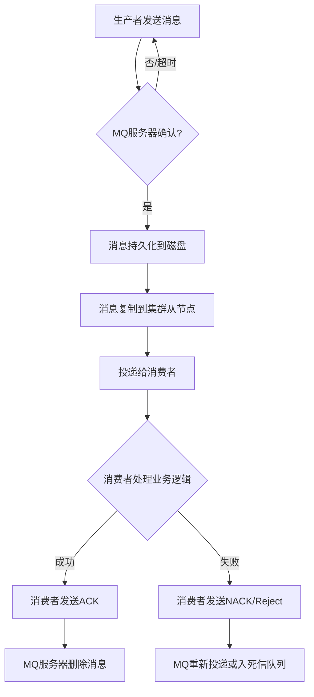

# 我面

TCP三次握手四次挥手

阶乘：递归，优化可能出现的问题

了解过solid吗
面向对象编程的各种方式
优化索引
Java堆栈
设计模式（装饰者模式）
受检异常和非受检异常，应用在什么场景

| 特性        | 受检异常 (Checked Exception)                                              | 非受检异常 (Unchecked Exception)                                                                          |
| --------- | --------------------------------------------------------------------- | ---------------------------------------------------------------------------------------------------- |
| **继承自**   | `Exception`                                                           | `RuntimeException`                                                                                   |
| **编译器检查** | **是**（必须处理或声明）                                                        | **否**                                                                                                |
| **处理要求**  | 强制性，try-catch块捕获或者throws抛出                                            | 可选性                                                                                                  |
| **代表性质**  | 可预见的、正常程序流程外的**问题**                                                   | 程序中的**错误（Bug）** 或逻辑错误                                                                                |
| **可恢复性**  | 通常希望调用者能**恢复**或处理                                                     | 通常**不可恢复**，需要中止当前操作                                                                                  |
| **调用者责任** | 明确知晓并处理可能发生的异常                                                        | 不强制知晓，但应避免引发异常的条件                                                                                    |
| **常见例子**  | `IOException`, `SQLException`，ClassNotFoundException，RuntimeException | `NullPointerEeception`, ArrayIndexOutOfBoundException，`IllegalArgumentException`，ArithmeticException |
| 场景        |                                                                       | 编程错误（访问null引用，数组或者集合下标越界，错误的类型转换）；API被误用(给方法传递了无效的参数，对象状态不正确)                                        |

对于Java虚拟机的了解


bean的生命周期
加载多个bean如何区分
	@Qualified指定名称装配bean
	

运行时接口超时失效应该如何定位，如何解决
	首先根据APM等工具查看接口响应时间，或者查看日志（网关以及应用日志）核心接口都会打印耗时日志
	查看接口的内部调用链，定位具体的失效原因
	解决：应急：服务降级，熔断。
		- 如果该接口不是核心流程（如评价列表、推荐列表），可以立即**手动配置降级**，返回一个默认值（如空列表），避免线程池被拖垮，保证其他核心接口（如下单、支付）可用。
		- 使用 **Hystrix** 或 **Sentinel** 配置熔断规则，当接口失败率超过阈值时，自动熔断，后续请求直接快速失败，不再请求下游脆弱的服务。
		- 如果判断是流量激增导致的整体负载过高，最简单粗暴的办法是**对应用节点和数据库进行临时扩容**，先扛过流量高峰。
		- 如果怀疑是某个实例状态异常（如内存泄漏、死锁），可以尝试**重启**该实例。这是一个万金油式的临时解决方案。
	- 根据链路追踪定位到的不同瓶颈点，进行针对性优化：
		**A. 如果是数据库慢（最常见）：**
		- **分析SQL**：抓取慢查询日志，使用`EXPLAIN`命令分析执行计划。
		- **优化索引**：缺少索引就加索引，索引失效就优化SQL写法（避免函数、隐式转换等）。
		**优化SQL**：避免深分页（`limit 100000, 10`）、大量`JOIN`、`SELECT *`等。
		- **引入缓存**：对查询结果进行缓存（Redis/Memcached），减少数据库压力
		- **读写分离**：将查询请求路由到从库，减轻主库压力。
		**B. 如果是下游第三方接口慢：**
		- **设置超时时间**：一定要在HTTP客户端（如Feign、RestTemplate）中**设置合理的连接超时和读取超时**，避免长时间等待。
		- **异步化**：如果业务允许，将调用改为**异步操作**（如通过消息队列），先快速响应客户端，后台再慢慢处理。
		- **熔断降级**：同上，必须配备熔断器，防止下游服务雪崩。
		**C. 如果是业务逻辑复杂/计算量大：**
		- **算法优化**：检查是否存在时间复杂度高的代码（如多重循环），尝试优化算法。
		- **空间换时间**：预处理一些数据，将计算结果缓存起来。
		- **异步处理**：将耗时操作扔到线程池中异步执行，或者存入消息队列进行削峰填谷。
		- **批处理**：如果有频繁的IO操作，考虑将多次操作合并为一次批量操作
		**D. 如果是JVM问题（GC频繁）：**
		- **分析GC日志**：使用工具分析GC频率和暂停时间。
		- **优化JVM参数**：调整堆大小、选择合适的垃圾收集器等。
		**E. 如果是资源竞争（锁）：*
		- **减少锁粒度**：查看是否有不必要的同步代码块或粗粒度的锁（如`synchronized`方法），尝试减小锁范围或使用并发容器。
		- **分布式锁优化**：如果使用了分布式锁（Redis/ZooKeeper），检查锁的持有时间是否过长。

队列使用在什么场景，有什么应用，
说两个常见的分布式锁以及应用
aop和Redis滑动窗口算法实现接口限流，如何实现
如何使用Redis的数据类型来实现Session保存用户的登录信息，如何优化
Redisson相关的项目细节，如何实现，带来了什么商业价值以及用户体验
SQL server是如何处理并发任务，保证数据的安全性的
volatile关键字，是否具有原子性
AOF和RDB


# 总

## 计算机网络

1. TCP三次握手四次挥手，为什么是三次四次问题
	1. 握手SYN，ACK
	2. 挥手FIN，ACK
2. time_wait状态的作用，以及为什么持续时间是2MSL？现代网络发展中，这个还是固定的2MSL吗？
	1. 确保最后一个ACK能够可靠地到达被关闭方，允许连接正常终止
	2. 让网络中所有旧的重复报文段都过期失效，避免被后续具有四元组的新连接错误接受
	3. msl是报文段在网络中的最大生存时间，设置为2可以让最后一个ACK到达关闭方也可以在ACK丢失之后重传并正常响应。还可以确保连接两个方向上的报文都从网络中消失，避免旧连接的报文干扰新连接。
	4. 不一定是固定的
3. TCP超时重传机制，sack算法，hpack算法
	1. 每发送一个数据段就启动重传计时器，并备份副本；在计时器结束前未收到确认信号则重新发送；收到确认后关闭计时器，清除副本
	2. 快速重传：接收方收到的与期望收到的数据段不同则立刻重复发送期望收到的序列号；如果发送方收到3个重复的ACK立即重传，无需等待计时器结束
	3. sack：允许接收方告知发送方已经收到的数据块，发送方可以精确的重传缺失的，提高效率
	4. hpack算法：http2的头部压缩算法，避免队头阻塞，静态字典+动态字典+霍夫曼编码，
4. TCP拥塞控制（慢启动，拥塞发生，拥塞避免，快速恢复）
	1. 连接开始时进入慢启动，拥塞窗口cwnd指数增长，达到慢启动阈值后转为拥塞避免的线性增长，趋于保守；一旦发生超时重传，将cwnd置为1，同时降低慢启动阈值ssthresh，重新开始慢启动；如果触发的是快速重传（收到三个重复的ACK）进入快速回复阶段，将cwnd 减半后进入拥塞避免，避免窗口的剧烈震荡，从而在高效利用带宽与保持网络稳定之间取得平衡
5. HTTP2和HTTP3的特点
	1. HTTP2：超时重传，二进制格式，还是TCP协议
	2. HTTP3：基于QUIC协议，
6. Session，token ，cookie
7. socket通信

## 操作系统

1. 进程间通信方式
2. Linux为何采用页式内存管理
3. io多路复用，epoll和select、poll的区别
4. 零拷贝（mmap，zerofile）这个可以结合rocketmq和kafk来说

## Mysql

1. innoDB采用的数据结构
2. 为何采用B+树而非其他结构
3. 什么叫覆盖索引
4. 什么叫索引下推
5. 联合索引的最左前缀法则，注意优化器可以优化where的条件顺序
6. RR隔离级别下，readview和锁机制如何减少幻读的发生的
7. undo log的WAL机制
8. 主从复制的同步机制、半同步机制、异步机制
9. 慢sql查询优化思路

## Redis

1. 常见的数据结构(string，list，hash，set，zset）
2. zset的底层实现
3. redis实现分布式锁（原子性，如何避免死锁等问题）
4. aof重写机制
5. rdb的写时复制技术
6. redis集群分片为何采用gossip协议同步元数据
7. redis集群分片解决单机实例压力大的问题
8. mysql与redis的数据一致性问题
### Redis 数据结构与分布式锁

#### 一、Redis 的核心数据结构

Redis 不仅是简单的 Key-Value 数据库，它的 Value 支持多种数据结构。

| 数据结构                 | 格式/描述                            | 常用命令                                        | 典型应用场景             |
| -------------------- | -------------------------------- | ------------------------------------------- | ------------------ |
| **String（字符串）**      | 最简单的类型，可存文本、数字（可自增/减）或二进制数据（如图片） | `SET`, `GET`, `INCR`, `DECR`, `MSET`        | 缓存、计数器、分布式锁        |
| **List（列表）**         | 一个有序、元素可重复的链表，支持从两端操作            | `LPUSH`, `RPUSH`, `LPOP`, `RPOP`, `LRANGE`  | 消息队列、最新消息排行、朋友圈时间线 |
| **Hash（哈希/字典）**      | 键值对集合，适合存储对象                     | `HSET`, `HGET`, `HMSET`, `HMGET`, `HGETALL` | 存储用户信息、商品信息等对象数据   |
| **Set（集合）**          | 无序、元素唯一的集合，支持交集、并集、差集等操作         | `SADD`, `SMEMBERS`, `SINTER`, `SUNION`      | 共同好友、标签系统、随机抽奖     |
| **Sorted Set（有序集合）** | 类似 Set，但每个元素都关联一个分数（score），用于排序  | `ZADD`, `ZRANGE`, `ZREVRANGE`, `ZRANK`      | 排行榜、带权重的消息队列       |
| **Bitmap（位图）**       | 通过位操作实现的数据结构，本质是 String          | `SETBIT`, `GETBIT`, `BITCOUNT`              | 用户签到、活跃用户统计        |
| **HyperLogLog**      | 用于基数统计（估算集合中不重复元素的数量）的算法         | `PFADD`, `PFCOUNT`, `PFMERGE`               | 大规模数据的UV统计（去重计数）   |
| **Geospatial（地理空间）** | 存储地理位置信息，并支持半径查询等操作              | `GEOADD`, `GEODIST`, `GEORADIUS`            | 附近的人、打车软件          |

#### 二、Redis 分布式锁的实现

分布式锁的核心是：在 Redis 中占一个“坑”，当别的进程也要来占时，发现已经有人占了，就放弃或者稍后再试。

**1. 基础版实现：`SETNX` + `DEL`（有缺陷，不推荐直接使用）**

- `SETNX key value`：如果 `key` 不存在，则设置成功（拿到锁）；如果 `key` 已存在，则设置失败（没拿到锁）。
    
- 业务完成后，使用 `DEL key` 删除键（释放锁）。
    
- **问题**：如果获取锁的客户端宕机，锁永远无法释放，导致**死锁**。
    

**2. 标准版实现：`SET` + Lua 脚本（推荐方案）**

为了解决死锁问题，需要给锁加一个过期时间。

- **加锁**：使用一条原子命令，同时完成设置值和过期时间。
	
    SET lock_key unique_value NX PX 30000
    
    - `NX`：仅当 Key 不存在时才能设置成功（互斥性）。
        
    - `PX 30000`：设置 Key 的过期时间为 30000 毫秒（防死锁）。
        
    - `unique_value`：一个唯一标识（如 UUID），必须是全局唯一字符串。**这是为了防止误删其他客户端的锁**。
        
- **释放锁**：使用 **Lua 脚本**保证原子性。先判断锁的值是否是自己设置的，再删除。
    
    ```lua
    if redis.call("get", KEYS[1]) == ARGV[1] then
        return redis.call("del", KEYS[1])
    else
        return 0
    end
    ```
    - **为什么需要 Lua 脚本？** 因为判断和删除是两个操作，如果不是原子性的，可能会在判断之后、删除之前，锁过期并被其他客户端获取，导致误删新锁。
        

**3. 工业级方案：Redlock 算法**

**当 Redis 采用主从架构**时，如果主节点宕机且锁未同步到从节点，可能导致多个客户端同时拿到锁。Redlock 算法旨在解决这个问题。

- **原理**：客户端向 **N 个（通常为 5 个）独立的 Redis 主节点**（不是主从集群，而是完全独立的主实例）依次申请锁。
    
- **加锁成功条件**：
    
    1. 客户端获取当前时间戳 T1。
        
    2. 依次向 5 个实例发送加锁命令（`SET ...`）。
        
    3. 客户端计算获取锁所花费的总时间（当前时间 T2 - T1），只有当满足以下两个条件时，才算加锁成功：
        
        - **超过半数（>= N/2 + 1，即 >=3）的节点都成功获取锁**。
            
        - **总花费时间小于锁的过期时间**。
            
- **优点**：可靠性更高。
    
- **缺点**：部署复杂，性能低，且其正确性在分布式理论界有争议。**除非是在极端要求可靠性的金融场景，否则通常使用第 2 种单实例方案就够了**。
    

**总结**：在生产环境中，最常用的是 **“SET NX PX + 唯一值 + Lua 脚本释放”** 的方案，它在简单性、性能和可靠性之间取得了很好的平衡。Java 中可以使用 `Redisson` 这样的客户端，它封装了这些复杂的逻辑，提供了开箱即用的分布式锁。
### Redis 热 Key 问题

#### 1. 什么是热 Key？

**热 Key** 是指在 Redis 中，某个 Key 在**单位时间内被访问的次数**远远高于其他 Key。通常是由于某个业务关键数据被高频访问造成的。

- **例子**：
    
    - 热门微博评论区的某个 Key。
        
    - 爆款商品的库存信息 Key。
        
    - 重大新闻的详情内容 Key。
        

#### 2. 热 Key 带来的问题

1. **流量集中，网卡打满**：所有对热 Key 的请求都打到 Redis 的**某一个数据分片**上（如果是集群模式）。该分片所在的服务器网络带宽可能被占满，导致其他请求变慢甚至超时。
    
2. **CPU 压力大**：单个 Redis 实例（或分片）的 CPU 负载急剧升高，处理能力达到瓶颈。
    
3. **数据倾斜**：在 Redis 集群中，导致某个节点负载过高，而其他节点负载很低，破坏了集群的负载均衡。
    
4. **缓存击穿风险**：如果热 Key 突然过期，海量请求会同时穿透到数据库，可能导致数据库瞬间被压垮。
    

#### 3. 如何发现热 Key？

1. **预估**：根据业务经验，提前识别可能的热点（如运营活动）。
    
2. **客户端统计**：在业务代码中嵌入统计逻辑，上报 Key 的访问频次。
    
3. **Redis 监控工具**：
    
    - `redis-cli --hotkeys` 命令（需要开启 `maxmemory-policy` 为 LFU 策略）。
        
    - `monitor` 命令（**谨慎使用**，性能开销极大，仅用于临时调试）。
        
    - 第三方监控平台（如 DataDog, Prometheus + Grafana）通过分析 Redis 指标进行推断。
        
4. **网络流量分析**：通过抓包分析哪些 Key 的请求频率最高。
    

#### 4. 解决方案

1. **二级缓存（本地缓存）** - **最有效的方案**
    
    - **做法**：在访问 Redis 之前，增加一个本地缓存（如 Guava Cache, Caffeine）。当热 Key 更新时，通过发布订阅机制或设置较短的过期时间来保证本地缓存的一致性。
        
    - **效果**：绝大部分请求在应用服务器本地就被处理掉了，不会打到 Redis，从根本上解决了热 Key 对 Redis 的压力。
        
2. **备份 Key（Key Splitting）**
    
    - **做法**：将热 Key 复制成多个副本，如 `hotkey:1`, `hotkey:2`, ... `hotkey:n`。客户端在访问时，随机选择一个副本 Key 进行读写。
        
    - **缺点**：更新数据时需要同时更新所有副本，操作复杂，一致性难以保证。通常只适用于只读热 Key。
        
3. **使用 Redis 集群模式**
    
    - 虽然不能解决单个分片的热点问题，但可以将其他非热点数据分散到其他节点，避免单个实例因混合负载而整体崩溃。
        

---

### Redis 大 Key 问题

#### 1. 什么是大 Key？

**大 Key** 是指 Redis 中某个 Key 对应的 **Value 值非常大**。通常有以下几种情况：

- **String 类型**：Value 的大小超过 **10 KB**。
    
- **集合类型（List, Hash, Set, Sorted Set）**：元素数量过多（如超过 1 万个），或整体体积过大（如超过 100 MB）。
    
- **例子**：
    
    - 一个包含几十万粉丝的用户 ID 列表（Set）。
        
    - 一个存储了超大 HTML 文本或图片的 String。
        
    - 一个存储了商品所有属性的巨大 Hash。
        

#### 2. 大 Key 带来的问题

1. **读写性能差**
    
    - **网络阻塞**：一次读取/写入大 Key 需要传输大量数据，耗时长，占满网络带宽。
        
    - **CPU 压力**：序列化和反序列化大 Value（尤其是集合的聚合操作如 `hgetall`, `lrange 0 -1`）会消耗大量 CPU。
        
    - **慢查询**：`DEL` 删除一个大 Key 会直接导致 Redis 线程阻塞，其他命令无法执行。
        
2. **内存分布不均**：可能导致内存倾斜，某个实例内存占用远高于其他实例。
    
3. **集群数据迁移困难**：在 Redis Cluster 中，扩容缩迁时，迁移大 Key 会导致卡顿和超时。
    
4. **持久化与主从复制风险**：
    
    - **AOF 重写**和 **`bgsave`** 生成 RDB 时，父进程会 fork 子进程。如果存在大 Key，fork 过程可能会因拷贝内存页表而变慢，导致主进程阻塞。
        
    - 主从同步时，首次同步或大 Key 更新时，会占用大量网络资源。
        

#### 3. 如何发现大 Key？

1. **使用 `redis-cli` 自带命令**：
    
    bash
    
    扫描大 Key，输出大于 10240 字节的 Key，最多输出前20个
    redis-cli --bigkeys -i 0.1 # -i 0.1 表示每扫描100个key休息0.1秒，降低对Redis的影响
    
2. **使用 `memory usage` 命令**（精确分析）：
    
    bash
    
    MEMORY USAGE your_key_name
    
3. **使用第三方工具**：如 `rdb-tools` 分析 RDB 文件，可以非常精确地分析出每个 Key 的内存占用。
    

#### 4. 解决方案

1. **拆分（最根本的解决方案）**
    
    - **String 类型**：如果 Value 是大型文本或二进制数据，考虑是否可以用对象存储（如 S3, OSS），Redis 中只存地址。
        
    - **集合类型**：
        
        - **纵向拆分**：将一个大的 Hash 拆分成多个小的 Hash。例如，用户信息 `user:123` 拆分成 `user:123:base_info`, `user:123:extended_info`。
            
        - **横向拆分**：按某种规则将元素分到多个 Key 中。例如，一个存储所有用户ID的大 Set，可以按用户ID的哈希值拆分成 `users:set:0`, `users:set:1`, ... `users:set:n`。
            
2. **压缩**
    
    - 对于 String 类型的 Value，在写入前先进行压缩（如 GZIP, Snappy），读取时再解压。以 CPU 开销换取网络和内存开销。
        
3. **异步删除与清理**
    
    - **避免直接使用 `DEL`**：Redis 4.0 及以上版本提供了异步删除命令 `UNLINK`，它会将 Key 异步地回收，不会阻塞主线程。
        
    - **渐进式删除**：对于大的集合类型，可以使用对应的命令分批删除：
        
        - `HSCAN` + `HDEL`：用于大 Hash。
            
        - `SSCAN` + `SREM`：用于大 Set。
            
        - `ZSCAN` + `ZREM`：用于大 ZSet。
            
        - `LTRIM`：用于大 List。
            

### 总结对比

|特性|热 Key 问题|大 Key 问题|
|---|---|---|
|**核心问题**|**访问频率高**，导致单分片流量和CPU瓶颈|**Value 体积大**，导致网络、CPU、内存操作阻塞|
|**主要影响**|流量倾斜、缓存击穿|慢查询、持久化阻塞、内存不均|
|**解决思路**|**分散访问压力**|**减小单个 Value 体积**|
|**核心解决方案**|**二级缓存（本地缓存）**|**拆分（分片）**|
|**辅助方案**|备份Key、集群化|压缩、异步删除（`UNLINK`）|

在实际生产环境中，大 Key 和热 Key 问题常常需要提前在架构设计和代码编写阶段就进行规避，并通过完善的监控系统及时发现和治理。
## Java

1. **==HashMap的原理==**
	1. 数据结构：数组（存储键值对，通过索引（通过对键的进一步hash处理得到）拿到）+链表（解决哈希冲突）+红黑树（链表长度超过8，数组长度大于64，链表转换为红黑树，查询效率logn）。底层数值长度都是2的幂次方
		
	2. 扩容机制：初始容量16，阈值是容量* 0.75。扩容后是原来的两倍，把原来的元素重新计算哈希放到新的数组。
		1. 如果设置得太低，如 0.5，会浪费空间；如果设置得太高，如 0.9，会增加哈希冲突。0.75 是 JDK 作者经过大量验证后得出的最优解，能够最大限度减少 rehash 的次数
	3. 为什么使用红黑树，而不是二叉树，平衡二叉树
		1. 查找插入删除的复杂度是logn
		2. 二叉树每个节点最多有两个子节点，容易出现极端情况，退化为链表，查询效率On
		3. 平衡二叉树比红黑树的要求更高，每个节点的左右字数的高度最多相差1，保证了极佳的查询效率，但是插入删除操作是需要频繁进行旋转类维持树的平衡，维护成本更高
	4. ==put流程==
		1. 哈希寻址，处理哈希冲突（链表还是红黑树），判断是否需要扩容，插入节点
		
		2. 通过==hash方法==进一步扰动哈希值，减少哈希冲突
			1. 先调用 key 自身的 `hashCode()` 方法得到一个整数值 `h`。然后将 `h` 的**高16位**与**低16位**进行**异或**操作。
			```Java
			static final int hash(Object key) {
			    int h;
			    return (key == null) ? 0 : (h = key.hashCode()) ^ (h >>> 16);
			}
			```
			2. **为什么能减少哈希冲突**
				1. 问题根源：高位缺失
					1. HashMap如何根据哈希值定位数组下标：index = (table.length - 1) & hashValue;
						1. `&` 操作符的特性是，只有双方都为 1 时结果才为 1。这意味着，**最终决定下标位置的，只是哈希值的低几位**，高位信息完全被 `(table.length - 1)` 的 `0` 给屏蔽掉了！
				2. 解决：扰动哈希
					1. `h >>> 16`：将原生哈希码 `h` **无符号右移 16 位**。这相当于把原来的**高 16 位**移动到了**低 16 位**的位置上。
					2. `h ^ (h >>> 16)`：将**原始哈希码** `h` 与**移位后的结果**进行**异或**操作
					3. 混合后的新哈希值，其低位同时包含了原始高、低位的信息。
					4. **即使原生哈希码低位相同，只要其高位不同，混合后的新低位有很大概率会不同**，从而被映射到不同的数组下标，极大减少了冲突概率。
		3. 第一次数组扩容，使用哈希值和数组长度进行取模运算，确定索引位置
			1. 如果当前位置为空，直接将键值对插入该位置；否则判断当前位置的第一个节点是否与新节点的 key 相同，如果相同直接覆盖 value，如果不同，说明发生哈希冲突。
			2. 如果是链表，将新节点添加到链表的尾部；如果链表长度大于等于 8，则将链表转换为红黑树
		4. 每次插入新元素后，检查是否需要扩容，如果当前元素个数大于阈值（`capacity * loadFactor`），则进行扩容，扩容后的数组大小是原来的 2 倍；并且重新计算每个节点的索引，进行数据重新分布。
	5. 查找元素
		1. 通过哈希值定位索引，定位桶，检查第一个节点，遍历链表或红黑树，返回结果
			1. 
	6. 解决哈希冲突的方法，HashMap使用拉链法
		1. 再哈希法：准备两台哈希算法，发生冲突时所使用另外一种哈希算法，直到找到空槽为止，对哈希算法的设计要求比较高
		2. 开放地址法：从冲突的位置开始往后找直到空槽（线性：依次，二次：二次方）
		3. **拉链法**：用链表将冲突元素串起来
	7. 判断key相等
		1. **hashCode()** ：使用`key`的`hashCode()`方法计算`key`的哈希码
		2. **equals()** ：当两个`key`的哈希码相同时，`HashMap`还会调用`key`的`equals()`方法进行精确比较。只有当`equals()`方法返回`true`时，两个`key`才被认为是完全相同的
	8. 为什么HashMap链表转红黑树的阈值为8？
		1. 红黑树节点的大小大概是普通节点大小的两倍，所以转红黑树，牺牲了空间换时间，更多的是一种兜底的策略，保证极端情况下的查找效率。
		2. 理想情况下，使用随机哈希码，链表里的节点符合泊松分布，出现节点个数的概率是递减的，节点个数为 8 的情况，发生概率仅为`0.00000006`。
		3. 红黑树转回链表的阈值为什么是 6，而不是 8？是因为如果这个阈值也设置成 8，假如发生碰撞，节点增减刚好在 8 附近，会发生链表和红黑树的不断转换，导致资源浪费
	9. **==HashMap的扩容机制==**
		1. 扩容时，HashMap 会创建一个新的数组，其容量是原来的两倍。然后遍历旧哈希表中的元素，将其重新分配到新的哈希表中
			1. 如果当前桶中只有一个元素，那么直接通过键的哈希值与数组大小取模锁定新的索引位置：`e.hash & (newCap - 1)`。
			2. 如果当前桶是红黑树，那么会调用 `split()` 方法分裂树节点，以保证树的平衡。
			3. 如果当前桶是链表，会通过旧键的哈希值与旧的数组大小取模 `(e.hash & oldCap) == 0` 来作为判断条件，如果条件为真，元素保留在原索引的位置；否则元素移动到原索引 + 旧数组大小的位置。
		2. JDK 7 在扩容的时候使用头插法来重新插入链表节点，这样会导致链表无法保持原有的顺序
		3. JDK 8 改用了尾插法，并且当 `(e.hash & oldCap) == 0` 时，元素保留在原索引的位置；否则元素移动到原索引 + 旧数组大小的位置。避免了 hashCode 的重新计算，大大提升了扩容的性能。
			1. 原索引 `index = (n - 1) & hash`，扩容后的新索引就是 `index = (2n - 1) & hash`
			2. 假设扩容前的数组长度为 16（n-1 也就是二进制的 0000 1111，1X+1X+1X+1X=1+2+4+8=15），key1 为 5（二进制为 0000 0101），key2 为 21（二进制为 0001 0101）。
				- key1 和 n-1 做 & 运算后为 0000 0101，也就是 5；
				- key2 和 n-1 做 & 运算后为 0000 0101，也就是 5。
				- 此时哈希冲突了，用拉链法来解决哈希冲突。
				
				现在，HashMap 进行了扩容，容量为原来的 2 倍，也就是 32（n-1 也就是二进制的 0001 1111，1+2+4+8+16=31）。
				
				- key1 和 n-1 做 & 运算后为 0000 0101，也就是 5；
				- key2 和 n-1 做 & 运算后为 0001 0101，也就是 21=5+16，就是数组扩容前的位置+原数组的长度。
				
				- 这样可以避免重新计算所有元素的哈希值，只需检查高位的某一位，就可以快速确定新位置。
				- 
	10. JDK8对HashMap做的优化
		1. 底层数据结构由数组+链表改成了数组+链表+红黑树
		2. 链表插入方式由头插法改为了尾插法
		3. 扩容的时机由插入时判断改为插入后判断，避免在每次插入时进行不必要的扩容检查
		4. 哈希扰动算法优化。7是通过多次移位和异或运算来实现的。8让hash值的高16位和低16位进行异或运算，极大程度减少哈希碰撞
	11. 设计HashMap
		1. 实现hash函数，对键的hashCode进行扰动
		2. 实现一个拉链法解决哈希冲突
		3. 扩容后重新计算哈希，将元素放到新的数组
			
	12. **==HashMap是线程安全的吗？不是==**
		1. 多线程下扩容会死循环：7中的HashMap使用头插法处理链表，多线程环境下扩容会出现环形链表造成死循环。8通过尾插法修复了，扩容时保持链表原来的顺序
		2. 多线程进行put元素使可能导致元素丢失。因为计算出来的位置可能会被其他线程覆盖掉
		3. put和get并发时可能导致get为null。线程 1 执行 put 时，因为元素个数超出阈值而扩容，线程 2 此时执行 get，就有可能出现这个问题。为线程 1 执行完 table = newTab 之后，线程 2 中的 table 已经发生了改变，比如说索引 3 的键值对移动到了索引 7 的位置，此时线程 2 去 get 索引 3 的元素就 get 不到了
	13. **==怎么解决线程不安全问题==**
		1. 使用并发工具包下的ConcurrentHashMap，使用CAS+synchronized关键字来保证线程安全
			1. 
	14. TreeMap和HashMap的区别，两者的应用场景
		1. TreeMap是基于红黑树实现的，put元素时会先判断根节点是否为空，为空直接插入到根节点，否则通过key比较器来判断元素插入左子树还是右子树。查找效率是Ologn，保证了元素的顺序，适用于大量范围查找或者有序遍历的场景
		2. HashMap是基于数组链表红黑树实现的，put元素时会先计算key的哈希值，通过hash值计算出元素在数组中存放的下标，将元素插入到指定位置。如果发生哈希冲突，会使用链表解决。链表长度大于8会转换为红黑树。查找效率为O1.适用于查找操作比较频繁的场景。
2. ConcurrentHashMap的原理
3. synchronized关键字在字节码层面的原理
4. synchronized和reentrantlock的区别
5. ThreadLoacl内存泄露问题
6. 双亲委派机制
7. g1垃圾回收器和cms垃圾回收器对比
8. **==常见的集合框架==**
	1. Collection（继承iterable）
		1. set：无序无重复的集合，HashSet ，TreeSet
		2. Queue：队列，双端队列ArrayDeque，优先队列PriorityQueue
		3. List：有序可重复的集合，动态数组ArrayList，封装了链表的LinkedList
	2. Map键值对集合
		1. sortedMap
			1. TreeMap
		2. abstractMap
			1. HashMap
				1. LinkedHashMap
	
	3. 集合框架常见的工具类
		1. Collections：对集合进行排序。二分查找
		2. Arrays：对数组进行排序、打印和List转换
	4. 队列
		1. 优先级队列PriorityQueue：无界队列，按照自然顺序排序或者comparator比较器进行排序
			
		2. 双端队列：实现了Queue接口，基于数组的，可以在两端插入或删除元素的队列
		3. LinkedList实现了Queue接口的子类Deque，可以当做双端队列来使用
	5. 常用的集合类
		1. HashMap：基于哈希表的键值对集合，优点是可以根据键的哈希值快速查找到值，但是可能会发生哈希冲突，并且不保留键值对的插入顺序
		2. LinkedHashMap：在HashMap的基础上增加了一个双向链表来保存键值对的插入顺序
		3. ArrayList：动态数组，可以在需要时进行动态扩容，需要复制元素到新的数组。优点是访问速度快，可以通过索引直接查到元素，确缺点是插入和删除元素可能需要移动或复制元素
		4. LinkedList：双向链表，适合频繁插入或删除操作。缺点是访问元素的时候需要遍历链表
	6. 线程安全的容器
		1. vector
		2. HashTable
		3. ConcurrentHashMap
		4. CopyOnWriteArrayList
9. **==ArrayList和LinkedList的区别==**
	1. ArrayList基于数组，利于查找O（1）。支持随机访问。连续内存空间，扩容是重新分配内存为原来的1.5倍，内存占用紧凑。
		1. 序列化：只序列化有效数据
		2. 实现线程安全的方法
			1. Collections.synchonizedList（）：SynchronizedList list = Collections.synchronizedList(new ArrayList());
			2. CopyOnWriteArrayList：CopyOnWriteArrayList list = new CopyOnWriteArrayList();CopyOnWrite 
				1. 就是当我们往一个容器添加元素的时候，不直接往容器中添加，而是先复制出一个新的容器，然后在新的容器里添加元素，添加完之后，再将原容器的引用指向新的容器。多个线程在读的时候，不需要加锁，因为当前容器不会添加任何元素。这样就实现了线程安全。
				2. 
	2. LinkedList基于链表，利于增删，头部尾部增删O1，中间增删On，不支持随机访问。内存不连续，
10. Java 的八种基本数据类型
	
	Java 是一种强类型语言，基本数据类型是语言本身定义的，不是对象。它们分为四大类：

| 类别      | 数据类型      | 大小（位） | 默认值      | 取值范围             | 说明                 |
| ------- | --------- | ----- | -------- | ---------------- | ------------------ |
| **整型**  | `byte`    | 8     | 0        | -128 ~ 127       | 最小单位，用于二进制数据       |
|         | `short`   | 16    | 0        | -2^15 ~ 2^15-1   | 不常用                |
|         | `int`     | 32    | 0        | -2^31 ~ 2^31-1   | **最常用**的整型         |
|         | `long`    | 64    | 0L       | -2^63 ~ 2^63-1   | 数值后加 `L` 或 `l`     |
| **浮点型** | `float`   | 32    | 0.0f     | 遵循 IEEE 754      | 单精度，数值后加 `F` 或 `f` |
|         | `double`  | 64    | 0.0d     | 遵循 IEEE 754      | **默认**的浮点型，双精度     |
| **字符型** | `char`    | 16    | `\u0000` | 0 ~ 65535        | 存储单个 Unicode 字符    |
| **布尔型** | `boolean` | 未精确定义 | `false`  | `true` / `false` | 表示逻辑真或假            |

| 特性       | 基本数据类型                  | 引用数据类型                                                   |
| -------- | ----------------------- | -------------------------------------------------------- |
| **本质**   | 存储的是**数据值本身**           | 存储的是对象的**内存地址（引用）**                                      |
| **内存分配** | 在**栈内存**中直接分配空间存储值      | 在**堆内存**中分配空间创建对象，栈内存中存储对象的地址                            |
| **默认值**  | 有默认值（见上表）               | 默认值为 `null`                                              |
| **比较操作** |  == 比较的是**值**是否相等       | == 比较的是**内存地址**是否相同（即是否为同一个对象）。比较内容是否相等需使用 `equals()` 方法 |
| **传递方式** | **按值传递**：方法调用时，传递的是值的副本 | **按引用值传递**：方法调用时，传递的是对象地址的副本（所以可以修改对象内容，但不能改变原引用指向的对象）   |
| **示例**   | `int a = 10;`           | `String s = "Hello";`  <br>`Object obj = new Object();`  |
#### 三、存储方式的区别（核心）

这是理解两者区别的关键。

**1. 基本数据类型的存储：**  
变量名直接指向存储数据值的内存地址。

int age = 25;

内存中会有一块空间存储值 `25`，变量 `age` 直接指向这个值。  
`栈内存：[age] --> 25`

**2. 引用数据类型的存储：**  
变量名指向一个存储地址的内存单元，而这个地址指向堆内存中实际的对象。

java

String name = "Alice";
Person p = new Person();

- 在堆内存（Heap）中创建了一个 `String` 对象，其值为 `"Alice"`。
	
- 在栈内存（Stack）中，变量 `name` 存储的是这个 `String` 对象在堆内存中的地址（例如 `0x1234`）。
	

`栈内存：[name] --> 0x1234`  
`堆内存：[0x1234] --> String("Alice")`

**图示理解：**

text

基本类型：   [栈]
		 变量a ---> 值(10)

引用类型：   [栈]         [堆]
		 变量p ---> 地址(0x1001) ---> 对象内容{name: "Alice", ...}

**重要结论**：正是因为引用类型变量存储的是地址，所以当两个变量指向同一个对象时，通过其中一个变量修改对象的状态，另一个变量也会“看到”这个变化。

### Static方法和普通方法被synchronized加锁，有什么区别？
#### 核心结论

*   **普通 `synchronized` 方法**：使用的是 **当前实例对象锁（this）**。即，一个线程访问一个对象的同步普通方法时，会阻塞其他线程访问**同一个实例**的**所有**同步普通方法，但不会影响不同实例的方法或静态方法。
*   **静态 `synchronized` 方法**：使用的是 **当前类的 Class 对象锁**。即，一个线程访问一个类的同步静态方法时，会阻塞其他线程访问**这个类的所有**同步静态方法，但不会影响普通方法。

---

#### 详细解析与对比

我们通过一个例子来彻底理解。

```java
public class SynchronizedExample {

    // 普通同步方法
    public synchronized void normalSyncMethod() {
        System.out.println("进入普通同步方法，线程：" + Thread.currentThread().getName());
        try {
            Thread.sleep(3000); // 模拟方法执行需要3秒
        } catch (InterruptedException e) {
            e.printStackTrace();
        }
        System.out.println("离开普通同步方法，线程：" + Thread.currentThread().getName());
    }

    // 静态同步方法
    public static synchronized void staticSyncMethod() {
        System.out.println("进入静态同步方法，线程：" + Thread.currentThread().getName());
        try {
            Thread.sleep(3000);
        } catch (InterruptedException e) {
            e.printStackTrace();
        }
        System.out.println("离开静态同步方法，线程：" + Thread.currentThread().getName());
    }

    // 普通非同步方法
    public void normalMethod() {
        System.out.println("进入普通非同步方法，线程：" + Thread.currentThread().getName());
    }
}
```

#### 场景一：同一个实例，不同线程调用普通同步方法

```java
public static void main(String[] args) {
    SynchronizedExample example1 = new SynchronizedExample();

    Thread t1 = new Thread(() -> example1.normalSyncMethod());
    Thread t2 = new Thread(() -> example1.normalSyncMethod());

    t1.start();
    t2.start();
}
```

**输出结果：**
```
进入普通同步方法，线程：Thread-0
（等待3秒...）
离开普通同步方法，线程：Thread-0
进入普通同步方法，线程：Thread-1
（等待3秒...）
离开普通同步方法，线程：Thread-1
```

**解释**：
*   线程 t1 和 t2 竞争的是 **`example1` 这个实例的对象锁**。
*   t1 先获取到锁，进入方法并休眠3秒。
*   t2 必须等待 t1 释放 `example1` 的锁后，才能进入方法。
*   **结论：普通同步方法锁的是当前对象实例。**

#### 场景二：不同实例，不同线程调用普通同步方法

```java
public static void main(String[] args) {
    SynchronizedExample example1 = new SynchronizedExample();
    SynchronizedExample example2 = new SynchronizedExample();

    Thread t1 = new Thread(() -> example1.normalSyncMethod());
    Thread t2 = new Thread(() -> example2.normalSyncMethod());

    t1.start();
    t2.start();
}
```

**输出结果：**
```
进入普通同步方法，线程：Thread-0
进入普通同步方法，线程：Thread-1
（等待3秒...）
离开普通同步方法，线程：Thread-0
离开普通同步方法，线程：Thread-1
```

**解释**：
*   线程 t1 竞争的是 `example1` 的对象锁。
*   线程 t2 竞争的是 `example2` 的对象锁。
*   这是**两把不同的锁**，因此不存在竞争关系。两个线程同时执行。
*   **结论：不同实例的普通同步方法之间互不干扰。**

#### 场景三：同一个类，不同线程调用静态同步方法

```java
public static void main(String[] args) {
    // 注意：即使创建不同的实例，静态方法也属于类本身
    SynchronizedExample example1 = new SynchronizedExample();
    SynchronizedExample example2 = new SynchronizedExample();

    Thread t1 = new Thread(() -> example1.staticSyncMethod()); // 通过实例调用，但锁的是类
    Thread t2 = new Thread(() -> example2.staticSyncMethod()); // 通过另一个实例调用

    t1.start();
    t2.start();
}
```

**输出结果：**
```
进入静态同步方法，线程：Thread-0
（等待3秒...）
离开静态同步方法，线程：Thread-0
进入静态同步方法，线程：Thread-1
（等待3秒...）
离开静态同步方法，线程：Thread-1
```

**解释**：
*   静态同步方法锁的是 **`SynchronizedExample.class`** 这个 Class 对象。
*   无论你通过 `example1` 还是 `example2` 去调用静态方法，它们争夺的都是**同一把类锁**。
*   因此 t1 和 t2 是互斥的。
*   **结论：静态同步方法锁的是当前类的 Class 对象。**

#### 场景四：同一个实例，一个线程调用普通同步方法，另一个调用静态同步方法

```java
public static void main(String[] args) {
    SynchronizedExample example1 = new SynchronizedExample();

    Thread t1 = new Thread(() -> example1.normalSyncMethod());
    Thread t2 = new Thread(() -> example1.staticSyncMethod());

    t1.start();
    t2.start();
}
```

**输出结果：**
```
进入普通同步方法，线程：Thread-0
进入静态同步方法，线程：Thread-1
（等待3秒...）
离开普通同步方法，线程：Thread-0
离开静态同步方法，线程：Thread-1
```

**解释**：
*   线程 t1 争夺的是 **`example1` 的对象锁**。
*   线程 t2 争夺的是 **`SynchronizedExample.class` 的类锁**。
*   **这是两把完全不同的锁**，因此不存在任何竞争关系。两个线程同时执行。
*   **结论：普通同步方法和静态同步方法使用的锁不同，它们之间不会互斥。**

---

#### 总结对比表

| 特性 | 普通 `synchronized` 方法 | 静态 `synchronized` 方法 |
| :--- | :--- | :--- |
| **锁的对象** | **当前实例对象（this）** | **当前类的 Class 对象** |
| **锁的作用范围** | 同一个实例内的所有普通同步方法 | 该类的所有实例的所有静态同步方法 |
| **不同实例间** | **不互斥**，各用各的锁 | **互斥**，共用同一把类锁 |
| **与对方的关系** | 和静态同步方法**不互斥** | 和普通同步方法**不互斥** |
| **等效的同步代码块** | `synchronized(this) { ... }` | `synchronized(Xxx.class) { ... }` |

**简单记忆**：
*   **普通方法** -> **锁实例** -> 保护的是**单个对象实例**内的数据。
*   **静态方法** -> **锁类** -> 保护的是**所有实例共享**的静态数据。

好的，简述 Java 中 synchronized 的锁升级过程。

Java 为了优化 synchronized 的性能，从 JDK 1.6 开始引入了**偏向锁**和**轻量级锁**，使得锁的状态可以根据竞争情况动态升级。这个过程是单向的，旨在减少获得锁和释放锁带来的性能开销。

锁的升级路径是：**无锁 -> 偏向锁 -> 轻量级锁 -> 重量级锁**。

---

### 锁的四种状态（由低到高）

1.  **无锁状态**
2.  **偏向锁状态**
3.  **轻量级锁状态**
4.  **重量级锁状态**

### 升级过程详解

#### 步骤一：无锁 -> 偏向锁

*   **触发条件**：当一个线程第一次访问同步块时。
*   **核心思想**：在大多数情况下，锁不仅不存在多线程竞争，而且总是由**同一线程**多次获得。偏向锁就是为了在只有一个线程执行同步块时提高性能。
*   **实现机制**：
    *   虚拟机在对象头中的 Mark Word 部分**记录获得锁的线程ID**。
    *   之后，这个线程再次进入和退出同步块时，**不需要进行CAS操作来加锁和解锁**，只需简单测试一下对象头的 Mark Word 里是否存储着指向当前线程的偏向锁。
    *   如果测试成功，表示线程已经获得了锁，直接进入同步块。
*   **优点**：加锁和解锁不需要额外的消耗，和非同步方法的时间差距微乎其微。

#### 步骤二：偏向锁 -> 轻量级锁

*   **触发条件**：当**另一个线程**也来尝试获取这个锁时（即发生锁竞争）。
*   **核心思想**：当存在轻微的锁竞争时（即线程交替执行同步块），避免直接使用重量级锁（操作系统互斥量）带来的性能消耗。
*   **实现机制**：
    1.  偏向锁的撤销：JVM 会首先**等待一个全局安全点**（此时没有字节码正在执行），然后暂停拥有偏向锁的线程。
    2.  检查原持有偏向锁的线程是否还活着：
        *   **如果已退出同步块或已死亡**：则将对象头设置为**无锁状态**，然后新的线程以轻量级锁的方式竞争。
        *   **如果仍然需要持有锁**：则**升级为轻量级锁**。
    3.  轻量级锁的加锁过程：JVM 会在当前线程的栈帧中创建一个名为**锁记录（Lock Record）** 的空间，用于存储锁对象目前的 Mark Word 的拷贝。然后，使用 **CAS 操作**尝试将对象头的 Mark Word 更新为指向锁记录的指针。
        *   如果**成功**，当前线程获得锁。
        *   如果**失败**，表示其他线程已经抢先争夺了锁（即发生了竞争），会**自旋**等待一小段时间（自适应自旋）再次尝试获取。如果自旋后仍然失败，则升级为重量级锁。

#### 步骤三：轻量级锁 -> 重量级锁

*   **触发条件**：轻量级锁在自旋等待后，如果还是**无法获取到锁**（说明竞争比较激烈，比如有多个线程同时在竞争），或者**自旋的线程数超过CPU核心数的一半**，就会进行锁升级。
*   **核心思想**：当竞争激烈时，继续自旋只会空耗 CPU，不如直接挂起线程，交由操作系统管理，让出CPU资源给其他线程使用。
*   **实现机制**：
    *   锁标志位变为重量级锁的状态。
    *   指向一个**互斥量（Mutex）**，这个互斥量由操作系统内核管理。
    *   此时，其他未获取到锁的线程会被**挂起**（进入阻塞状态），进入操作系统的等待队列。等待锁被释放后，由操作系统唤醒。
*   **缺点**：线程的挂起和唤醒需要从用户态切换到内核态，这个操作成本很高，导致执行速度慢。

---

### 总结与图示

**升级路径：**
`无锁` --(第一个线程访问)--> `偏向锁` --(第二个线程竞争)--> `轻量级锁` --(竞争加剧/自旋失败)--> `重量级锁`

**核心思想：**
*   **无竞争或单线程**：使用**偏向锁**，开销最小。
*   **轻微竞争（线程交替执行）**：使用**轻量级锁**，通过CAS和自旋避免阻塞。
*   **激烈竞争**：使用**重量级锁**，避免空转消耗CPU，将线程挂起。

**重要提示：** 锁的升级是**不可逆**的。一旦升级为重量级锁，就无法再降级。这是因为在激烈竞争环境下，降级的意义不大，且降级操作本身也有开销。

这个精巧的升级机制使得 synchronized 在无竞争和低竞争场景下性能表现非常好，同时也能应对高竞争场景，这也是为什么现代Java程序中 synchronized 的性能已经不逊于甚至优于 Lock 接口的实现（如 ReentrantLock）的原因。
## Mq

### 1. mq如何保证数据不丢失
非常好，这是一个关于消息队列（MQ）最核心、最常被问及的问题。要保证 MQ 数据不丢失，需要从消息传递的**三个关键环节**入手：**生产者 -> MQ 服务器 -> 消费者**。

没有任何单一配置能绝对保证数据不丢失，它需要生产端、Broker 端、消费端三方协同才能实现。下面以主流的 RabbitMQ 和 RocketMQ/Kafka 为例进行说明。

---

#### 核心框架：三个环节的可靠性保障

| 环节 | 丢失场景 | 解决方案 |
| :--- | :--- | :--- |
| **1. 生产者发向 MQ** | 消息还在网络传输，MQ 服务器宕机或网络断开，导致消息丢失。 | **生产者确认机制** (Confirm Mechanism) |
| **2. MQ 服务器自身** | MQ 服务器收到消息后，在持久化到磁盘之前宕机，导致内存中的消息丢失。 | **消息持久化** (Message Persistence) |
| **3. MQ 发向消费者** | MQ 服务器将消息发给消费者后，消费者在处理消息前宕机，MQ 服务器误以为消息处理成功而将其删除。 | **消费者确认机制** (Ack Mechanism) |

---

#### 环节一：生产者保证消息不丢失

目标：确保消息成功送达 MQ 服务器。

##### 1. 事务模式（不推荐，性能差）
*   通过类似数据库的事务 `txSelect`, `txCommit`, `txRollback` 来保证消息的投递。同步操作，吞吐量非常低。

##### 2. 确认机制（推荐）

**RabbitMQ: Publisher Confirm**
1.  生产者开启信道（Channel）的 confirm 模式：`channel.confirmSelect()`。
2.  发送消息，异步等待 MQ 服务器的确认（ACK）。
3.  如果收到 ACK，表示消息已成功持久化到磁盘（如果队列是持久化的）。
4.  如果收到 NACK 或超时未收到确认，生产者可以进行**重发**。

**RocketMQ/Kafka: 同步发送 + 状态判断**
*   **同步发送**：调用发送 API 后，会阻塞等待 MQ 服务器的响应。
*   **判断发送结果**：根据返回的 `SendResult` 或 `RecordMetadata` 判断消息是否发送成功。如果失败（如刷盘超时、从节点同步失败等），进行重试。
*   **重试机制**：生产端 SDK 通常内置了重试逻辑（如 RocketMQ 默认重试 2 次）。

> **关键**：生产者必须处理发送失败或未确认的情况，并实现重试逻辑。

---

#### 环节二：MQ 服务器保证消息不丢失

目标：确保消息在服务器内部安全存储，即使服务器重启也不会丢失。

##### 1. 消息持久化
这是最核心的步骤。以 RabbitMQ 为例：
*   **队列持久化**：声明队列时设置 `durable=true`。这样即使 RabbitMQ 重启，队列本身也不会丢失。
    ```java
    channel.queueDeclare("my_queue", true, false, false, null); // 第二个参数true表示持久化
    ```
*   **消息持久化**：发送消息时设置 delivery mode 为 `2`（PERSISTENT）。
    ```java
    channel.basicPublish("", "my_queue", MessageProperties.PERSISTENT_TEXT_PLAIN, message.getBytes());
    ```
*   **交换器持久化**：声明交换器时也设置 `durable=true`。

**注意**：即使设置了持久化，消息在存入内存后和写入磁盘前仍然有一个短暂的时间窗口，如果此时服务器宕机，消息还是会丢失。为了解决这个问题，可以开启 **MQ 的镜像队列（Mirrored Queues）**，将消息复制到集群中的其他节点。

##### 2. 集群与复制（高可用）
*   **RabbitMQ**：使用**镜像队列**。队列的消息会被同步到集群的其他节点上，形成主从备份。即使主节点宕机，从节点可以提升为主节点，保证服务可用性和数据不丢失。
*   **Kafka/RocketMQ**：天生为分布式设计。每个 Topic 的分区（Partition）都有多个副本（Replica），包括一个 Leader 和多个 Follower。生产者向 Leader 写入消息，Follower 会从 Leader 拉取数据进行同步。只有消息被**所有 ISR（In-Sync Replicas，同步副本）列表中的副本**都成功复制后，这条消息才被认为是“已提交”的，从而保证即使 Leader 宕机，选举出的新 Leader 也拥有完整的数据。

> **关键**：必须配置持久化 + 高可用集群（副本机制），才能保证 Broker 端消息不丢失。

---

#### 环节三：消费者保证消息不丢失

目标：确保消息被消费者**成功处理**后，才从 MQ 中删除。

##### 消费者确认（ACK）机制
MQ 服务器在将消息发送给消费者后，不会立即删除它，而是等待消费者的确认信号。

*   **自动确认（Auto Ack）**：消息一经发出，MQ 就认为消费成功，立即标记为可删除。**这是导致消费端消息丢失的主要原因，生产环境严禁使用。**
*   **手动确认（Manual Ack）**：消费者在处理完业务逻辑后，**主动**向 MQ 服务器发送一个 ACK 信号，MQ 收到后才删除消息。
    *   **RabbitMQ**：`channel.basicAck(deliveryTag, false);`
    *   如果处理失败，可以发送 `basicNack` 或 `basicReject` 告诉服务器消息处理失败，服务器可以选择将消息重新投递（Requeue）或放入死信队列。

*   **Kafka**：通过**位移提交（Commit Offset）** 来实现。
    *   消费者消费消息后，需要定期向 Kafka 提交已经处理完毕的消息的位移（Offset）。
    *   如果消费者处理完消息但还未提交位移时就宕机了，当它重启后或由其他消费者接管时，会从上次提交的位移处重新消费消息，这样就保证了消息不会因为消费者宕机而丢失。
    *   建议**关闭自动提交**，改为在业务逻辑成功完成后**手动提交位移**。

> **关键**：必须在业务逻辑**成功执行完毕后**，再进行手动确认（ACK）或提交位移（Commit Offset）。顺序必须是：**处理业务 -> 确认消息**。

---

#### 总结：最佳实践流程图

为了保证数据万无一失，一个可靠的消息传递流程如下：



**黄金法则**：
1.  **生产端**：使用 **Confirm/同步发送** + **重试**机制。
2.  **Broker端**：配置 **消息持久化** + **多副本** 的高可用集群。
3.  **消费端**：采用 **手动ACK/手动提交位移**，并在业务处理成功后再确认。

通过这三方面的协同配置，才能最大程度地保证消息在 MQ 中不丢失。需要注意的是，这通常会以**牺牲一部分性能**（如延迟、吞吐量）为代价，需要根据业务场景在可靠性和性能之间做出权衡。
### 1. mq如何保证消息的顺序性消费
### 1. Rabbitmq和kafka的架构区别
### 1. rocketmq如何实现的事务消息
### 1. rocketmq如何实现的延时消息

## Spring

好的，这是一个非常基础的面试题。简单来说，**Spring Boot 和 Spring MVC 不是并列关系，而是继承和发展的关系。** 我们可以用一个比喻来理解：

> **Spring MVC 好比是一辆汽车的发动机和变速箱（核心驱动组件），而 Spring Boot 则是将这辆汽车的所有部件（发动机、变速箱、车轮、座椅、方向盘）预先组装好，并提供了“一键启动”功能的整辆车。**

下面我们来详细分解它们的区别。

---

### 一、 Spring MVC

1.  **定位**：**一个基于 MVC 架构模式的 Web 框架**。
2.  **核心功能**：它解决了 Web 层的问题，提供了清晰的职责分离：
    *   **Model（模型）**：封装应用程序数据。
    *   **View（视图）**：渲染模型数据，展示给用户（如 JSP, Thymeleaf）。
    *   **Controller（控制器）**：处理用户请求，协调模型和视图。
3.  **特点**：
    *   **是一个模块**：它是 Spring Framework 生态系统中的一个重要模块。
    *   **需要大量配置**：要创建一个 Spring MVC 项目，你需要在 `web.xml` 中配置 `DispatcherServlet`，编写 Spring 的配置文件（如 `applicationContext.xml`）来开启注解驱动、配置视图解析器、静态资源处理等。
    *   **高度灵活**：因为所有配置都需要手动完成，所以开发者对项目的控制力很强，可以精细地定制每一个组件。

**小结：Spring MVC 专注于“如何构建Web层”，但它不关心如何整合持久层、安全层等其他部分，这些整合工作需要开发者手动完成。**

---

### 二、 Spring Boot

1.  **定位**：**一个快速应用开发框架，其核心是“约定大于配置”（Convention Over Configuration）**。
2.  **核心功能**：它旨在简化 Spring 应用的**初始搭建和开发过程**。它并不是要取代 Spring MVC，而是让它变得更易用。
3.  **特点**：
    *   **自动配置**：Spring Boot 通过扫描项目 Classpath 中的 Jar 包，自动为你配置 Spring 应用程序。例如，如果 Classpath 下有 `H2` 数据库的 Jar 包，它会自动配置一个内存数据库。
    *   **起步依赖**：它将常用的依赖分组（例如，`spring-boot-starter-web` 包含了 Spring MVC, Tomcat, Jackson 等开发 Web 应用所需的所有依赖），你只需要引入一个起步依赖，而无需担心版本兼容问题。
    *   **内嵌服务器**：无需部署 WAR 包到外部 Tomcat。Spring Boot 应用程序直接内嵌了 Tomcat, Jetty 或 Undertow 服务器，可以像运行普通 Java 程序一样运行 `java -jar` 命令来启动应用。
    *   **生产就绪**：提供了一系列用于监控和管理生产环境的工具（如健康检查、指标收集等），称为 **Actuator**。

**小结：Spring Boot 专注于“如何快速创建出一个可以独立运行的、生产级的 Spring 应用”，它默认集成了 Spring MVC 作为其 Web 框架。**

---

### 三、核心区别对比表

| 特性 | Spring MVC | Spring Boot |
| :--- | :--- | :--- |
| **关系** | **是 Spring Framework 的一个模块** | **是一个建立在 Spring Framework 之上的更高层次的框架** |
| **核心概念** | 实现 MVC 架构模式的 Web 框架 | **约定大于配置**，快速应用开发 |
| **配置方式** | **大量手动配置**（XML 或 Java Config） | **自动配置**，极大减少了手动配置 |
| **依赖管理** | 需要开发者自己管理依赖及其版本 | 通过**起步依赖**自动管理依赖和版本兼容 |
| **部署方式** | 通常需要打包成 WAR 文件，部署到外部的 Web 服务器（如 Tomcat） | **内嵌服务器**，可打包成可执行的 JAR 文件，独立运行 |
| **项目创建** | 手动搭建项目结构，配置依赖 | 可以使用 **Spring Initializr** 在线工具或 IDE 快速生成项目骨架 |
| **主要目的** | **构建 Web 层** | **快速创建独立的、生产级的 Spring 应用** |

### 一个简单的例子

**使用 Spring MVC 创建一个 Hello World 端点：**
1.  配置 `web.xml`。
2.  配置 `spring-servlet.xml` 或使用 `@Configuration` 类。
3.  解决可能遇到的依赖冲突。
4.  部署到 Tomcat。

**使用 Spring Boot 创建一个 Hello World 端点：**
1.  在 `start.spring.io` 上选择 `Web` 依赖，生成项目。
2.  在 IDE 中编写一个带有 `@RestController` 的类。
3.  运行 `main` 方法。

### 结论

*   **Spring MVC 是核心，Spring Boot 是加速器。**
*   你可以**在没有 Spring Boot 的情况下使用 Spring MVC**（例如，在传统的 SSM 架构中）。
*   但当你**使用 Spring Boot 开发 Web 应用时，你其实就是在使用 Spring MVC**，只不过 Spring Boot 帮你处理了所有繁琐的配置，让你可以专注于业务逻辑。

所以，它们不是“二选一”的关系，而是“Spring Boot 让 Spring MVC 用起来更爽”的关系。

### 一、IOC（控制反转）

#### 1. 什么是 IOC？

**IOC，控制反转，是一种设计思想，而不是一项具体的技术。** 它的核心是**将对象的创建、组装、管理权从应用程序代码中“反转”给外部容器（即 Spring 容器）来处理。**

为了更好地理解，我们看一个没有 IOC 的例子：
```java
// 没有IOC：程序员自己控制依赖的创建（主动创建）
public class OrderService {
    // 在代码内部主动new了一个依赖对象
    private UserService userService = new UserServiceImpl();

    public void createOrder() {
        // 使用userService...
    }
}
```
在这个例子中，`OrderService` **控制**着 `UserService` 的创建和生命周期，两者**紧密耦合**在一起。如果想测试 `OrderService` 或者更换 `UserService` 的实现，都必须修改 `OrderService` 的源代码。

**引入 IOC 之后：**
```java
// 有IOC：控制权交给了容器（被动接收）
public class OrderService {
    // 不自己创建，而是等待容器“注入”
    private UserService userService;

    // 通过Setter方法或构造方法接收容器创建好的对象
    public void setUserService(UserService userService) {
        this.userService = userService;
    }
}
```
现在，`OrderService` 不再关心 `UserService` 是如何创建的。它只是声明：“我需要一个 `UserService`”。由 Spring 容器来负责创建 `UserService` 的实例，并在合适的时机“注入”给 `OrderService`。

所以，IOC 的别名也叫 **DI（依赖注入）**。DI 是 IOC 思想最典型的实现方式：**容器通过注入的方式来实现依赖关系。**

**总结：IOC 解决了对象间的耦合问题，让程序员可以专注于业务逻辑，而不是复杂的对象依赖关系。**

#### 2. IOC 的实现机制

Spring IOC 容器的实现机制可以概括为三个核心步骤：**配置元数据 -> 容器初始化 -> 依赖注入**。

**1. 配置元数据（Configuration Metadata）**
首先，你需要告诉 Spring 容器要管理哪些对象，以及对象之间的依赖关系。有三种方式：
*   **XML 配置**：传统方式，在 `.xml` 文件中定义 `<bean>`。
*   **注解配置**：现代主流方式，使用 `@Component`, `@Service`, `@Controller`, `@Autowired` 等注解。
*   **Java 配置**：使用 `@Configuration` 和 `@Bean` 注解在 Java 类中显式配置。

**2. 容器初始化（BeanFactory/ApplicationContext）**
Spring 容器（最常用的是 `ApplicationContext`）会读取并解析这些配置元数据。这个过程包括：
*   **资源定位**：找到配置文件或扫描注解类。
*   **BeanDefinition 的加载与解析**：将配置信息解析成一个个的 `BeanDefinition` 对象，这个对象定义了 Bean 的所有信息（如类名、是否单例、初始化方法、依赖关系等）。
*   **BeanDefinition 注册**：将这些 `BeanDefinition` 注册到一个名为 `BeanDefinitionRegistry` 的注册中心中。**此时，Bean 还没有被实例化。**

**3. 依赖注入（Dependency Injection）**
这是核心环节，通常发生在容器启动后，第一次获取 Bean 时（对于非懒加载的单例 Bean，容器启动时就会完成创建和注入）。步骤如下：
*   **实例化**：容器通过 Java 反射机制，使用类的无参构造器来创建 Bean 的实例。
*   **属性填充（依赖注入）**：容器检查 Bean 实例中的依赖关系（通过 `@Autowired` 等注解标记的字段或方法），然后从容器中查找所需的依赖 Bean，并通过反射将其注入（赋值）。
*   **初始化**：如果 Bean 实现了 `InitializingBean` 接口或指定了 `init-method`，容器会调用这些初始化方法。
*   **Bean 可用**：此时，一个完整的、依赖关系已解决的 Bean 就被放入容器的单例池中，可供应用程序使用了。

**整个流程就像是一个自动化工厂：你提供“设计图纸”（配置元数据），工厂（IOC 容器）就会自动为你生产出组装好的“产品”（Bean 对象）。**

---

### 二、AOP（面向切面编程）

#### 1. 什么是 AOP？

**AOP 是面向切面编程，是 OOP（面向对象编程）的补充和完善。** 它的目的是将那些**散布在应用程序多个功能中且与核心业务逻辑无关的代码（横切关注点）分离出来，形成独立的“切面”，从而提高代码的模块化程度。**

**常见的横切关注点包括：**
*   **日志记录**
*   **事务管理**
*   **安全检查和权限控制**
*   **性能监控**
*   **异常处理**

**没有 AOP 的问题：**
```java
public class UserService {
    public void createUser() {
        // 记录日志（横切关注点）
        System.out.println("开始执行createUser方法...");
        long start = System.currentTimeMillis();

        try {
            // 开启事务（横切关注点）
            startTransaction();

            // --- 核心业务逻辑 ---
            // 1. 校验用户信息
            // 2. 保存用户到数据库
            // --------------------

            // 提交事务（横切关注点）
            commitTransaction();
        } catch (Exception e) {
            // 回滚事务（横切关注点）
            rollbackTransaction();
        } finally {
            // 记录日志和性能监控（横切关注点）
            long end = System.currentTimeMillis();
            System.out.println("createUser方法执行结束，耗时：" + (end - start) + "ms");
        }
    }
}
```
你会发现，日志、事务等代码**横向地**穿插在各个业务方法中，导致：
1.  **代码重复**：每个方法都要写类似的代码。
2.  **代码混乱**：业务逻辑被非核心代码淹没，可读性差。
3.  **难以维护**：如果需要修改日志格式或事务策略，需要修改所有相关方法。

**引入 AOP 之后：**
你可以将日志、事务等功能抽取到独立的“切面”类中。业务代码变得非常纯净：
```java
public class UserService {
    // 方法中只关注核心业务
    public void createUser() {
        // 1. 校验用户信息
        // 2. 保存用户到数据库
    }
}
```
而横切逻辑在切面中定义：
```java
@Aspect
@Component
public class LogAndTransactionAspect {

    @Around("execution(* com.example.service.*.*(..))") // 定义在哪些地方切入（切点）
    public Object aroundAdvice(ProceedingJoinPoint pjp) throws Throwable {
        // 方法前执行：日志、开启事务
        System.out.println("开始执行 " + pjp.getSignature().getName() + " 方法...");
        long start = System.currentTimeMillis();
        try {
            startTransaction();
            Object result = pjp.proceed(); // 执行目标方法（核心业务逻辑）
            // 方法后执行：提交事务
            commitTransaction();
            return result;
        } catch (Exception e) {
            // 异常时执行：回滚事务
            rollbackTransaction();
            throw e;
        } finally {
            // 最终执行：记录耗时
            long end = System.currentTimeMillis();
            System.out.println("方法执行结束，耗时：" + (end - start) + "ms");
        }
    }
}
```

**总结：AOP 实现了横切关注点与核心业务逻辑的分离，使得系统更容易维护和扩展。**

#### 2. AOP 的实现机制

Spring AOP 的底层是通过**动态代理**技术实现的。主要分为两种方式：

**1. JDK 动态代理（基于接口）**
*   **条件**：如果**目标对象实现了至少一个接口**，Spring AOP 默认会使用 JDK 动态代理。
*   **原理**：在运行时，JDK 的 `java.lang.reflect.Proxy` 类会动态创建一个**实现了目标对象相同接口的新类（代理类）** 的实例。
*   **过程**：当调用代理对象的方法时，调用会被转发到一个 `InvocationHandler` 的实现类。在该类的 `invoke` 方法中，就可以在目标方法执行的前后插入切面逻辑（Advice）。

**2. CGLIB 动态代理（基于继承）**
*   **条件**：如果**目标对象没有实现任何接口**，Spring AOP 会使用 CGLIB 库。
*   **原理**：CGLIB 会在运行时**动态生成一个目标对象的子类**作为代理类。
*   **过程**：这个子类会重写目标类的方法。当调用代理对象的方法时，调用会被转发到一个 `MethodInterceptor` 的实现类。在该类的 `intercept` 方法中，就可以插入切面逻辑。

**AOP 的执行流程（以方法调用为例）：**
1.  当 Spring 容器发现一个 Bean 需要被切面增强时，它会创建一个代理对象（JDK 代理或 CGLIB 代理）来代替原始的目标对象。
2.  当客户端（例如另一个 Bean）调用该 Bean 的方法时，实际上调用的是**代理对象**的方法。
3.  代理对象根据定义好的**切点（Pointcut）** 判断当前方法是否需要被增强。
4.  如果需要，则执行**通知（Advice）** 链（如 `@Before`, `@Around`, `@After` 等），并在合适的时机通过反射调用**目标对象**的原始方法。
5.  最终将结果返回给客户端。

**总结：AOP 的本质就是通过动态代理技术，在运行时为目标对象创建一个“替身”（代理对象），这个替身可以在执行原始方法的前后，帮你把切面中的通用逻辑“织入”进去。**

### 最终总结

| 概念 | 核心思想 | 要解决的问题 | 实现机制 |
| :--- | :--- | :--- | :--- |
| **IOC** | **控制反转**，将对象的控制权交给容器 | **对象间的耦合问题**，实现组件间的解耦 | 通过**配置元数据**、**反射**和**Bean工厂**进行对象的**依赖注入** |
| **AOP** | **面向切面**，将横切关注点与核心业务分离 | **代码分散和混乱问题**，提高模块化 | 通过**动态代理（JDK/CGLIB）** 在运行时**织入**切面逻辑 |

IOC 和 AOP 共同构成了 Spring 框架的基石，使得开发企业级应用变得简单、灵活且易于维护。

## 场景题

1. 设计一个自己的配置中心。这个问题问了非常多次，可能和我的实习有关系，我感觉起码问了10次这道设计。我通常回答从下面三个角度来想:
2. 服务端的推模式（SSE、websocket）
3. 客户端的长轮询 + 事件驱动拉模式
4. 推拉结合模式
5. 使用双buffer设计一个无锁的高效并发系统

## 算法题

1. 反转链表
2. 判断回文链表
3. 数组第K大元素（快速选择）
4. 最长回文子串（dp+中心扩散）
5. 带过期时间的LRU（堆）
6. 编辑距离（dp）
7. 链表是否存在环
8. 多线程顺序打印
9. 36进制加法 + 链表相加组合题
10. 最长递增子序列（nlogn时间复杂度）
11. 由前序遍历和中序遍历构建树
12. 全排列
13. 带重复数字的全排列

---

## AOP 切面编程的原理

AOP（Aspect-Oriented Programming）是一种编程范式，旨在将横切关注点（如日志、事务、安全等）与核心业务逻辑分离，提高代码的模块化程度。

#### 核心原理：动态代理

AOP 的底层实现技术主要是**动态代理**。Spring AOP 等框架在运行时动态地创建一个代理对象，这个代理对象在目标方法执行的前后，织入（Weave）切面逻辑。

**工作流程**：
1.  **定义切面 (Aspect)**：开发者编写一个类，里面包含**通知 (Advice)**（如 `@Before`, `@After` 等）和**切点 (Pointcut)**（定义在哪些方法的哪些位置织入代码）。
2.  **创建代理对象**：Spring 容器启动时，或当需要被增强的 Bean 被获取时，框架会检查这个 Bean 是否符合切面规则。
3.  **织入逻辑**：如果符合，框架会通过动态代理技术，**为目标对象创建一个代理对象**。这个代理对象不是原目标对象本身，而是它的一个“包装”。
4.  **方法调用拦截**：当客户端调用目标方法时，实际上调用的是**代理对象的方法**。
5.  **执行增强链**：代理对象的方法内部会创建一个**方法调用链**。这个链包含了：
    *   **前置通知**（Before Advice）
    *   可能有的**环绕通知**（Around Advice）的执行前半部分
    *   **目标方法的实际执行**
    *   可能有的**环绕通知**的执行后半部分
    *   **后置通知**（After Advice）
    *   **返回后通知**（After Returning Advice）或**异常通知**（After Throwing Advice）

最终，通过这个代理机制，横切关注点的代码就被无缝地织入到了核心业务逻辑中。

---

### 三、动态代理的实现方式及原理

动态代理是 AOP 的基石，主要有两种主流的实现方式。

#### 1. JDK 动态代理 (基于接口)

*   **原理**：Java 标准库提供的 `java.lang.reflect.Proxy` 类在运行时动态地生成一个**实现了指定接口的代理类**的字节码。
*   **使用条件**：**目标类必须至少实现一个接口**。
*   **核心类**：
    *   `java.lang.reflect.Proxy`：用于创建代理实例。
    *   `java.lang.reflect.InvocationHandler`：调用处理器接口。开发者需要实现它的 `invoke` 方法，在这里编写代理逻辑。
*   **流程**：
    1.  通过 `Proxy.newProxyInstance()` 方法传入目标类的类加载器、需要代理的接口数组、以及一个 `InvocationHandler` 实例。
    2.  JVM 在运行时动态生成一个代理类（如 `$Proxy0`），这个类实现了指定的接口。
    3.  当调用代理对象的任何方法时，调用都会被重定向到 `InvocationHandler.invoke()` 方法。
    4.  在 `invoke` 方法内部，你可以通过 `Method` 对象调用目标方法，并在其前后添加自定义逻辑。

**简单代码示例**：
```java
// 1. 定义接口
public interface UserService {
    void save();
}
// 2. 实现类（目标对象）
public class UserServiceImpl implements UserService {
    public void save() { System.out.println("保存用户"); }
}
// 3. 调用处理器
public class MyInvocationHandler implements InvocationHandler {
    private Object target; // 目标对象
    public MyInvocationHandler(Object target) { this.target = target; }
    
    public Object invoke(Object proxy, Method method, Object[] args) throws Throwable {
        System.out.println("前置通知");
        Object result = method.invoke(target, args); // 反射调用目标方法
        System.out.println("后置通知");
        return result;
    }
}
// 4. 使用
UserService target = new UserServiceImpl();
InvocationHandler handler = new MyInvocationHandler(target);
// 创建代理对象
UserService proxy = (UserService) Proxy.newProxyInstance(
        target.getClass().getClassLoader(),
        target.getClass().getInterfaces(), // 关键：基于接口
        handler);
proxy.save(); // 调用的是代理对象的方法
```

#### 2. CGLIB 动态代理 (基于继承)

*   **原理**：CGLIB（Code Generation Library）是一个强大的第三方字节码生成库。它通过**继承目标类**，在运行时动态生成目标类的**子类**作为代理类。
*   **使用条件**：目标类**不能是 final 的**，目标方法也不能是 final 的（因为 final 方法不能被重写）。
*   **核心类**：
    *   `net.sf.cglib.proxy.Enhancer`：类似于 JDK 的 `Proxy`，用于创建代理实例。
    *   `net.sf.cglib.proxy.MethodInterceptor`：类似于 `InvocationHandler`，需要实现 `intercept` 方法。
*   **流程**：
    1.  通过 `Enhancer` 对象设置目标类作为父类，并设置一个 `MethodInterceptor` 回调。
    2.  CGLIB 库在运行时动态生成一个目标类的子类（如 `TargetClass$$EnhancerByCGLIB$$...`）。
    3.  这个子类会重写父类（目标类）的所有非 final 方法。
    4.  当调用代理对象的方法时，调用会被重定向到 `MethodInterceptor.intercept()` 方法。
    5.  在 `intercept` 方法内部，你可以通过 `MethodProxy` 对象调用目标方法（即父类方法），并在其前后添加自定义逻辑。

**简单代码示例**：
```java
// 目标类，无需实现接口
public class UserService {
    public void save() { System.out.println("保存用户"); }
}
// 方法拦截器
public class MyMethodInterceptor implements MethodInterceptor {
    public Object intercept(Object obj, Method method, Object[] args, MethodProxy proxy) throws Throwable {
        System.out.println("CGLIB 前置通知");
        // 调用目标类（父类）的方法
        Object result = proxy.invokeSuper(obj, args);
        System.out.println("CGLIB 后置通知");
        return result;
    }
}
// 使用
Enhancer enhancer = new Enhancer();
enhancer.setSuperclass(UserService.class); // 关键：设置父类
enhancer.setCallback(new MyMethodInterceptor());
UserService proxy = (UserService) enhancer.create(); // 创建代理对象
proxy.save();
```

### 总结对比

| 特性 | JDK 动态代理 | CGLIB 动态代理 |
| :--- | :--- | :--- |
| **原理** | 基于**接口**实现 | 基于**继承**子类化 |
| **依赖** | Java 标准库，无需额外依赖 | 需要引入 CGLIB 库 |
| **限制** | 目标类必须实现接口 | 目标类和目标方法不能是 final 的 |
| **性能** | 生成代理较快，调用稍慢（反射） | 生成代理较慢（需生成字节码），调用较快（直接调用） |
| **应用** | Spring AOP **默认**使用 JDK 代理（如果目标有接口） | Spring AOP 在目标无接口时自动使用 CGLIB |

**Spring AOP 的默认策略**：如果目标对象实现了接口，则使用 JDK 动态代理；如果没有实现接口，则使用 CGLIB 动态代理。你也可以强制 Spring AOP 始终使用 CGLIB。


# 招银网络科技 一面
  
上来拷打了项目，  
从项目设计到一些具体功能的拓展。  
还问了一下表设计应该考虑什么  
（简单项目经不起拷打，连连道歉）  
  
八股主要问了数据库相关的：  
**事务的ACID**  
	a：原子性：通过undolog日志实现，事务失败自动回滚
	c：consistency：一致性：事务执行前后数据库保持一致性，
	i：isolation：隔离性：多个事务并发执行时彼此之间互不干扰，每个事务感受不到其他事务在同时执行。通过锁机制和多版本并发控制MVCC来实现不同级别的隔离
		其他事务不会读到转账中间状态
	durability：持久性：一旦事务提交，对数据库来说是永久性的，即使系统发送故障也不会丢失。通过redolog和数据刷盘策略来实现
	
**事务的隔离级别**
	读未提交：一个事务可以读取另一个未提交事务修改的数据，会导致脏读，隔离级别最低，（写操作会加独占锁X锁，读操作不加锁）
	读已提交：读取另一个已提交事务修改的数据，会导致不可重复读和幻读，避免了脏读。（写操作加独占锁X锁，读操作利用MVCC机制，读取已提交的快照数据，不用加锁）
	可重复读：同一事务多次读取同一数据的结果是一致的，避免了不可重复读，可能会发生幻读。（记录锁，间隙锁，临键锁）（读操作利用MVCC不加锁，写操作加记录锁，间隙锁，临键锁）
	串行化：隔离级别最高，避免了幻读和不可重复读。将所有语句转换为select for update（获取共享锁S锁），update/delete/select for update获取独占锁X锁。
**说说对redis的认识**
	Redis底层是键值存储系统，主要用来做数据库，缓存，消息中间件，
	基于内存，因此读写速度快，可用在缓存，消息队列，分布式锁的场景
	丰富的数据结构，核心网络模型是单线程的，避免了多线程的上下文交换和竞争条件，保证了原子性操作，
	高可用，分布式
	持久化机制：AOF追加日志和RDB快照
		AOF：记录每一次执行的命令。数据恢复速度慢，可以通过修改conf文件来修改刷盘策略。1. always同步刷盘：每执行一条命令就加入到AOF文件。2. 每秒刷盘：将命令写入缓冲区，每隔一秒写入AOF文件。3. 系统刷盘：由系统决定刷盘时机，因此数据丢失风险大
			应用在对数据安全性要求高的场景
		RDB：定时对整个内存做数据快照，将数据存储到磁盘。恢复时从磁盘读取数据。bgsave：fork主进程得到子进程，复制一份新的RDB文件，之后再替换旧的。
			数据恢复速度快，应用在允许存在数据丢失的场景下，要求速度快
			缺点：执行间隔时间长，读写耗时
**redis的主要应用**  
	缓存：将热点数据放在Redis，加速访问，减轻数据库的压力
	消息队列：利用 List 的 `LPUSH`/`BRPOP` 或 Streams 类型，可以实现一个简单的消息队列，用于系统间的异步通信和解耦。
	分布式锁
	排行榜：zset可以轻松实现，
	会话存储Session，将用户登录信息状态集中存储到Redis中实现无状态服务，
 
  
 手撕：   
hot100搜索旋转排序数组（lc33）

**1.jvm类加载**

**2.实习最大的收获是什么**

**3.实习的时候怎么平衡的课程和工作**

**4.如何定位oom问题**

**5.手撕：二进制1的数量**

**6.缓存三兄弟**
	缓存雪崩：多个缓存同时过期，此时有大量访问，直接打到数据库。解决：设置不同过期时间（添加时间戳）
	缓存穿透：Redis和数据库上都没有该数据。解决：设置缓存空值，或者使用布隆过滤器
	缓存击穿：大量请求访问同一个失效的热点key。解决：互斥锁（setnx）

**7.public protected private default**，权限修饰符
	排序：private-> default -> protected -> public
	范围：当前类 -> 同包 -> 不同包的子类 -> 不同包
	private：私有：可以修饰属性，方法。
	default：默认
	protected
	public

**8.前端一个请求 后端多个相同实例 如何保证只有一个实例运行请求**

  
Object有哪些方法，具体讲讲  
  
equals方法追问  
  
浅拷贝和深拷贝，怎么实现深拷贝？  
  
Integer的缓存机制  
	缓存-127到128之间的整数，如果不在这个缓存范围内就需要创建新对象
  
对线程安全的理解？  
  
讲讲java中的锁  
	
	
  
怎么理解Reentrantlock的可重入性？  
  
volatile关键字的作用  
  
看过Spring源码吗？依赖注入方式？（只能通过构造方法、字段、setter注入吗？）了解过Springcontext吗？aware接口？  
  
springboot自动配置原理  
	利用反射，通过序列化和反序列化，将Java对象序列化为json字符串，再将json字符串反序列化为Java对象
  
拷打实习，实习项目中的难点，遇到过高并发的场景吗？怎么解决的？从读多写少和读少写多 2个方向考虑  
	读多写少：主库负责写，从库执行读业务
	读少写多
  
Redis缓存三剑客  
  
手撕：简单题数组中出现次数超过一半的数字  


1. 使用Mybatis访问数据库时，是如何找到对应的配置？工作原理是什么？
	1. table注解
2. 追问7：具体是哪个配置文件呢？叫什么？
3. Spring的核心思想是什么？不是SpringBoot
	1. IOC：依赖注入DI，反射
	2. AOP：面向切面编程
	3. 事务管理
4. MVC中有Controller，前端发起一个请求，是如何找到对应的Controller的呢？
	1. 每一个controller都会指定一个根地址，首先获取到地址中的根，定位相应的controller
5. 在MVC中，我们需要一个控制器，但是实际上我们定义了很多控制器，那么我们为什么还要叫他控制器？
6. Flink有什么好处？
7. 事务是什么？
8. 追问13：因为有高并发才有了事务的概念吗？事务是用来解决高并发中存在的冲突的吗？
9. 什么是原子性？
	1. 事务执行时不会产生冲突，
10. 追问15：你刚刚说原子性是一个事务中的操作都完成或者都不完成？确定是完成吗？还是别的概念？
11. 什么是分布式事务？
12. 如何做全局的事务管理？
13. 想要做一个两阶段提交的事务，该怎么办？
14. Spring的事务管理是怎么做的？
15. 追问20：只是加一个注解这么简单吗？具体底层的原理是怎样的？
16. 对java的设计模式有了解吗？
	1. 单例模式
		1. - **目的**：保证一个类**只有一个实例**，并提供一个全局访问点。
		    
		- **实现**：关键在于**私有化构造方法**，并提供一个静态方法来返回唯一实例。
		    ```java
		    public class Singleton {
		        // 1. 静态成员，持有唯一实例
		        private static final Singleton INSTANCE = new Singleton();
		        
		        // 2. 私有构造方法，阻止外部new
		        private Singleton() {}
		        
		        // 3. 公共静态方法，提供全局访问点
		        public static Singleton getInstance() {
		            return INSTANCE;
		        }
		    }
		    ```
		    
		    （更复杂的实现还有双重检查锁、静态内部类等，以处理多线程和延迟加载问题）
		    
		- **应用场景**：
		    
		    - **配置管理器**：整个应用只需要一个配置对象。
		        
		    - **数据库连接池**：连接池只需要初始化一次。
		        
		    - **日志记录器**：全局共享一个日志记录器实例。
		        
		    - **Spring 中的 Bean**：默认就是单例的。
	1. 工厂模式
		1. - **目的**：定义一个用于创建对象的接口，但让子类决定实例化哪一个类。工厂方法使一个类的实例化**延迟到其子类**。
		    
		- **实现**：
			```java
		    // 1. 产品接口
		    public interface Product {
		        void use();
		    }
		    
		    // 2. 具体产品
		    public class ConcreteProductA implements Product {
		        @Override
		        public void use() { System.out.println("Using Product A"); }
		    }
		    
		    public class ConcreteProductB implements Product {
		        @Override
		        public void use() { System.out.println("Using Product B"); }
		    }
		    
		    // 3. 创建者（工厂）抽象类
		    public abstract class Creator {
		        public abstract Product createProduct(); // 工厂方法
		        
		        public void someOperation() {
		            Product product = createProduct(); // 使用工厂方法创建产品
		            product.use();
		        }
		    }
		    
		    // 4. 具体创建者
		    public class ConcreteCreatorA extends Creator {
		        @Override
		        public Product createProduct() {
		            return new ConcreteProductA(); // 决定创建哪种产品
		        }
		    }
		    
			```
		- **应用场景**：
		    
		    - **日志框架**：`Log4j`、`SLF4J` 中，根据配置创建 FileAppender 或 ConsoleAppender。
		        
		    - **JDBC**：`DriverManager.getConnection()` 根据不同的驱动URL返回不同的Connection实现。
		        
		    - **集合框架**：`Collections.unmodifiableList()` 返回一个特定的不可修改列表。
	2. 观察者模式
		1. - **目的**：定义对象间的一种**一对多的依赖关系**，当一个对象（主题）的状态发生改变时，所有依赖于它的对象（观察者）都得到通知并被自动更新。
		    
		- **实现**：（Java自身就提供了`java.util.Observable`和`Observer`，但已过时，现在更常用自定义或RxJava等库）
		    ```java
		    // 1. 主题（被观察者）接口
		    interface Subject {
		        void registerObserver(Observer o);
		        void removeObserver(Observer o);
		        void notifyObservers();
		    }
		    
		    // 2. 观察者接口
		    interface Observer {
		        void update(String message);
		    }
		    
		    // 3. 具体主题
		    class ConcreteSubject implements Subject {
		        private List<Observer> observers = new ArrayList<>();
		        private String state;
		        
		        public void setState(String newState) {
		            this.state = newState;
		            notifyObservers(); // 状态改变，通知所有观察者
		        }
		        
		        @Override
		        public void registerObserver(Observer o) { observers.add(o); }
		        @Override
		        public void removeObserver(Observer o) { observers.remove(o); }
		        @Override
		        public void notifyObservers() {
		            for (Observer observer : observers) {
		                observer.update(state); // 通知每个观察者
		            }
		        }
		    }
		    
		    // 4. 具体观察者
		    class ConcreteObserver implements Observer {
		        private String name;
		        
		        public ConcreteObserver(String name) {
		            this.name = name;
		        }
		        
		        @Override
		        public void update(String message) {
		            System.out.println(name + " received message: " + message);
		        }
		    }
		    
		    // 使用
		    Subject subject = new ConcreteSubject();
		    subject.registerObserver(new ConcreteObserver("Observer A"));
		    subject.registerObserver(new ConcreteObserver("Observer B"));
		    
		    subject.setState("New State!"); 
		    // 输出:
		    // Observer A received message: New State!
		    // Observer B received message: New State!
		    ```
		    
		- **应用场景**：
			- **场景**：用户支付成功后，系统需要执行一系列后续操作：更新订单状态、发送短信通知、增加用户积分、通知仓库发货。这些操作彼此独立，且可能随时增减。
			- 
			```java
			// 1. 事件（状态改变）
			public class OrderPaidEvent {
			    private final Order order;
			    public OrderPaidEvent(Order order) { this.order = order; }
			    public Order getOrder() { return order; }
			}
			
			// 2. 事件发布者（被观察者）
			@Service
			public class OrderService {
			    private final ApplicationEventPublisher eventPublisher; // Spring提供的事件发布器
			
			    public OrderService(ApplicationEventPublisher eventPublisher) {
			        this.eventPublisher = eventPublisher;
			    }
			
			    public void paySuccess(Order order) {
			        // ... 更新订单为已支付等核心逻辑
			        // 3. 发布事件（通知所有观察者）
			        eventPublisher.publishEvent(new OrderPaidEvent(order));
			    }
			}
			
			// 4. 事件监听者（观察者）
			@Component
			public class SMSNotificationListener {
			    @EventListener // Spring的注解，标记这是一个事件监听器
			    public void handleOrderPaidEvent(OrderPaidEvent event) {
			        Order order = event.getOrder();
			        // 发送短信的逻辑
			        smsService.send(order.getUser().getPhone(), "您的订单已支付成功！");
			    }
			}
			
			@Component
			public class PointServiceListener {
			    @EventListener
			    @Async // 可以异步执行，不影响主流程
			    public void handleOrderPaidEvent(OrderPaidEvent event) {
			        Order order = event.getOrder();
			        // 增加积分的逻辑
			        userService.addPoints(order.getUser().getId(), order.getAmount());
			    }
			}
			```
			- **彻底解耦**：`OrderService`（主题）完全不知道有哪些监听器存在，它只负责发布事件。新增监听器（如新增一个“发送优惠券”的监听器）完全不需要修改`OrderService`。
			    
				- **异步化与削峰**：可以将耗时的操作（如发短信、发货）异步处理，加速主流程响应。
			    
				- **职责清晰**：每个监听器只关心自己那一部分业务逻辑。
				- 
		    - **GUI事件监听**：按钮被点击（主题状态改变），所有注册的监听器（观察者）被触发。
		        
		    - **消息队列/事件驱动系统**：生产者发布消息，多个消费者订阅并处理。
		        
		    - **React/Vue等前端框架**：数据（状态）变化，自动更新UI（视图）。
		        
		    - **Spring的事件发布机制**：`ApplicationEventPublisher` 发布事件，`@EventListener` 方法监听处理。
	- #### 代理模式：Spring AOP 实现日志和事务
		
		**场景**：你需要在业务逻辑的执行前后自动添加日志记录、事务管理、权限检查等“横切关注点”逻辑，但又不想把这些代码混杂在业务代码中。
		
		**应用**：  
		你并不需要手动写代理模式，Spring AOP 帮你实现了。你只需要定义“切面”。
		```java
		@Aspect
		@Component
		public class LoggingAspect {
		
		    // 定义一个切点：匹配UserService的所有方法
		    @Pointcut("execution(* com.example.service.UserService.*(..))")
		    private void userServiceMethods() {}
		
		    // 环绕通知：这就是一个“增强”代理
		    @Around("userServiceMethods()")
		    public Object logMethodExecution(ProceedingJoinPoint joinPoint) throws Throwable {
		        String methodName = joinPoint.getSignature().getName();
		        long startTime = System.currentTimeMillis();
		        LOG.info("Entering method: {}", methodName);
		
		        try {
		            // 执行原始目标方法
		            Object result = joinPoint.proceed();
		            long endTime = System.currentTimeMillis();
		            LOG.info("Exiting method: {} | Execution time: {} ms", methodName, (endTime - startTime));
		            return result;
		        } catch (Exception e) {
		            LOG.error("Exception in method: {}", methodName, e);
		            throw e;
		        }
		    }
		}
		
		// 你的业务代码完全不用修改，干干净净
		@Service
		public class UserService {
		    public User getUserById(Long id) {
		        // pure business logic
		        return userRepository.findById(id);
		    }
		}
		// 当调用userService.getUserById()时，实际上调用的是Spring生成的代理对象的方法，它会先执行你的日志逻辑。
		```
		
		**为什么用代理（AOP）**？
		
		- **解耦**：将非业务逻辑（日志、事务等）与核心业务逻辑彻底分离。
		    
		- **可维护**：修改日志或事务策略只需改动切面类，不影响业务代码。
		    
		- **DRY（Don‘t Repeat Yourself）**：避免在每一个业务方法中重复编写相同的样板代码。
		
在项目中应用设计模式，绝不是为了用而用。它们的出现是为了解决**特定的代码坏味道**：

- 当你在到处**复制粘贴**相似代码时 → 想想**模板方法**模式。
    
- 当你看到又长又臭的 **if-else/switch-case** 时 → 想想**策略**、**状态**、**工厂**模式。
    
- 当你觉得一个类**职责太多**、变得臃肿时 → 想想**代理**、**观察者**模式来拆分职责。
    
- 当你发现代码**难以扩展**，加个新功能就要改一堆地方时 → 想想**开闭原则**，用**策略**、**观察者**模式。
    

**最终目的**是写出**高内聚、低耦合、易于维护和扩展**的代码。设计模式就是前人总结出的、达到这一目标的经典招式。


1. 解释一下工厂模式，在项目中有使用在哪里吗？
2. 追问13：你说在登录中保存用户信息到缓存用了工厂模式，这是工厂模式吗？工厂模式具体是解决什么问题的呢？

手撕24点

1.介绍concurrentHashmap底层结构、CAS是什么、如何解决ABA问题  
	数组+CAS+链表+红黑树 **+ synchronized**
2.redis持久化方式、如何与数据库保持数据一致  
	RDB和AOF
	双删，先更新数据库再删除缓存
3.jvm内存区域、堆的分区、新生代老生代如何垃圾回收的  
4.url显示主页的过程、tcp为什么不能只两次握手  
	先解析URL，再通过DNS确定ip地址（查缓存，再查询本地DNS服务器缓存，再访问根域服务器，再访问顶级DNS服务器，再访问权威DNS服务器，得到ip地址）；然后浏览器调用socket库交给操作系统进入协议栈进行TCP三次握手，组装TCP报文，加上IP头部和MAC头部，组成网络包。网卡收到后缓存，加上报头和起始分帧符，加上校验序列FCS。交换机（MAC），路由（IP），服务端解包，再封装发送到客户端，客户端解包渲染显示主页
	
5.内存溢出和内存泄漏的区别、有遇到内存泄漏吗怎么处理的  
6.场景：给一个用户信息如何存储到数据库  

好的，这是一个非常实际的问题。将用户信息存储到数据库不仅仅是执行一条 `INSERT` 语句那么简单，它涉及到**安全性**、**数据库设计**、**性能**和**可维护性**等多个方面。

下面我将从一个完整的流程来阐述如何安全、高效地将用户信息存储到数据库。

---

### 一、数据库设计（第一步，至关重要）

首先，你需要设计一张用户表。以下是一个最基础但考虑周全的用户表结构：

```sql
CREATE TABLE `user` (
  `id` bigint(20) unsigned NOT NULL AUTO_INCREMENT COMMENT '用户ID，主键',
  `username` varchar(50) NOT NULL DEFAULT '' COMMENT '用户名，唯一',
  `email` varchar(100) DEFAULT NULL COMMENT '邮箱，唯一',
  `phone` varchar(20) DEFAULT NULL COMMENT '手机号，唯一',
  `password_hash` varchar(255) NOT NULL DEFAULT '' COMMENT '加密后的密码',
  `salt` varchar(100) DEFAULT NULL COMMENT '密码盐值，用于加强加密',
  `status` tinyint(1) NOT NULL DEFAULT '1' COMMENT '状态（0:禁用, 1:启用）',
  `avatar` varchar(255) DEFAULT NULL COMMENT '头像URL',
  `last_login_ip` varchar(45) DEFAULT NULL COMMENT '最后登录IP',
  `last_login_time` datetime DEFAULT NULL COMMENT '最后登录时间',
  `create_time` datetime NOT NULL DEFAULT CURRENT_TIMESTAMP COMMENT '创建时间',
  `update_time` datetime NOT NULL DEFAULT CURRENT_TIMESTAMP ON UPDATE CURRENT_TIMESTAMP COMMENT '更新时间',
  PRIMARY KEY (`id`),
  UNIQUE KEY `uk_username` (`username`),
  UNIQUE KEY `uk_email` (`email`),
  UNIQUE KEY `uk_phone` (`phone`),
  KEY `idx_status` (`status`),
  KEY `idx_create_time` (`create_time`)
) ENGINE=InnoDB DEFAULT CHARSET=utf8mb4 COMMENT='用户表';
```

**设计要点说明：**

1.  **主键**：使用与业务无关的自增 `id` (`AUTO_INCREMENT`)，而非用户名、手机号等业务字段。这有利于索引维护和作为外键引用。
2.  **唯一索引**：为 `username`, `email`, `phone` 这些需要唯一的字段建立唯一索引 (`UNIQUE KEY`)，数据库层面保证数据唯一性，防止重复注册。
3.  **密码存储**：**绝对不要明文存储密码！** 使用 `password_hash` 字段存储**加密后的密文**，`salt` 字段存储**盐值**（见第二部分）。
4.  **字段长度**：`varchar` 类型根据实际情况设置长度，如用户名 `varchar(50)`。`IP` 地址在 IPv6 下最长可达 45 字符，故用 `varchar(45)`。
5.  **默认值与注释**：设置合理的默认值（如 `status` 默认为 1）和详细的 `COMMENT`，便于后续维护。
6.  **时间戳**：`create_time` 和 `update_time` 是必备字段，用于审计和排查问题。`ON UPDATE CURRENT_TIMESTAMP` 可自动更新修改时间。
7.  **字符集**：使用 `utf8mb4` 字符集，而不是 `utf8`，因为 `utf8mb4` 才真正支持所有的 Unicode 字符（包括表情符号 Emoji）。
8.  **引擎**：使用 `InnoDB` 引擎，支持事务、行级锁和外键，是大多数场景的最佳选择。

---

### 二、处理密码（安全是核心）

这是整个流程中最关键的一步。

**原则：绝对不可逆、绝对不明文存储。**

1.  **在客户端进行首次哈希（可选但推荐）**：前端对用户密码先进行一次哈希（如使用 SHA-256），再将哈希值传给后端。这样即使网络请求被拦截，攻击者得到的也不是原始密码。但这不能替代后端加密。
2.  **在后端使用专业的哈希算法**：
    *   **绝对不要使用**：MD5、SHA-1 等快速哈希算法。这些算法很容易被暴力破解（彩虹表攻击）。
    *   **必须使用**：**bcrypt**、**Argon2**、**PBKDF2** 等**慢哈希**算法。这些算法设计初衷就是慢，专门用于密码存储，能有效抵御暴力破解。

**Java 代码示例（使用 Spring Security 的 BCrypt）:**

```java
import org.springframework.security.crypto.bcrypt.BCryptPasswordEncoder;

public class UserService {

    private BCryptPasswordEncoder passwordEncoder = new BCryptPasswordEncoder();

    public void registerUser(User user) {
        // 1. 从前端接收到的明文密码
        String rawPassword = user.getPassword();
        
        // 2. 加密密码（BCrypt会自动生成盐值并混入哈希中，无需单独管理salt字段）
        String encodedPassword = passwordEncoder.encode(rawPassword);
        
        // 3. 将加密后的密码设置回用户对象，准备存入数据库
        user.setPasswordHash(encodedPassword); 
        // user.setSalt(null); // 如果使用BCrypt，不需要单独存储salt

        // 4. 调用Mapper将用户对象存入数据库
        userMapper.insert(user);
    }

    public boolean login(String username, String rawPassword) {
        // 1. 根据用户名从数据库查出用户，包含存储的加密密码
        User user = userMapper.findByUsername(username);
        if (user == null) {
            return false;
        }
        
        // 2. 用BCrypt比较前端传来的明文密码和数据库存储的哈希值是否匹配
        return passwordEncoder.matches(rawPassword, user.getPasswordHash());
    }
}
```
**BCrypt 的优势**：它内部自己处理了盐值的生成和存储（哈希值中就包含了盐），你不需要自己管理和存储 `salt` 字段，更安全方便。

---

### 三、编写数据访问层代码（Java 示例）

以 MyBatis 为例，你需要编写 Mapper 接口和 XML 映射文件。

1.  **User Entity**:
    ```java
    @Data // Lombok 注解，生成getter, setter等
    public class User {
        private Long id;
        private String username;
        private String email;
        private String phone;
        private String passwordHash; // 加密后的密码
        private Integer status;
        private String avatar;
        private String lastLoginIp;
        private Date lastLoginTime;
        private Date createTime;
        private Date updateTime;
    }
    ```

2.  **UserMapper Interface**:
    ```java
    @Mapper
    public interface UserMapper {
        int insert(User user);
        User findByUsername(@Param("username") String username);
        User findByEmail(@Param("email") String email);
        // ... 其他方法
    }
    ```

3.  **UserMapper.xml**:
    ```xml
    <?xml version="1.0" encoding="UTF-8"?>
    <!DOCTYPE mapper PUBLIC "-//mybatis.org//DTD Mapper 3.0//EN" "http://mybatis.org/dtd/mybatis-3-mapper.dtd">
    <mapper namespace="com.yourproject.mapper.UserMapper">

        <insert id="insert" parameterType="User" useGeneratedKeys="true" keyProperty="id">
            INSERT INTO user (username, email, phone, password_hash, status, avatar)
            VALUES (#{username}, #{email}, #{phone}, #{passwordHash}, #{status}, #{avatar})
        </insert>

        <select id="findByUsername" resultType="User">
            SELECT * FROM user WHERE username = #{username}
        </select>

    </mapper>
    ```

---

### 四、业务流程处理（Service 层）

在 Service 层处理业务逻辑，如校验数据唯一性。

```java
@Service
@Transactional
public class UserService {

    @Autowired
    private UserMapper userMapper;
    @Autowired
    private BCryptPasswordEncoder passwordEncoder;

    public void register(UserRegisterDTO userDTO) {
        // 1. 校验用户名、邮箱、手机号是否已存在
        if (userMapper.findByUsername(userDTO.getUsername()) != null) {
            throw new RuntimeException("用户名已存在");
        }
        if (userMapper.findByEmail(userDTO.getEmail()) != null) {
            throw new RuntimeException("邮箱已存在");
        }
        // ... 手机号校验同理

        // 2. DTO 转 Entity
        User user = new User();
        BeanUtils.copyProperties(userDTO, user); // 复制基础属性

        // 3. 加密密码
        user.setPasswordHash(passwordEncoder.encode(userDTO.getPassword()));

        // 4. 设置默认状态等
        user.setStatus(1);

        // 5. 插入数据库
        userMapper.insert(user);

        // 6. （可选）发送欢迎邮件、生成用户激活链接等后续操作
    }
}
```

---

### 五、完整流程总结

1.  **接收请求**：控制器（Controller）接收前端传来的用户注册数据（JSON 表单）。
2.  **数据校验**：校验数据格式（如邮箱格式、手机号格式、密码强度），通常使用 `@Valid` 注解。
3.  **业务校验**：Service 层检查用户名、邮箱等是否重复。
4.  **密码加密**：使用 BCrypt 等慢哈希算法对明文密码进行加密。
5.  **组装数据**：将 DTO 转换为 Entity，并填充其他字段（如状态、时间）。
6.  **数据落库**：通过 Mapper 接口执行 `INSERT` 语句，将用户数据持久化到数据库表中。
7.  **后续操作**：返回成功信息，或触发发送验证邮件等异步任务。

通过以上步骤，你就可以安全、可靠地将用户信息存储到数据库中了。核心牢记两点：**严谨的数据库设计**和**安全的密码处理**。

# j
7.String中== 和equals的区别，String可变吗？可重写吗？  
8.Spring AOP、动态代理类型  
9.有Springboot为什么要用Springcloud？Springcloud的组件、最新版本的注册中心  
10.mysql的默认隔离级别、解决了什么问题、如何解决幻读的、mvcc是如何解决幻读的、垂直分表、水平分表  
11.linux常用命令、linux设置权限命令、777  
  
手撕：单例模式  
  
redis  
spring mvc和springboot的区别  
bean的注入方式

一面：  
1.设计模式  
2.对索引的认识  
3.Redis和MySQL双写一致性（延迟双删，读写锁，消息队列）  
4.对数组排序并找到最大质数  
5.怎么判断函数划分  
二面：  
问项目和实习  
场景题：自己设计一个数据库连接池  
HR面：  
正常HR问题，对加班怎么看  
  
1.如何防止死锁  
2.讲一下bean（这里我已经穿插讲了点控制反转）  
3.什么是IOC（这？）  
然后开始两个算法题

mysql的删除  
mysql查询效率提高  
七层网络  
tcp和udp  
不用bigdecimal怎么算特别大的数  
传输信息时，如果传输失败概率很大，而且不能收到确认，怎么确认信息传输成功  
只记得这些了

一面：主要问八股，细节挖的比较深（30 分钟）  
怎么查慢 SQL，怎么调优  
explain 字段  
redis 击穿，穿透和雪崩  
redis 同步  
redis 的缺点


#  度小满一面

业务和数据库相关，大部分是mysql知识的拷打，我是真菜  
  
1. 项目拷打  
2. redis集群，主从复制  
3. 一致性哈希  
4. mysql和redis数据一致性  
5. 旁路缓存  
6. 本地缓存设计的考量，大小限制，删除策略，是否会引发oom  
7. select * from xxx where a = 1 and b = 1 如何考虑取去建立索引  
8. 如果还有个属性c， 如何建立 （都是覆盖索引）  
9. 如果变成 select * from xxx where a = 1 or b = 1 怎么建索引  
10. server层优化器的的作用  
11. 执行  select * from xxx where a = 1 for update 会加什么锁考虑尽量全面（数据存在不存在的情况，是否是索引的情况， 这个答的不好）  
12. mysql为啥采用b+树（这里是面试官引导我根据数据结构去往间隙锁上思考）  
13. 和二叉搜索树有啥相同和不同之处  
14. 快照读和当前读 (两个混合使用反而无法解决幻读了，这是第一次知道）  
15. mysql隔离级别  
16. 有关树的mid题

  
# 云徙科技面经

框架  
1.springboot自动装配原理  
2.标志为bean类的注解，它们之间的关系  
3.aop的类型，自动导入对象到类中的注解，他们之间的区别  
  
java基础  
1.匿名内部类能否修改外部变量  
2.string的最大长度  
3.switch能匹配的类型，能匹配枚举类吗？  
4.泛型通配符及其之间的区别，类型擦除  
5.自动装箱和拆箱  
  
mysql  
1.讲一下删除命令，它们之间有什么区别，删除后能回滚吗？  
2.索引的种类  
3.limit 1  
4.前缀索引

# 快⼿本地⽣活 Java 后端⼀⾯

⾯试体验不错｡ 主要还是有些⼋股背的不熟｡

 ⾃我介绍

项⽬及⼋股

 项⽬中做了哪些内容?  哪部分是⾃⼰做的?

 怎么提⾼⼤模型准确率的? 有没有提⾼⼤模型的精度?

 ⼤模型本身精度怎么提⾼? 在模型调优⽅⾯做了哪些事情?

 redis 缓存的什么东西? 数据格式是什么？

 redis 怎么把数据映射到 java 的 class?  redis 基础数据类型和 zset 的底层数据结构?  redis 除了可以做缓存外,  还可以做什么?

 看到⽤了布隆过滤器, 具体实现流程讲⼀下?

 数据增加和删除是怎么实现的?

 刚才说的这些数据是存在了哪个数据库中?

⽤的 MySQL 哪个版本?  具体数据库表结构怎么设计的? 主要表结构存储顺序是怎么样的?

查询这个 chat_message 表的流程是什么?

 如果这个 chat_message 表中有 10 万条数据, 查询⽐较慢, 该如何操作?

这个要做分⻚ limit 查询,  数据很多, 该如何操作?

mysql 中的索引有哪些?

介绍下聚簇索引和⾮聚簇索引有啥区别?   

MySQL 的隔离级别以及分别解决的问题? 

幻读是什么? 举例说明下?

如何在读已提交 (RC)隔离级别下避免幻读现象?

介绍下 MVCC (多版本并发控制)?

看到还⽤了 websocket,  具体的怎么实现流程?

 websocket 基于哪个协议?

 如果不⽤ websocket, 这部分要怎么操作? 

 介绍下 TCP 三次握⼿的具体实现流程?

项⽬有没有⽤到线程池?

介绍下线程池的配置参数和原理?

 java 锁实现有哪些?

 Synchronized 锁可以加到哪⾥?

回 ArrayList 介绍下?

回 刚才说了动态数组, ArrayList 是怎么扩容的?

回回 具体怎么实现这个扩容 (临界值,  扩容倍数),  扩容的⼤⼩? 回 spring boot 注⼊ bean 循环依赖

⼿撕

删除有序的数组中的重复项

反问

哪个部⻔, 做什么⼯作? ⾯试进度询问?

# 虾⽪后端⼀⾯ 8.2

1. ⾯试官介绍部⻔:  搜索引擎

2. 实习 + 项⽬ (重点问了向量搜索)

3. 堆是怎么样的数据结构

4. redis 分布式锁怎么实现

5. springboot 中有哪些设计模式 (AOP ⽤了什么模式,  MVC ⽤了什么模式)

6. 输⼊ url 到显示⽹⻚

7. 乐观锁悲观锁

8. 跳表的实现和复杂度 (插⼊删除忘记了)

9. 限流⽅式, 滑动窗⼝对⽐固定窗⼝的优势

10. java 线程池, 有哪些拒绝策略

11. 进程通信⽅式

12. cpu100% 可能的原因 算法 : 64. 最⼩路径和

# ⼀⾯:  8.6 , ⼆ ⾯: 8/11 
⼀⾯:

讲讲实习或者项⽬:

RocketMQ 三把锁 (给⾃⼰挖坑了, 忘记了): CAS 是什么, 存在什么问题:

乐观锁问题

update 上锁时 , 上的什么锁? 和什么有关?

你们数据库⽤的什么隔离级别, 建表的时候要注意什么? 唯⼀索引的作⽤?

B+ 树和 B 树的区别?

脏读是什么? 幻读是什么?

幻读什么隔离级别能解决? (我说的是串⾏) TCP 和 UDP 的区别

TCP 如何实现可靠性等? 讲讲慢启动

TCP 滑动窗⼝知道吗?

TCP 为啥要四次挥⼿?  不能三次吗?

熟悉操作系统吗 (我说不是很熟悉 , 但是你可以问问) 进程和线程的区别

虚拟内存的作⽤

【有个问题没答上来 , 也是操作系统的, 忘了是什么了, 他说“这块没复习到是吧”】 死锁知道吧 , 形成条件是什么

教科书上, 有个算法解决是什么? 具体如何实现的 (我说了银⾏家) 线程池的 7 个参数

线程池的使⽤流程

volatile 关键字的作⽤? 原理?

reentrantlock 和 synchronized 的区别 synchronized 的锁升级

聚簇索引和⾮聚簇索引的区别 ⼿撕:  链表求和

⼆ ⾯:

全程半个⼩时 , ⽆⼋股,  ⽆⼿撕｡ 问了学校成绩 (50%

),  问了职业规划

然后聊实习, 但是没有拷打,  ⽐较浅 继续闲聊 , ⼀ 天写多少代码等等

介绍⼀下⾃⼰的的项⽬ 反问:

业务是什么: 进去才分 对我的评价: 很有朝⽓

总结: 虾⽪⼀､ ⼆⾯的⾯试官⾮常好, 很有耐⼼ , 也感觉他们很专业｡ ⼀⾯主要问⼋股,  偏基础, ⼆ ⾯整体轻松｡ 

# 虾⽪后端⼀⾯

项⽬: 点评

1.redis 缓存穿透 , 击穿 ,  雪崩问题

2.怎么解决 Redisson 实现秒杀场景的“⼀⼈⼀单”, 避免超卖

3.如果让你不⽤ redission 实现, 你会怎么做,  讲讲代码 4.判断什么是热点数据 (指标, 数据结构)

5.为什么会有定时任务重复执⾏的问题, 这是⼀个什么场景

6.zet 底层逻辑, 讲的详细⼀点 (就是说⼀下跳表的数据结构, 为什么选择跳表 + 哈希)

7.跳表底层存储的单元逻辑 (没太听懂,  问了 ai 说是 从内存结构 ､  编码⽅式 到 元素存储的⼆ 进制布局讲) 8.⾃⼰实现⼀个锁,  你会怎么样去实现

9.持久化机制, 你会选择什么样⼦的 10.redis 的过期机制

11.redis 集群的部署 , 整体讲⼀下 (数据分⽚､  ⾼可⽤和⾃动故障转移等机制) 12.主从节点, 主从节点崩溃怎么处理, 删除节点, 增加节点, 主节点故障

13.java 进程中⼀个线程 om 了, 这个程序会怎么样

14.如果是栈溢出呢, 怎么解决

15.jvm 空间分配介绍 (着重讲堆内存)

16.垃圾回收机制, 堆内存空间分布, 为什么要这么分, ⼀个程序怎么切换到其他内存 17.GC 策略

18.数据库底层数据结构 (对⽐讲解)(为什么选择) 19.红⿊树怎么实现的, 特点

20.查询数据库整个过程 (楼主既讲 sql 执⾏过程, 也讲了整个⽹络的过程) 21.数据库查询中的重复度问题及解决⽅案

22.数据库隔离机制, acid 都是什么, 数据库事务的理解, 并发问题,  隔离级别的实现

23.数据库 mvcc 讲解⼀下  24.分布式事务策略 (不会) 25.讲⼀下计算机⽹络模型  26.http 和 socket 的区别

27.四次挥⼿过程,  产⽣两个 wait 都在哪⾥, 怎么解决 编程题⽬ :

电商系统,  实现⼀个商品库存的接⼝, 提供 increaseStock(int amount)

decreaseStock(int amount)

解决并发的问题, 可以使⽤乐观锁 (txt ⼿打 , 从零开始 , 使⽤ cas 去解决, 然后还要写测试并发的代码) ------编程题真麻⽊了,

# 字节后端⼀⾯

1. Java 基础与数据结构

Java ⾯向对象有哪四个特性? Java 常⻅数据类型有哪些?

  

HashMap 的底层实现是什么? 为什么链表会转成红⿊树? 红⿊树的时间复杂度是多少? 数组插⼊､ 链表插⼊的时间复杂度对⽐?

常⻅排序算法及时间复杂度 (快排的原理和复杂度)｡ Set 的底层结构是什么? 和 HashMap 的区别?

线程安全的集合有哪些?

ConcurrentHashMap 的实现⽅式 (Segment 锁 ､ CAS 乐观锁)｡ CAS 是什么?  如果版本号不⼀致会怎样处理?

2. 多线程与并发

Java 中的线程与操作系统中的线程是否相同? 多线程同步的⼿段有哪些?

GC 的作⽤是什么?  常⽤垃圾回收算法有哪些? Java 中默认使⽤的垃圾回收器及特点｡

变量存在堆还是栈的条件? ⽅法内局部变量存放位置｡

3. ⽹络与协议

你们项⽬是否是微服务架构? ⽤的 RPC 还是 HTTP?   TCP 的可靠性如何保证? 为什么挥⼿要⽐握⼿多⼀次? 如果不多⼀次会出现什么问题?

UDP 和 TCP 的区别,  为什么游戏可以使⽤  UDP? 为什么需要 HTTP 协议?  HTTP 和 TCP 的关系 ｡   HTTP ⻓连接与短连接的区别和好处｡

4. 项⽬场景题

在⽀付项⽬中, 如何保证交易的⼀致性?

什么是⼀致性 (你们系统中指的是什么和什么⼀致)?

如何防⽌重复⽀付 (尤其在数据未落库时的并发情况)?

分布式锁的实现⽅式 (Redis setNX ､ 过期时间､  续租机制)｡

  

Redis 除了做锁, 还常⽤于哪些功能?

Redis 常⻅数据结构 (string ､ list ､ set ､ zset 等) 及底层实现｡

为什么同⼀数据结构在数据量⼤⼩不同的情况下会使⽤不同的底层结构? 跳表的原理和时间复杂度, 为什么还需要字典结构配合?

5. 算法题

⼆ 叉树路径和等于 targetSum 的路径数 (路径可以不从根节点开始,  ⽅向必须向下)｡ 要求写出解题思路和代码, 并分析时间复杂度｡

# ⼩公司

1.常⻅排序算法及各⾃的时间复杂度 (如冒泡､ 选择､  归并 ､ 快速 ､ 堆排序等)｡

2.⼆叉树的查找算法､ 前序/ 中序 / 后序遍历

3.图的深度优先遍历 ､ ⼴度优先遍历的具体内容｡ 4.⽆向图的定义｡

5.分⻚内存管理中的淘汰策略 6.B + 树的 4 个构成条件｡

7.事务的完整隔离级别

8.MySQL 中锁的种类及区别 (如⾏锁 ､ 表锁､ 意向锁等 , 意向锁的定义)｡ 9.LinkedList 的扩容机制

10.HashMap 的哈希算法 11.哈希冲突的解决⽅法    12.Java 的垃圾回收⽅式

# 字节⼀⾯[红⾊⼼形 R]

1.从项⽬中学到了哪些内容?

2.对 HTTP 协议的了解 (如请求⽅法､  状态码､  报⽂结构等)

3.线程与进程的区别及联系 4.Redis ⽀持哪些数据结构

5.MySQL 中 count(*)/count(1)/count(字段) 的计数过程及区别｡ 6.MySQL 如何实现分⻚ (如 limit m,n 的⽤法)｡

7.当数据量超⼤时 , limit m,n 的执⾏过程及性能问题 (如越往后分⻚越慢的原因)｡ 8.B + 树的特点

9.联合索引在 B + 树上的存储⽅式 (如何按索引顺序构建树结构) 10.什么是回表查询

11.SQL 题:  分析索引失效的场景及失效后的查询结果 12.StringBuilder 与 StringBuffer 的区别

13.Git 合并分⽀的常⽤命令

14.算法题: 跳跃游戏   最⻓递增⼦序列的⻓度

15.场景题:  如何⽤ Redis 的 zset 实现 “热度前 10 的店铺”?

# 快⼿ Java 后端⼀⾯ (⾮常难) 1.⾃我介绍,  项⽬介绍

2.先问⼀些 Java 基础: Java 对象在堆内存中是怎么布局的?

  

3.对⻬填充 ､ 数组对象和普通对象的区别是什么 4.逃逸分析”优化后, 对象创建在哪⾥

5.synchronized 的对象头结构变化过程

6.hashmap1.7 和 1.8 区别, 为什么引⼊红⿊树? 树化过程发⽣在什么条件下? 能不能⼿动触发? 7.HashMap 的 table 数组容量为什么总是 2 的幂?  如果不是会发⽣什么

8.HashMap 扩容时为什么需要复制所有元素我能不能⽤链表挂接新 table 来避免复制

9.我有个服务, 是⼀个打印服务崩了, 造成 3000 条订单打印消息堆积,  什么定位排查, 如何恢复? 10.我有个积分服务 , 积分服务⾮常慢, 导致订单线程池被打满, ⽤户下单失败, 怎么优化

11.我有个 sql:SELECT * FROM orders WHERE user_id=xxx ORDER BY create_time DESC LIMIT 10 为什么加了索引还是慢? 是什么原因

12.设计⼀个榜单, 要求是要实时维护 , 前 100 名的⼀个分数, 你需要回答⽤什么样的数据结构,  怎么样存储, 然后这个榜单需要什 么样的接⼝给⽤户提供什么样的接⼝

13.好的, 那我现在不是 100 名了, 我有 10 万⼈ , 100 万⼈ , 会有什么问题

14.你说你按地区来分, 这个接⼝要怎么实现, 为什么要⽤地区去 zset 存呢, ⼀ 定要存么

15.可以了, 那接着吧 , 假如说我要实现这么⼀个榜单, 我同样分数的⼈先达到这个分数的⼈ , 他要排名在前｡  ⽐如说两个⼈都是到 达⼗分, 第⼀个到达⼗分的⼈ , 他排第⼀名 , 第⼆ 个到达⼗分, 他排第⼆ 名, 要怎么实现? (再次打断, 我不管, 我要你答复合这个 点你就答怎么复合不要扯别的)

16.只⽤ zset 结构,  它的 value 是⼀个 float 类型,  可以在这个上⾯做⽂章

17.我们如果⽤⼀个 set 加⼀个 KV 去存,  可以实现｡  请求过来需要更新两个了,  ⽐如说我们先更新这个⼈的 K v1 个分数｡  这个分数 如果达到了前⼀版,  我们再去进⾏前⼀版的更新 , 需要更新两个数据结构, 这就涉及到⼀致性问题, 那可以怎么解决这个问题?

18.现在我⼜要实现幂等, 怎么做 19.说⼀下 synchized 锁升级原理 20.⼿撕代码:寻找数组第 k ⼤数

# 滴滴秋招提前批⼀⾯

java ⼋股⽂ 今天 18:34 ①

⾃我介绍  hashmap

concurrentHashmap ⽤的是哪个锁 (忘记了)

sync 锁升级过程, 什么时候会升级轻量级, 轻量级到重锁发⽣了什么 mysql 存储引擎

mysql 索引,  隔离级别, 如何解决 (感觉说对了, ⾯试官不太满意) springcloud 和 dubbo 的区别

redis 线程模型,  引⼊多线程的场景有哪些, 跳表原理场景提问了如何保证多个中间件,  多个库的数据⼀致 性

0om 如何排查, mybatis ⼆ 级缓存如何禁⽤,  编程试事物如何实现 (这三个简历写的不好 , 坑⾃⼰了店) ⼿撕:  给定前序遍历和中序遍历序列构造⼀个⼆ 叉树｡

# 字节

⼀⾯ 2025/8/1 14:00 50min 15min 基础

⾃我介绍

SpringBoot 加载 bean 的过程 反射为什么会影响性能开销

线程安全⼯作原理

线程安全中主内存和⼯作内存都代表哪些含义呢 进程和线程的联系和区分

  

HashMap 和 TreeMap 的区别 红⿊树查询效率为什么会⾼

红⿊树如何实现⾃平衡

⽹络编程过程中,  了解哪些 IO 模型

BIO ､ NIO ､ AIO ,  N 代表什么 TCP 如何实现可靠性传输

20min ⼿撕

LRU 缓存 (⾃⼰写了 Node, 结果没写完 , 被⾯试官指出⽤ LinkedList,  没继续往后写) 15min 反问

# 虾⽪后端⼀⾯ 8.2

酣畅淋漓的⼋股盛宴,  实习基本没问是属实没想到[失望 R] ⼋股忘了, 算法忘了,  问的不难但⾯得稀烂

1 ､ 布隆过滤器

2 ､ redis 中的zset

底层数据结构, 为什么⽤跳表和哈希表, 跳表中存储什么 3､ 最左前缀法则

4 ､ mysql 分⻚查询原理

5 ､ 扣减库存为什么要加锁, ⼀⼈⼀单怎么实现的

6 ､ 异步下单 , 扣库存成功 , 但发消息失败 (机器下线) 7 ､ 平时怎么设计数据库的索引

8 ､ volatile ,  双检锁单例为什么要⽤ volatile 9 ､ springboot 的设计模式

10 ､ 双亲委派机制

11 ､ AOP 实现原理, AOP 失效 算法: 数组中第 k ⼩的数

# 7.4 字节⼴告后端⼀⾯

0 说⼀下登录的流程

1jwt 的数据格式是怎样

2 ⽤户怎么感知 token 过期

3 拦截器是实现的 spring 拦截器接⼝吗 4spring 的 bean ⽣命周期

5bean 的后置处理器了解吗

6 项⽬⽤到 lombok 是⼲什么的 7redis 的数据结构

8zset 是怎么实现的

9zset 查询复杂度是多少 , 为什么是 o (logn) 10mysql 的 innoDB 引擎⽀持哪些类型的索引

11 给了⼀个代码让判断索引是否有效

12 索引的底层实现, 普通索引的叶⼦节点存储的是数据吗

13 进程和线程有什么区别

14 线程是共享线程内存的, 那安全同步有什么措施呢?  除了信号量还有呢

15 说下 tcp 关闭连接的过程

16 关闭连接时客户端和服务端分别处于什么状态, time_wait 状态多了有什么影响呢

17 给⼀个数组和⼀个数,  这个数可以从数组头或尾减去数组⾥的数, 求数减到 0 的最⼩操作次数

  

# vivo 后端⼀⾯ (已挂)

1.redis 容灾问题, redis 集群

2.为什么⽤ redis 做发布订阅?  有没有考虑过别的实现⽅式?  redis 做发布订阅有没有什么缺点?

3.现在⽤的 jdk 版本是什么, 相对于以前的版本有什么区别? 为什么采⽤这个版本的 jdk? 4.⼤ key 怎么解决?

5.bitmap 底层, 为什么⽤ bitmap?

6.⼈群标签更新操作频繁时 , 会有什么问题?

# 华为⾯经

⸻⸻⸻ ⼀⾯

上来先⼿撕:  ⼒扣原题两数之和

1.redis 的数据结构, 分别⽤于什么场景? 2.redis 优缺点

3.redis ⽣产问题: 穿透 , 击穿 ,  雪崩 , ⼀ 致性问题

4.String , StringBuffer , StringBuilder 5.jvm 内存区域有哪些, 分别存放什么    6.jvm 垃圾回收机制

7.springboot 如何实现⾃动配置 8.对象⽐较 equals 和== 的区别   9.⼤ key , 热 key 怎么解决

⸻⸻⸻

主管⾯ (全程问项⽬, 没有价值观的考察) 详细讲⼀下第⼀个项⽬

这个项⽬解决了什么问题

这个项⽬开发的过程中遇到了什么难点, 怎么解决的 说⼀下你的技术⽅案

# 淘天⼀⾯⾯经

27 届⽇常实习, ⾯试的时候说是偏客户端的, 项⽬⼀点没问｡ 1.hashcode 和 equals 的关系

2.equals 判断两个对象需要注意什么 3.lock 与 sychronized 的区别

4.tcp 与 udp 的区别

5.给了三段代码让我判断输出的结果 6.⼿撕反转链表

7.给出圆⼼坐标 , 让我设计时钟各个时间点的坐标 8.⼿撕懒汉 (我说我不会直接跳了)

9.⼿撕最⻓有效括号 (⼒扣 hard 原题) 10.hashmap

①为什么要⽤ threadlocal, 讲⼀下底层原理, 存在哪些问题, 什么是弱引⽤ / 强引⽤ / 软引⽤ / 虚引⽤ redis 的缓存雪崩 / 击穿 / 穿透的概念和解决思路

1.    什么是乐观锁和悲观锁,  数据库层⾯如何实现乐观锁, sql 该怎么写

2.    乐观锁有哪些实现⽅式, cas 的 ABA 问题如何解 决

3.    实现分布式锁有哪些⽅案 , setnex 的问题有哪些, redission 如何解决上述问题,  这个地⽅就能引申出特别多的东⻄了,  ⽐ 如 watchdog ､ 可重⼊ ､ redlock 等内容

4.    对于布隆过滤器的理解,  它存在哪些问题

⑦做了哪些优化,  ⽐如⽤ mq 代替 list 实现的消息队

1.     拦截器和过滤器的区别,  拦截器的关键⽅法

  

2.    如何保证缓存⼀致性 , 其他的⽅案有没有, 这些⽅案存在哪些问题 (⽐如双写 , 延迟双删⽅案)

①回实现点赞排⾏榜的数据结构, 底层实现是什么团 ①全局唯⼀ id 的⽣成⽅案 (这个挺多的,  ⾃⼰设计的话⼀般是拼接的形式:  符 号位＋时间戳＋序列

号)

项⽬相关 :

●      业务背景

●     调⽤ ai 接⼝做什么,  如何实现的

Java 基础⼋股:  多态 ､ 值传递和引⽤传递 (可以举具体例⼦吗)､ 装箱和拆箱数据库相关 :

1.     三⼤范式 (⼀定要遵循吗, 可以结合具体场景说说吗)

2.     并发的安全性问题 (MySQL) 3.SQL 查询慢如何解决

分布式与微服务并发编程:

1.    微服务有了解吗

2.    并发安全如何保证:  加锁 (分布式锁)--->如何实现 (Redis ､   Redission)

1 ⽇有了关系型数据库, 为什么还需要NOSQL?

2 ⽇ MySQL 的数据存储⼀定是基于硬盘的吗?

3 ⽇ InnoDB 和 MyISAM 有什么区别?

4 ⽇ char 和 varchar 的区别?

5 ⽇ MySQL 5.x 和 8.0 有什么区别?

1.     ⽇什么是数据库范式,  为什么要反范式?

2.     ⽇为什么⼤⼚不建议使⽤多表 join?

3.     ⽇说⼀说 MySQL—条 SQL 语句的执⾏过程?

4.     ⽇ InnoDB ⽀持哪⼏种⾏格式?

5.      ⽇什么是数据库事务机制?

# 拼多多消息营销⽅向 Java 后端⼀⾯ (地狱级别 
1.⾃我介绍,  项⽬介绍

2.先问⼀些 Java 基础: Java 对象在堆内存中是怎么布局的? 3.对⻬填充 ､ 数组对象和普通对象的区别是什么

4.逃逸分析”优化后, 对象创建在哪⾥    5.synchronized 的对象头结构变化过程

6.hashmap1.7 和 1.8 区别, 为什么引⼊红⿊树? 树化过程发⽣在什么条件下? 能不能⼿动触发? 7.HashMap 的 table 数组容量为什么总是 2 的幂?  如果不是会发⽣什么

8.HashMap 扩容时为什么需要复制所有元素我能不能⽤链表挂接新 table 来避免复制

9.我有个服务, 是⼀个打印服务崩了, 造成 3000 条订单打印消息堆积,  什么定位排查, 如何恢复? 10.我有个积分服务 , 积分服务⾮常慢, 导致订单线程池被打满, ⽤户下单失败, 怎么优化

11.我有个 sql:SELECT * FROM orders WHERE user_id=xxx ORDER BY create_time DESC LIMIT 10 为什么加了索引还是慢? 是什么原因

12.设计⼀个榜单, 要求是要实时维护 , 前 100 名的⼀个分数, 你需要回答⽤什么样的数据结构,  怎么样存储, 然后这个榜单需要什 么样的接⼝给⽤户提供什么样的接⼝

13.好的, 那我现在不是 100 名了, 我有 10 万⼈ , 100 万⼈ , 会有什么问题

14.你说你按地区来分, 这个接⼝要怎么实现, 为什么要⽤地区去 zset 存呢, ⼀ 定要存么

15.可以了, 那接着吧 , 假如说我要实现这么⼀个榜单, 我同样分数的⼈先达到这个分数的⼈ , 他要排名在前｡  ⽐如说两个⼈都是到 达⼗分, 第⼀个到达⼗分的⼈ , 他排第⼀名 , 第⼆ 个到达⼗分, 他排第⼆ 名, 要怎么实现? (再次打断, 我不管, 我要你答复合这个 点你就答怎么复合不要扯别的)

16.只⽤ zset 结构,  它的 value 是⼀个 float 类型,  可以在这个上⾯做⽂章

17.我们如果⽤⼀个 set 加⼀个 KV 去存,  可以实现｡  请求过来需要更新两个了,  ⽐如说我们先更新这个⼈的 K v1 个分数｡  这个分数 如果达到了前⼀版,  我们再去进⾏前⼀版的更新 , 需要更新两个数据结构, 这就涉及到⼀致性问题, 那可以怎么解决这个问题?

18.现在我⼜要实现幂等, 怎么做

  

19.说⼀下 synchized 锁升级原理 20.⼿撕代码:寻找数组第 k ⼤数

# 百度 java 后端开发 (⽇常实习) ⼀⾯ 
⾃我介绍

项⽬问的有点细｡ 项⽬做了多久? ⼤概解决了哪些问题展开说下? 部署上线了吗?

登录之后后续请求的⽤户的 UUID 从 HTTP 协议的⻆度看是怎么传递的? 请求头具体是哪个头? 缓存空对象是什么意思? 商户的量级⼤概有多少?

防⽌超卖的 LUA 脚本是怎么写的? 为什么要⽤ LUA 脚本?  ZSET 实现排⾏榜的原理是什么? Zset 底层数据结构｡

跳表的具体实现和原理｡

java 中 object 有哪些⽅法?

equals 和 hashcode ⽤法和使⽤场景｡ 字符串类型这俩是怎么实现的?

常量指的是? 运⾏时新建的字符串对象也是在常量池⾥⾯吗? 解释下哈希冲突 ｡ HashMap

在 spring boot ⾥⾯是怎么控制 MySQL 事务的开启和关闭的?     可重复读会有什么问题, 不改隔离级别的话有什么⽅式可以避免? 依赖注⼊有哪些⽅式｡ 那俩注解的区别｡

线程池项⽬⾥怎么⽤的? 参数和执⾏步骤｡

⼿撕:  删除链表倒数第 N 个节点,  ⾃⼰定义｡

# ⼩红书后端开发⽇常实习
⼀⾯ ⼿撕｡ lc14 最⻓公共前缀

⾃我介绍

聊⼀下对 Spring 的理解｡ 如果对源码有研究的话可以更深⼊的去说｡ Bean 的⽣命周期 , Spring 中的⼀些核⼼类, 设计模式展开说｡

你⽤过 Spring 中的哪些扩展类或者扩展⽅法,  ⽐如在 bean 各个⽣命周期之间, 可以怎样进⾏⼀些前置或者后置的处理｡ JVM 核⼼模块和功能｡

点评的重难点｡

线程池怎么处理的｡

核⼼参数和⼯作流程｡ (在所有的重点⼋股中, 线程池问的频率好像⼀骑绝尘了, 基本每场⾯试都问｡) MYSQL 索引, MVCC｡

# 途⽜ java 后端开发实习
⼀⾯ ⾃我介绍

java 特性; 重载和重写; ArrayList 和 LinkedList, 本质的区别在于? HashMap 本身是⽆序的, 怎样可以让其变成有序的?

项⽬: session 不共享问题; 单台的 redis 实例有瓶颈吗? token 存在哪⾥的?

对 rabbitmq 怎么理解的? 讲⼀下异步下单, 如果 MQ 异常了, 或者是造成消息堆积了, 后续的你怎么考虑? 为什么⽤ LUA 脚本 (⼀直追问)

有⽤过设计模式吗; 单例模式

线程池参数; 为什么要⽤线程池? 项⽬中有⽤过吗, 线程池⼯作流程;

什么是聚簇索引 ; 怎么判断有没有⾛聚簇索引; 最左匹配的⼏个例⼦判断 select a from table where d=?能⽤到吗 (能⾛聚簇)

什么是事务; 为什么要有事务;

场景题: 假设我们现在的度假产品有⼀个配置, 可以设置售卖的种类,  ⽐如机票 ､ 酒店 ､ ⽕⻋票等 , 然后这些品类都可以⾃由组合 配置的｡ 那现在我需要你设计⼀个⽅法去判断这个产品 , 去快速地判断这个产品有没有允许售卖机票 , 或者是有没有售卖酒店加⽕ ⻋票这种 , 你会怎么设计｡ (没太听懂)

  

你最有成就感的事｡

# 百度实习 java 后端开发⼆ ⾯

⾃我介绍,  研究⽅向,  研究过程中有做⼀些实践吗, 有成果吗? ⾯向对象和⾯向过程

你的项⽬中是怎么设计的?  ⽐如怎么抽象出各个领域模型, 整体的规划设计,  包括接⼝的设计｡

你的 service 应该是去实现⼀些实现类, 去 implement 这个 interface｡  这⾥边有没有⼀些额外的设计,  ⽐如说可能有⼀些基类,  有 没有额外的去 extend⼀些基类｡

业务复杂的时候可能要抽取出⼀些基类你觉得怎么抽?

⽤户密码存在哪⾥的, ⽤户可以修改个⼈信息吗? 介绍⼀下商家的cache-aside｡ 封装了⼀个⾃定义缓存⼯具类, 这个去封装的逻辑跟这个思路是啥｡  问的很细｡

本地缓存了解哪些? Caffeine 他怎么实现的?

⽤ concurrenthashmap 也可以做本地缓存, 介绍⼀下cchm , 底层原理｡ synchronized 原理, 锁的是什么｡

⽤ concurrenthashmap 设计⼀个本地缓存的⼯具, 怎么设计｡ ⼀直追问｡ 线程池参数｡

让你去想办法优化它的这个设计, 或者让你再去做⼀层⾼级包装 , 你觉得他现在这个七个参数有哪些不⾜或者说可以优化的地⽅? 结合项⽬追问优化｡

介绍全局唯⼀订单 ID｡

订单这张表有索引吗? 对哪些列建索引, 为什么｡ 有没有⽤ explain 看执⾏计划｡

explain ⾥的索引可能是优化器分析的, 能不能查询的时候强制指定使⽤某个索引? Spring SpringBoot 区别

怎么解决的循环依赖?  哪些 case 是 spring 三级缓存都解决不了的循环依赖｡ docker 了解吗? 和 VM 的区别｡

Docker 它怎么如何运⽤这种虚拟化技术 , 能达到这么⽅便的? 写过 dockerfile 吗?  k8s?

git ⽤过,  git push poll 这些常⽤命令的原理?  本地会有⼀些⼯作区这些了解吗?

# 滴滴- EHR 部⻔后端开发实习⼀⾯⾯经

⾃我介绍

String/StringBuffer/StringBuilder 的区别

String a="ab" String b="a"+"b"; a== b? (true) == /equal 区别 基础类和包装类的区别; 默认值⽅⾯? 列举常⽤集合

ConcurrentMap 原理; 不同版本的区别? [1.7.1.8](1.7.1.8) 有什么区别? 分段和桶有什么区别呢? () HashMap 的 key 和 value 都可以是 null 吗?  CCH 呢?

线程池核⼼参数, ⼯作原理,  拒绝策略

MYSQL 有哪两个引擎? 索引的存储⽅式有什么区别?  MyISAM ⽀持外键吗?  B+ 树 ,  回表,  索引失效场景 ,  所有模糊查询都不会使 ⽤索引吗? 介绍 MVCC

@AutoWire @Resource 区别, 各优先什么?  @AutoWire byname 的话不需要配合新的注解吗? 可以⾃动吗 @qualified 是⼲什么 的?

AOP 底层, 两个动态代理区别, 他们代理的对象有什么区别? 没实现任何接⼝⽤哪个?  有⼀些场景可能导致切⾯失效 , 也就是没有 去⾛这个代理对象, 你了解过吗? (引导 : 之前提到失效 , 也就是没有创建动态代理对象就失效了, 那什么场景下会没办法创建代理 对象? 或者创建了代理对象但是根本没⾛代理, 可能吗? )

(⿊⻢点评) 主要是⼲什么的?  Redis 为什么快? 任何时候都是单线程的吗? (提到⼦线程持久化) 讲⼀下持久化, 缓存三兄弟 , 消息 队列 MQ 上下游怎么保证对同⼀个消息消费的幂等?

TCP ､ UDP 区别? 设计模式? ⼿撕双重校验的单例模式｡

  

# 安恒信息 (杭州) 后端开发⼀⾯ ⾃我介绍

reentranlock 和 syn 区别 JVM 内存模型

索引失效情况

项⽬: 你⽤逻辑过期解决缓存击穿, 如果逻辑过期时间内, 数据库数据变更, 如何保证⼀致性? MQ 下单包含了付款吗?

如果⽤户⽀付订单超时, 怎么去恢复库存?

为什么要使⽤ bitmap 存签到数据,  有什么优势?

有单独的认证服务吗? 怎么对每个服务进⾏拦截和校验的? 只有这⼀个项⽬吗?

设计⼀个分布式的 ID ⽣成器, 要求⾼并发,  全局唯⼀,  递增｡ 递增这个是怎么做的?

你这个数学建模的经历对做研发有什么帮助吗?

对 AI 未来的发展趋势怎么看, 使⽤或者⾃⼰做过哪些 AI ⼯具

⽬前的 AI 引⽤主要还是集中于问答､ 客服这些⽅⾯, 你觉得 AI 应⽤可以怎么和业务结合?

针对同⼀个问题,  你和同事有两个⽅案 , 你明显觉得你的⽅案⽐同事的⽅案好 , 但是领导使⽤了同事的⽅案 , 你怎么做?

# 字节游戏服务器开发实习⽣-绿洲⼯作室⼀⾯ ⾃我介绍

这是⼀个游戏开发相关的岗位 , 你怎么了解到这个岗位的? 平时玩什么游戏

java 中 list,set,map 有什么区别

list,set 只是重复和不重复的区别吗

多线程环境下使⽤ list 应该怎么办? (答 syn) list 下有线程安全的容器吗 ()

线程池, 核⼼线程数有什么作⽤

核⼼线程和救急线程怎么配合使⽤?  最熟悉的 java 垃圾收集器 (答 CMS)

CMS 特点, 详细的⼯作流程, 追问初始标记

⾯试官:  我很好奇为什么你最熟悉的是 CMS ,  因为 CMS 在 java ⽐较新的版本中已经废弃了 ⽤ redis 实现⼀个分布式锁,  你怎么实现

可重⼊怎么实现? 追问

你⽤线程 id 来⽐较,  可能重复, 怎么办? ⽤两个栈来实现队列你怎么实现

linux 操作系统怎么杀掉 CPU 占⽤最⾼的进程,  命令 TCP , time_wait

如果让你去开发⼀款实时性要求⽐较⾼的游戏 ,  只考虑⽹络传输, 怎样降低⽹络延迟 只回答了 UDP , 应该还有?

UDP 可能有丢包乱序重复的情况怎么办?