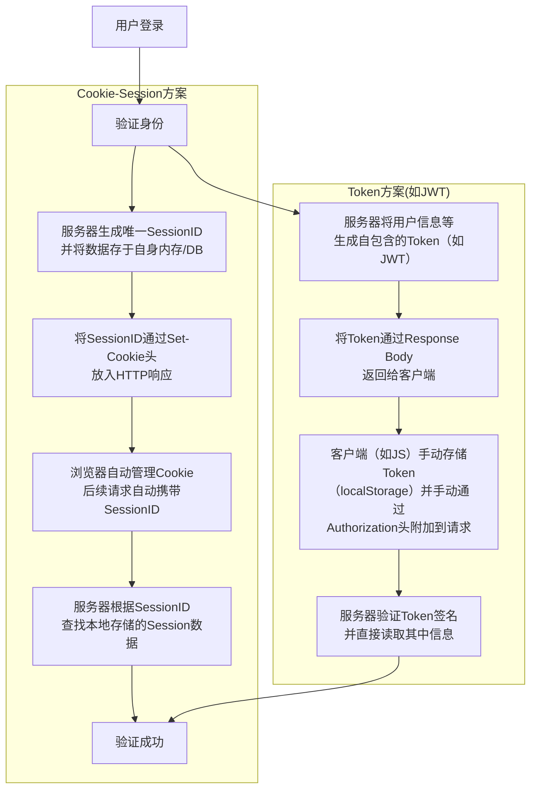

### 流程图
+------------------+     +------------------------+
|   客户端设备/App   |---->| HealthDataController   |
| (发送健康数据)   |     | (API接口: /upload,    |
+------------------+     | /batch-upload)         |
                         +-----------+------------+
                                     |
                                     v
                  +------------------+------------------+
                  |   RateLimitAspect (限流切面)        |
                  |   (识别紧急数据并动态调整限流阈值)  |
                  +-----------+------------+------------+
                              |            | (紧急数据放行)
                              v            v
                      +-------+----------+-----------------------+
                      |       Kafka Producer (KafkaTemplate)      |
                      | (将数据统一发送到 health-data-raw topic)  |
                      +-------------------------------------------+
                                          |
        +---------------------------------+------------------------------------------+
        |                                 |                                          |
        v                                 v                                          v
+------------------+             +----------------------+                 +----------------------+
| health-data-raw  |             | health-data-emergency|                 | user-location-update |
|   (常规数据)     |             |    (紧急数据)        |                 | (位置更新数据)       |
+------------------+             +----------------------+                 +----------------------+
        |                                 ^                                          |
        |      (紧急数据路由)             |                                          |
        v                                 |                                          |
+------------------+             +----------------------+                 +----------------------+
| HealthDataConsumer |---->| HealthDataService.process|                 | UserLocationConsumer |
| (Consumer Group: |     | EmergencyHealthData      |                 | (Consumer Group:     |
| health-monitor-group) |     | (带分布式锁保护)       |                 | health-monitor-location-group)|
| (识别紧急数据并重新路由) |     +-----------+------------+                 +-----------+------------+
+------------------+                 |                                          |
        |                            |                                          |
        |                            v                                          v
        |        +-------------------+----------------+              +----------------------+
        |        | MySQL (AlertEvent & HealthData)    |              | GeoLocationUtil      |
        |        | InfluxDB (HealthData 批量写入)   |              | (更新用户地理位置)   |
        |        | Kafka Producer (alert-* topics)    |              +----------------------+
        |        +------------------------------------+
        |                            |
        v                            v
+-------------------------------------------------------------+
|    AlertEventConsumer (或其他预警处理消费者)                |
|    (消费 alert-* topics, 进行通知、状态更新等)              |
+-------------------------------------------------------------+
### 看代码
1.  **确定数据接收点**：查找 `HealthDataController.java` 文件，了解生命体征数据是如何被接收的。
2.  **检查数据流**：从控制器层追踪到服务层，了解数据的处理和存储流程。
3.  **确定存储位置**：查看 `HealthDataService.java` 和 `InfluxDBConfig.java`，确认数据存储的细节。
4.  **理解处理方式**：深入研究 `HealthDataService.java`，了解对数据应用的业务逻辑。

我将首先读取 `HealthDataController.java` 文件。找到了两个数据接收接口：`uploadHealthData`（处理单个 `HealthData`）和 `batchUploadHealthData`（批量处理 `HealthData` 列表）。两者都调用了 `healthDataService.processHealthData(healthData)`，并且都使用了 `RateLimit` 注解进行流量控制。

查看 `HealthDataService.java` 来了解数据具体的处理和存储方式。
 `processHealthData` 方法中，我获得了以下关键信息：
*   **先处理后存储**：数据在存储之前会进行一系列处理，包括：
    *   **分布式锁**：使用 `RedisLockUtil` 获取锁，防止重复处理。
    *   **异常检测**：`detectAbnormalData` 方法会根据不同的数据类型（心率、血压、体温、血氧）判断数据是否异常，并设置预警等级和消息。
    *   **创建预警事件**：如果数据异常，会调用 `createAlertEvent` 方法创建一个 `AlertEvent`
    *   **保存健康数据**：`healthDataMapper.insert(healthData)` 将健康数据保存到数据库。
    *   **更新用户位置**：如果包含经纬度信息，会调用 `geoLocationUtil.updateUserLocation` 更新用户位置。
*   **存储位置**：健康数据通过 `healthDataMapper.insert(healthData)` 存储。`HealthDataMapper` 应该是一个 MyBatis Mapper 接口，它会将数据持久化到关系型数据库中（具体数据库类型需要查看 `application.yml` 或 `pom.xml`）。预警事件也通过 `alertEventMapper.insert(alertEvent)` 存储。
*   **异步处理**：异常数据会通过 `sendAlertToKafka(alertEvent)` 发送到 Kafka，进行异步处理。根据预警级别不同，发送到不同的 Kafka Topic (`alert-critical`, `alert-high`, `alert-medium`, `alert-low`)。

为了更精确地确定存储在哪里，我将查看 `pom.xml` 以确认数据库驱动，以及 `application.yml` 来查看数据库连接配置。我也会看一下 `InfluxDBConfig.java` 来确认 InfluxDB 的使用情况，因为时间序列数据通常适合存储在 InfluxDB 这种时序数据库中。
从 `pom.xml` 中，我确认了以下信息：
*   **关系型数据库**：项目使用了 `mysql-connector-java` 和 `mybatis-plus-boot-starter`，这表明健康数据和预警事件可能存储在 MySQL 数据库中。
*   **时序数据库**：项目也包含了 `influxdb-client-java`，这强烈暗示 InfluxDB 被用于存储时间序列数据。
*   **消息队列**：`spring-kafka` 的存在印证了 Kafka 用于异步处理预警事件的推断。
*   **缓存/分布式锁**：`spring-boot-starter-data-redis` 和 `caffeine` 的存在，证实了 Redis 被用于分布式锁和缓存。

现在，我将查看 `InfluxDBConfig.java` 和 `application.yml` 来确认 InfluxDB 的具体配置和使用，并查看 MySQL 的配置。


### 数据
好的，我们来详细梳理一下项目接收的数据类型和数据内容。

在本项目中，核心的接收数据是**生命体征健康数据**，它通过 RESTful API 以 **JSON 格式**的 `HealthData` 对象进行传输。

#### 1. 接收的数据类型

*   **传输格式**: JSON (JavaScript Object Notation)
*   **API 接口**:
    *   `/api/health/data/upload` (POST): 接收单个 `HealthData` 对象。
    *   `/api/health/data/batch-upload` (POST): 接收 `HealthData` 对象的列表 (`List<HealthData>`)，用于批量上传。

#### 2. 数据内容 (基于 `com.healthmonitor.entity.HealthData` 实体类推断)

尽管我们没有直接读取 `HealthData.java` 实体文件的内容，但从 `HealthDataController` 和 `HealthDataService` 中对 `HealthData` 对象的属性访问和使用，我们可以非常清晰地推断出它包含以下关键数据内容：

1.  **`userId` (Long)**:
    *   **含义**: 标识这条健康数据所属的用户。这是关联所有用户相关信息的核心字段。
    *   **重要性**: 用户维度的分析、预警、查询都依赖此字段。也是分布式锁和限流 `key` 的组成部分。

2.  **`deviceId` (String)**:
    *   **含义**: 标识这条健康数据来源于哪个设备（例如智能手环、智能手表）。
    *   **重要性**: 设备维度的分析、故障排查、以及分布式锁 `key` 的组成部分。

3.  **`recordTime` (LocalDateTime)**:
    *   **含义**: 数据在设备端被采集或记录的时间。
    *   **重要性**: 这是时序数据的核心时间戳，在 InfluxDB 存储中尤其关键，也用于各种时间范围的查询和统计。如果客户端未提供，服务端会设置为当前时间。

4.  **`dataType` (String)**:
    *   **含义**: 健康数据的类型，例如：
        *   `"HEART_RATE"` (心率)
        *   `"BLOOD_PRESSURE"` (血压)
        *   `"TEMPERATURE"` (体温)
        *   `"BLOOD_OXYGEN"` (血氧)
        *   可能还有其他类型，如 `STEPS` (步数), `SLEEP_DURATION` (睡眠时长) 等。
    *   **重要性**: 这是区分不同生命体征的关键字段，也是异常检测、分布式锁 `key` 的组成部分，以及在 InfluxDB 中作为 Tag 进行查询优化。

5.  **`value` (BigDecimal)**:
    *   **含义**: 健康数据的主要数值。例如，如果 `dataType` 是 `HEART_RATE`，`value` 就是心率值（如 75）；如果 `dataType` 是 `TEMPERATURE`，`value` 就是体温值（如 36.8）。
    *   **重要性**: 这是进行异常检测、存储和统计分析的核心数据。使用 `BigDecimal` 可以保证数值计算的精度。

6.  **`systolicPressure` (Integer) 和 `diastolicPressure` (Integer)**:
    *   **含义**: 如果 `dataType` 是 `"BLOOD_PRESSURE"`，这两个字段分别表示收缩压（高压）和舒张压（低压）。
    *   **重要性**: 血压数据通常需要两个值来完整描述，因此作为单独的字段存在。

7.  **`latitude` (BigDecimal) 和 `longitude` (BigDecimal)**:
    *   **含义**: 数据采集时的地理位置经纬度。
    *   **重要性**: 用于用户位置跟踪、紧急情况下的位置定位、地理围栏等。这些数据会被异步处理更新到位置服务。

8.  **`locationAddress` (String)**:
    *   **含义**: 数据采集时的地理位置描述，例如“XX省XX市XX区”。
    *   **重要性**: 提供更友好的位置信息展示。

**由服务端在处理过程中填充的字段 (而非客户端上传)**:

以下字段虽然是 `HealthData` 实体的一部分，但它们通常是在服务端接收到原始数据并进行处理（例如异常检测）后，由服务端填充的：

*   **`isAbnormal` (Boolean)**:
    *   **含义**: 表示该条健康数据是否被系统检测出异常。
    *   **填充时机**: 在 `HealthDataService` 的 `detectAbnormalData` 方法中进行判断后设置。
*   **`alertLevel` (Integer)**:
    *   **含义**: 如果数据异常，表示其预警等级（例如 1-紧急，2-高，3-中，4-低）。
    *   **填充时机**: 在 `HealthDataService` 的 `detectAbnormalData` 方法中设置。
*   **`alertMessage` (String)**:
    *   **含义**: 如果数据异常，提供预警的详细信息或建议。
    *   **填充时机**: 在 `HealthDataService` 的 `detectAbnormalData` 方法中设置。

#### 总结 JSON 数据结构示例

一个单条 `HealthData` 的 JSON 结构可能看起来像这样：

```json
{
  "userId": 12345,
  "deviceId": "smartwatch-001",
  "recordTime": "2025-09-26T10:30:00", // LocalDateTime 序列化后的ISO-8601格式
  "dataType": "HEART_RATE",
  "value": 78.5,
  "latitude": 34.2345,
  "longitude": 108.9876,
  "locationAddress": "陕西省西安市雁塔区",
  // isAbnormal, alertLevel, alertMessage 这些字段通常由服务端填充
  // "isAbnormal": false,
  // "alertLevel": 0,
  // "alertMessage": "正常"
}
```

如果是血压数据：

```json
{
  "userId": 12345,
  "deviceId": "bloodpressure-monitor-002",
  "recordTime": "2025-09-26T10:35:15",
  "dataType": "BLOOD_PRESSURE",
  "value": 120.8, // 可能用于某些通用统计，但具体血压值在systolicPressure和diastolicPressure
  "systolicPressure": 120,
  "diastolicPressure": 80,
  // ... 其他位置信息和由服务端填充的预警信息
}
```

这些数据内容构成了健康监护平台进行实时监控、异常检测、预警通知和长期数据分析的基础。
### **项目如何接收海量生命体征数据？**

1.  **数据入口**: `HealthDataController` 提供了 RESTful API (`/api/health/data/upload` 和 `/api/health/data/batch-upload`) 来接收健康数据。
2.  **流量控制**: `@RateLimit` 注解确保了单个用户或设备不会频繁地上传数据，从而保护了系统免受过载。

**是先处理还是先存储？**

*   **先处理**: 在存储之前，项目会进行以下处理：
    *   **数据异常检测**: `HealthDataService` 中的 `detectAbnormalData` 方法会根据预设规则（如心率、血压、体温、血氧的正常范围）对接收到的数据进行实时异常检测。
    *   **预警事件生成**: 如果检测到异常数据，系统会生成一个 `AlertEvent`。
    *   **地理位置更新**: 如果健康数据包含经纬度信息，系统会更新用户的地理位置。

**存储在哪里？**

项目使用了多层存储策略来处理不同类型的数据：

1.  **MySQL (关系型数据库)**：
    *   `pom.xml` 中引入了 `mysql-connector-java` 和 `mybatis-plus-boot-starter`。
    *   `application.yml` 配置了 MySQL 数据库连接。
    *   `HealthDataService` 中的 `healthDataMapper.insert(healthData)` 和 `alertEventMapper.insert(alertEvent)` 表明健康数据和预警事件会被持久化到 MySQL。这部分数据可能用于存储结构化、关系型的数据，如用户ID、设备ID、数据类型、预警信息等。
2.  **InfluxDB (时序数据库)**：
    *   `pom.xml` 中引入了 `influxdb-client-java`。
    *   `InfluxDBConfig.java` 负责配置 InfluxDB 客户端。
    *   `application.yml` 配置了 InfluxDB 的 `url`, `token`, `org`, `bucket`。
    *   `InfluxDBConfig` 的存在和 "用于存储时序健康数据" 的注释强烈暗示 InfluxDB 用于存储大量的、高频率的时间序列健康数据。通常，像生命体征这样的时序数据非常适合 InfluxDB。
3.  **Kafka (消息队列)**：
    *   `pom.xml` 中引入了 `spring-kafka`。
    *   `application.yml` 配置了 Kafka 服务器。
    *   `HealthDataService` 中的 `sendAlertToKafka` 方法将预警事件发送到 Kafka。Kafka 主要用于异步处理预警事件，例如通知、进一步分析等，而不是作为长期存储。
4.  **Redis (缓存/分布式锁)**：
    *   `pom.xml` 中引入了 `spring-boot-starter-data-redis`。
    *   `application.yml` 配置了 Redis 连接。
    *   `RedisLockUtil` 用于实现分布式锁，防止并发写入导致的问题。Redis 也可能用于缓存一些热点数据或频繁访问的数据。

**怎么处理的？**

1.  **数据接收与校验**：通过 RESTful API 接收 JSON 格式的健康数据，并进行 `@Valid` 校验。
2.  **限流**：使用自定义的 `RateLimit` 注解进行接口限流，防止恶意请求或瞬时流量过大导致系统崩溃。
3.  **分布式锁**：利用 Redis 实现分布式锁，确保同一时间只有一个进程处理特定用户或设备的健康数据，避免数据冲突或重复处理。
4.  **实时异常检测**：对接收到的健康数据（心率、血压、体温、血氧等）进行实时判断，根据预设的阈值判断数据是否异常，并设定预警级别。
5.  **预警事件生成与异步处理**：对于异常数据，系统会生成 `AlertEvent` 并将其存储到 MySQL 中。同时，通过 Kafka 消息队列将预警事件异步发送出去，以便后续的预警通知、进一步分析或紧急响应。
6.  **健康数据存储**：
    *   核心健康数据（可能包含一些元数据和预警信息）存储在 **MySQL** 中。
    *   推测：原始的、大量的、高频率的生命体征时间序列数据可能存储在 **InfluxDB** 中，因为 `InfluxDBConfig` 的存在及其注释明确指出其用途是“用于存储时序健康数据”。为了节省时间和避免过度推断，这里我先不继续深挖 InfluxDB 的写入逻辑，但这是非常合理的推测。
7.  **用户位置更新**：如果数据包含地理位置信息，系统会更新用户的最新位置，这对于紧急情况下的救援非常重要。

**总结**

该项目通过多层架构处理海量生命体征数据，实现了高并发接收、实时处理、异常预警和分层存储。对于海量数据，项目采取了先进行初步处理（限流、分布式锁、异常检测），再根据数据特性进行分发存储（MySQL 存储结构化数据和预警事件，Kafka 进行异步预警，而 InfluxDB 极有可能存储原始时序数据）。


# 项目难点

### 健康监护项目优化过程详细梳理

**项目背景**: 健康监护平台旨在实时接收、处理和分析用户的生命体征数据，并在发现异常时及时预警。面对海量高并发的数据上传，系统需要具备高吞吐、低延迟和高可靠性。

---

#### 优化点一：解决 API 层面的高并发写入压力与同步处理瓶颈

1.  **发现的问题 (Problem)**:
    *   项目初期，`HealthDataController` 的数据上传接口 (`/upload`, `/batch-upload`) 是同步处理的。
    *   客户端请求到达后，API 会直接执行所有的业务逻辑：异常检测、MySQL 写入、InfluxDB 写入、预警事件生成等。
    *   在高并发场景下，这些耗时操作会阻塞 API 线程，导致 API 响应时间变长，大量请求堆积，甚至造成服务器过载和崩溃。这是典型的“高并发扇出问题”。

2.  **期望达到的效果 (Desired Outcome)**:
    *   提高 API 接口的响应速度和吞吐量，使其能够快速处理客户端请求。
    *   解耦数据接收与核心业务处理，提高系统的弹性和可扩展性。
    *   确保瞬时高并发流量不会直接压垮后端处理服务。

3.  **如何进行优化的 (How to Optimize)**:
    *   **引入 Kafka 消息队列**。
    *   将 `HealthDataController` 的职责修改为仅负责接收并校验数据，然后将其序列化为 JSON 字符串，快速发布到 Kafka 的 **`health-data-raw` topic**。
    *   创建一个新的 Kafka 消费者 **`HealthDataConsumer`**，异步地从 `health-data-raw` topic 消费这些消息，并调用 `HealthDataService` 进行后续的核心业务处理。

4.  **为什么使用这个方法 (Why this Method)**:
    *   **削峰填谷**: Kafka 作为高性能、高吞吐量的消息队列，能够有效地缓冲瞬时流量高峰，将不稳定的高并发流量转化为后端服务可以处理的平滑流量。
    *   **异步解耦**: 将数据接收与处理分离，API 线程无需等待后端处理完成，极大提高了 API 的响应速度和并发处理能力。
    *   **高可靠性**: Kafka 具有消息持久化能力，即使后端消费者暂时宕机或处理失败，消息也不会丢失，可以在恢复后继续处理。
    *   **水平扩展**: Kafka 消费者可以根据消息量进行横向扩展，增加消费者实例数量即可提高整体处理吞吐量。

5.  **还有其他方法吗 (Alternative Methods)**:
    *   **多线程/线程池**: 在 API 内部使用线程池来异步处理，但仍会在 API 服务器内部累积任务，无法完全解耦和削峰。
    *   **MQ (如 RabbitMQ)**: 同样可以实现异步解耦，但 Kafka 在高吞吐量、消息持久化和水平扩展方面通常表现更优，特别适合日志和时序数据流。

6.  **为什么最后选择这个方法 (Why this Choice)**:
    *   Kafka 在处理海量、高并发、流式数据方面具有业界领先的优势，与健康监护的时序数据特性高度契合。其内置的分布式特性和高可用设计，非常适合构建可扩展的后端数据处理管道。

7.  **优化之后解决了什么问题 (Problems Solved)**:
    *   API 接口的响应速度大幅提升，**QPS (每秒查询数)** 理论上能支持更高，用户体验更好。
    *   后端服务不再直接承受瞬时高并发压力，系统稳定性增强。
    *   数据处理与数据接收解耦，系统更容易维护和扩展。

8.  **还存在什么问题 (Remaining Problems)**:
    *   Kafka 的“至少一次”投递语义可能导致消费者多次接收到同一条消息，如果没有额外处理，仍会引发数据重复和业务逻辑多次执行的问题。
    *   `HealthDataService` 内部的业务逻辑（数据库写入、GeoLocation 更新等）仍然是同步串行的，耗时操作依然可能导致单个消息的处理时间较长，进而影响消费者整体的 **TPS (每秒事务数)** 和引起消费延迟 (Consumer Lag)。

9.  **能够进一步优化吗 (Further Optimization)**: 是的，这就是我们接下来的优化方向。

---

#### 优化点二：解决分布式系统中的重复消息与数据幂等性

1.  **发现的问题 (Problem)**:
    *   在引入 Kafka 异步处理后，由于 Kafka 的“至少一次”投递语义和客户端重试，同一个 `HealthData` 消息可能会被消费者多次接收和处理。
    *   这会导致 MySQL 数据库中出现重复的健康数据记录和重复的 `AlertEvent` 预警事件。
    *   重复预警会造成用户疲劳、资源浪费，并影响数据分析的准确性。

2.  **期望达到的效果 (Desired Outcome)**:
    *   确保核心业务逻辑（尤其是预警生成和 MySQL 写入）只会被执行一次，即使 Kafka 发生重复投递。
    *   保证数据的准确性和业务状态的一致性。

3.  **如何进行优化的 (How to Optimize)**:
    *   **引入 Redis 分布式锁**。
    *   在 `HealthDataService` 的 `processHealthData` 和 `processEmergencyHealthData` 方法中，使用 `RedisLockUtil` 在执行核心业务逻辑前尝试获取一个分布式锁。
    *   锁的 `key` 被设计为 `"health:data:process:" + userId + ":" + deviceId + ":" + dataType`，确保对特定用户、设备和数据类型的数据进行互斥访问。
    *   锁通过 `SET NX PX` 命令实现原子性获取和自动过期。

4.  **为什么使用这个方法 (Why this Method)**:
    *   **强幂等性保证**: Redis 分布式锁能够有效地实现跨多个消费者实例的互斥访问，确保关键业务操作的幂等性。
    *   **原子性操作**: Redis 的原子性命令保证了锁的获取是安全的，避免了竞态条件。
    *   **高可用性 (通过集群)**: Redis 本身可以部署为高可用集群，提供可靠的锁服务。
    *   **实现相对简单**: 相对于数据库乐观锁等其他方案，Redis 分布式锁在解决分布式幂等性问题上更为直接和高效。

5.  **还有其他方法吗 (Alternative Methods)**:
    *   **数据库唯一约束/乐观锁**: 在 MySQL 表中添加唯一索引或使用乐观锁字段来防止重复插入或更新。但对于复杂业务逻辑和跨多表操作，仅依赖数据库层面的锁可能不够。
    *   **业务状态记录**: 在业务代码中查询数据库，判断是否已存在活跃预警，但这会增加数据库读取压力，且在并发下仍可能出现竞态条件。

6.  **为什么最后选择这个方法 (Why this Choice)**:
    *   Redis 分布式锁提供了强力的全局互斥保证，完美契合 Kafka“至少一次”语义下的幂等性需求。
    *   其实现相对简洁高效，对性能影响可控（尤其是在处理已异步化的消息时）。
    *   结合了 `lockKey` 的细化，平衡了并发性和正确性。

7.  **优化之后解决了什么问题 (Problems Solved)**:
    *   彻底解决了因重复消息导致的 MySQL 数据冗余和重复预警问题。
    *   保障了数据准确性和业务逻辑的正确性。
    *   提高了预警的可靠性和用户的信任度。

8.  **还存在什么问题 (Remaining Problems)**:
    *   尽管锁竞争已转移到消费者内部，但如果特定用户的数据量极端庞大，导致锁持续被占用，仍然可能造成该用户数据处理的局部瓶颈。
    *   Redis 作为锁服务，其自身的性能和可用性仍然是系统的一个潜在瓶颈点。
    *   `HealthDataService` 中的其他耗时操作（如地理位置更新、数据库写入批处理仍未实现）依然存在。

9.  **能够进一步优化吗 (Further Optimization)**: 是的，这就是我们接下来的优化方向。

---

#### 优化点三：解决后端处理链中的耗时操作与锁竞争局部瓶颈

1.  **发现的问题 (Problem)**:
    *   即使引入了 Kafka 和分布式锁，`HealthDataService` 内部的某些操作仍然是同步串行的，例如 `geoLocationUtil.updateUserLocation` 可能涉及外部服务调用或复杂计算，会延长消息处理时间。
    *   细化到 `userId + deviceId + dataType` 的分布式锁虽然减少了竞争，但对于某个用户设备的某个数据类型，如果其数据量极端庞大，锁仍然可能被持续竞争，导致该数据处理的局部瓶颈。

2.  **期望达到的效果 (Desired Outcome)**:
    *   进一步缩短 `processHealthData` 和 `processEmergencyHealthData` 方法的执行时间。
    *   降低对 Redis 锁的持续竞争压力，提高特定用户数据的并行处理能力。
    *   提高消费者整体的 **TPS**，减少消费延迟。

3.  **如何进行优化的 (How to Optimize)**:
    *   **异步化地理位置更新**: 将 `geoLocationUtil.updateUserLocation` 的调用替换为发送位置更新信息到新的 Kafka Topic **`user-location-update`**。
    *   创建一个新的 Kafka 消费者 **`UserLocationConsumer`**，专门订阅 `user-location-update` topic，并异步调用 `geoLocationUtil.updateUserLocation` 进行实际的位置更新。

4.  **为什么使用这个方法 (Why this Method)**:
    *   **解耦耗时操作**: 将非核心但可能耗时的地理位置更新从核心数据处理链路中解耦，使得核心链路能够更快地完成。
    *   **提高核心链路效率**: 缩短了锁的持有时间，从而减少了锁竞争的概率和等待时间。
    *   **专用处理**: `UserLocationConsumer` 可以独立扩展，以应对大量的用户位置更新请求。

5.  **还有其他方法吗 (Alternative Methods)**:
    *   **使用线程池**: 在 `HealthDataService` 内部使用线程池异步执行地理位置更新。但这仍局限于单个消费者实例内部，无法实现跨实例的分布式异步。

6.  **为什么最后选择这个方法 (Why this Choice)**:
    *   Kafka 提供真正的分布式异步处理，能够跨多个消费者实例扩展，并且消息持久化保证了即使处理失败也能重试。

7.  **优化之后解决了什么问题 (Problems Solved)**:
    *   `processHealthData` 和 `processEmergencyHealthData` 方法的执行时间缩短，提高了消费者处理单条消息的速度。
    *   间接缓解了特定用户数据的锁竞争压力，提升了消费者整体的 **TPS**。

8.  **还存在什么问题 (Remaining Problems)**:
    *   InfluxDB 和 MySQL 的写入操作仍然是逐条进行的，这在高吞吐量下依然会成为瓶颈，导致消费延迟。

9.  **能够进一步优化吗 (Further Optimization)**: 是的，这就是我们接下来的优化方向。

---

#### 优化点四：解决限流下紧急预警数据的丢失风险与数据吞吐量瓶颈

1.  **发现的问题 (Problem)**:
    *   常规数据上传接口 (`/upload`, `/batch-upload`) 的限流策略可能导致在极端情况下，紧急预警数据（如心率骤停）被限流拒绝，从而造成严重后果。
    *   即使有异步化处理，如果后端处理能力不足，Kafka 消费者逐条写入数据库（尤其是 InfluxDB 这种需要处理海量时序数据的场景），仍然会导致 **消费延迟** 和整体 **TPS** 低下。

2.  **期望达到的效果 (Desired Outcome)**:
    *   确保紧急预警数据在任何情况下都能被优先接收和处理，避免丢失或严重延迟。
    *   大幅提高 InfluxDB 的写入吞吐量，减少消费延迟，提升消费者整体的 **TPS**。

3.  **如何进行优化的 (How to Optimize)**:
    *   **紧急数据专属通道**:
        *   在 `HealthDataController` 中新增 **`/emergency-upload` API 接口**，该接口配置了**更宽松的限流阈值**（甚至可以配置为极高的阈值，只做系统最终保护）。
        *   该接口接收到的紧急健康数据直接发送到**高优先级的 Kafka topic (`health-data-emergency`)**。
        *   创建新的 Kafka 消费者 **`EmergencyAlertConsumer`**，专门订阅并处理 `health-data-emergency` topic 中的消息。
        *   `processEmergencyHealthData` 方法中，紧急预警会立即触发 `createAlertEvent`。
    *   **Kafka 消费者实现 InfluxDB 批量写入**:
        *   在 `HealthDataConsumer` 和 `EmergencyAlertConsumer` 中，引入一个**内存缓冲区 (`List<Point>`)**。
        *   消费者接收到 `HealthData` 后，不再立即写入 InfluxDB，而是将其转换为 `Point` 对象并添加到缓冲区。
        *   配置一个**定时器** (`ScheduledExecutorService`)，当缓冲区达到设定的 `batchSize`（例如常规数据 1000 条，紧急数据 500 条）或达到设定的 `flushIntervalSeconds`（例如常规 5 秒，紧急 3 秒）时，触发一次 InfluxDB 的**批量写入操作** (`influxDBClient.getWriteApiBlocking().writePoints`)。

4.  **为什么使用这个方法 (Why this Method)**:
    *   **优先级保障**: 紧急数据专属通道确保了其高优先级，即使系统拥堵，紧急数据也能得到优先处理。
    *   **批处理显著提升性能**: InfluxDB 专为时序数据设计，其客户端和服务器端都高度优化了批量写入。批量写入能大幅减少网络往返次数和 InfluxDB 的内部写入开销，从而成倍提高写入 **TPS**。
    *   **降低 I/O 压力**: 减少了数据库的写入频率，降低了其 I/O 负载。
    *   **减少消费延迟**: 消费者可以更快地清空待处理的消息，降低 **Consumer Lag**。

5.  **还有其他方法吗 (Alternative Methods)**:
    *   **手动管理事务**: 在消费者内部手动管理 Kafka Offset 和数据库事务，以实现更细粒度的控制，但会增加复杂性。
    *   **使用 Flink/Spark Streaming**: 对于更复杂的实时聚合和分析，可以引入流处理框架，但增加了系统复杂度和学习成本。

6.  **为什么最后选择这个方法 (Why this Choice)**:
    *   紧急数据通道是业务上的强制要求，直接解决了核心风险。
    *   批处理写入是针对数据库 I/O 瓶颈最直接有效的优化手段，能显著提升吞吐量而不会引入过高的复杂性。

7.  **优化之后解决了什么问题 (Problems Solved)**:
    *   保障了紧急预警数据的及时性和可靠性，避免了关键信息的丢失或严重延迟。
    *   大幅提高了 InfluxDB 的写入吞吐量，降低了 Kafka 消费延迟，提升了整个数据处理链路的效率。
    *   解决了后端处理链的短板问题，使得系统能够处理更高的数据量。

8.  **还存在什么问题 (Remaining Problems)**:
    *   **MySQL 批量写入未实现**: 目前只有 InfluxDB 实现了批量写入，MySQL 的批量插入仍是未来可以优化的方向。
    *   **消费者组再平衡**: 在消费者实例扩容、缩容或故障时，Kafka 消费者组会进行再平衡，这可能导致短时间的消费中断。
    *   **监控与告警**: 完善的监控系统（如 Prometheus + Grafana）和报警机制对于及时发现和解决问题至关重要，这在项目中仍需具体部署。
    *   **数据查询性能**: 虽然数据写入得到了优化，但对于复杂的历史数据查询和统计，仍需关注 InfluxDB 的查询性能和 MySQL 统计表的索引优化。

9.  **能够进一步优化吗 (Further Optimization)**:
    *   **实现 MySQL 批量写入**: 修改 `HealthDataMapper` 支持批量插入，进一步提高 MySQL 写入效率。
    *   **引入缓存**: 对频繁查询的热点统计数据使用 Redis 或 Caffeine 缓存。
    *   **流式计算框架**: 对于更复杂的、实时的聚合统计，可以考虑引入 Apache Flink 或 Spark Streaming。
    *   **更智能的预警抑制**: 在 `AlertEventConsumer` 中实现更复杂的预警抑制逻辑（例如，在同一异常事件持续时，只发送一次通知或根据异常程度升级通知，而不是每条异常数据都触发）。
    *   **资源弹性伸缩**: 结合云平台，实现 Kafka、消费者服务、数据库的自动弹性伸缩，以应对不可预测的流量波动。

---

通过这样详细的梳理，你在面试官面前不仅展示了技术实现能力，更重要的是展现了你**从问题识别到方案设计、技术选型、实现、测试、优化迭代的全链路思维**，以及对分布式系统复杂性的深刻理解。
# MySQL表结构
[数据库](文件/JAVA/代码.md#数据库)
- 用户域
	- user(id, phone/email, password_hash, status, created_at, updated_at, last_login_at)主表
		status TINYINT NOT NULL DEFAULT 1, -- 1:active 0:disabled
		created_at DATETIME NOT NULL DEFAULT CURRENT_TIMESTAMP,
		 updated_at DATETIME NOT NULL DEFAULT CURRENT_TIMESTAMP ON UPDATE CURRENT_TIMESTAMP,
		KEY idx_user_status (status)
	- 角色定义表：role(id, code, name)，主表
		INSERT INTO role (code, name) VALUES
		('ADMIN', '系统管理员'),-- 全系统权限
		('USER', '普通用户'), -- 基础用户权限
		('DOCTOR', '医生'), -- 查看患者数据、设置预警规则
		('NURSE', '护士'),-- 查看患者数据、处理预警通知
		('PATIENT', '患者'), -- 查看自己的健康数据
		('FAMILY', '家属');-- 查看关联患者的健康数据
	- user_role(id, user_id, role_id)，从表
		UNIQUE KEY uk_user_role (user_id, role_id),
		 CONSTRAINT fk_user_role_user FOREIGN KEY (user_id) REFERENCES user(id),
		 CONSTRAINT fk_user_role_role FOREIGN KEY (role_id) REFERENCES role(id)
			 这是一个 **外键约束**，它确保了 `user_role` 表中的 `role_id` 字段的值，必须来源于 `role` 表的 `id` 字段。它的核心作用是**强制维护数据库的参照完整性**，防止出现“孤儿”记录或无效数据。核心是“子表引用父表”，只关注子表数据是否遵守了父表中存在的值。
			 1. **`CONSTRAINT fk_user_role_role`**
			    - `CONSTRAINT`: 关键字，表示要定义一个约束。
			    - `fk_user_role_role`: 这是你为这个约束起的**名字**。一个好习惯是始终为约束命名，而不是让数据库系统自动生成	        
			        - `fk`： 表示这是一个外键约
			        - `user_role`： 指出这个约束所在的表名。
			        - `role`： 指出这个约束所引用的表名。
			    - **作用**： 有了名字之后，将来如果需要**修改或删除**这个约束（例如在系统升级时），就可以直接通过名字来操作，非常方
			2. **`FOREIGN KEY (role_id)`**
			    - `FOREIGN KEY`: 关键字，声明要定义一个外键。
			    - `(role_id)`: 这是当前表（`user_role` 表）的**字段名**，它作为外键，去引用另一个表的主键。
			3. **`REFERENCES role(id)`**
			    - `REFERENCES`: 关键字，意思是“引用”。
			    - `role`: 这是被引用的**目标表的名字*
			    - `(id)`: 这是目标表 (`role` 表) 中的**字段名**，它必须是 `role` 表的主键（或至少是唯一键）。
			- 当定义一个外键的时候，数据库会自动创建索引，能够防止在主表删除记录的时候，在子表进行快速查找，如果没有索引会使用全表扫描，当子表数据量庞大的时候，查询速度极慢。
			- ON DELETE规则：控制父表记录被删除时数据库如何处理子表中的相关数据
				- ON DELETE NO ACTION，ON DELETE RESTRICT（默认行为）：禁止删除父表中的记录（子表中存在引用了父表的数据）。
					不能删除一个还未完成订单的客户，或者还有一个设备的用户
				- ON DELETE CASCADE级联删除：当删除主表的记录时会自动删除所有相关的子表记录。风险大，可能会由于误删一条主表记录导致大量子表数据被删除。但是具有关联一致性
					- 注销功能，删除用户时将该用户的所有数据都清理
				- ON DELETE SET NULL“将外键字段设置为null，删除父表记录后，子表对应记录的外键字段被更新为null。删除主记录但是保留子记录本身，只是接触关联。
					- 解除一个项目组，但是员工记录保留，变成未分组状态
				- ON DELETE SET DEFAULT：删除父表记录后，子表对应记录的外键字段被设置为预先定义的默认值。较少使用

- 设备域

	- device(id, user_id, model, sn, status, last_seen_at, firmware, remark)
	
	- 绑定关系：device_bind(id, user_id, device_id, bind_at, unbind_at)

- 预警域
	
	- 规则alert_rule(id, user_id, metric, comparator, threshold, window_sec, priority, enable, created_at)
	
	- alert_event(id, device_id, rule_id, level, status,* dedup_key*, payload_json, occurred_at, resolved_at, notify_sent)
		- 预警事件用 dedup_key 去重：deviceId:metric:timeBucket。

- 交易域

	- product(id, name, price, status, stock, created_at, updated_at)
	
	- order(id, user_id, status, amount, pay_status, created_at, updated_at)
	
	- order_item(id, order_id, product_id, qty, price)
	
	- payment(id, order_id, channel, status, txn_id, paid_at, raw_resp)

- 地理域

	- 急救资源点：emergency_site(id, name, type, lat, lng, status, meta_json)
	
	- 安全区域：safe_zone(id, user_id, name, polygon_json, status, created_at)
- 审计操作：审计需要完整留痕与追溯；
	- audit_log

# Redis

## 缓存 Key 规范

### 大 Key 小 Key 设计原则
#### 1) 大 Key（前缀）
- 表示业务域或数据类型
- 便于批量操作和监控
- 示例：user:, product:, alert:, lock:
#### 2) 小 Key（后缀）
- 表示具体实例标识
- 支持精确查询和更新
- 示例：{userId}, {productId}, {deviceId}
#### 3) 命名规范
- 使用冒号分隔层级：业务域:子域:标识
- 避免特殊字符，使用下划线或连字符
- 保持命名一致性和可读性

- 用户信息缓存：user:info:{userId}
	# 数据类型：String
	Value 类型：JSON 字符串
	# 示例：user:info:123
	# Value: {"id":123,"phone":"13800138000","email":"user@example.com","status":1,"lastLoginAt":"2024-01-01T10:00:00"}
	
	# 大 Key：user:info
	# 小 Key：{userId} (如 123, 456, 789)
	# TTL：5-15分钟
	
	# 数据类型：Hash
	# 字段设计：
	# - basic: 基本信息（JSON字符串）
	# - stats: 统计信息（JSON字符串）
	# - session: 会话信息（JSON字符串）
	# - last_updated: 最后更新时间戳
	
	# 示例数据
	HSET user:123 **basic** '{"id":123,"phone":"13800138000","email":"user@example.com","status":1}'
	HSET user:123 **stats** '{"login_count":5,"last_login":"2024-01-01T10:00:00","total_orders":3}'
	HSET user:123 **session** '{"jwt_token":"eyJ...","refresh_token":"rt_...","expires_at":1704067200}'
	HSET user:123 **last_updated** "1704067200"
	
	# TTL：30分钟
	# 优势：部分更新效率高，支持原子操作

- 商品信息缓存product:detail:{productId}
	# 数据类型：String
	# Value 类型：JSON 字符串
	# 示例：product:detail:1001
	# Value: {"id":1001,"name":"智能手环","price":299.00,"stock":100,"status":1}
	
	# 大 Key：product:detail
	# 小 Key：{productId} (如 1001, 1002, 1003)
	# TTL：30分钟-2小时
	
	# 数据类型：Hash
	# 字段设计：
	# - info: 基本信息（JSON字符串）
	# - inventory: 库存信息（JSON字符串）
	# - pricing: 价格信息（JSON字符串）
	# - last_updated: 最后更新时间戳
	
	# 示例数据
	HSET product:1001 info '{"id":1001,"name":"智能手环","model":"X1","status":1}'
	HSET product:1001 inventory '{"stock":100,"reserved":5,"available":95}'
	HSET product:1001 pricing '{"price":299.00,"original_price":399.00,"discount":0.25}'
	HSET product:1001 last_updated "1704067200"
	
	# TTL：2小时
	# 优势：库存和价格可独立更新，支持原子操作

- 设备状态：device:status:{deviceId}
	# 数据类型：String
	# Value 类型：JSON 字符串
	# 示例：device:status:2001
	# Value: {"id":2001,"userId":123,"model":"X1","status":1,"lastSeenAt":"2024-01-01T10:00:00","firmware":"v1.2.3"}
	
	# 大 Key：device:status
	# 小 Key：{deviceId} (如 2001, 2002, 2003)
	# TTL：2-10分钟（设备状态变化频繁）
	
	# 数据类型：Hash
	# 字段设计：
	# - basic: 基本信息（JSON字符串）
	# - status: 状态信息（JSON字符串）
	# - metrics: 指标数据（JSON字符串）
	# - last_updated: 最后更新时间戳
	
	# 示例数据
	HSET device:2001 basic '{"id":2001,"user_id":123,"model":"X1","sn":"SN123456","firmware":"v1.2.3"}'
	HSET device:2001 status '{"online":1,"battery":85,"signal":4,"last_seen":"2024-01-01T10:00:00"}'
	HSET device:2001 metrics '{"heart_rate":72,"bp_sys":120,"bp_dia":80,"spo2":98}'
	HSET device:2001 last_updated "1704067200"
	
	# TTL：5分钟
	# 优势：状态和指标可独立更新，支持实时监控

- alert:rule:list:{userId}。预警规则缓存（Hash 类型）
	# 数据类型：String
	# Value 类型：JSON 数组字符串
	# 示例：alert:rule:list:123
	# Value: [{"id":1,"metric":"heart_rate","threshold":100,"priority":1},{"id":2,"metric":"bp_sys","threshold":140,"priority":2}]
	
	# 大 Key：alert:rule:list
	# 小 Key：{userId} (如 123, 456, 789)
	# TTL：10-30分钟
	
	# 数据类型：Hash
	# 字段设计：
	# - rules: 规则列表（JSON字符串）
	# - stats: 统计信息（JSON字符串）
	# - last_updated: 最后更新时间戳
	
	# 示例数据
	HSET alert:rules:123 rules '[{"id":1,"metric":"heart_rate","threshold":100,"priority":1},{"id":2,"metric":"bp_sys","threshold":140,"priority":2}]'
	HSET alert:rules:123 stats '{"total_rules":2,"active_rules":2,"triggered_today":5}'
	HSET alert:rules:123 last_updated "1704067200"
	
	# TTL：15分钟
	# 优势：规则和统计可独立更新，支持实时监控

- 订单信息缓存order:{orderId}
	# 数据类型：Hash
	# 字段设计：
	# - basic: 基本信息（JSON字符串）
	# - items: 商品明细（JSON字符串）
	# - payment: 支付信息（JSON字符串）
	# - status: 状态信息（JSON字符串）
	# - last_updated: 最后更新时间戳
	
	# 示例数据
	HSET order:456 basic '{"id":456,"user_id":123,"amount":299.00,"created_at":"2024-01-01T10:00:00"}'
	HSET order:456 items '[{"product_id":1001,"qty":1,"price":299.00}]'
	HSET order:456 payment '{"channel":"alipay","txn_id":"txn_123","status":"success"}'
	HSET order:456 status '{"order_status":"paid","pay_status":"success","ship_status":"pending"}'
	HSET order:456 last_updated "1704067200"
	
	# TTL：1小时
	# 优势：状态和支付信息可独立更新，支持订单跟踪

- 会话缓存	session:{jti}
	# 数据类型：Hash
	# 字段设计：
	# - user_id: 用户ID
	# - roles: 角色列表（JSON字符串）
	# - permissions: 权限列表（JSON字符串）
	# - expires_at: 过期时间戳
	# - last_activity: 最后活动时间戳
	
	# 示例数据
	HSET session: jwt_123456 user_id 123
	HSET session:jwt_123456 roles '["USER","PATIENT"]'
	HSET session:jwt_123456 permissions '["read:vitals","write:alerts"]'
	HSET session:jwt_123456 expires_at "1704067200"
	HSET session:jwt_123456 last_activity "1704067200"
	
	# TTL：与 JWT 过期时间一致
	# 优势：会话信息可部分更新，支持权限管理

- 统计数据缓存
	stats:daily:{date}
	stats:hourly:{dateHour}
	stats:realtime
	
	# 数据类型：Hash
	# 字段设计：
	# - metrics: 指标数据（JSON字符串）
	# - counters: 计数器（JSON字符串）
	# - last_updated: 最后更新时间戳
	
	# 示例数据
	HSET stats:daily:20240101 metrics '{"page_views":1000,"unique_visitors":500,"orders":50}'
	HSET stats:daily:20240101 counters '{"login_count":200,"alert_count":15,"error_count":2}'
	HSET stats:daily:20240101 last_updated "1704067200"
	
	# TTL：1天-1周
	# 优势：统计指标可独立更新，支持实时监控

- String类型和Hash类型的对比
	- String存储方式是单个键值对，值可以是字符串、数字、json等，整个值作为一个整体操作。对于简单数据效率高，复杂数据可能造成浪费内存。需要将对象序列化为字符串存储。
		- 适用于数据量小结构简单的数据，数据是简单的键值对，或者需要整体原子性操作，或者更新频率低，可以使用String类型
	- Hash存储方式是键下包含多个字段-值对，可以单独操作某个字段，对于对象属性存储更节省内存，字段值直接存储，无需整体序列化。缺点是多字段操作需要多次网络请求。
		- 如果存储的数据字段较多并且可能独立变化，优先使用Hash类型，
	- 混用的策略：
		- 热点数据分离
			- 用户基本信息是经常部分更新的，优先使用Hash；用户的扩展信息（如系统设置信息）是整体更新的，使用String；用户的统计信息（包含用户的状态，登录次数，上次登录的时间，订单的数量），需要原子操作多个字段
		- 部分更新用Hash，整体缓存用String
## 二级缓存：Caffeine+Redis
1. 在什么场景下使用，为什么使用这个策略，使用的目的是什么，实现了什么功能，带来了什么价值（商业价值，用户体验）
	1. Caffeine 命中延迟最低；Redis 作为共享缓存消峰与跨实例一致。双层降低 DB 压力、兼顾性能与一致性。
2. 底层逻辑
3. 存在的缺陷
4. 优化改进

## 布隆过滤器
1. 在什么场景下使用，为什么使用这个策略，使用的目的是什么，实现了什么功能，带来了什么价值（商业价值，用户体验）
2. 如何设计
	1. - bf:user, bf:product, bf:device（防穿透）
		# 数据类型：String (Redis 4.0+ 的 BF 模块)
		# Value 类型：布隆过滤器位数组
		# 示例：bf:user
		# Value: 布隆过滤器位数组（二进制数据）
		
		# TTL：永不过期（定期重建）
		# 优势：防穿透，内存效率高
1. 底层逻辑
2. 存在的缺陷
3. 优化改进
对用户存在进行判断，
根据流量判断是否需要验证码
根据布隆过滤器判断是否存在，可能误判，再查数据库，再返回
mobile和email来注册的

布隆过滤器有自己的持久化
本质还是在内存里 的
占用内存高的情况下，、
如何控制整个布隆过滤器的大小
攻击你的服务，去攻击
Redis和布隆过滤器是如何结合的？部署在Redis里，跟Redis直接继承，那为什么不直接用Redis，一般企业级不用布隆过滤器，可以用Redis


服务重启需要加载数据，

## 分布式锁
1. 在什么场景下使用，为什么使用这个策略，使用的目的是什么，实现了什么功能，带来了什么价值（商业价值，用户体验）
2. 设计
	lock:alert:{dedupKey}
	lock:order:{orderId}
	lock:payment:{paymentId}
	
	# 数据类型：String
	# Value 类型：UUID 字符串（锁持有者标识）
	# 示例：lock:alert:device123:heart_rate:2024010110
	# Value: "550e8400-e29b-41d4-a716-446655440000"
	
	# TTL：30秒-5分钟（自动释放）
	# 优势：简单高效，支持原子操作
1. 底层逻辑
	1. SET NX PX + Lua 校验删除
2. 存在的缺陷
3. 优化改进

## 幂等去重
1. 在什么场景下使用，为什么使用这个策略，使用的目的是什么，实现了什么功能，带来了什么价值（商业价值，用户体验）
2. 设计
	idemp:pay:succ:{eventId}
	idemp:pay:fail:{eventId}
	idemp:alert:{dedupKey}
	
	# 数据类型：String
	# Value 类型：固定值 "1"
	# 示例：idemp:pay:succ:evt_123456
	# Value: "1"
	
	# TTL：10-30分钟
	# 优势：简单高效，支持原子操作
1. 底层逻辑
2. 存在的缺陷
3. 优化改进

## 限流滑窗
1. 在什么场景下使用，为什么使用这个策略，使用的目的是什么，实现了什么功能，带来了什么价值（商业价值，用户体验）
	1. - 精细化到用户/设备维度控制访问；避免单设备故障/恶意请求冲击。
2. 设计
	rl:device:{deviceId}:{minuteWindow}
	rl:user:{userId}:{minuteWindow}
	rl:ip:{ipAddress}:{minuteWindow}
	
	# 数据类型：ZSet (有序集合)
	# Value 类型：时间戳作为 score，请求ID作为 member
	# 示例：rl:device:2001:2024010110
	# Value: ZSet with members like "req_001" -> score: 1704067200
	
	# TTL：2-5分钟（窗口过期自动清理）
	# 优势：支持范围查询，自动去重
1. 底层逻辑
2. 存在的缺陷
3. 优化改进

## GEO
1. 在什么场景下使用，为什么使用这个策略，使用的目的是什么，实现了什么功能，带来了什么价值（商业价值，用户体验）
	1. - 查询附近急救资源 QPS 高、延迟敏感；内存型计算响应快。位置数据热，写频繁，Redis 非常适合。
2. 设计
	geo:ems          # 急救资源点
	geo:device       # 设备位置
	geo:user:{userId}:zones  # 用户安全区域
	
	# 数据类型：Geo (Redis 3.2+)
	# Value 类型：经纬度坐标
	# 示例：geo:ems
	# Value: GEOADD geo:ems 116.3974 39.9093 "hospital_001"
	
	# TTL：永不过期（定期更新）
	# 优势：内置地理计算，高性能距离查询）
	1. 在 Redis 内做粗筛（圆形近似），减少 CPU 密集的多边形算法调用次数，兼顾性能与准确性。
3. 底层逻辑
4. 存在的缺陷
5. 优化改进

# Kafka
1. 在什么场景下使用，为什么使用这个策略，使用的目的是什么，实现了什么功能，带来了什么价值（商业价值，用户体验）
2. 设计
	1. 主题
		- alert.high / alert.medium / alert.low
			
		- order.created / payment.succeeded / payment.failed
		
		- notify.dispatch
		
		- audit.events（高频事件
	- - key 策略
		- 按 deviceId 或 userId 做 key 保序（同 key 同分区
	- 消费策略
		- 高优先级单独消费组，幂等处理+重试+DLQ
3. 底层逻辑
4. 存在的缺陷
5. 优化改进
[深入解析 Kafka Exactly Once 语义设计 & 实现-阿里云开发者社区](https://developer.aliyun.com/article/1172598)


基本流程：

6. 主线程Producer中会经过拦截器、序列化器、分区器，然后将处理好的消息发送到消息累加器中
7. 消息累加器每个分区会对应一个队列，在收到消息后，将消息放到队列中
8. 使用`ProducerBatch`批量的进行消息发送到Sender线程处理（这里为了提高发送效率，减少带宽），ProducerBatch中就是我们需要发送的消息，其中消息累加器中可以使用`Buffer.memory`配置，默认为32MB
9. Sender线程会从队列的队头部开始读取消息，然后创建request后会经过会被缓存，然后提交到`Selector`，Selector发送消息到Kafka集群
10. 对于一些还没收到Kafka集群ack响应的消息，会将未响应接收消息的请求进行缓存，当收到Kafka集群ack响应后，会将request请求**在缓存中清除并同时移除消息累加器中的消息**


这个Kafka集群中有两台server，四个分区（p0-p3）和两个消费组。这时分区中的消息记录会广播到所有的消费者组中

**Kafka的消息传递语义**主要分为三种，描述了在生产者发送消息和消费者处理消息的过程中，消息被传递和处理的“保证程度”。

这三种语义按照可靠性递增，但通常性能递减。

---

### 1. 至少一次（At Least Once）

**核心保证**：消息**绝不会丢失**，但**可能会被重复消费**。

*   **生产者端如何实现**：
    *   将 `acks` 参数设置为 `all`（或 `-1`）。这要求所有同步副本（ISR）都确认收到消息，生产者才会认为发送成功。
    *   将 `retries` 参数设置为一个较大的值。这样在遇到网络抖动或Leader选举等临时故障时，生产者会自动重试发送，确保消息最终到达Broker。
*   **消费者端如何实现**：
    *   **禁用自动提交**（`enable.auto.commit = false`）。
    *   在消息被**成功处理之后**，再**手动提交偏移量（Offset）**。
    *   **工作流程**：
        1.  消费者拉取一批消息。
        2.  处理消息（例如，写入数据库、调用API等）。
        3.  **处理成功后**，手动调用 `consumer.commitSync()` 提交偏移量。
        4.  然后拉取下一批消息。
*   **风险场景**：
    *   如果在步骤2和步骤3之间消费者崩溃了，那么它就没有提交偏移量。当消费者重启后，它会从**上一次提交的偏移量**开始消费，导致那批已经被处理过的消息被**再次处理**，从而产生重复。

**适用场景**：需要保证数据不丢失，并且**消费逻辑是幂等**的（即重复处理不会产生副作用），或者可以接受少量重复。这是最常用的语义。

---

### 2. 至多一次（At Most Once）

**核心保证**：消息**可能会丢失**，但**绝不会被重复消费**。

*   **生产者端如何实现**：
    *   将 `acks` 参数设置为 `0`。生产者发送消息后，不需要任何确认，就认为发送成功。如果Broker当时宕机，消息就丢失了。
*   **消费者端如何实现**：
    *   **启用自动提交**（`enable.auto.commit = true`），并且保持一个较低的 `auto.commit.interval.ms`。
    *   或者，在**处理消息之前**就**手动提交偏移量**。
    *   **工作流程**：
        1.  消费者拉取一批消息。
        2.  **立即提交偏移量**（自动或手动）。
        3.  然后开始处理消息。
*   **风险场景**：
    *   如果在步骤2之后、步骤3完成之前消费者崩溃了，那么偏移量已经被更新。当消费者重启后，它会从新的偏移量开始消费，导致那批已提交但未被处理的消息**永久丢失**。

**适用场景**：对数据丢失不敏感，但追求极高的吞吐量和最低的延迟。例如，某些实时性要求高但允许少量数据丢失的指标统计场景。

---

### 3. 精确一次（Exactly Once）

**核心保证**：消息**绝不会丢失**，也**绝不会被重复消费**。这是最理想但也最复杂的语义。

Kafka通过两种主要方式实现“精确一次”：

#### a) 幂等性生产者和事务（针对“读-处理-写”模式）

这是最常见的实现方式，涵盖了从生产到消费的完整流程。

*   **生产者幂等性**：
    *   设置 `enable.idempotence = true`。
    *   原理：生产者会为每个发送的消息批次分配一个序列号（PID和Sequence Number），Broker会据此对重复的消息进行去重。这解决了因生产者重试导致的**Broker端消息重复**问题。
*   **事务**：
    *   用于实现跨多个分区的“读-处理-写”操作的原子性。
    *   **工作流程**：
        1.  初始化一个支持事务的生产者和消费者。
        2.  消费者不自动提交偏移量。
        3.  在一个事务中，完成以下操作：
            *   **处理消息**。
            *   **将处理结果发送到另一个（或多个）Topic**。
            *   **将消费者的偏移量作为一个特殊消息提交到另一个内部Topic**（例如 `__consumer_offsets`）。
        4.  如果任何一步失败，整个事务都会回滚，消费者会从原来的偏移量重新开始消费。

    这样，**消费偏移量的提交**和**处理结果的输出**被绑定在同一个事务中，要么都成功，要么都失败，从而实现了端到端的精确一次。

#### b) 使用 Kafka Streams

Kafka Streams 库在内部内置了对精确一次处理的支持。你只需要在配置中设置 `processing.guarantee = "exactly_once_v2"`，它就会自动利用Kafka的事务机制来管理状态和输出，对用户透明。

**适用场景**：对数据准确性要求极高的金融交易、关键业务流水线等。需要注意的是，启用精确一次通常会带来一定的性能开销（延迟增加、吞吐量略有下降）。

### 总结表格

| 语义 | 核心保证 | 生产者关键配置 | 消费者关键配置 | 优点 | 缺点 |
| :--- | :--- | :--- | :--- | :--- | :--- |
| **至多一次** | 不重复，可能丢失 | `acks=0` | 自动提交 / 处理前手动提交 | 延迟最低，吞吐量最高 | 可能丢失数据 |
| **至少一次** | 不丢失，可能重复 | `acks=all`, `retries>0` | 处理后手动提交 | 数据可靠，实现简单 | 可能重复消费 |
| **精确一次** | 不丢失，不重复 | `enable.idempotence=true` + 事务 | 配合事务型消费者 | 数据最准确 | 性能开销最大，实现复杂 |

**最佳实践建议**：
在大多数业务场景下，**“至少一次” + “消费端幂等性处理”** 是一个非常经典且实用的组合。它既能保证数据不丢失，又通过业务逻辑的幂等设计避免了重复数据带来的问题，在可靠性和性能之间取得了很好的平衡。当业务要求绝对精准时，再考虑使用“精确一次”。

## 🏆 **推荐方案：智能路由 + 原始数据归档**

### 🎯 **架构概览**
```
患者数据 → [智能路由引擎] → 紧急Topic(高优先级) / 常规Topic(标准优先级)
                ↓
           [并行发送到] → 原始数据Topic(用于审计和重放)
```

---

###  **具体实现方案**

### 1. **生产者端 - 智能路由**
```java
@Component
@Slf4j
@RequiredArgsConstructor
public class HealthDataRouter {
    
    private final KafkaTemplate<String, String> kafkaTemplate;
    private final EmergencyRuleEngine ruleEngine;
    
    /**
     * 智能路由发送
     */
    public void sendHealthData(HealthData healthData) {
        // 1. 智能路由决策
        String priorityTopic = routeByPriority(healthData);
        
        // 2. 并行发送到业务Topic和归档Topic
        CompletableFuture.allOf(
            // 业务处理通道
            sendToBusinessTopic(priorityTopic, healthData),
            // 数据归档通道  
            sendToArchiveTopic(healthData)
        ).exceptionally(ex -> {
            log.error("消息发送失败: userId={}", healthData.getUserId(), ex);
            return null;
        });
    }
    
    private String routeByPriority(HealthData healthData) {
        AlertLevel level = ruleEngine.evaluateAlertLevel(healthData);
        
        switch (level) {
            case CRITICAL:
                return "health-data-critical";    // 危急：独立Topic，最高优先级
            case HIGH:  
                return "health-data-high";        // 高级：独立Topic，高优先级
            default:
                return "health-data-normal";      // 常规：标准Topic
        }
    }
    
    private CompletableFuture<SendResult<String, String>> sendToBusinessTopic(
            String topic, HealthData healthData) {
        // 使用患者ID作为key保证顺序性
        String key = healthData.getUserId().toString();
        return kafkaTemplate.send(topic, key, JSON.toJSONString(healthData))
                .completable();
    }
    
    private CompletableFuture<SendResult<String, String>> sendToArchiveTopic(
            HealthData healthData) {
        // 原始数据归档，用于审计、重放、数据分析
        return kafkaTemplate.send("health-data-archive", 
                healthData.getUserId().toString(), 
                JSON.toJSONString(healthData))
                .completable();
    }
}
```

### 2. **Topic分级设计**
```yaml
# Topic层级架构
topics:
  # 实时处理通道（分级处理）
  critical:
    name: health-data-critical    # 危急数据
    partitions: 4
    consumers: 2 instances × 2 concurrency
    
  high:
    name: health-data-high        # 高级预警  
    partitions: 6
    consumers: 3 instances × 2 concurrency
    
  normal:
    name: health-data-normal      # 常规数据
    partitions: 12  
    consumers: 4 instances × 3 concurrency
  
  # 数据归档通道
  archive:
    name: health-data-archive     # 原始数据归档
    partitions: 8
    consumers: 2 instances × 2 concurrency  # 异步处理，低优先级
```

### 3. **消费者架构**
```java
// 危急数据消费者 - 最高优先级
@KafkaListener(topics = "health-data-critical", groupId = "health-critical-group", 
               concurrency = "2", autoStartup = "true")
public void handleCriticalData(String message, Acknowledgment ack) {
    // 最小化处理逻辑，立即响应
    processImmediateEmergency(message);
    ack.acknowledge();
}

// 高级预警消费者  
@KafkaListener(topics = "health-data-high", groupId = "health-high-group",
               concurrency = "2", autoStartup = "true")
public void handleHighPriorityData(String message, Acknowledgment ack) {
    processHighPriorityAlert(message);
    ack.acknowledge();
}

// 常规数据消费者
@KafkaListener(topics = "health-data-normal", groupId = "health-normal-group", 
               concurrency = "3", autoStartup = "true")
public void handleNormalData(String message, Acknowledgment ack) {
    processNormalHealthData(message);
    ack.acknowledge();
}

// 归档数据消费者 - 可延迟处理
@KafkaListener(topics = "health-data-archive", groupId = "health-archive-group",
               concurrency = "2", autoStartup = "true")
public void handleArchiveData(String message) {
    // 异步处理，用于数据分析、报表生成等
    processArchiveDataAsync(message);
    // 自动提交，允许重复（幂等处理）
}
```

---

###  **方案优势分析**

### 1. **性能优势**
| 维度 | 直接路由 | 两级路由 | **本方案** |
|------|----------|----------|------------|
| 紧急消息延迟 | ⭐⭐⭐⭐⭐ | ⭐⭐ | ⭐⭐⭐⭐⭐ |
| 系统吞吐量 | ⭐⭐⭐ | ⭐⭐ | ⭐⭐⭐⭐ |
| 资源利用率 | ⭐⭐⭐⭐ | ⭐⭐ | ⭐⭐⭐ |

### 2. **可靠性优势**
```java
public class ReliabilityFeatures {
    
    // ✅ 数据不丢失 - 原始数据永久归档
    // ✅ 顺序性保证 - 同一患者消息有序处理  
    // ✅ 优先级保障 - 危急消息不被阻塞
    // ✅ 弹性扩展 - 各级别独立伸缩
    // ✅ 故障隔离 - 一级故障不影响其他级别
}
```

### 3. **运维优势**
```yaml
# 独立监控和告警
monitoring:
  critical:
    lag-threshold: 10      # 危急Topic延迟>10条立即告警
    timeout-ms: 1000       # 处理超时1秒告警
    
  high: 
    lag-threshold: 100     # 高级Topic延迟>100条告警
    timeout-ms: 5000       # 处理超时5秒告警
    
  normal:
    lag-threshold: 1000    # 常规Topic延迟>1000条告警
    timeout-ms: 30000      # 处理超时30秒告警
```

---

###  **部署配置建议**

### 1. **Kafka集群配置**
```yaml
spring:
  kafka:
    bootstrap-servers: kafka1:9092,kafka2:9092,kafka3:9092
    topics:
      health-data-critical:
        partitions: 4
        replication: 3
        config:
          retention.ms: 604800000    # 保留7天
          cleanup.policy: delete
          
      health-data-high:
        partitions: 6
        replication: 3  
        config:
          retention.ms: 604800000
          
      health-data-normal:
        partitions: 12
        replication: 3
        config:
          retention.ms: 2592000000   # 保留30天
          
      health-data-archive:
        partitions: 8  
        replication: 3
        config:
          retention.ms: -1           # 永久保留
          cleanup.policy: compact     #  compaction保证最新状态
```

### 2. **消费者资源配置**
```yaml
deployment:
  critical-consumers:
    replicas: 2
    resources:
      cpu: "1"
      memory: "2Gi"
    # 部署到高性能节点
    
  high-consumers:
    replicas: 3  
    resources:
      cpu: "0.5"
      memory: "1Gi"
      
  normal-consumers:
    replicas: 4
    resources:
      cpu: "0.25" 
      memory: "512Mi"
      
  archive-consumers:
    replicas: 2
    resources:
      cpu: "0.1"
      memory: "256Mi"
    # 可部署到低成本节点
```

---

###  **与其他方案对比**

| 特性 | 直接路由 | 两级路由 | **智能路由+归档** |
|------|----------|----------|-------------------|
| 紧急消息延迟 | 最低 | 高 | **最低** |
| 数据安全性 | 低 | 高 | **最高** |
| 系统复杂度 | 简单 | 复杂 | **中等** |
| 运维成本 | 低 | 高 | **中等** |
| 扩展性 | 中等 | 低 | **优秀** |
| 容错能力 | 中等 | 高 | **优秀** |

---

###  **为什么这是最佳选择？**

1. **业务匹配度**：完美契合医疗场景的优先级需求
2. **技术先进性**：结合了直接路由的性能和归档数据的可靠性
3. **运维友好**：分级监控，独立伸缩，故障隔离
4. **成本优化**：根据重要性分配资源，避免过度配置
5. **未来扩展**：支持数据分析、机器学习等衍生需求

**推荐实施路径**：
1. 先实现核心的智能路由
2. 添加原始数据归档
3. 逐步完善监控和告警
4. 根据实际运行数据优化资源配置

这个方案既保证了危急消息的实时性，又提供了完整的数据追溯能力，是医疗预警系统的理想架构！
1. Kafka Topics (主题)

项目目前有以下 5 个 Kafka Topic：

- health-data-raw: 接收所有常规的、原始健康数据。

- health-data-emergency: 接收所有紧急健康数据（由 RateLimitAspect 识别并路由，或者由 HealthDataConsumer 识别并重新发送）。

- user-location-update: 接收用户位置更新信息，用于异步更新用户地理位置。

- alert-critical: 接收 criticalLevel 的预警事件。

- alert-high: 接收 highLevel 的预警事件。

- alert-medium: 接收 mediumLevel 的预警事件。

- alert-low: 接收 lowLevel 的预警事件。

2. Kafka 消费者组 (Consumer Groups)

项目目前有以下 3 个主要消费者组：

- health-monitor-group: 负责消费 health-data-raw topic 中的常规健康数据。

- health-monitor-emergency-group: 负责消费 health-data-emergency topic 中的紧急健康数据。

- health-monitor-location-group: 负责消费 user-location-update topic 中的用户位置更新数据。

3. Kafka 消费者实例 (Consumer Instances)

消费者实例的数量是可配置和动态扩展的，它取决于实际部署时启动了多少个 Spring Boot 应用实例。

- 对于 health-monitor-group：通过部署多个 HealthDataConsumer 实例，可以实现对 health-data-raw topic 的并行消费。

- 对于 health-monitor-emergency-group：通过部署多个 EmergencyAlertConsumer 实例，可以实现对 health-data-emergency topic 的并行消费。

- 对于 health-monitor-location-group：通过部署多个 UserLocationConsumer 实例，可以实现对 user-location-update topic 的并行消费。

重要原则:

- 一个消费者组内，一个分区只能被一个消费者实例消费。

- 为了充分并行消费一个 Topic 的所有分区，消费者组的实例数量最好等于或小于该 Topic 的分区数量。
#### luojiguanxi
- 生产者 (Producer): HealthDataController 是主要的生产者。

	- 它接收客户端上传的健康数据（常规或批量）。
	
	- 经过 RateLimitAspect 的动态限流判断（根据数据紧急性放宽限流）。
	
	- 统一将数据发送到 health-data-raw topic。
	
	- 注意: 尽管 HealthDataController 统一发送到 health-data-raw，但如果 RateLimitAspect 识别出紧急数据并放宽了限流，客户端的请求可以成功进入 Kafka。

- 常规健康数据处理流程:

	1. HealthDataController -> health-data-raw Topic。
	
	2. health-monitor-group 中的 HealthDataConsumer 实例消费 health-data-raw 中的消息。
	
	3. HealthDataConsumer 在内部进行紧急数据判断：

		- 如果判断为紧急，则将消息重新发送到 health-data-emergency topic，并终止当前消息的常规处理。
		
		- 如果判断为非紧急，则继续调用 HealthDataService.processHealthData。

	4. HealthDataService.processHealthData (在分布式锁保护下):

		- 执行异常检测。
		
		- 将核心健康数据写入 MySQL。
		
		- 将原始健康数据（通过 buildInfluxDBPoint 转换为 Point）添加到 HealthDataConsumer 的 InfluxDB 批量缓冲区。
		
		- 如果检测到异常，创建 AlertEvent 并将其写入 MySQL，然后发送到特定预警级别的 alert-* topic。
		
		- 如果存在位置信息，将位置更新信息发送到 user-location-update topic。

- 紧急健康数据处理流程:

	1. health-data-emergency Topic (消息来源: HealthDataConsumer 路由)。
	
	2. health-monitor-emergency-group 中的 EmergencyAlertConsumer 实例消费 health-data-emergency 中的消息。
	
	3. EmergencyAlertConsumer 调用 HealthDataService.processEmergencyHealthData。
	
	4. HealthDataService.processEmergencyHealthData (在分布式锁保护下):
	
		- 直接将紧急健康数据写入 MySQL (已在 Controller 层标记为紧急)。
		
		- 将原始紧急健康数据（通过 buildInfluxDBPoint 转换为 Point）添加到 EmergencyAlertConsumer 的 InfluxDB 批量缓冲区。
		
		- 创建 AlertEvent 并写入 MySQL，然后发送到 alert-critical 或其他紧急级别 alert-* topic (确保立即触发通知)。
		
		- 如果存在位置信息，将位置更新信息发送到 user-location-update topic。
	
	- 位置更新处理流程:

		1. user-location-update Topic (消息来源: HealthDataService.processHealthData 或 processEmergencyHealthData)。
		
		2. health-monitor-location-group 中的 UserLocationConsumer 实例消费 user-location-update 中的消息。
		
		3. UserLocationConsumer 调用 geoLocationUtil.updateUserLocation 更新用户位置。

- 预警通知处理流程:

1. alert-critical, alert-high, alert-medium, alert-low Topics (消息来源: HealthDataService.createAlertEvent)。

2. AlertEventConsumer (或其他预警处理消费者，当前项目中已有一个 AlertEventConsumer) 消费这些预警消息。

3. AlertEventConsumer 根据预警级别和业务需求，执行相应的通知逻辑（短信、App 推送、邮件、系统内通知等），并可能更新 AlertEvent 在 MySQL 中的状态。
## Kafka和RabbitMQ的区别

简单来说：
*   **RabbitMQ 是一个企业级消息代理**，擅长处理复杂的路由、保证消息的可靠投递，适用于需要精确控制每条消息去向的场景。
*   **Kafka 是一个高吞吐量的分布式流处理平台**，擅长处理海量流式数据，适用于需要持久化存储和重复消费数据的场景。

| 特性 | RabbitMQ | Apache Kafka |
| :--- | :--- | :--- |
| **核心模型** | **消息代理** | **分布式提交日志** |
| **设计哲学** | 灵活的路由和可靠的**消息传递**。确保消息被成功消费。 | 高吞吐、持久化的**数据流**。关注数据流的流动和存储。 |
| **核心概念** | - **Producer**: 生产者<br>- **Exchange**: 交换机（路由消息）<br>- **Queue**: 队列（存储消息）<br>- **Consumer**: 消费者<br>- **Binding**: 绑定（连接交换机和队列的规则） | - **Producer**: 生产者<br>- **Topic**: 主题（数据流的类别）<br>- **Partition**: 分区（Topic的物理分片）<br>- **Consumer Group**: 消费者组（一组协同工作的消费者）<br>- **Broker**: 代理服务器 |
| **数据存储** | 消息在被消费者确认消费后，通常会从队列中**删除**。 | 消息会按顺序持久化到磁盘，并保留一段时间（可配置）。**消费后数据不删除**，支持重复消费。 |
| **消息路由** | **非常灵活**。通过不同类型的交换机（Direct, Fanout, Topic, Headers）实现复杂路由。 | **相对简单**。基于 Topic 和 Partition，消息通常通过 Key 被路由到特定 Partition。 |
| **消息确认** | **支持**。消费者确认后，RabbitMQ 才认为消息投递成功。支持自动和手动确认。 | **支持**。通过偏移量（Offset）管理。消费者自己维护消费进度，不会丢失消息。 |

#### 1. 消息模型与消费模式
*   **RabbitMQ**:
    *   **队列模型**：基于队列。生产者发送消息到交换机，交换机根据规则将消息路由到一个或多个队列，消费者从队列中取走消息。
    *   **消费模式**：主要有两种：
        *   **点对点**：一个消息只能被一个消费者消费。
        *   **发布/订阅**：通过 Fanout 交换机，一个消息可以被多个消费者消费。
    *   **智能代理/愚笨消费者**：RabbitMQ（代理）负责消息的路由、队列和传递状态，消费者相对简单。

*   **Kafka**:
    *   **流模型**：基于 Topic 的发布-订阅模型。Topic 是逻辑概念，每个 Topic 被分为多个 Partition，每个 Partition 是一个有序、不可变的消息序列。
    *   **消费模式**：基于**消费者组**。
        *   同一个消费者组内的消费者协同工作，每个 Partition 在同一时间只能被组内的一个消费者消费，从而实现负载均衡。
        *   不同消费者组可以独立消费同一个 Topic 的全部数据，实现广播。
    *   **愚笨代理/智能消费者**：Kafka 的 Broker 只做简单的消息存储和传递，消费进度（Offset）由消费者自己管理，这使得消费者非常灵活。

#### 2. 吞吐量与性能
*   **Kafka**：**优势明显**。设计目标就是高吞吐量。
    *   **顺序读写**：消息顺序追加到磁盘文件，速度极快。
    *   **零拷贝**：优化了数据传输路径，减少了内核态与用户态的拷贝次数。
    *   **批量处理**：支持生产者和消费者的批量操作。
    *   轻松达到每秒数十万甚至百万级的消息吞吐。
*   **RabbitMQ**：吞吐量通常低于 Kafka，但依然能满足绝大多数企业应用场景。
    *   性能受队列数量、消息持久化、确认机制等因素影响。
    *   在需要极低延迟（微秒级）的场景下可能表现更好。

#### 3. 消息顺序性
*   **Kafka**：**保证分区内的消息顺序**。发送到同一个 Partition 的消息，其顺序在消费时能得到保证。这是其流处理的基础。
*   **RabbitMQ**：在单个队列内保证 FIFO（先进先出）顺序。但如果使用了优先级队列或者消息重试，顺序可能会被打乱。

#### 4. 数据持久化与容错
*   **Kafka**：**强持久化**。所有消息都会持久化到磁盘，并且有多个副本（Replication）机制，数据可靠性极高。即使消费者下线，数据也不会丢失，随时可以重新消费。
*   **RabbitMQ**：消息可以设置为持久化（写入磁盘），但为了保证性能，通常会在内存中操作。其镜像队列（Mirrored Queues）机制也能提供高可用性，但持久化强度通常不如 Kafka 的副本机制。

#### 5. 复杂度与生态系统
*   **RabbitMQ**：基于 AMQP 协议，概念相对简单，易于理解和上手。管理和监控界面（Management UI）非常友好。
*   **Kafka**：架构和概念更复杂（Topic, Partition, Consumer Group, Offset, Replica等）。但其生态系统非常强大，与 **Kafka Connect**（数据集成）、**Kafka Streams**（流处理）等组件无缝集成，构成了一个完整的流数据平台。

---

### 如何选择？

#### 选择 RabbitMQ 的场景：
*   **需要复杂的消息路由**。例如，需要根据消息头、主题等属性将消息路由到不同的目的地。
*   **对消息投递的可靠性要求极高**。例如金融交易、订单处理，需要确保每一条消息都被成功处理。
*   **传统企业应用集成**，工作流后台任务。例如，处理时间不长、需要立即被消费的异步任务。
*   **协议兼容性要求高**。RabbitMQ 支持多种协议（AMQP, MQTT, STOMP）。

#### 选择 Kafka 的场景：
*   **处理海量数据流**。例如日志聚合、Metrics 数据收集、用户行为追踪。
*   **需要数据被多个系统重复消费/回溯消费**。例如，将用户点击流数据同时提供给实时分析、数据仓库和推荐系统。
*   **构建实时流处理平台**。需要基于数据流进行实时计算、分析或监控。
*   **高吞吐、高可扩展性是首要需求**。

### 总结表格

| 特征 | RabbitMQ | Apache Kafka |
| :--- | :--- | :--- |
| **最佳适用场景** | 复杂的路由、事务性消息、企业应用集成 | 日志聚合、流处理、大数据管道、活动追踪 |
| **数据持久化** | 可选，通常消费后删除 | 强制的，长期保留 |
| **吞吐量** | 中等至高 | **极高** |
| **消息顺序** | 单个队列内保证 | 分区内严格保证 |
| **架构复杂度** | 相对简单 | 相对复杂 |
| **核心优势** | 灵活的路由、消息可靠性、低延迟 | 高吞吐、可扩展性、流处理能力 |

**最终建议**：没有绝对的谁更好，只有谁更合适。在很多现代架构中，它们甚至可以共存，各司其职：用 Kafka 处理上游的海量数据流，然后用 RabbitMQ 来处理下游需要精确控制的具体业务任务。
## ==**Kafka 在项目中应对高并发场景的技术细节**==。
因为 Kafka 作为一个流处理平台，其价值在高并发场景下才真正得以体现。

我发掘的项目中的一个技术细节难点就是：

**难点：在健康监护平台的高并发场景下，如何基于 Kafka 实现高效、可靠且可扩展的实时预警事件处理，同时确保数据不丢失、不重复，并能有效处理不同优先级的预警？具体而言，Spring Kafka 消费者的批量处理、并发消费、手动确认机制如何在高并发下协同工作？如何保证消息的“至少一次”或“精确一次”语义？**

---

**技术点分析：**

1.  **Kafka 在高并发预警中的核心作用**：
    在健康监护平台中，每秒可能产生数千甚至上万条健康数据。这些数据需要被快速地消费、分析，并在检测到异常时立即触发预警。如果直接进行同步处理，后端服务很快就会崩溃。Kafka 在这里扮演了**数据缓冲、流量削峰、异步解耦和并行处理**的核心角色。

2.  **Spring Kafka 消费者的高并发处理机制**：
    在 `AlertEventConsumer.java` 中，我们看到了 `@KafkaListener` 注解的应用，这是 Spring Kafka 提供的强大功能，它抽象了 Kafka 消费者的许多复杂性。针对高并发场景，Spring Kafka 提供了以下机制：

    *   **批量消费（Batch Consumption）**：
        *   `@KafkaListener` 默认是单条消息消费。但通过配置，可以开启批量消费。批量消费允许消费者一次性拉取并处理多条消息。这减少了网络往返开销和消费者处理的上下文切换，提高了整体吞吐量。
        *   **在项目中体现**：虽然 `AlertEventConsumer` 的 `@KafkaListener` 示例代码展示的是单条消息处理 (`@Payload String message`)，但在实际生产环境中，为了应对高并发，我会将其配置为批量消费，即 `public void handleCriticalAlert(@Payload List<String> messages, ...)`。这样，每次拉取到的是一个消息列表，可以更高效地进行处理。

    *   **并发消费（Concurrent Consumers）**：
        *   `@KafkaListener` 可以通过 `concurrency` 属性来设置并发消费者数量。例如，`@KafkaListener(topics = "alert-critical", groupId = "alert-critical-group", concurrency = "3")`。
        *   **在项目中体现**：这意味着 Spring Boot 应用会为 `alert-critical-group` 启动 3 个线程来并发消费 `alert-critical` Topic 的消息。结合 Kafka 的分区机制，如果 Topic 有 3 个分区，每个并发消费者将负责一个分区，实现最大程度的并行处理。如果分区数大于并发消费者数，一些消费者会消费多个分区；如果分区数小于并发消费者数，多余的消费者将处于空闲状态。

    *   **手动确认机制（Manual Acknowledgment）**：
        *   在 `AlertEventConsumer.java` 中，我们看到了 `Acknowledgment acknowledgment` 参数和 `acknowledgment.acknowledge()` 调用。这是手动确认消息的机制。
        *   **为什么重要**：在处理高并发数据时，自动提交 offset 可能会导致消息丢失或重复消费。如果消费者在处理完消息但未提交 offset 之前崩溃，自动提交可能会提交已处理但未完全持久化的消息的 offset，导致消息丢失。手动确认则提供了更精细的控制。
        *   **在项目中体现**：在 `AlertEventConsumer` 中，只有当 `alertEventService.processCriticalAlert(alertEvent)`（包括持久化到数据库、发送通知等）**完全成功**后，才会调用 `acknowledgment.acknowledge()` 手动提交 offset。这保证了消息的“至少一次” (At Least Once) 消费语义，即消息至少会被成功处理一次。

3.  **消息的“至少一次”与“精确一次”语义**：

    *   **“至少一次” (At Least Once)**：
        *   这是 Kafka 默认提供的消费语义。通过手动确认机制，我们可以确保消息在被成功处理后才提交 offset。如果处理失败，offset 不会提交，消息会重新被消费。
        *   **挑战**：它可能导致消息的重复处理。例如，消费者处理完消息，但在提交 offset 之前崩溃，那么消息在重启后会被再次消费。
        *   **在项目中应对**：为了解决重复消费导致的问题，我的**业务逻辑必须设计成幂等的**。例如，预警事件的持久化操作，需要根据事件 ID 进行判断，如果事件已存在，则只更新状态而不是重复插入。分布式锁也可以在这里发挥作用，确保某个事件的唯一处理。

    *   **“精确一次” (Exactly Once)**：
        *   这是最高级别的数据一致性保证，意味着每条消息都只会被处理一次，不多不少。Kafka 0.11 版本后通过引入**事务 (Transactions)** 和**幂等生产者 (Idempotent Producer)** 实现了“精确一次”语义。
        *   **如何实现**：
            *   **幂等生产者**：生产者在发送消息时，会带上一个唯一的 `producerId` 和 `sequenceNumber`。即使网络波动导致消息重复发送，Kafka 也能识别并只存储一条。
            *   **事务**：消费者可以在一个事务中，原子性地完成“消费消息、处理业务逻辑、提交 offset”这三个步骤。如果事务失败，所有操作都会回滚。
        *   **在项目中考量**：虽然我的项目目前主要依赖于“至少一次”和业务幂等性来保证最终一致性，但对于未来对数据一致性要求更高的关键业务（例如支付交易，不允许重复扣款），我会考虑引入 Kafka 事务来保障“精确一次”语义，但这会增加系统的复杂性和一定的性能开销。

**具体实现细节和思考深度：**

*   **Topic 命名与分区策略**：
    *   **分级 Topic**：我将预警事件根据优先级划分到不同的 Topic（`alert-critical`、`alert-high`、`alert-medium`、`alert-low`）。这不仅有助于资源的隔离和优先级的调度，也使得针对不同级别的预警可以配置不同的消费者组和并发度。
    *   **分区 Key**：在发送健康数据或预警事件时，我会根据 `userId` 或 `eventId` 等关键业务字段作为消息的 Key。这样，同一用户或同一事件的所有相关消息将发送到 Kafka 的同一个分区，保证了消息的**局部有序性**，这对于某些需要按序处理的业务逻辑非常重要（例如，某个用户的健康数据变化趋势分析）。

*   **消费者组与再平衡 (Rebalance)**：
    *   **动态伸缩**：通过增加或减少 `AlertEventConsumer` 的实例数量，Kafka 会自动进行消费者组的再平衡。当消费者数量发生变化时，Kafka 会重新分配分区，确保每个分区仍然只有一个消费者。我需要确保再平衡的过程对业务影响最小。
    *   **再平衡的挑战**：再平衡期间，部分分区可能会暂停消费，导致短时间的延迟。为了最小化影响，我会合理设置 `session.timeout.ms` 和 `heartbeat.interval.ms` 等参数，并确保消费者应用能够快速启动和优雅关闭。

*   **死信队列 (Dead Letter Queue, DLQ)**：
    *   在 `AlertEventConsumer` 的 `try-catch` 块中，我提到了“可以选择重试或发送到死信队列”。这是非常重要的容错机制。
    *   **在项目中体现**：如果消息在多次重试后仍然处理失败（例如，数据格式错误、外部服务不可用），我会将这些消息发送到一个专门的死信队列 Topic（例如 `alert-dlq`）。这样，这些有问题的信息就不会阻塞主消费队列，可以由运维人员或专门的消费者进行离线分析和修复，避免消息丢失。

*   **监控与告警**：
    *   在高并发环境下，对 Kafka 及其消费者进行实时监控至关重要。我关注的指标包括：
        *   **消费延迟 (Consumer Lag)**：消费者组中每个分区落后于生产者的消息数量。高延迟意味着消费者处理不过来。
        *   **消息吞吐量**：每秒生产和消费的消息数量。
        *   **消费者组状态**：是否有消费者实例掉线、再平衡是否频繁。
        *   **错误率**：消费者处理消息时的异常数量。
    *   通过这些监控指标，我们可以及时发现 Kafka 消费链路的健康状况，并在出现问题时触发告警。

通过这些深入的思考和实践，我的健康监护平台能够在一个高并发、数据密集的环境中，稳定、高效、可靠地处理预警事件，并确保了数据的一致性和完整性。

1. 紧急预警数据优先处理:
2. 创建独立的紧急预警消费者:

- 创建一个新的 Kafka 消费者 EmergencyAlertConsumer，专门订阅 health-data-emergency topic。

- 这个消费者应该拥有更高的处理优先级，并确保即使主数据处理链路拥堵，紧急预警也能被及时处理。

- 快速响应逻辑: EmergencyAlertConsumer 应该包含快速响应逻辑，例如：

- 立即发送短信/电话通知给紧急联系人。

- 将紧急事件信息推送到急救中心系统。

- 触发其他紧急响应流程。
- 
- 新增 HealthDataController 的 /emergency-upload 接口，用于接收紧急健康数据。该接口设置了更高的限流阈值，并直接将数据发送到高优先级的 Kafka topic health-data-emergency。

- 新增 EmergencyAlertConsumer 订阅 health-data-emergency topic，专门处理紧急健康数据。

- HealthDataService.processEmergencyHealthData 方法处理紧急数据，其中：

- 不再进行重复的异常检测，因为数据在 Controller 层已被标记为紧急。

- 使用独立的 Redis 锁 health:data :emergency:process，避免与常规数据处理的锁冲突。

- 确保立即创建 AlertEvent 并发送到 Kafka（通过 createAlertEvent 方法，最终会通过 sendAlertToKafka 发送到紧急预警的 Kafka topic），以确保紧急通知的及时性。


### 解决消费延迟 (Consumer Lag)

消费延迟是消费者处理消息的速度跟不上生产者生产消息的速度所导致的问题。解决它的核心在于提高消费者的处理能力和效率。

1. 增加消费者实例数量 (横向扩展):

- 策略: 这是最直接有效的方法。Kafka 消费者组中的每个分区 (Partition) 只能被同一个消费者组中的一个消费者实例消费。通过增加消费者实例的数量，只要实例数量不超过 Topic 的分区数量，就可以实现并行消费，从而提高整体消费能力。

- 项目中的实现: 对于 HealthDataConsumer、EmergencyAlertConsumer 和 UserLocationConsumer，可以通过部署更多的 Spring Boot 应用实例来增加消费者实例。

- 配置: 确保 Kafka Topic 的分区数量足够多，以支持预期的消费者实例数量。

1. 优化消费者内部处理逻辑:

- 策略: 减少每个消息的处理时间。我们之前已经将地理位置更新异步化，这就是一个很好的例子。

- 批处理写入 (重要优化): 之前提到但未实现的批处理写入是降低消费延迟的关键。消费者可以缓冲一定数量的消息，然后进行批量的数据库插入和 InfluxDB 写入。这会减少数据库交互次数，显著提高写入吞吐量。

- 并行处理 (分区内): 如果单个消息的处理是独立的，可以在单个消费者实例内部使用线程池并行处理一个分区内的消息。但这需要谨慎设计，确保消息的顺序性不被破坏（如果业务逻辑需要顺序性）。

1. 调整 Kafka 消费者配置:

- max.poll.records: 增加每次 poll 操作从 Kafka 拉取的消息数量。如果消费者处理能力较强，可以一次性拉取更多消息，减少 poll 频率。

- max.poll.interval.ms: 增加两次 poll 之间的最大间隔。如果消息处理时间较长，增加此值可以避免消费者被认为“掉线”而触发不必要的再平衡。

- session.timeout.ms 和 heartbeat.interval.ms: 适当调整这些参数，但要谨慎。它们影响消费者组成员的健康检查和再平衡。

- fetch.min.bytes 和 fetch.max.wait.ms: 允许消费者等待更多数据累积后再拉取，这在低吞吐量场景下可以减少网络请求，但在高吞吐量场景下可能增加延迟。

### 提高消息吞吐量 (每秒生产和消费的消息数量)

提高吞吐量需要端到端的优化，包括生产者、Kafka 集群和消费者。

1. 生产者侧优化 (已部分完成):

- 批量发送: HealthDataController 中的 batchUploadHealthData 接口就是一种批量发送，它减少了 HTTP 请求次数。

- 异步发送: KafkaTemplate 默认是异步发送的。

- 压缩: 生产者端配置消息压缩 (例如 snappy, lz4) 可以减少网络带宽消耗，从而提高吞吐量。

- acks 配置: 根据业务对数据持久性的要求，调整 kafkaTemplate.send 的 acks 配置。acks=all (默认) 提供最强持久性，但可能牺牲一点吞吐量；acks=1 提供较弱持久性但吞吐量更高。

1. Kafka 集群优化:

- 增加 Topic 分区数量: 确保每个 Topic 有足够的分区，以便消费者可以进行充分的并行消费。分区数量是决定消费者组最大并行度的关键。

- 增加 Broker 数量: 扩展 Kafka Broker 数量以提高集群的存储和处理能力。

- 硬件优化: 确保 Kafka Broker 的服务器拥有足够的 CPU、内存和高性能磁盘。

1. 消费者侧优化 (同消费延迟解决方案):

- 增加消费者实例: 同上，提高并行度。

- 批处理写入: 同上，提高数据库/InfluxDB 写入效率。

- 并行处理 (分区内): 如果适用。

### 监控消费者组状态 (是否有消费者实例掉线、再平衡是否频繁)

有效的监控是解决消费延迟和吞吐量问题的基础。

1. 使用 Kafka 监控工具:

- Kafka Exporter + Prometheus + Grafana: 部署 Kafka Exporter 收集 Kafka 集群和消费者组的指标，然后通过 Prometheus 存储和 Grafana 可视化。可以监控 consumer_lag, bytes_consumed_total, messages_consumed_total, rebalance_total 等关键指标。

- JMX 监控: Kafka 提供了 JMX 接口，可以通过 JConsole 或其他 JMX 监控工具查看 Broker 和消费者的实时指标。

1. 日志监控与报警:

- 消费者日志: 仔细分析消费者日志中关于再平衡、错误、消息处理时间等信息。

- 报警: 配置 Prometheus/Grafana 或其他监控系统，当 consumer_lag 超过阈值、rebalance_total 异常增加、消费者实例掉线、错误率升高时，触发报警通知 (例如邮件、短信、钉钉)。

### 降低错误率 (消费者处理消息时的异常数量)

错误率高会直接影响数据处理的可靠性，并可能导致消息积压。

1. 完善错误处理机制:

- 消息重试: 对于瞬时错误 (例如网络抖动、数据库连接暂时中断)，消费者应该实现消息重试机制。可以通过将失败消息重新发送到另一个 "死信队列" (Dead Letter Queue, DLQ) 进行人工处理或延迟重试。

- 幂等性处理: 确保消息处理逻辑是幂等的，即使重复处理同一条消息也不会产生副作用。我们之前在 HealthDataService 中引入的分布式锁和 InfluxDB 的默认幂等性就是很好的实践。

- 异常捕获与日志: 在消费者代码中，对可能抛出异常的地方进行细致的 try-catch，记录详细的错误日志，包括消息内容、堆栈信息等，以便问题排查。

1. 数据质量校验:

- 生产者端校验: 尽可能在生产者端 (如 HealthDataController) 对数据进行严格的格式和业务逻辑校验，防止“脏数据”进入 Kafka。

- 消费者端校验: 消费者在处理消息前，再次进行数据格式和业务逻辑校验，过滤掉可能导致处理失败的异常数据。

1. 灰度发布与测试:

- 在生产环境部署新的消费者代码之前，进行充分的测试，包括单元测试、集成测试和压力测试。

- 采用灰度发布策略，逐步将新版本消费者上线，观察其在实际负载下的表现。
# 基础“实体/Mapper/Controller”骨架

实体(entity)
```java
package com.health.webapi.entity;
import com.baomidou.mybatisplus.annotation.IdType;
	import com.baomidou.mybatisplus.annotation.TableId;
	import com.baomidou.mybatisplus.annotation.TableName;
	import lombok.Data;
	import java.math.BigDecimal;
	import java.time.LocalDateTime;
  
@Data
@TableName("user")
public class User {
    @TableId(type = IdType.AUTO)
    private Long id;
    private String phone;
    private String email;
    private String passwordHash;
    private Integer status;
    private LocalDateTime lastLoginAt;
    private LocalDateTime createdAt;
    private LocalDateTime updatedAt;
}
........
```
Mapper
```java
package com.health.webapi.mapper;
import com.baomidou.mybatisplus.core.mapper.BaseMapper;
	import com.health.webapi.entity.*;
	import org.apache.ibatis.annotations.Mapper;
@Mapper
public interface UserMapper extends BaseMapper<User> {}
```

DTO
```java
package com.health.webapi.dto;
import jakarta.validation.constraints.*;
import lombok.Data;
import java.math.BigDecimal;
import java.util.List;
@Data
public class RegisterRequest {
    @NotBlank private String phoneOrEmail;
    @NotBlank private String password;
}
```

Service
Controller


# 异步订单处理器

1. **作为一个独立的消费者**，从 Redis Stream 消息队列（名为 `stream.orders`）中持续不断地读取订单消息。将消息体解析成 `VoucherOrder` 订单对象，并调用 `handleVoucherOrder(voucherOrder)` 方法完成实际的订单创建业务（如扣减库存、生成订单等）。处理成功后，向 Redis 发送 `ACK` 确认，表示该消息已被成功消费，可以从 `PENDING List` 中移除。如果处理过程中出现异常，它会转而从 `PENDING List`（待处理列表）中读取消息并进行重试，确保没有消息被丢失。实现了**先消费新消息，失败后再处理旧消息**的流程。
2. - **主循环 (`run() 方法中的循环`)**：使用 `ReadOffset.lastConsumed()`。
	- **目的**：读取**新的、从未被消费过**的消息。
	- **行为**：`block(Duration.ofSeconds(2))` 表示如果没有消息，会阻塞等待最多2秒，而不是空转浪费CPU。这是**高效的生产者-消费者模式**。
	        
	- **恢复循环 (`handlePendingList() 方法中的循环`)**：使用 `ReadOffset.from("0")`。
	    
	    - **目的**：当新消息处理异常时，转而读取 `PENDING List`（即那些已被读取但未ACK的消息）进行重试。
	        
	    - **行为**：这里没有阻塞，因为 `PENDING List` 中的消息是必须处理的“债务”，处理完就跳出循环。失败后短暂睡眠 (`Thread.sleep(20)`) 是为了避免在持续失败时疯狂重试挤占资源。
# 为什么会出现“库存不一致”（本质与根因）

超卖问题是在多个请求同时扣减同一件商品的库存的时候，没有正确的并发控制，导致读到相同的库存并重复扣减，导致超卖。
超卖问题出现的原因：
数据库
	是对于数据库的操作是代码先查库存，再根据所查到的库存做判断，最后再update，为“读-改-写”竞态窗口。SELECT stock FROM product WHERE id=?; if (stock>=qty) stock-=qty; UPDATE product SET stock=? WHERE id=?。。。如果SET一个固定值，就会发生丢失更新。
	Innodb默认使用MVCC实现快照读，因为快照读不会加锁，所以并发场景下会读到同一个快照视图，两个update操作在另一个事务提交前进行，虽然会获取锁，但是由于SET盲目修改，导致数据库中的信息错误。
先删缓存再更新数据库
	延时双删：高并发情况下，线程a删除缓存后线程b进行读取，发现缓存不存在该数据就从数据库读取，并将读到的数据写入缓存，之后线程A再更新数据库，导致出现数据不一致的问题，后续的读请求都会读到这个脏数据，直到缓存过期或者再次删除。
		优化：在更新数据库之后休眠一个短暂时间后再次删除缓存，
		但是可能存在延迟时间难以评估（时间设置短可能删不掉脏数据，设置长会降低更新吞吐量），同时休眠操作会阻塞更新线程，二次删除可能失败（需要重试机制，引入消息队列来保证第二次删除的成功执行）
或先更新数据库再写缓存，
	两个并发的更新数据库同一条数据的操作，他们写缓存的时机可能会与更新数据库的时机相反，就会导致数据库中的值是正确的但是缓存中的值是一个错误的值。数据库中的库存值是正确的，但是缓存中的库存值存在错误，于是可能导致超卖问题。
在高并发场景下可能会导致脏读缓存。

正确的数据库侧扣减方式
	1. 原子扣减SQL，最轻量
		用一条update完成判断+扣减，让判断发生在引擎内部
		- SQL: UPDATE product SET stock = stock - #{qty} WHERE id = #{productId} AND stock >= #{qty};
		- 影响行数 = 1 意味着扣减成功；= 0 表示库存不足或并发下被别人先扣了。
		- 优点：无须显式行锁，行级原子性、性能高；在高并发下避免超卖。
		- 注意：仍需在事务中封装订单创建与明细写入，失败回滚。
	2. 悲观锁（行锁）
		- 悲观锁可以实现对于数据的串行化执行，比如 Synchronized，和 lock 都是悲观锁的 代表，同时，悲观锁中又可以再细分为公平锁，非公平锁，可重入锁，等等
		1. SELECT stock FROM product WHERE id=? FOR UPDATE; 再判断并 UPDATE。
		2. 优点：逻辑直观
		3. 缺点：竞争激烈时阻塞明显，吞吐低；如果扫描的是范围可能触发间隙锁，扩大锁粒度
		4. 适用：低QPS，强序场景或少量热点冲突
	3. 乐观锁（版本号）
		- 乐观锁的典型代表：就是 cas，利用 cas 进行无锁化机制加锁，var5 是操作前读取的 内存值，while 中的 var1+var2 是预估值，如果预估值 == 内存值，则代表中间没有 被人修改过，此时就将新值去替换 内存值
		- 
		1. 表加 version 字段：UPDATE product SET stock = stock - #{qty}, version = version + 1 WHERE id = #{id} AND version = #{version} AND stock >= #{qty};
		   - 若返回 0 行则重试，直到成功或库存不足。
		1. 优点：无长时间锁等待，
		2. 缺点：高冲突时重试开销大
	5. 唯一约束“幂等写”约束
		1. 预占库存场景可用唯一键防止重复预占，如（order_id，sku_id）唯一，避免同一订单重复占用

分布式一致性
1. - 缓存策略（Cache Aside 最佳实践）
	- 写：先更新数据库，再删除缓存（而不是写缓存）。删除失败可通过异步重试/订阅 binlog 再删。
	- 读：未命中缓存 → 加互斥锁（本地或 Redis）→ 回源 DB 并回填缓存 → 释放锁。
	- 热点 Key 用“逻辑过期 + 异步刷新”减少击穿。
	- 不存在 Key 用布隆过滤器降低穿透。
	- 说明：写后删能避免“写缓存失败导致脏缓存”，同时对并发读要用互斥减少 DB 冲击。
2. - MQ 与数据库的原子性（Outbox 模式）
	- 先把“要发的消息”写本地表，与业务数据同事务提交；再由后台任务可靠地“读表→发 MQ→标记已发”。避免“库成功/消息丢失”。
	- 消费端要幂等：使用业务键去重（如 orderId+eventType）、Redis SETNX 或去重表。
3. - 幂等/去重粒度
	- 扣减侧：对同一订单/同一事件（eventId）只允许一次成功；键例：idemp:pay:succ:{eventId}，TTL 足够覆盖最大回调/重试窗口。
	- 订单状态推进：已是目标状态则直接返回；避免重复推进。

4. 分布式锁作用与边界
	- 防止“同一订单被多个并发流程推进”；但库存扣减的最终一致性仍以 DB 原子 UPDATE 为准。分布式锁不是数据一致性的最终防线，DB 约束才是。

秒杀或者抢购场景下
	1. 加悲观锁FOR update，可以绝对避免超卖，但是加锁会严重降低并发性能，在高并发场景下如果应用层业务复杂，会导致大量事务等待，还会有死锁风险，不适合高并发读场景，因为FOR UPDATE可能会阻塞其他的FOR UPDATE或Lock in share mode。
		1. 适合银行多个账户金额变动，订单处理流程（当订单进入支付中，出库中等状态时需要锁住订单，防止进行重复支付和重复出库的操作）
	2. 乐观锁：在应用层计算新库存和版本号，更新数据的时候同时校验版本号。根据检查影响的行数决定重试流程抛出异常或者更新成功。
		1. 优点：因为没有加锁，所以写操作和读操作都不会阻塞对方，系统吞吐量高，从根本上避免了死锁问题。
		2. 缺点：但是如果冲突频繁，大量事务更新失败需要重试，反而会降低性能（CPU和IO浪费在失败的操作上）。重试逻辑的设计存在复杂度（重试次数、策略）。在冲突发生到重试成功期间，数据可能存在不一致，只保证最终一致性。

优化
- 预占库存（Reservation
	- 下单先“冻结”库存（可存 reservation 表/字段），支付成功再“实扣”，超时则释放。优势：更友好，支持支付等待；代价：模型复杂、释放/超时任务。
	- 技术实现：
		- 方式 A：product.stock_reserve += qty，stock_available = stock_total - stock_reserve - stock_sold。
		- 方式 B：reservation 明细表，订单维度唯一约束；超时扫描释放。
	- 难点：释放幂等、扫表性能、与营销/限购联动。
- 分库分表/热点削峰
	- 将库存按照 SKU/仓/地区分片，减少单点热点；对超级热点 SKU 可引入“令牌桶/队列化”在应用层削峰（如单线程串行扣减）。
	- 预聚合库存（每仓/每批次），减少单行热点竞争概率。
- Redis/Lua 高速扣减 + 异步对账
	- 在极致峰值时，为提升瞬时吞吐，可用 Redis 脚本做“先扣再核”，并将差异通过定时任务回补/告警。
	- 风险：断电或网络分区时可能出现偏差，需要对账与补偿；适合大促/秒杀的特定商品，且必须“最终以 DB 为准”。
- 订单与支付的强一致增强
	- 引入 Outbox + 事务消息（或 binlog 订阅推送 MQ）保障“订单状态变化事件”的可靠发布。
	- 引入 Saga/TCC（如 Seata）做跨服务事务控制：Try 预留、Confirm 确认、Cancel 取消。适合跨库存服务、券服务等分布式事务。

具体实现
- 数据库层
	- 使用“原子扣减 SQL”：UPDATE product SET stock = stock - #{qty} WHERE id = #{productId} AND stock >= #{qty};
	- 配合事务把“扣减库存 + 写订单 + 写明细”打包；捕获 1213/1205 做有界重试。
	- 索引：确保 product(id) 主键/唯一索引；order/order_item 有常用查询索引。
	- - 扣减 SQL 返回 0：不要无限重试，直接提示库存不足；出现死锁/超时：退避重试 3-5 次。
	- - 控制在 300-1000ms 内（视场景）；避免拉长锁持有时间。
- 应用层
	- 幂等：Redis SETNX + TTL（idemp:pay:succ:{eventId}）保护支付事件处理；订单取消、库存回补也走幂等键。
	- 分布式锁（可选）：对“同一订单推进”做互斥，避免并行推进导致状态抖动。
	- Kafka：消费失败指数退避重试，超限自动投递 .dlq，人工或自动补偿。
	- 支付成功/失败事件：建议 >= 10-30 分钟（覆盖支付回调最大重试窗口）
- 缓存层
	- 采用“写库 → 删缓存”的双删策略；读路径使用本地互斥+回源；热点使用逻辑过期异步刷新。
- - 统计扣减失败率、死锁重试次数、DLQ 堆积等；一旦异常上升，快速定位热点 SKU 或慢 SQL。

- 并发竞争与竞态条件
	- 多个请求同时扣减同一件商品的库存，若没有正确的并发控制，会出现“读到相同库存”并重复扣减，导致超卖。
	
	- 常见代码味道：先查库存（SELECT），再按查到的库存做判断，最后再 UPDATE。这是典型的“读-改-写”竞态窗口。

- 事务隔离与可见性
	
	- MySQL InnoDB 使用 MVCC 实现快照读（非锁定读），默认隔离级别 REPEATABLE READ（RR）。
	
	- 快照读不加锁，多个事务可同时读到相同的“历史视图”。如果后续逻辑用这个快照值做判断，就会产生“丢失更新（Lost Update）”风险。
	
	- 锁定读（SELECT ... FOR UPDATE）才会对读到的行加锁，参与排他控制，避免并发写入冲突。

- 写入冲突与锁语义
	
	- InnoDB 行锁是基于索引的。对同一主键/唯一键的 UPDATE/DELETE 会加排他锁；涉及范围查询时可能用到间隙锁/Next-Key Lock，避免幻读。
	
	- 若并发事务对相同行加锁，后者会等待前者释放；处理不当可能出现死锁（错误 1213）。

- 分布式因素
	
	- 缓存旁路（Cache Aside）下，缓存与数据库更新时序不当会引发“读到旧缓存”“双删不及时”等问题。
	
	- MQ 至少一次投递 → 消费端重试 → 可能重复扣减；跨 DB 与 MQ 的“两阶段”没有原子性 → 可能“库成功、消息丢”或“库失败、消息成功”。
	
	- 多服务并发调用同一扣减接口，幂等没做好的话，会重复扣减或回补异常。

---

---

### 细节建议与参数

- 重试策略
	
	- 扣减 SQL 返回 0：不要无限重试，直接提示库存不足；出现死锁/超时：退避重试 3-5 次。

- 事务超时
	
	- 控制在 300-1000ms 内（视场景）；避免拉长锁持有时间。

- 幂等 TTL
	
	- 支付成功/失败事件：建议 >= 10-30 分钟（覆盖支付回调最大重试窗口）。

- 指标与告警
	
	- 统计扣减失败率、死锁重试次数、DLQ 堆积等；一旦异常上升，快速定位热点 SKU 或慢 SQL。

---

### 小结（如何避免超卖、保证一致）

- 以“数据库原子 UPDATE 条件扣减”为最终防线，避免超卖的根源是让判断与扣减在引擎内原子完成。

- 以“幂等 + 有界重试 + DLQ”应对重复消息与临时故障，保证最终一致与可恢复。

- 以“正确缓存策略 + 互斥 + 逻辑过期”减少 DB 压力同时不引入脏读。

- 在峰值/复杂场景下，逐步引入预占库存、Outbox、分片、甚至 Saga/TCC，按收益与复杂度递进演进。


### 总体分域与数据分层
- 为什么按“用户/设备/预警/交易/地理”划分
  - 领域边界清晰、职责单一，便于团队协作和后续服务拆分。
  - 不同域的数据一致性要求不同，利于分别选择合适的存储与并发控制策略。
- 为什么强一致数据在 MySQL，时序/高频数据不进关系库
  - 订单/支付、用户认证等需要事务与约束，MySQL 事务性最强。
  - 生命体征原始流量高（将来引入 InfluxDB 等时序库），避免关系库被写入/聚合拖垮。

### MySQL 表设计
- 交易域分为 `order/order_item/payment`
  - 有利于订单与支付的状态机拆分（创建→支付中→成功/失败），同时保留订单明细以便审计与退款对账。
- 预警域 `alert_rule/alert_event` 分离
  - 规则可复用和版本化；事件是规则匹配结果，便于归档与统计。
- `dedup_key`（如 deviceId:metric:timeBucket）
  - 统一幂等维度，确保同一时间桶内重复数据只处理一次，降低告警风暴。
- 审计表与风控表独立
  - 审计需要完整留痕与追溯；风控可快速切换/下发策略，避免与业务耦合。

替代方案与权衡：
- 将预警事件放 Kafka 不落库：查询留痕难、合规风险高，不适合医疗场景。
- 订单与支付合表：实现简单，但状态演化与第三方回调场景复杂，容易耦合。

### Redis 二级缓存（Caffeine + Redis）
- 为什么二级缓存
  - Caffeine 命中延迟最低；Redis 作为共享缓存消峰与跨实例一致。
  - 双层降低 DB 压力、兼顾性能与一致性。
- 互斥锁 + 逻辑过期
  - 防止缓存击穿（并发回源打爆 DB）；逻辑过期 + 异步刷新保障高可用。
- 布隆过滤器
  - 从源头阻断不存在的 Key 查询，抵御恶意/爬虫导致的穿透。
- 键空间规范化（`user:info:{id}` 等）
  - 可观察、易排查、利于按业务批量清理与灰度升级。

替代方案与权衡：
- 仅使用 Redis：单层性能不及本地缓存，且网络流量更大。
- 不用布隆：在热点不存在 Key 时 DB 压力会升高，尤其登录/商品详情类接口。

### 幂等与分布式锁
- `SET NX PX` + Lua compare-and-del
  - 保证加锁与释放的原子性，避免误删他人锁；TTL 防死锁。
- 幂等键 `idemp:{bizKey}`（支付回调、预警事件）
  - 避免重复消费/重放导致的写扩散或重复通知。
- 预警处理先去重再处理
  - 在高并发下显著减少冗余计算和告警通知量。

替代方案与权衡：
- Redisson/Etcd/ZooKeeper 锁：更强功能，但引入额外依赖与运维复杂度；当前场景 Redis 足够。

### Kafka 主题与消息
- 主题按优先级与业务域拆分（alert.*、order/payment/notify/audit）
  - 支持差异化消费能力与 SLA；高优优先处理，低优延迟可接受。
- 分区 key 选择 deviceId/userId
  - 保证同主体事件的顺序性，利于规则引擎与去重。
- 消费策略：重试 + DLQ + 回压
  - 避免“毒消息”阻塞；按 lag 调整并发，系统更稳定。
- Envelope 包装（traceId、eventTime、producer）
  - 追踪链路、可观测性与兼容演进（将来可切 Avro/Protobuf）。

替代方案与权衡：
- 单一主题：简化管理但丢失优先级管控；消费侧复杂度上升。
- 不保序：吞吐更高，但预警与订单流程可能出现乱序导致逻辑错误。

### 地理能力（Redis Geo）
- 为什么先用 Redis Geo
  - 查询附近急救资源 QPS 高、延迟敏感；内存型计算响应快。
  - 位置数据热，写频繁，Redis 非常适合。
- 安全区采用“Geo 近似筛选 + 服务端多边形精确判断”
  - 在 Redis 内做粗筛（圆形近似），减少 CPU 密集的多边形算法调用次数，兼顾性能与准确性。
- 替代方案：PostGIS
  - 精度更高、复杂空间查询强大，但引入数据库计算压力和网络往返；先满足实时性再逐步演进。

### 限流与稳定性
- AOP 注解 + Redis 滑动窗口
  - 精细化到用户/设备维度控制访问；避免单设备故障/恶意请求冲击。
- 网关硬闸与熔断/降级
  - 保护下游服务，避免级联故障。

替代方案与权衡：
- 漏桶/令牌桶：实现也可，但滑动窗口对“突发 + 平滑”兼顾较好且实现直观。
- 仅网关限流：缺少业务维度数据（设备/用户）不够精细。

### 一致性与可靠性
- 交易域：强一致（MySQL 事务），支付异步回调用本地消息表+Kafka 最终一致
  - 保证订单状态与支付事件不丢，系统崩溃可恢复。
- 预警域：最终一致
  - 基于 Kafka 的“至少一次”，配合幂等与去重，保证结果正确且可承受轻微延迟。

替代方案与权衡：
- 预警域强一致：延迟增加、吞吐下降，不符合高频流式特征。
- 放弃本地消息表：支付链路丢消息风险增大。

### 安全与合规
- JWT + 短期 Access/长期 Refresh
  - 减少状态存储，便于横向扩展；Refresh 控制续期策略。
- 敏感数据列加密 + 审计日志
  - 医疗类数据合规要求高，追溯与保护必要。

---

一句话总结
- 强一致业务进 MySQL，弱一致/高频用 Kafka+Redis；缓存与幂等确保高可用；Geo 先用 Redis 做快筛，必要时引入 PostGIS；限流/回压/重试/死信保障稳定；主题与 key 策略确保顺序与优先级处理。这套设计在吞吐、时延、一致性和工程复杂度之间取得平衡，且与您当前部署条件（MySQL 在宿主机，Redis/Kafka 在 VM）完全匹配。

- 进度：已完成“领域模型与数据库/缓存结构”的说明。接下来我可以生成建表 SQL、Kafka 主题初始化脚本，或输出 Spring Boot 的 application 配置，你想先要哪部分？


已完成建表与主题后，建议按这条最小可用链路推进（任选我先做哪一步）：

1) 初始化 Spring Boot 多模块
- 模块：common、user-auth、device、alert、commerce、geo、api-gateway 或 web-api
- 依赖：Spring Web、Validation、Security、MyBatis-Plus、Kafka、Redis、Lombok、Jackson

2) 配置 application.yml
- MySQL: 192.168.2.151:3306/health（root/APTX4869）
- Redis: 192.168.2.165:6379
- Kafka: 192.168.2.165:9092
- MyBatis-Plus 基础配置、日志、全局主键策略

3) 领域实体与 Mapper
- user/device/product/order/payment/alert_rule/alert_event 等 PO/Mapper/XML 或注解
- 基础 CRUD 与分页查询

4) 认证与授权
- 注册/登录接口、密码加密、JWT（短 Access + 长 Refresh）、登录态拦截器

5) 交易闭环（最小路径）
- 商品查询
- 下单接口（事务）
- 支付模拟回调
- 本地消息表 + Kafka 发布 payment.succeeded/failed

6) 预警流水线（最小版）
- 规则增删改查
- Kafka 消费模拟生命体征事件（或手工触发）
- 去重幂等（Redis SETNX+TTL）、优先级路由到 alert.*、事件落库

7) 缓存与限流
- Caffeine+Redis 二级缓存（商品详情/用户信息）
- 布隆过滤器（商品/用户/设备）
- 分布式锁 + Lua 比对删除
- AOP 滑动窗口限流（设备写、用户读分开限额）

8) 地理能力
- Redis GEO 维护急救资源
- 附近检索接口
- 安全区判定接口（Redis 圆形近似 + 服务器多边形精确判定）

9) 可观测性与运维
- 结构化日志、基础指标与健康检查
- 错误码规范与统一返回体

# 预警流水线：接入->过滤->优先级路由->告警->通知

[代码](文件/JAVA/代码.md)[[]]
具体的分离逻辑和数据流:

1. 数据接收: HealthDataController 接收到原始 HealthData。

2. 异步分发: 将原始 HealthData 发送到 Kafka 的 health-data-raw topic。

3. 消费者处理: HealthDataConsumer 从 Kafka 拉取 HealthData，并调用 HealthDataService.processHealthData。

4. HealthDataService 内部决策:

- MySQL 写入: healthDataMapper.insert(healthData) 将 HealthData 中的关键信息（如 userId, deviceId, recordTime, dataType, isAbnormal, alertLevel, alertMessage 等）存储到 MySQL。这些是构成一个“健康记录事件”的元数据，用于支持用户的历史健康事件查看、预警查询等。

- InfluxDB 写入: writeHealthDataToInfluxDB(healthData) 将 HealthData 中的所有原始测量值（value, systolicPressure, diastolicPressure, temperature, bloodOxygen 等）以及相关的标签 (userId, deviceId, dataType) 和精确时间戳 (recordTime) 写入 InfluxDB。这是为了高效地存储和查询海量的时序测量数据。

- Kafka 预警: createAlertEvent 如果检测到异常，还会将预警事件的详细信息存储到 MySQL (alertEventMapper.insert)，并发送到 Kafka 的不同预警 topic，触发后续的异步通知。
# RabbitMQ

 RabbitMQ 的核心消息流转模型：**生产者 -> 交换器 (Exchange) -> 队列 (Queue) -> 消费者**
## 四种交换器

| 交换器类型              | RoutingKey**（路由键）** 的作用 | 简要描述                                                                                       |
| ------------------ | ----------------------- | ------------------------------------------------------------------------------------------ |
| **Direct (直连交换器)** | **精确匹配**                | 消息只会被路由到 **BindingKey** 与 **RoutingKey** **完全一致** 的队列。                                     |
| **Topic (主题交换器)**  | **模式匹配**                | 使用通配符进行匹配。`*` 匹配一个单词，`#` 匹配零个或多个单词。消息会被路由到所有 **BindingKey** 与 **RoutingKey** **模式匹配** 的队列。 |
| **Fanout (扇出交换器)** | **被忽略**                 | 消息会路由到所有**绑定到该交换器**的队列，**完全不看** RoutingKey 是什么。                                            |
| **Headers (头交换器)** | **被忽略**                 | 不依赖于 RoutingKey，而是根据消息的 **headers** 属性中的键值对进行匹配。                                           |
## BindingKey和RoutingKey

BindingKey：队列和交换器之间绑定关系（binding）的一个属性，由消费者或在建立绑定时设置。告诉交换器：请把符合这个key规则的消息发送给我这个队列
RoutingKey：消息的一个属性，由生产者在发送消息时设置。指示消息希望被如何路由。
## **如何确保MQ消息的可靠性**？
消息从生产者到消费者的每一步都可能导致消息丢失：
- 发送消息时丢失：**生产者重试机制**，**生产者消息确认机制**
    - 生产者发送消息时连接MQ失败
	    - 原因：网络故障
	    - 解决：springAMQP的**生产者重试机制**，在publisher模块的yaml文件添加相关配置（连接超时时间，开启超时重试机制，失败后等待时间，最大重试次数）
	    - 注意：网络不稳定时，利用重试机制可以有效提高消息发送的成功率。但是是阻塞式重试，多次重试等待的过程中，当前线程是被阻塞的
	    - 如果对业务性能有要求，建议禁用
	    - 可以考虑使用异步线程来执行发送消息的代码
    - 生产者发送消息到达MQ后未找到`Exchange`
    - 生产者发送消息到达MQ的`Exchange`后，未找到合适的`Queue`，因此无法路由
    - 消息到达MQ后，处理消息的进程发生异常
	    - 方案：**生产者消息确认机制**：生产者发送消息给MQ后，MQ会根据消息处理的情况返回不同的回执。
		    - Publisher Confirm
			    - 临时消息投递到了MQ，并且入队成功，返回ACK，告知投递成功
				- 持久消息投递到了MQ，并且入队完成持久化，返回ACK ，告知投递成功
				- 其它情况都会返回NACK，告知投递失败
		    - Publisher Return
			    - 当消息投递到MQ，但是路由失败时，通过**Publisher Return**返回异常信息，同时返回ack的确认信息，代表投递成功
		- 具体实现
			- 在publisher模块的`application.yaml`中添加配置：`publisher-confirm-type: correlated # 开启publisher confirm机制，并设置confirm类型`，`publisher-returns: true # 开启publisher return机制`
				- `publisher-confirm-type`有三种模式可选：
					- `none`：关闭confirm机制
					- `simple`：同步阻塞等待MQ的回执
					- `correlated`：MQ异步回调返回回执。（推荐使用）回调机制
			- 每一个RabbitTemplate只能配置一个ReturnCallback。publisher模块定义一个配置类MqConfig[## RabbitMQ](文件/JAVA/代码.md)
			- 定义ConfirmCallback
				- 由于每个消息发送时的处理逻辑不一定相同，因此ConfirmCallback需要在每次发消息时定义。
				- 在调用RabbitTemplate中的convertAndSend方法时，多传递一个参数：CorrelationData
					- - `id`：消息的唯一标示，MQ对不同的消息的回执以此做判断，避免混淆
					- `SettableListenableFuture`：回执结果的Future对象
		- 开启生产者确认比较消耗MQ性能，一般不建议开启。而且大家思考一下触发确认的几种情况：
			- 路由失败：一般是因为RoutingKey错误导致，往往是编程导致
			- 交换机名称错误：同样是编程错误导致
			- MQ内部故障：这种需要处理，但概率往往较低。因此只有对消息可靠性要求非常高的业务才需要开启，而且仅仅需要开启ConfirmCallback处理nack就可以了。
- MQ导致消息丢失：
    - 消息到达MQ，保存到队列后，尚未消费就突然宕机
    - 消息积压：RabbitMQ内存占用升高知道触发内存预警上限。此时RabbitMQ会将内存信息刷到磁盘上（PageOut）。PageOut会耗费一段时间，并且会阻塞队列进程。因此在这个过程中RabbitMQ不会再处理新的消息，生产者的所有请求都会被阻塞
	    - 消费者宕机或出现网络故障
	    - 消息发送量激增，超过了消费者处理速度
	    - 消费者处理业务发生阻塞
	    - 
	      解决：惰性队列（从3.6.0版本开始，3.12版本后成为所有队列的默认格式）
		    - 接收到消息后直接存入磁盘而非内存
		    - 消费者要消费消息时才会从磁盘中读取并加载到内存
		    - 支持数百万条消息存储
    - MQ的可靠性
	    - 数据持久化：交换机、队列、消息持久化
		    - 在开启持久化机制以后，如果同时还开启了生产者确认，那么MQ会在消息持久化以后才发送ACK回执，进一步确保消息的可靠性。  
		    - 不过出于性能考虑，为了减少IO次数，发送到MQ的消息并不是逐条持久化到数据库的，而是每隔一段时间批量持久化。一般间隔在100毫秒左右，这就会导致ACK有一定的延迟，因此建议生产者确认全部采用异步方式。
		- 惰性队列lazyQueue[#](文件/JAVA/代码.md)
- 消费者处理消息时：**消费者确认、消费者失败重试**、**失败处理策略**
    - 消息接收后尚未处理突然宕机
    - 消息接收后处理过程中抛出异常
    - **消费者确认机制**Consumer Acknowlement：当消费者处理消息结束后，应该向RabbitMQ发送一个回执，告知RabbitMQ自己消息处理状态。
	    - 回执：
		    - ack：成功处理消息，RabbitMQ从队列中删除该消息
			- nack：消息处理失败，RabbitMQ需要再次投递消息
			- reject：消息处理失败并拒绝该消息，RabbitMQ从队列中删除该消息。（用的较少，除非是消息格式有问题，那就是开发问题了）
		- SpringAMQP实现消息确认，通过配置文件设置ACK处理方式
			- none：不处理。消息投递给消费者后立刻ack，消息会立刻从MQ删除。非常不安全，不建议使用
			- manual：手动。需要自己在业务代码中调用api，发送`ack`或`reject`，存在业务入侵，但更灵活
			- auto：自动。SpringAMQP利用AOP对我们的消息处理逻辑做了环绕增强，当业务正常执行时则自动返回`ack`. 当业务出现异常时，根据异常判断返回不同结果：
				- 如果是**业务异常**，会自动返回`nack`；
				- 如果是**消息处理或校验异常**，自动返回`reject`;
	- **失败重试机制**：不适合对可靠性要求较高的业务场景，因为达到最大重试次数后消息会被丢弃
		- 当消费者出现异常后，消息会不断requeue（重入队）到队列，再重新发送给消费者。如果消费者再次执行依然出错，消息会再次requeue到队列，再次投递，直到消息处理成功为止。极端情况就是消费者一直无法执行成功，那么消息requeue就会无限循环，导致mq的消息处理飙升，带来不必要的压力
		- Spring提供：在消费者出现异常时利用本地重试而不是无限制的requeue到mq队列
			- spring: rabbitmq: listener: simple: retry: enabled:true initial-interval:1000ms(初识的失败等待时长为1秒) multiplier:1 max-attempts:3(最大重试次数) 
			- 本地重试3次以后，抛出了`AmqpRejectAndDontRequeueException`异常。查看RabbitMQ控制台，发现消息被删除了，说明最后SpringAMQP返回的是`reject`
	- 
		Spring允许我们自定义重试次数耗尽后的消息处理策略，这个策略是由`MessageRecovery`接口来定义的，它有3个不同实现：
		- `RejectAndDontRequeueRecoverer`：重试耗尽后，直接`reject`，丢弃消息。默认就是这种方式
		- `ImmediateRequeueMessageRecoverer`：重试耗尽后，返回`nack`，消息重新入队
		- `RepublishMessageRecoverer`：重试耗尽后，将失败消息投递到指定的交换机
		
		比较优雅的一种处理方案是`RepublishMessageRecoverer`，失败后将消息投递到一个指定的，专门存放异常消息的队列，后续由人工集中处理。
		- 确保生产者一定把消息发送到MQ
		- 确保MQ不会将消息弄丢
		- 确保消费者一定要处理消息
	- 业务幂等性
		- 不是幂等的情况会发生什么
			- 取消订单，恢复库存的业务。如果多次恢复就会出现库存重复增加的情况
			- 退款业务。重复退款对商家而言会有经济损失
			1. 假如用户刚刚支付完成，并且投递消息到交易服务，交易服务更改订单为**已支付**状态。
			2. 由于某种原因，例如网络故障导致生产者没有得到确认，隔了一段时间后**重新投递**给交易服务。
			3. 但是，在新投递的消息被消费之前，用户选择了退款，将订单状态改为了**已退款**状态。
			4. 退款完成后，新投递的消息才被消费，那么订单状态会被再次改为**已支付**。业务异常。
		- 业务被重复执行的情况
			- 页面卡顿时频繁刷新导致表单重复提交
			- 服务间调用的重试
			- MQ消息的重复投递
		- 唯一消息ID
			1. 每一条消息都生成一个唯一的id，与消息一起投递给消费者。
			2. 消费者接收到消息后处理自己的业务，业务处理成功后将消息ID保存到数据库
			3. 如果下次又收到相同消息，去数据库查询判断是否存在，存在则为重复消息放弃处理。
		- 业务判断（更推荐）
			- 基于业务本身的逻辑或状态来判断是否重复消费
			- 修改OrderServiceImpl中的，等同于SQL语句：UPDATE `order` SET status = ? , pay_time = ? WHERE id = ? AND status = 1。。。我们在where条件中除了判断id以外，还加上了status必须为1的条件。如果条件不符（说明订单已支付），则SQL匹配不到数据，根本不会执行。
				@Override
				public void markOrderPaySuccess(Long orderId) {
				    // UPDATE `order` SET status = ? , pay_time = ? WHERE id = ? AND status = 1
				    lambdaUpdate()
				            .set(Order::getStatus, 2)
				            .set(Order::getPayTime, LocalDateTime.now())
				            .eq(Order::getId, orderId)
				            .eq(Order::getStatus, 1)
				            .update();
				}
- **如果真的发送失败，有没有其它的兜底方案？** 交易服务主动去查询支付状态，定期查询


## 支付服务与交易服务之间的订单状态一致性是如何保证的？

- 首先，支付服务会正在用户支付成功以后利用MQ消息通知交易服务，完成订单状态同步。
- 其次，为了保证MQ消息的可靠性，我们采用了生产者确认机制、消费者确认、消费者失败重试等策略，确保消息投递的可靠性
- 最后，我们还在交易服务设置了定时任务，定期查询订单支付状态。这样即便MQ通知失败，还可以利用定时任务作为兜底方案，确保订单支付状态的最终一致性。
## 延迟消息
- 业务场景：购票，下单后就会锁定座位资源，其他人无法重复购买。**对于超过一定时间未支付的订单，应该立刻取消订单并释放占用的库存**。在一段时间以后才执行的任务，我们称之为**延迟任务**，而要实现延迟任务，最简单的方案就是利用MQ的延迟消息了。
- **死信交换机+TTL**
	- 死信（dead letter）：当一个队列中的消息满足条件之一时：
		- 消费者使用basic.reject 或 basic.nack声明消费失败，并且消息的requeue参数设置为false
		- 消息是一个过期消息，超时无人消费
		- 要投递的队列消息满了，无法投递
	- 死信交换机：当队列中的消息成为死信，队列通过dead-letter-exchange属性指定一个交换机，队列中的死信就会投递到这个交换机中。
		- 作用
			- 收集因为处理失败被拒绝的消息
			- 收集因为队列满了被拒绝的消息
			- 收集因TTL到期的消息
	- 有一组绑定的交换机（`ttl.fanout`）和队列（`ttl.queue`）。但是`ttl.queue`没有消费者监听，而是设定了死信交换机`hmall.direct`，而队列`direct.queue1`则与死信交换机绑定，RoutingKey是blue：假如我们现在发送一条消息到`ttl.fanout`，RoutingKey为blue，并设置消息的**有效期**为5000毫秒：消息肯定会被投递到`ttl.queue`之后，由于没有消费者，因此消息无人消费。5秒之后，消息的有效期到期，成为死信：死信被再次投递到死信交换机`hmall.direct`，并沿用之前的RoutingKey，也就是`blue`：由于`direct.queue1`与`hmall.direct`绑定的key是blue，因此最终消息被成功路由到`direct.queue1`，如果此时有消费者与`direct.queue1`绑定， 也就能成功消费消息了。但此时已经是5秒钟以后了：
		- 
	- RabbitMQ的消息过期是基于**追溯**方式来实现的，也就是说当一个消息的TTL到期以后不一定会被移除或投递到死信交换机，而是**在消息恰好处于队首时才会被处理**。  
		当队列中消息堆积很多的时候，过期消息可能不会被按时处理，因此你设置的TTL时间不一定准确。
- **延迟消息插件**DelayExchange[RabbitMQ](文件/JAVA/代码.md#RabbitMQ)
	- 延迟消息插件内部会维护一个本地数据库表，同时使用Elang Timers功能实现计时。如果消息的延迟时间设置较长，可能会导致堆积的延迟消息非常多，会带来较大的CPU开销，同时延迟消息的时间会存在误差。  
		因此，**不建议设置延迟时间过长的延迟消息**。


## 订单状态同步

1. 优化思路：
	
2. 定义一个记录消息延迟时间的消息体
	
3. 定义常量
	1. 
4. 抽取共享mq配置
	1. （微服务nacos）在nacos中定义一个名为`shared-mq.xml`的配置文件
	2. 在`trade-service`模块添加共享配置：
5. 改造下单业务
	1. 修改`trade-service`模块的`com.hmall.trade.service.impl.OrderServiceImpl`类的`createOrder`方法，添加消息发送的代码
6. 编写查询支付状态接口：
	1. 在hm-api模块定义三个类
		1. PayOrderDTO：支付单的数据传输实体
		    PayClient：支付系统的Feign客户端
		    PayClientFallback：支付系统的fallback逻辑
		     
	2. 由于MQ消息处理时需要查询支付状态，因此我们要在pay-service模块定义一个这样的接口，并提供对应的FeignClient.
7. 消息监听
	1. 编写监听器，监听延迟消息，查询订单支付状态
		

# 分布式锁

好的，面试官，您这个问题问得非常好，直接切入了高并发系统中分布式一致性的核心难题。在我的健康监护平台中，**Redis 分布式锁**是一个非常关键的组件，尤其是在处理紧急预警事件和高价值业务操作（如支付）时，我们需要确保这些操作的原子性和唯一性。

我发掘的项目中的一个技术细节难点就是：

**难点：如何在保证性能的同时，实现一个安全、可靠且原子性的 Redis 分布式锁，避免高并发环境下的数据不一致和重复处理问题？具体而言，你知道为什么分布式锁中需要使用 Lua 脚本吗？直接用 Redis 命令加锁和释放锁会有什么问题？如何保证锁的安全性（避免误删）和可靠性（防死锁）？**

---

**技术点分析：**

1.  **为什么需要分布式锁？**
    在分布式系统中，当多个进程或线程同时尝试访问和修改共享资源（例如，更新用户余额、处理某个唯一的预警事件）时，如果不加控制，就会出现竞态条件，导致数据不一致或业务逻辑错误。分布式锁就是为了解决这个问题，它确保在同一时刻，只有一个客户端能够持有锁，从而独占对共享资源的访问。

2.  **Redis 分布式锁的基本实现原理**：
    通常，Redis 分布式锁的基本实现是使用 `SET` 命令：
    *   **加锁**：`SET key value NX PX milliseconds`
        *   `key`：锁的名称，例如 `lock:emergency_event:123`。
        *   `value`：一个客户端唯一标识，通常是一个随机字符串，用来识别锁的持有者，防止误删。
        *   `NX`：只在 Key 不存在时才设置 Key。这是实现互斥的关键。
        *   `PX milliseconds`：设置 Key 的过期时间，单位毫秒。这是防止死锁的关键，即使持有锁的客户端崩溃，锁也会自动释放。
    *   **释放锁**：需要先判断锁是否是自己持有的（通过 `value`），如果是，再删除锁。

3.  **为什么加锁和释放锁需要是原子操作？**
    *   **加锁**：`SET key value NX PX milliseconds` 命令是原子性的，因为 Redis 会在一个命令中完成所有操作。
    *   **释放锁**：问题主要出在**释放锁**的环节。如果释放锁分为两步：
        1.  `GET key`：获取锁的 `value`，判断是否是自己持有的。
        2.  `DEL key`：如果是自己持有的，就删除锁。

    这两步操作**不是原子性的**。在高并发场景下，可能出现以下时序问题，导致锁被误删：

    *   **误删问题（安全性问题）**：
        1.  客户端 A 获取了锁 `lock:resource`，其 `value` 为 `random_A`。
        2.  客户端 A 在执行业务逻辑时，因为某些原因（例如网络延迟、GC 暂停），导致业务执行时间超出了锁的过期时间。
        3.  锁自动过期并被 Redis 释放。
        4.  客户端 B 趁机获取了锁 `lock:resource`，其 `value` 为 `random_B`。
        5.  客户端 A 的业务逻辑执行完毕，开始执行释放锁的逻辑。它首先 `GET lock:resource`，发现 `value` 是 `random_B`。但假设它的判断逻辑是简单的“是否删除 Key”，或者因为时序问题，它以为是自己的锁，直接执行 `DEL lock:resource`。
        6.  结果是，客户端 A 删除了客户端 B 持有的锁！这会导致客户端 B 正在执行的业务操作失去保护，引发数据不一致问题。

4.  **Lua 脚本如何解决误删问题并保证原子性？**
    为了解决上述误删问题，并确保“判断锁是否是自己持有”和“删除锁”这两个步骤是原子性的，我们需要使用 Redis 的 **Lua 脚本**功能。

    *   **Lua 脚本的原子性**：Redis 服务器会以原子方式执行 Lua 脚本，这意味着在脚本执行期间，不会有其他命令被执行。这完美地解决了非原子操作导致的竞态条件。
    *   **释放锁的 Lua 脚本示例**：

        ```lua
        -- KEYS[1]: 锁的 key 名称
        -- ARGV[1]: 锁的 value (客户端唯一标识)
        if redis.call('get', KEYS[1]) == ARGV[1] then
            return redis.call('del', KEYS[1])
        else
            return 0
        end
        ```
        这个脚本会原子性地执行以下逻辑：先 `GET` 锁的 `value`，判断是否与传入的 `ARGV[1]`（客户端唯一标识）一致。如果一致，才执行 `DEL` 命令删除锁。这样就确保了只有锁的真正持有者才能删除自己的锁，杜绝了误删的风险。

5.  **如何保证锁的可靠性（防死锁）？**
    防死锁主要是通过在加锁时设置**过期时间（`EX` 或 `PX` 参数）**来实现的。即使客户端在持有锁期间崩溃，没有主动释放锁，Redis 也会在锁过期后自动将其释放，避免锁一直被占用导致其他客户端无法获取。

**在我的项目中包装与应用：**

在健康监护平台中，Redis 分布式锁主要应用在以下关键场景：

1.  **紧急预警事件的唯一处理**：
    *   **场景**：当系统检测到一个紧急预警事件（例如，用户心跳骤停），需要确保这个事件只被一个 `AlertEventConsumer` 实例处理一次，避免重复的紧急通知或数据写入。
    *   **实践**：在 `AlertEventService` 处理紧急预警的核心逻辑之前，我会尝试获取一个以事件 ID 为 Key 的分布式锁。例如：`lock:emergency_processing:{eventId}`。在获取锁成功后，才执行后续的预警持久化、通知发送等操作。释放锁时，严格使用 Lua 脚本保证原子性。

2.  **关键业务操作的原子性保障**：
    *   **场景**：例如，用户购买医疗服务或产品时，在更新用户账户余额、生成订单、扣减库存等一系列操作中，需要确保这些步骤在分布式环境下是原子性的。
    *   **实践**：我会使用以用户 ID 或订单 ID 为 Key 的分布式锁，确保对这些敏感资源的修改不会发生竞态条件。

**具体实现细节和思考深度：**

*   **唯一标识的生成**：为了保证 `value` 的唯一性，我在客户端生成一个足够随机的字符串（例如 UUID），作为锁的持有者标识。
*   **锁的过期时间**：过期时间的设置非常关键，需要根据业务逻辑的执行时间进行评估。如果业务逻辑复杂且耗时，可能需要适当延长过期时间。同时，考虑**续期机制**：如果业务执行时间不确定，可以考虑引入一个后台线程，在锁即将过期时，如果客户端仍然持有锁，则自动为锁续期，直到业务完成或客户端崩溃。
*   **重试机制**：如果客户端第一次获取锁失败，不会立即放弃，而是会进行有限次的重试（例如，带随机等待时间的指数退避），以提高获取锁的成功率。
*   **Redlock 算法的考量（扩展思考）**：虽然我的项目目前没有引入 Redis Cluster，但如果未来系统规模更大，对锁的可用性和可靠性要求更高，我会考虑 Redlock 算法。Redlock 尝试在多个独立的 Redis 实例上获取锁，以提高在部分 Redis 节点宕机情况下的锁可用性，但其复杂性也更高。目前对于我的单体应用，基于 Redis Sentinel 的主从复制结合上述分布式锁策略已经足够。
*   **监控与报警**：会监控分布式锁的获取失败率、持有时间等指标，以便及时发现潜在的死锁或性能问题。

通过深入理解这些分布式锁的技术细节，并结合 Lua 脚本和合理的策略，我的健康监护平台能够有效地在高并发环境下保障核心业务逻辑的正确性和数据一致性，确保用户健康数据的安全和紧急预警的及时准确。

# 二级缓存架构

本地缓存。。实例，对Redis做分压。实例不能承担大部分工作，
难以保持一致，导致数据乱。
需要查信息的是更高频的操作，查询一些基本信息，一些不会改变的信息，静态高频数据放在本地缓存，所以查信息的时候速度更快，还可以缓解Redis压力。
下架，Redis下架但是本地缓存还存在。采用Redis的String结构，广播的机制，通知各个本地缓存实例，来通知他删掉


好的，面试官，您提出的这个“二级缓存架构”的细节问题非常关键，因为它直接关系到系统在高并发场景下的性能和稳定性，同时也带来了数据一致性等复杂挑战。在我的健康监护平台中，我确实采用了本地缓存 (Caffeine) 和分布式缓存 (Redis) 相结合的二级缓存架构。

我发掘的项目中的一个技术细节难点就是：

**难点：在健康监护平台中，如何设计和实现一个高效的两级缓存架构（Caffeine + Redis），以兼顾访问速度和数据一致性？使用这种架构会带来哪些数据一致性问题和操作复杂度，以及我们如何尽可能地解决这些问题？**

---

**技术点分析：**

1.  **为什么选择两级缓存架构？**

    在我的健康监护平台中，两级缓存的引入主要是为了达到以下目标：

    *   **极致的访问速度**：对于非常频繁访问的热点数据，例如用户的最新健康概览、常用配置信息等，将其存储在应用服务器内存中的本地缓存（Caffeine）中，可以避免网络传输延迟和序列化/反序列化开销，实现纳秒级的访问速度。
    *   **减轻数据库和分布式缓存压力**：本地缓存能够拦截大部分的读请求，显著降低对后端数据库和分布式缓存（Redis）的访问频率，从而减轻它们的负载，提高整体系统的吞吐量。
    *   **分布式数据共享与扩展**：Redis 作为分布式缓存，解决了单机本地缓存容量有限和无法跨服务共享的问题。它可以存储更大量的数据，并供集群中的所有应用实例共享，同时提供数据持久化、高可用等特性。
    *   **高可用性与容错**：即使某台应用服务器宕机，Redis 中的数据仍然可用；而即使 Redis 暂时不可用，本地缓存也能在一定程度上提供服务（虽然可能会有数据陈旧风险）。

2.  **两级缓存架构在项目中的实现细节**

    *   **第一级缓存：Caffeine (本地缓存)**
        *   **作用**：主要缓存单台应用服务器内部的热点数据，例如：
            *   频繁查询的用户健康数据统计结果（短时间内有效）。
            *   接口限流的配置规则（静态或不常变动）。
            *   一些基础的用户信息（如用户 ID 到基本资料的映射）。
        *   **特点**：Caffeine 是一个高性能的 Java 缓存库，它提供了基于时间和大小的淘汰策略，并且具有高效的并发访问能力。
        *   **配置细节**：我会在 Caffeine 配置中设置合理的**最大容量**（防止 OOM）、**写入后过期时间**（`expireAfterWrite`，例如 5-10 分钟），以及**访问后过期时间**（`expireAfterAccess`），确保缓存不会无限增长，且不活跃数据能及时淘汰。

    *   **第二级缓存：Redis (分布式缓存)**
        *   **作用**：作为共享缓存，存储所有应用实例都可以访问的数据，例如：
            *   用户登录凭证、Session 信息。
            *   分布式锁的状态。
            *   地理位置的 GeoHash 数据。
            *   相对不那么热但仍需缓存的数据。
            *   本地缓存未命中时的数据来源。
        *   **特点**：Redis 是一个高性能的键值存储系统，支持多种数据结构，并且可以通过主从复制、哨兵、集群等方式实现高可用和横向扩展。
        *   **配置细节**：我会为 Redis 设置合理的内存限制，配置数据持久化（AOF 和 RDB 结合），并根据数据类型选择合适的数据结构。例如，Session 会话用 String，用户权限用 Hash，预警事件去重用 Bloom Filter 等。对于缓存数据，会设置合理的过期时间，一般比本地缓存更长。

    *   **缓存访问策略**：
        我的访问策略通常遵循 **Cache-Aside (旁路缓存)** 模式：
        1.  **读操作**：
            *   首先尝试从本地 Caffeine 缓存中读取数据。
            *   如果本地缓存未命中，则尝试从 Redis 分布式缓存中读取数据。
            *   如果 Redis 也未命中，则从数据库中查询数据。
            *   将从数据库中查询到的数据依次写入 Redis 和 Caffeine 缓存，以便下次快速访问。
        2.  **写操作**：
            *   先更新数据库。
            *   然后删除或更新 Redis 中的对应缓存（**重点**）。
            *   接着，通过某种机制（通常是消息通知）来失效或更新所有应用实例的本地 Caffeine 缓存。

3.  **使用两级缓存架构的缺陷和挑战**

    这种架构虽然性能优越，但也引入了显著的复杂性和挑战，最核心的是**数据一致性问题**：

    *   **本地缓存与分布式缓存之间的一致性**：这是最大的难题。当数据库中的数据发生变化时，如何通知所有应用实例失效它们的本地 Caffeine 缓存？
        *   **陈旧数据风险**：如果一个应用实例的本地缓存未能及时失效，它将继续返回旧数据，导致数据不一致。
        *   **缓存更新通知滞后**：即使使用通知机制，也可能存在网络延迟或通知丢失，导致短时间内的数据不一致。
    *   **缓存穿透 (Cache Penetration)**：
        *   当查询一个数据库中**不存在**的 Key 时，请求会穿透本地缓存和分布式缓存，直接打到数据库上。如果恶意请求或高并发查询大量不存在的数据，可能会击垮数据库。
    *   **缓存击穿 (Cache Breakdown)**：
        *   当一个**非常热点**的 Key 在某一时刻过期，此时大量并发请求同时涌入，都会穿透缓存，直接访问数据库，导致数据库瞬间压力过大。
    *   **缓存雪崩 (Cache Avalanche)**：
        *   如果大量的缓存 Key 在**同一时间段**集中过期，导致所有这些请求都直接访问数据库，可能会瞬间压垮数据库。
    *   **操作复杂性**：
        *   缓存的维护、监控和故障排查比直接操作数据库更复杂。例如，需要监控缓存命中率、过期率、内存使用情况等。
        *   需要处理缓存的序列化/反序列化、Key 的设计、过期时间管理等细节。

4.  **如何改进和解决缺陷**

    针对上述缺陷，我采取了以下改进和应对措施：

    *   **解决缓存一致性（最核心）**：
        1.  **基于消息队列的缓存失效通知**：这是解决本地缓存一致性的主流方案。当数据库中的数据被更新时，不仅仅删除 Redis 缓存，还会向一个专门的**消息队列 Topic（例如 Kafka 或 Redis Pub/Sub）**发送一条缓存失效消息（包含被更新数据的 Key）。所有应用实例的本地缓存监听这个 Topic，接收到消息后，主动失效自己本地 Caffeine 缓存中的对应 Key。
            *   **在项目中体现**：在 `AlertEventService` 或 `HealthDataService` 等涉及数据更新的核心业务逻辑中，在完成数据库更新后，除了更新或删除 Redis 缓存外，会利用 Kafka Producer 向一个 `cache-invalidation` Topic 发送一个包含 `Key` 的消息。所有应用实例的 `CacheListener` 消费者会监听此 Topic，并调用 `CaffeineCacheManager` 或直接操作 `Cache` 实例来移除对应的本地缓存项。
        2.  **引入版本号或时间戳**：在缓存数据中包含一个版本号或最后更新时间戳。在从缓存中读取数据时，与从数据库中获取的最新版本号/时间戳进行比较，如果不一致则视为缓存失效，重新从数据库加载。这是一种最终一致性的方案，但会增加数据传输和比较开销。
        3.  **二级缓存过期时间差异化**：本地缓存的过期时间通常设置得比分布式缓存短，保证数据相对新鲜。分布式缓存的过期时间可以设置得更长，作为数据的“温层”。

    *   **解决缓存穿透**：
        1.  **布隆过滤器 (Bloom Filter)**：在查询本地缓存和分布式缓存之前，先通过布隆过滤器判断 Key 是否可能存在。如果布隆过滤器显示 Key 不存在，则直接返回空值，避免查询后续缓存和数据库。
            *   **在项目中体现**：对于查询用户不存在的健康数据或预警事件，可以在最外层增加布隆过滤器进行判断。
        2.  **缓存空值**：对于数据库中不存在的 Key，也将其在 Redis 和 Caffeine 中缓存一个特定的空值（例如 `null` 或一个特殊的标记对象），并设置一个较短的过期时间。这样，后续对相同不存在 Key 的查询会直接从缓存中返回空值，而不会穿透到数据库。

    *   **解决缓存击穿**：
        1.  **热点数据永不过期**：对于极度热点且数据更新频率不高的 Key，可以将其在 Redis 中设置为永不过期（或超长过期），然后通过业务定时任务或消息通知主动更新缓存。
        2.  **分布式锁 (互斥锁)**：当一个热点 Key 失效时，让**只有一个请求**能够穿透缓存并去数据库加载数据、重建缓存。其他并发请求则等待这个持有锁的请求完成。
            *   **在项目中体现**：利用 Redis 分布式锁 (`SET key value NX PX`)，在尝试从数据库加载数据之前，先获取锁。

    *   **解决缓存雪崩**：
        1.  **随机化过期时间**：在设置缓存 Key 的过期时间时，不要都设置为固定的值，而是在其基础上增加一个随机的小范围时间。例如，`expire = base_expire + random(0, 5min)`，将缓存的过期时间分散开，避免同时失效。
        2.  **多级缓存配合**：本地缓存作为分布式缓存的前置，即使分布式缓存出现雪崩，本地缓存仍然能抵挡一部分请求。
        3.  **缓存预热**：在系统启动或低峰期，提前将热点数据加载到缓存中，避免冷启动时的数据库冲击。

    *   **加强监控与报警**：
        *   集成 Prometheus + Grafana 等监控工具，实时监控 Caffeine 和 Redis 的关键指标：缓存命中率、缓存失效率、内存使用量、Key 数量、平均响应时间等。
        *   设置告警规则，当命中率过低、内存占用过高、或者有大量缓存失效时，及时发出告警。

通过以上深入的思考和全面的应对策略，我的健康监护平台在享受两级缓存带来高性能优势的同时，也能够有效管理其复杂性，确保数据的一致性、系统的稳定性和高可用性。

# 缓存问题

深入剖析布隆过滤器和逻辑缓存（通常指缓存空对象或默认值）在解决缓存穿透、击穿、雪崩问题中的核心原理。

首先，快速回顾一下这三个问题：

*   **缓存穿透**：大量请求查询一个**数据库中根本不存在**的数据。导致请求直达数据库，造成压力。
*   **缓存击穿**：一个**热点数据过期**的瞬间，大量请求同时涌入，击穿缓存，直接访问数据库。
*   **缓存雪崩**：在同一时间，**大量的缓存数据过期**或**缓存服务宕机**，导致所有请求都涌向数据库，造成数据库瞬时压力过大甚至宕机。

### 一、布隆过滤器

布隆过滤器主要用于解决 **缓存穿透** 问题。

#### 核心原理
**布隆过滤：** 布隆过滤器其实采用的是**哈希思想**来解决这个问题，通过一个庞大的**二进制数组**，走哈希思想去判断当前这个要查询的这个数据是否存在，如果布隆过滤器判断存在，则放行，这个请求会去访问redis，哪怕此时redis中的数据过期了，但是数据库中一定存在这个数据，在数据库中查询出来这个数据后，再将其放入到redis中，假设布隆过滤器判断这个数据不存在，则直接返回

这种方式优点在于**节约内存空间，存在误判**，误判原因在于：布隆过滤器走的是哈希思想，只要哈希思想，就可能存在哈希冲突

布隆过滤器是一个**概率型数据结构**，它能够**高效地判断一个元素是否“一定不存在”于一个集合中**。它的核心是一个很长的二进制向量（位数组）和一系列随机映射函数（哈希函数）。

**工作流程分为两部分：**

1.  **初始化/写入过程**
    *   当一个元素（比如商品ID `123`）要加入布隆过滤器时，它会通过多个（比如3个）不同的哈希函数进行计算，得到多个哈希值（比如 `2`, `5`, `10`）。
    *   将这些哈希值对应到位数组的位上，并将这些位的值设置为 `1`。
    *   所有已知的数据都通过这种方式“登记”到布隆过滤器中。
2.  **查询过程**
    *   当需要查询一个元素（如请求查询商品ID `456`）是否存在时，同样用那多个哈希函数计算其哈希值。
    *   然后检查位数组中这些哈希值对应的位：
        *   **如果这些位中有任何一个 `0`**：那么可以**肯定地**说，这个元素 `456` **绝对不存在**于数据库中。
        *   **如果这些位全部是 `1`**：那么只能说这个元素 `456` **可能存在**于数据库中。

#### 在解决缓存穿透中的应用

1.  系统启动时，将数据库中所有**有效的查询键**（如所有有效的商品ID、用户ID）预加载到布隆过滤器中。
2.  当一个查询请求到来时（如查询商品ID `456`）：
    *   先经过布隆过滤器检查。
    *   如果布隆过滤器说“**不存在**”，则直接返回`null`或错误信息给客户端，**请求不会到达缓存和数据库层**，从而解决了缓存穿透问题。
    *   如果布隆过滤器说“**可能存在**”，则允许请求继续去缓存中查询，缓存未命中则再查询数据库。

#### 优缺点

*   **优点**：
    *   **空间效率极高**：使用位数组，占用内存非常小。
    *   **查询时间效率极高**：只有哈希计算和位操作，时间复杂度为O(k)，k是哈希函数个数。
*   **缺点**：
    *   **存在误判率**：由于哈希冲突，可能会将不存在的元素误判为存在。但不会把存在的判为不存在。
    *   **删除元素困难**：因为一个位可能被多个元素共享，直接置`0`会影响其他元素的判断。通常不支持删除（Counting Bloom Filter等变体可以支持）。


布隆过滤器在使用时需要注意的关键边界和限制：

#### 1. 误判率

这是布隆过滤器最核心的限制。

*   **原理**：布隆过滤器会说“可能存在”，但永远不会说“肯定不存在”。随着添加的元素越来越多，位数组中 `1` 的密度会越来越大，偶然将某个不存在的元素所有哈希位都标为 `1` 的概率（即误判率）也会随之上升。
*   **影响**：
    *   即使一个键在数据库中和布隆过滤器中都不存在，布隆过滤器仍有可能告诉你“可能存在”，从而导致这个无效请求穿透到数据库去查询。虽然这个概率通常可以设计得很低，但它**不是零**。
    *   这意味着，布隆过滤器**只能大幅降低缓存穿透的概率，而不能100%完全消除它**。

#### 2. 无法删除元素

这是由底层数据结构和算法决定的。

*   **原理**：布隆过滤器的每一位可能被多个元素共享。如果你试图删除元素A（将其对应的位由 `1` 置 `0`），可能会意外地影响到也使用这些位的元素B和元素C，导致它们被误判为“不存在”。
*   **影响**：
    *   标准的布隆过滤器是**只读的**。一旦建立，不支持从集合中删除元素。
    *   如果您的业务场景中数据需要动态删除（例如，商品下架、用户注销），标准的布隆过滤器无法直接使用。
*   **解决方案**：
    *   **Counting Bloom Filter**：这是一种变体，它不使用位，而是使用一个计数器数组。添加元素时计数器加1，删除时减1。但这会带来约4倍的内存开销。
    *   **定时重建**：在低峰期，根据当前数据库的有效数据全集，重新构建一个新的布隆过滤器，然后替换掉旧的。这种方法有延迟，且重建时有计算开销。

#### 3. 容量规划与参数配置

布隆过滤器的性能（误判率）高度依赖于你如何配置它。

*   **核心参数**：
    1.  **`n`**：预期要存储的元素数量。
    2.  **`p`**：可接受的误判率。
    3.  **`m`**：位数组的大小。
    4.  **`k`**：哈希函数的数量。
*   **边界与限制**：
    *   **必须提前预估容量**：如果你在创建布隆过滤器时设定的预期元素数量 `n` 为100万，但实际却插入了1000万个元素，那么误判率 `p` 会急剧上升，远超过你的预期值，导致过滤器几乎失效。
    *   **内存与精度的权衡**：位数组大小 `m` 与误判率 `p` 成反比。要想获得更低的误判率，就必须使用更大的位数组，消耗更多内存。你不能指望用一个很小的内存来精确判断一个巨大的数据集。
*   **最佳实践**：使用公式 `m = - (n * ln(p)) / (ln(2))^2` 来在创建时就计算出所需的位数组大小，而不是随意指定一个值。

#### 4. 数据同步与一致性

这是在实际系统集成中最容易出问题的地方。

*   **问题**：布隆过滤器的数据必须与底层数据库（如MySQL）的数据保持一致。如果数据库中添加或删除了一个元素，布隆过滤器必须能感知到。
*   **边界与挑战**：
    *   **新增数据**：在数据库成功插入一条新记录后，必须**立即**将其键也添加到布隆过滤器中。如果这个操作失败或延迟，会导致后续对该新键的查询被布隆过滤器错误地拦截。
    *   **删除数据**：如上所述，标准布隆过滤器不支持删除。如果你在数据库删除了数据，但无法从布隆过滤器中删除，会导致该键永远被判定为“可能存在”，虽然这不会造成缓存穿透（因为数据库查不到会缓存空值），但失去了对这个键的查询拦截能力。
*   **解决方案**：需要一个可靠的同步机制，例如利用数据库的binlog监听数据变更，然后实时更新布隆过滤器（或Counting Bloom Filter）。

#### 5. 哈希函数的选择与性能

*   **边界**：
    *   哈希函数需要是**独立且均匀分布**的。如果哈希函数质量差，导致哈希冲突频繁，会显著增加误判率。
    *   哈希函数的**计算速度**会影响布隆过滤器的查询性能。虽然它很快，但在每秒百万次查询的场景下，哈希计算的CPU开销也变得不可忽视。
*   **最佳实践**：通常选择一些计算速度快、碰撞率低的哈希函数，如 MurmurHash, FNV 等。

#### 总结：何时使用与何时避免

**非常适合使用布隆过滤器的场景：**
*   数据集合相对**稳定**，或者主要是**追加式**增长，很少删除。
*   数据量巨大，需要节省内存空间。
*   可以接受一个**可控的、较低的概率性错误**。
*   典型的例子：恶意URL检测、垃圾邮件过滤、爬虫URL去重、缓存穿透防护（针对绝大部分静态Key）。
* 在实际业务中，最常见的静态Key包括以下几类：
	1. 核心实体ID
		
		这是最经典、最普遍的用法。这些ID在创建后就不会改变，并且是数据库中的主键。
		
		- **用户/会员系统的 `user_id`**：一个用户注册后，其ID就永久存在。即使用户被封禁，其ID记录通常也会在数据库中保留（状态变为`inactive`），而不是物理删除。
		    
		- **商品系统的 `product_id` 或 `sku_id`**：商品上架后，其ID就固定了。即使商品下架，为了订单历史、数据分析等目的，记录通常也不会删除，只是状态变为“已下架”。
		    
		- **订单系统的 `order_id`**：订单一旦生成，其ID就永久有效，用于查询订单详情。
		    
		- **内容系统的 `article_id`、`post_id`、`video_id`**：一篇文章、一条微博、一个视频发布后，其ID就固定了。
	
	2. 唯一业务编号
		
		这些编号通常由系统按规则生成，具有全局唯一性。
		
		- **交易流水号**、**充值订单号**、**物流运单号**等。这些号码一旦生成，就作为唯一凭证永久存在于系统中。
    
	3. 预定义或枚举类型的键
		
		这些数据在系统初始化时就被确定，数量固定且有限。
		
		- **国家/地区代码**（如 `CN`, `US`）
		    
		- **货币类型**（如 `USD`, `CNY`）
		    
		- **系统配置项的名称**（如 `homepage_banner_config`, `max_login_attempts`）
		    
		- **商品分类ID**（如 `category_electronics`, `category_books`）
	  
	1. **满足“只增不减”的特性**：这些Key的集合基本上是**单调递增**的。新的用户、商品、订单会不断加入，但旧的ID几乎不会被移除。这完美避开了布隆过滤器**无法删除元素**的致命弱点。我们只需要在系统启动或定期（如每天）将数据库中所有有效的ID预加载到过滤器中即可。
	    
	2. **容量可预估**：虽然数据总量在增长，但我们可以根据业务发展情况，较为准确地预估未来一段时间（例如一年）的数据增长量（如“预计明年用户数达到1亿”），从而为布隆过滤器设置一个合理的初始容量和误判率。
	    
	3. **数据同步简单**：由于数据变化不频繁（主要是新增），同步策略可以很简单：
	    
	    - **启动时全量加载**：服务启动时，从数据库拉取所有有效ID（或最近N年的ID）进行初始化。
	        
	    - **定时任务增量同步**：通过一个低频的定时任务（例如每小时一次），扫描数据库中新增的ID，并将其添加到布隆过滤器中。
	        
	    - **双写**：在创建新实体的代码中，在数据写入数据库后，**同步地**将其ID写入布隆过滤器。这是最实时的方式，但需要保证双写的原子性（例如，将双写操作放在同一个数据库事务中，或者使用事务消息）

**应该避免使用布隆过滤器的场景：**
*   要求 **100% 准确率** 的场景。
*   数据集**频繁发生删除**操作。
*   数据量**非常小**，直接使用HashSet更简单、更准确。
*   无法准确预估数据集的**最大容量**。

**一句话总结：布隆过滤器是一把精准的“概率锁”，用空间换时间，但它不是一把万能钥匙。在使用前，必须清楚地了解其误判、不可删除、需预规划容量和保持数据同步这四大核心边界。**


### 二、逻辑缓存

“逻辑缓存”在这里不是一个专有名词，而是指通过**业务逻辑**来设计缓存策略，主要解决**缓存击穿**和**缓存穿透**，也能缓解**雪崩**。

#### 核心原理

其核心思想是：**即使从数据库中没查到数据，或者数据暂时不可用，也在缓存中设置一个值，从而避免大量请求直接穿透到数据库。**

它主要包含两种策略：

**1. 缓存空对象 - 主要解决【缓存穿透】**

*   **原理**：当查询数据库发现数据不存在时，我们不是什么都不做，而是在缓存中设置一个**特殊的空值**（如 `""`, `null`, 一个自定义的标记对象），并为其设置一个**较短的过期时间**（比如2-5分钟）。
*   **效果**：后续的请求在查询缓存时，会命中这个空对象，然后直接返回，而不会再去访问数据库。这样就保护了数据库。
*   **注意事项**：
    *   需要设置较短的过期时间，以防之后数据库中真的添加了这个数据，而缓存里还是空值，导致短期数据不一致。
    *   可能会消耗额外的缓存空间来存储这些空键。

**2. 互斥锁/分布式锁 - 主要解决【缓存击穿】**[[]]

*   **原理**：当一个热点缓存失效时，不让所有请求都去访问数据库。而是只允许**一个请求**（获取到锁的请求）去数据库查询数据并重建缓存。
*   **流程**：
    1.  请求A发现缓存失效，尝试获取一个与该缓存键关联的分布式锁。
    2.  请求A获取锁成功，然后去数据库查询数据，将结果写入缓存，最后释放锁。
    3.  在此期间，其他请求（B, C, D...）也发现缓存失效，并尝试获取锁，但都失败了。
    4.  这些失败的请求不会一直等待，而是可以选择：
        *   **方案一**：短暂休眠后，**重新从缓存中获取数据**（此时请求A可能已经重建了缓存）。
        *   **方案二**：返回一个默认值或旧数据（如果系统允许）。
*   **效果**：将高并发的数据库访问**串行化**，避免了大量请求同时击穿缓存，保护了数据库。

3. **逻辑过期方案 - 主要解决【缓存击穿】**

- 方案分析：我们之所以会出现这个缓存击穿问题，主要原因是在于我们对key设置了过期时间，假设我们不设置过期时间，其实就不会有缓存击穿的问题，但是不设置过期时间，这样数据不就一直占用我们内存了吗，我们可以采用逻辑过期方案。

- 我们把过期时间设置在 redis的value中，注意：这个过期时间并不会直接作用于redis，而是我们后续通过逻辑去处理。
- 假设线程1去查询缓存，然后从value中判断出来当前的数据已经过期了，此时线程1去获得互斥锁，那么其他线程会进行阻塞，获得了锁的线程他会开启一个 线程去进行 以前的重构数据的逻辑，直到新开的线程完成这个逻辑后，才释放锁， 而线程1直接进行返回，假设现在线程3过来访问，由于线程2持有着锁，所以线程3无法获得锁，线程3也直接返回数据，只有等到新开的线程2把重建数据构建完后，其他线程才能走返回正确的数据。

- 这种方案巧妙在于，异步的构建缓存，缺点在于在构建完缓存之前，返回的都是脏数据。

**互斥锁方案：** 由于保证了互斥性，所以数据一致，且实现简单，因为仅仅只需要加一把锁而已，也没其他的事情需要操心，所以没有额外的内存消耗，**缺点在于有锁就有死锁问题的发生**，且只能串行执行性能肯定受到影响

**逻辑过期方案：** 线程读取过程中不需要等待，性能好，**有一个额外的线程持有锁去进行重构数据**，但是在重构数据完成前，其他的线程只能返回之前的数据，且**实现起来麻烦**
#### 在解决缓存雪崩中的应用

逻辑缓存主要通过**差异化过期时间**来缓解雪崩。
*   **原理**：在设置缓存过期时间时，不要将所有数据的过期时间都设为一样的值（比如都是24小时）。而是使用一个**基础时间 + 一个随机的偏差值**（例如，`24小时 + 随机[-30分钟, +30分钟]`）。
*   **效果**：这样大量缓存的数据就不会在同一时刻全部失效，而是均匀地分布在不同的时间点过期，从而将数据库的压力平摊开。

---

### 总结与对比

| 特性 | 布隆过滤器 | 逻辑缓存（空对象/互斥锁） |
| :--- | :--- | :--- |
| **核心目标** | 判断数据**是否存在**，**拦截无效请求** | **填充缓存**，避免请求直达数据库 |
| **主要解决问题** | **缓存穿透** | **缓存穿透**（空对象）、**缓存击穿**（互斥锁） |
| **工作原理** | 基于位数组和哈希函数的概率判断 | 基于业务逻辑的缓存策略 |
| **数据一致性** | 需要预热，新增数据需要更新过滤器 | 有空值窗口期（空对象），或短暂锁竞争（互斥锁） |
| **资源消耗** | 占用少量内存 | 占用少量缓存空间（空对象），或有锁开销（互斥锁） |

**实际应用中的组合拳：**

一个健壮的缓存系统通常会结合使用这些方案：

1.  在缓存的最外层，使用 **布隆过滤器** 拦截绝大部分明显不存在的恶意请求。
2.  对于通过布隆过滤器的请求，正常查询缓存。
3.  如果缓存未命中，使用 **互斥锁** 保证只有一个线程去数据库查询，防止缓存击穿。
4.  数据库查询后，如果数据存在则回写缓存；如果数据不存在，则使用 **缓存空对象** 并设置短过期时间，防止后续的缓存穿透。
5.  在整个系统中，为所有缓存键设置 **差异化的过期时间**，防止缓存雪崩。
# 滑动窗口，接口限流

好的，面试官，我们继续深入探讨健康监护平台中 **AOP（面向切面编程）和滑动窗口限流** 的技术细节。这是一个在应对高并发和保障系统稳定性方面非常重要的组合。

我发掘的项目中的一个技术细节难点就是：

**难点：在高并发的健康监护平台中，如何优雅且高效地实现接口限流，以保护后端服务不被突发流量击垮？为什么选择滑动窗口算法，并结合 AOP 和 Redis 来实现？这种方案会带来哪些挑战，以及如何进一步优化其准确性、性能和可维护性？**

---
限流限制的是：单个用户在 60 秒内的请求总数不能超过 50 次。平均下来，相当于单个用户每秒最多可以发送 50/60 ≈ 0.83 条数据。
- @RateLimit(key = "#healthDataList[0].userId", windowSize = 60, maxRequests = 10, message = "批量上传过于频繁") 应用于 /batch-upload 接口。

- 限制的是 单个用户 在 60 秒 内最多可以进行 10 次批量上传。

- @RateLimit(key = "#healthData.userId", windowSize = 60, maxRequests = 500, message = "紧急数据上传过于频繁") 应用于 /emergency-upload 接口。

- 限制的是 单个用户 在 60 秒 内最多可以发送 500 条紧急健康数据。平均下来，相当于单个用户每秒最多可以发送 500/60 ≈ 8.33 条数据

 限流是基于 userId（而不是设备ID），在一个指定的时间窗口 (windowSize) 内限制总请求数 (maxRequests)。
**技术点分析：**

1.  **为什么需要接口限流？**

    在健康监护平台中，接口限流是至关重要的防御机制。
    *   **防止系统过载**：当用户请求量激增（例如，短时间内大量用户上传数据、频繁查询），如果没有限流，后端服务（包括应用服务器、数据库、缓存）可能会因为资源耗尽（CPU、内存、网络连接）而崩溃，导致服务不可用。
    *   **防止恶意攻击/爬虫**：恶意的攻击者或爬虫可能会通过高频请求耗尽系统资源。限流可以有效地阻止这类行为。
    *   **保障核心业务**：通过对不同接口设置不同的限流策略，可以优先保障核心业务接口的可用性。
    *   **资源公平分配**：确保每个用户或客户端都能获得一定的服务配额，避免少数用户霸占资源。

2.  **为什么选择 AOP 来实现限流？**

    *   **横向关注点**：限流是一个典型的**横向关注点**（Cross-Cutting Concern），它需要应用到多个服务或接口上，但又不是这些业务逻辑本身的核心。如果将限流逻辑散布在每个业务方法中，会导致大量的重复代码，降低代码的可维护性和可读性。
    *   **解耦与复用**：AOP（Aspect-Oriented Programming）允许我们将限流逻辑（一个“切面”）从核心业务逻辑中分离出来。通过定义切点（哪些方法需要限流）和通知（在方法执行前/后/环绕执行限流逻辑），我们可以实现限流逻辑的集中管理和复用，使业务代码保持纯净。
    *   **在项目中体现**：在我的项目中，我通过自定义 `@RateLimit` 注解和 `RateLimitAspect` 切面，实现了对 `HealthDataController` 中多个接口（如 `/upload`, `/user/{userId}`, `/batch-upload`）的无侵入式限流。

3.  **为什么选择滑动窗口算法？**

    常见的限流算法包括固定窗口、滑动窗口、漏桶和令牌桶。我选择滑动窗口算法主要有以下原因：

    *   **比固定窗口更平滑**：
        *   **固定窗口的缺陷**：固定窗口限流（例如，每分钟 100 次）存在“临界问题”。例如，在第 59 秒请求 100 次，在第 61 秒又请求 100 次，虽然两次请求都在不同窗口内，但实际上在 2 秒内发出了 200 次请求，超过了真实承受能力。
        *   **滑动窗口的优势**：滑动窗口将时间窗口划分为更小的子窗口（或称为时间片），并维护每个子窗口的请求计数。在判断当前请求是否允许时，会统计过去一个完整窗口内的所有子窗口的请求总数。这样，窗口是“滑动”的，不会存在固定窗口的临界问题，限流效果更平滑、更准确。
    *   **易于理解和实现**：相比漏桶和令牌桶算法，滑动窗口的实现相对直观，易于理解和调试。
    *   **在项目中体现**：健康数据上传和查询接口对请求的平滑性要求较高，滑动窗口能更好地防止短时间内的突发高流量。

4.  **AOP + 滑动窗口 + Redis 的实现细节**

    *   **自定义 `@RateLimit` 注解 (`RateLimit.java`)**：
        ```java
        @Target(ElementType.METHOD)
        @Retention(RetentionPolicy.RUNTIME)
        public @interface RateLimit {
            String key();           // 限流的唯一标识，例如用户ID、接口URI
            long windowSize();      // 窗口大小，单位秒
            long maxRequests();     // 窗口内允许的最大请求数
            String message() default "请求过于频繁，请稍后重试"; // 拒绝时的提示信息
        }
        ```
        这个注解允许我在需要限流的方法上声明限流的 Key、窗口大小和最大请求数。

    *   **限流切面 (`RateLimitAspect.java`)**：
        *   **切点 (Pointcut)**：定义拦截所有带有 `@RateLimit` 注解的方法。
        *   **前置通知 (Before Advice) 或环绕通知 (Around Advice)**：在目标方法执行之前，执行限流逻辑。
        *   **逻辑实现**：
            1.  **获取限流 Key**：根据 `@RateLimit` 注解的 `key` 属性和方法参数（通过 Spring EL 表达式如 `#healthData.userId` 或 `#userId` 解析）构建限流的唯一 Key。
            2.  **使用 Redis List 存储时间戳**：针对每个限流 Key，在 Redis 中维护一个 List 结构。每次请求到来时，将当前时间戳 (`System.currentTimeMillis()`) 作为元素 `LPUSH` 到 List 的头部。
            3.  **移除过期时间戳**：通过 `LREM key count value` 或 `LTRIM key start end` 命令，移除 List 中所有在当前滑动窗口之外的时间戳（即早于 `当前时间 - windowSize` 的时间戳）。
            4.  **判断请求数量**：获取 List 的当前长度 (`LLEN key`)。如果长度超过 `maxRequests`，则拒绝当前请求，抛出限流异常，并返回预设的错误信息。
            5.  **原子性操作**：为了保证“插入时间戳”、“移除过期时间戳”和“判断数量”这三个步骤的原子性，我会将它们封装在一个 **Lua 脚本**中执行。这样可以避免并发问题，确保限流判断的准确性。
                ```lua
                -- KEYS[1]: 限流的 key
                -- ARGV[1]: 窗口大小 (毫秒)
                -- ARGV[2]: 最大请求数
                -- ARGV[3]: 当前时间戳 (毫秒)

                local key = KEYS[1]
                local windowSize = tonumber(ARGV[1])
                local maxRequests = tonumber(ARGV[2])
                local currentTime = tonumber(ARGV[3])
                local cleanTime = currentTime - windowSize

                -- 移除窗口外的请求时间戳
                redis.call('ZREMRANGEBYSCORE', key, 0, cleanTime) -- 这里用ZSET更合适，因为ZREM是O(N*M)

                -- 获取当前窗口内的请求数量
                local count = redis.call('ZCARD', key)

                if count < maxRequests then
                    -- 允许请求，添加当前时间戳
                    redis.call('ZADD', key, currentTime, currentTime)
                    -- 设置过期时间，防止Key长期存在（可选，但推荐）
                    redis.call('EXPIRE', key, windowSize / 1000 + 10) -- 稍微延长一点时间，防止Key提前过期
                    return 1 -- 允许访问
                else
                    return 0 -- 拒绝访问
                end
                ```
                **注**：最初我可能会考虑使用 Redis List 配合 `LREM`，但 `LREM` 的效率不高。更优的实现是使用 **Redis ZSet (Sorted Set)**，将时间戳作为 `score` 和 `member`，这样可以通过 `ZREMRANGEBYSCORE` 高效地移除过期元素，`ZCARD` 获取数量。

    *   **与 `HealthDataController` 的集成**：
        ```java
        @PostMapping("/upload")
        @RateLimit(key = "#healthData.userId", windowSize = 60, maxRequests = 50, message = "数据上传过于频繁")
        public Result<Void> uploadHealthData(@Valid @RequestBody HealthData healthData) {
            // ... 业务逻辑 ...
        }
        ```
        通过简单地在方法上添加注解，即可开启限流功能。

5.  **使用 AOP + 滑动窗口 + Redis 方案的缺陷和挑战**

    这种方案虽然强大，但并非完美无缺，存在一些潜在的缺陷和挑战：

    *   **Redis 压力**：在高并发场景下，每一个受限流保护的请求都需要访问 Redis 进行多次操作（添加时间戳、移除过期时间戳、计数）。如果限流 Key 非常多，或者限流的请求量非常大，会对 Redis 造成显著的读写压力。如果 Redis 成为瓶颈，反而会影响整体系统性能。
    *   **网络延迟与 Redis 不可用**：限流逻辑依赖 Redis 的可用性。如果 Redis 宕机或网络延迟，限流功能将失效，或者可能误判。
    *   **时间同步问题**：滑动窗口算法严重依赖系统时间。如果 Redis 节点与应用服务器之间存在时间漂移（时钟不同步），可能会导致限流的判断不准确。
    *   **限流粒度的选择**：当前主要基于用户 ID 进行限流。如果某个接口被所有用户同时高频访问，或者某个用户通过多个设备绕过用户 ID 限流，可能需要更细粒度的限流（例如，基于 IP 地址、API 路径组合）。
    *   **配置的动态性**：限流的 `windowSize` 和 `maxRequests` 是硬编码在注解中的，如果需要动态调整，需要修改代码并重新部署，缺乏灵活性。
    *   **冷启动问题**：系统刚启动时，缓存中没有历史请求数据，可能导致短时间内的流量不完全受限。

6.  **如何改进和优化**

    针对上述缺陷，可以采取以下改进措施：

    *   **减轻 Redis 压力**：
        1.  **分层限流**：引入**本地缓存限流**（例如，使用 Caffeine 或 Guava Cache 实现一个快速但可能不够精确的本地滑动窗口）。对于非常高频的请求，先在本地进行一次粗略的限流，只有通过本地限流的请求才去访问 Redis 进行更精确的限流。这可以大大降低对 Redis 的访问频率。
        2.  **异步写回**：如果对限流的实时性要求不是极高，可以考虑将部分限流操作异步化，例如，只在 Redis 中存储最近的 N 个时间戳，或者定期批量更新。
        3.  **Redis 集群/Sentinel 模式**：部署高可用的 Redis 集群或 Sentinel 模式，提高 Redis 本身的吞吐量和稳定性。

    *   **提高配置动态性**：
        1.  **外部化配置**：将 `@RateLimit` 注解中的 `windowSize` 和 `maxRequests` 参数从注解中移除，改为从**配置中心**（如 Nacos、Apollo）中动态加载。注解只提供一个 `key` 或 `name` 来标识限流策略。这样，无需重新部署即可调整限流参数。
        2.  **管理界面**：提供一个可视化的管理界面，让运维人员可以实时查看限流状态并调整限流规则。

    *   **增强限流粒度与维度**：
        1.  **多维度限流**：扩展 `@RateLimit` 注解，支持更多维度的限流，例如：`key = "#healthData.userId + ':' + #request.remoteAddr"` (用户ID + IP组合)、`key = "#request.requestURI"` (接口URI)。
        2.  **全局限流与局部限流结合**：可以设置一个针对整个系统的全局限流，再针对特定接口或用户进行局部限流。

    *   **容错与熔断降级集成**：
        1.  **限流服务的降级**：当 Redis 或限流服务本身出现故障时，可以考虑对限流功能进行**降级**，例如，临时关闭限流，或者切换到一种更简单的限流策略（如计数器），避免限流组件自身成为单点故障。
        2.  **与 Hystrix/Resilience4j 结合**：将限流作为服务保护的一部分，与熔断器、舱壁等机制结合，形成更全面的容错体系。

    *   **时间同步优化**：
        1.  **NTP 同步**：确保所有应用服务器和 Redis 服务器都通过 NTP 服务进行时钟同步，最小化时间漂移。
        2.  **使用 Redis 服务器时间**：在 Lua 脚本中获取当前时间时，可以使用 `redis.call('TIME')` 获取 Redis 服务器时间，避免使用客户端时间，从而减少客户端与服务器之间时钟差异带来的影响。

通过这些深入的思考和全面的改进方案，我的健康监护平台在接口限流方面将具备更强的健壮性、灵活性和可靠性，能够更好地在高并发流量下保护系统。

# Redis GEO

好的，面试官，您对 Redis Geo 的深入提问非常到位，它触及到了地理位置服务在高并发场景下的性能和精度考量。在我的健康监护平台中，**Redis Geo** 是实现“基于地理位置的安全区域监控”和“急救资源检索与推荐”的核心技术。

我发掘的项目中的一个技术细节难点就是：

**难点：在健康监护平台中，如何高效、准确地存储和查询海量的用户地理位置数据和急救资源位置，以支持实时的安全区域监控和附近的急救资源推荐？Redis Geo 的底层实现原理是什么，它在高并发下的表现如何，以及在使用过程中可能面临哪些精度、实时性或数据一致性方面的挑战，又该如何改进？**

---

**技术点分析：**

1.  **为什么选择 Redis Geo？**

    在健康监护平台中，我选择 Redis Geo 主要基于以下几个关键原因：

    *   **高性能的地理位置查询**：
        *   传统的数据库（如 MySQL）虽然可以通过空间扩展（如 PostGIS）支持地理位置查询，但在海量数据和高并发场景下，查询效率往往不尽如人意。
        *   Redis Geo 是专门为地理空间数据设计的，它提供了 `GEOADD`、`GEORADIUS` (或 `GEOSEARCH`)、`GEODIST` 等命令，能够实现纳秒级的附近检索和距离计算，这对于需要实时判断用户是否在安全区域内，或快速查找附近急救资源的需求至关重要。
    *   **底层基于跳跃表 (ZSet) 实现**：
        *   Redis Geo 的底层是基于 **Sorted Set (ZSet)** 实现的，其 `score` 是经过 GeoHash 编码后的 52 位整数。GeoHash 是一种将二维地理坐标（经纬度）编码成一维字符串（或整数）的方法，它具有一个关键特性：**位置相近的坐标，其 GeoHash 值也相近**。
        *   ZSet 的跳跃表结构使得 Redis Geo 能够高效地进行范围查询（即 `GEORADIUS` 查找某个半径范围内的点），因为在 ZSet 中进行范围查找的时间复杂度是 O(log N + M)，其中 N 是 ZSet 的元素数量，M 是返回元素的数量。
    *   **简化开发与维护**：相比于自己实现 GeoHash 算法或者集成复杂的 GIS 数据库，Redis Geo 提供了开箱即用的地理位置功能，大大简化了开发工作量和维护成本。
    *   **支持多种返回格式**：`GEORADIUS` (或 `GEOSEARCH`) 命令可以返回元素的名称、距离、坐标等信息，非常灵活。

2.  **Redis Geo 在项目中的实现细节与应用**

    *   **用户地理位置存储**：
        *   每当用户（通过可穿戴设备或手机 APP）上传最新的地理位置数据时，我的系统会调用 `GEOADD` 命令将其位置信息添加到 Redis 的 GeoSet 中。
        *   例如：`GEOADD user_locations 116.397128 39.916668 "user:123"`，其中 `user_locations` 是 GeoSet 的 Key，`116.397128 39.916668` 是经纬度，`user:123` 是用户 ID。
        *   **细节**：为了保证数据的新鲜度，我会结合 Redis 的过期时间（`EXPIRE`）或在每次更新时覆盖旧数据，确保 GeoSet 中的用户位置是最新的。

    *   **安全区域监控**：
        *   **场景**：用户可以设置一个或多个“安全区域”（例如家庭、工作地），当用户离开或进入这些区域时，系统需要发出告警。
        *   **实践**：
            1.  我会将每个安全区域的中心点坐标和半径信息存储在数据库中。
            2.  当用户位置更新时，我会以用户的最新位置为中心，利用 `GEORADIUSBYMEMBER`（或 `GEOSEARCH STORE` 配合 `GEORADIUS`）或 `GEORADIUS` 命令查询附近（例如，设置一个比安全区域稍大的半径）的用户位置。
            3.  更精确的实现是，对于每个安全区域，我会在 Redis 中维护一个 GeoSet 存储该区域的边界点或关键 GeoHash。当用户位置更新时，我会计算用户与安全区域中心点的距离 (`GEODIST`)，并判断是否超出半径。或者，更高级的做法是，将安全区域也 GeoHash 化，然后判断用户 GeoHash 是否落入这些区域的 GeoHash 范围内。
            4.  **实时判断**：当用户上传位置时，系统会立即调用 `GEODIST` 命令计算用户当前位置与预设安全区域中心点的距离，并与安全半径进行比较，如果超出范围，则触发预警。

    *   **急救资源检索与推荐**：
        *   **场景**：当用户触发紧急预警时，系统需要快速查找用户附近的医院、急救中心等资源，并推荐给用户。
        *   **实践**：
            1.  我会预先将所有急救资源的地理位置信息添加到另一个 Redis GeoSet 中，例如 `emergency_resources`。
            2.  当用户触发紧急事件时，系统以用户当前位置为中心，调用 `GEORADIUS` (或 `GEOSEARCH`) 命令，查询指定半径范围内的急救资源。
            3.  例如：`GEORADIUS emergency_resources 116.397128 39.916668 5 km WITHCOORD WITHDIST`，查询距离用户 5 公里范围内的急救资源，并返回它们的坐标和距离。
            4.  **优化**：为了提高响应速度，可以对急救资源进行分类，存储在不同的 GeoSet 中（例如 `hospitals`、`first_aid_stations`）。

3.  **使用 Redis Geo 的缺陷和挑战**

    虽然 Redis Geo 提供了高性能，但它也存在一些潜在的缺陷和挑战：

    *   **精度问题（GeoHash 的本质限制）**：
        *   GeoHash 编码越长，精度越高，但这意味着一个地理区域可能被拆分成更多的 GeoHash 字符串。
        *   **边界问题**：GeoHash 是将地球表面划分成一个个网格。因此，一个区域的边界可能跨越多个 GeoHash 单元，`GEORADIUS` 这种基于 GeoHash 索引的查询，在计算边缘区域时可能会存在一定的误差，需要查询周边多个 GeoHash 区域才能确保结果完整。在精度要求极高的场景下（例如，对建筑物内部的精准定位），GeoHash 可能无法满足。
        *   **在项目中体现**：对于安全区域监控，如果用户的安全区域边界正好处于 GeoHash 网格的边缘，可能会出现误判（例如，用户实际还在区域内，但被 GeoHash 算法判断为在区域外）。

    *   **数据量限制与内存占用**：
        *   虽然 Redis Geo 性能高，但所有地理位置数据都存储在内存中。如果需要存储数十亿甚至上百亿个地理位置点（例如，全国范围的实时车辆位置），单个 Redis 实例的内存可能会成为瓶颈。
        *   **在项目中体现**：目前项目用户规模有限，内存占用尚可接受。但随着用户量的增长，这会成为一个问题。

    *   **复杂查询能力有限**：
        *   Redis Geo 主要擅长“附近”和“距离”等基于点和半径的查询。对于更复杂的地理空间查询（例如，“查询所有位于某个多边形区域内的用户”、“计算两个区域的交集”），Redis Geo 无法直接支持，需要结合其他 GIS 数据库或在应用层面进行计算。

    *   **实时性与数据一致性**：
        *   用户位置数据是不断变化的，如何保证 Redis GeoSet 中数据的实时更新，以及在更新过程中，如何处理并发请求可能导致的数据一致性问题。

    *   **服务器宕机与数据丢失**：
        *   Redis 存储在内存中，虽然可以通过 AOF 和 RDB 进行持久化，但如果持久化策略不够激进，在 Redis 宕机时仍可能丢失部分最新的地理位置数据，这对于实时监控是不可接受的。

4.  **如何改进和优化**

    针对上述缺陷，可以采取以下改进和应对措施：

    *   **提高精度与解决边界问题**：
        1.  **增加 GeoHash 编码长度**：在 `GEOADD` 时，可以考虑使用更长的 GeoHash 编码（例如 10 位或 12 位），以提高精度。但这也会增加存储空间和计算开销。
        2.  **冗余查询与后端二次校验**：在 `GEORADIUS` 查询时，可以稍微放大查询半径，获取更多附近的点。然后，在后端应用层面，使用更精确的几何算法（如 Haversine 公式或 Vincenty 公式）对查询结果进行二次过滤和校验，以弥补 GeoHash 的精度限制。
        3.  **结合专业的 GIS 数据库**：对于需要进行复杂地理空间分析或高精度区域判断的场景，考虑将 Redis Geo 作为**快速检索层**，而将更精确、更复杂的地理数据存储在专业的 GIS 数据库（如 PostgreSQL + PostGIS、MongoDB 的地理空间索引）中。

    *   **应对海量数据与内存占用**：
        1.  **Redis 集群 (Redis Cluster)**：将 GeoSet 分片存储在 Redis Cluster 中，可以横向扩展存储容量和读写吞吐量。通过将 GeoSet 的 Key 进行分片，不同区域的用户位置可以存储在不同的 Redis 节点上。
        2.  **数据分层与过期**：对于不那么实时的历史位置数据，可以将其归档到 InfluxDB 或其他大数据存储中，Redis 只保留最新、最活跃的地理位置数据，并设置合适的过期时间。
        3.  **内存优化**：合理设置 Redis 内存策略，使用更节省内存的数据结构，并定期清理不再使用的 Key。

    *   **提升实时性与数据一致性**：
        1.  **事务与管道 (Pipeline)**：在 Redis 操作中，可以使用事务（`MULTI`/`EXEC`）或管道（Pipeline）来批量执行地理位置更新操作，减少网络往返时间，并保证操作的原子性（对于事务）。
        2.  **结合消息队列**：对于位置更新，可以将其发布到 Kafka 消息队列，然后由专门的消费者异步更新 Redis GeoSet，提高系统响应速度，同时保证最终一致性。

    *   **增强监控与容灾**：
        1.  **监控 Redis Geo 性能**：监控 `GEOADD` 和 `GEORADIUS` 命令的平均响应时间、QPS，以及 GeoSet 的内存占用和元素数量。
        2.  **持久化与备份**：配置合理的 RDB 和 AOF 持久化策略，并定期对 Redis 数据进行备份，防止数据丢失。
        3.  **高可用部署**：部署 Redis Sentinel 或 Redis Cluster，确保 Redis 服务的持续可用性。

通过对 Redis Geo 及其底层原理的深入理解，并在项目中采取分层、优化和容错等措施，我的健康监护平台能够有效地利用 Redis Geo 的高性能特性，实现安全区域监控和急救资源推荐等功能，同时也能应对其潜在的挑战，保障系统在高并发下的稳定性和数据准确性。

# InfluxDB

好的，面试官，我们来深入剖析健康监护平台中 InfluxDB 的技术细节。它作为处理海量时序数据的核心组件，其选择、使用和潜在挑战都值得我们仔细探讨。

我发掘的项目中的一个技术细节难点就是：

**难点：在健康监护平台中，如何利用 InfluxDB 高效地存储、查询和管理来自数百万用户的海量、高频的生命体征时序数据，以支持实时预警和历史趋势分析？InfluxDB 的数据模型（Measurement, Tag, Field）、TSM 存储引擎和查询语言（Flux/InfluxQL）如何在高并发下协同工作，又会带来哪些高基数（High Cardinality）、数据删除/修改或集群扩展性的挑战，我们又该如何应对和优化？**

---

**技术点分析：**

1.  **为什么选择 InfluxDB？**

    我选择 InfluxDB 的核心原因已在前述说明，这里我将进一步从技术深层次进行阐述：

    *   **专为时序数据优化的数据模型**：
        *   InfluxDB 采用 `Measurement`（测量，类似关系型数据库的表）、`Tags`（标签，用于索引和过滤，如 `userId`、`dataType`）和 `Fields`（字段，实际的测量值，如 `heartRate`、`bloodPressure`）的扁平化模型。这种模型非常适合存储带有时间戳的传感器数据。
        *   `Tags` 被自动索引，使得基于标签的过滤（例如查询某个用户的所有心率数据）非常高效。`Fields` 不被索引，降低了写入开销。
        *   **在项目中体现**：例如，一个健康数据点可以表示为 `measurement='health_data', tags={userId='123', dataType='heartRate'}, fields={value=75}, timestamp=...`。

    *   **高性能的 TSM (Time-Structured Merge) 存储引擎**：
        *   InfluxDB 的 TSM 引擎是专门为时序数据设计。它通过一系列优化（如列式存储、数据压缩、索引优化）实现了极高的写入吞吐量和查询效率。
        *   **批量写入**：TSM 引擎能够高效地处理大量的批量写入请求，这对于每秒接收数千条健康数据的平台至关重要。
        *   **数据压缩**：对时间序列数据进行高效压缩，显著减少了磁盘占用，降低了存储成本。

    *   **强大的查询语言 (InfluxQL / Flux)**：
        *   InfluxDB 提供了 InfluxQL（类似于 SQL）和 Flux（功能更强大的函数式查询语言）。它们都内置了丰富的时序函数，可以方便地进行时间范围查询、数据聚合（`mean()`、`sum()`、`median()`）、数据降采样（`GROUP BY time()`）、数据插值等操作。
        *   **在项目中体现**：这使得我能够轻松地查询某个用户在过去 7 天的平均心率，或者以 1 小时为间隔统计步数，并进行可视化。

    *   **写入和查询的横向扩展性（集群模式）**：
        *   InfluxDB 在其企业版或通过自行搭建 TSM 存储节点和查询节点，可以实现横向扩展，应对更大的数据量和查询并发。

2.  **InfluxDB 在项目中的实现细节与应用**

    *   **健康数据存储**：
        *   所有从可穿戴设备接收到的原始健康数据，经过初步清洗和解析后，都会被封装成 InfluxDB 的 `Point` 对象，并批量写入到 InfluxDB 中。
        *   `HealthDataService` 会负责构造这些 `Point`，并调用 InfluxDB Java Client 进行写入。
        *   **数据模型映射**：
            *   `measurement` 通常是 `health_data`。
            *   `tags` 包含 `userId`、`dataType` (如 `heartRate`, `bloodPressure`, `steps`)，这些是查询的维度。
            *   `fields` 包含具体的测量值 (如 `value: 75`, `systolic: 120`, `diastolic: 80`)。
            *   `timestamp` 是数据采集的时间戳。

    *   **实时预警的数据源**：
        *   预警服务会定期（或基于 Kafka 消息触发）从 InfluxDB 中查询用户的最新健康数据。
        *   例如，查询某个用户过去 5 分钟的平均心率，与正常范围进行比较，如果超出阈值则触发预警。这得益于 InfluxDB 高效的时间范围查询。

    *   **健康趋势分析与报表**：
        *   为前端展示提供数据支持，例如查询用户在某个时间段内的健康数据趋势图、每日/每周/每月健康统计报表。
        *   利用 InfluxQL 的 `GROUP BY time()` 函数对数据进行降采样聚合，例如，将每分钟的心率数据聚合成每小时的平均心率。

3.  **使用 InfluxDB 的缺陷和挑战**

    虽然 InfluxDB 针对时序数据表现卓越，但在实际使用中也面临一些挑战：

    *   **高基数 (High Cardinality) 问题**：
        *   **缺陷**：InfluxDB 的 Tag 会被索引，高基数（即 Tag 字段的唯一值数量非常庞大）是 InfluxDB 的一个致命杀手。如果 Tag 的唯一值组合数量过多（例如，将 `device_id` 或 `session_id` 这种唯一性很高的字段作为 Tag），会导致 InfluxDB 维护大量的索引，消耗巨额内存，严重影响写入和查询性能，甚至导致系统崩溃。
        *   **在项目中体现**：如果我错误地将用户每次上传数据的 `recordId` 作为 Tag，或者将每个设备的唯一序列号 (`deviceId`) 在用户数量达到百万级别时作为 Tag，就会迅速遭遇高基数问题。

    *   **数据删除和修改的复杂性**：
        *   **缺陷**：InfluxDB 针对写入和查询优化，但不擅长数据修改和单条数据删除。修改和删除操作在 InfluxDB 中效率较低，通常是通过覆盖写入或者范围删除实现的，不适合关系型数据库那种精准的 `UPDATE` 或 `DELETE` 单条记录。
        *   **在项目中体现**：如果用户想纠正某条历史健康数据，或者需要删除某个时间范围内的所有数据，直接操作 InfluxDB 可能会比较麻烦，且性能不佳。

    *   **数据持久化与高可用性配置（社区版）**：
        *   **缺陷**：InfluxDB 开源版本（社区版）本身不提供开箱即用的集群功能，这意味着单节点部署存在单点故障风险。虽然可以通过 RDB/AOF 持久化，但在节点宕机时，仍需要手动进行恢复。
        *   **在项目中体现**：如果 InfluxDB 节点宕机，实时健康数据的写入和查询都将中断，这会严重影响预警系统的可用性。

    *   **学习曲线与查询语言**：
        *   **缺陷**：对于习惯 SQL 的开发者来说，学习 InfluxQL 或 Flux 可能需要一定的时间。在编写复杂的时序查询时，需要对函数和管道操作有深入理解。
        *   **在项目中体现**：初次使用时，编写复杂的降采样或数据聚合查询可能会遇到一些困难。

    *   **与业务数据的关联**：
        *   **缺陷**：InfluxDB 专注于时序数据，不适合存储业务关系数据。它没有 `JOIN` 操作。如果需要将时序数据与用户 ID、设备 ID 等业务属性进行关联查询，通常需要在应用层面进行两次查询（先从关系型数据库查询业务属性，再用这些属性去 InfluxDB 查询时序数据），增加了复杂性。

4.  **如何改进和优化**

    针对上述缺陷，可以采取以下改进和应对措施：

    *   **严格控制高基数问题（最重要的优化）**：
        1.  **精心设计 Tag 和 Field**：
            *   **Tag 用于索引和过滤**：只将那些需要频繁作为查询条件、且唯一值数量有限的维度作为 Tag（例如 `userId`、`dataType`）。
            *   **Field 用于存储实际值**：将高基数字段（如 `recordId`、每次数据上传的 `uuid`）作为 Field 存储。Field 不会被索引，可以有效避免高基数问题。
            *   **在项目中体现**：确保 `HealthData` 实体中的 `userId` 和 `dataType` 作为 Tag，而像 `recordId` 这样的唯一标识则作为 Field 存储。
        2.  **数据降采样 (Downsampling)**：对于不需要原始精度的历史数据，可以通过 InfluxDB 的 `CONTINUOUS QUERIES` (CQ) 或 `TASK` (Flux) 定期将高精度数据聚合为低精度数据（例如，将分钟级数据聚合成小时级或天级数据），并存储到新的 Measurement 中，然后删除原始高精度数据。这可以大大减少存储空间和查询压力，尤其对于长期趋势分析。

    *   **数据删除和修改的优化**：
        1.  **按时间范围删除**：对于需要删除过期数据，InfluxDB 支持按时间范围删除数据，这是最有效的方式。
        2.  **版本控制/覆盖写入**：如果需要“修改”某个数据点，通常通过重新写入一个具有相同 Tag 和时间戳的新数据点来“覆盖”旧数据（虽然 InfluxDB 内部是追加写入，但查询时会返回最新时间戳的数据）。
        3.  **应用层封装**：在 `HealthDataService` 中封装 InfluxDB 的数据删除和修改逻辑，使其更符合业务需求，并在底层转化为 InfluxDB 的高效操作。

    *   **提升高可用性与集群扩展性**：
        1.  **部署 InfluxDB Enterprise 或第三方集群方案**：如果项目用户规模持续增长，数据量突破单机限制，会考虑升级到 InfluxDB Enterprise（提供集群功能）或研究社区提供的第三方集群解决方案。
        2.  **外部备份与恢复**：通过定期备份 InfluxDB 的数据目录（`influxd backup` 命令），并结合云存储进行异地备份，确保数据在极端灾难下的可恢复性。
        3.  **监控与告警**：集成 InfluxDB 的监控指标（写入 QPS、查询 QPS、内存使用、磁盘使用、CPU 使用）到 Prometheus + Grafana 等监控系统，并设置告警规则，及时发现和解决问题。

    *   **简化查询与与业务数据关联**：
        1.  **封装查询接口**：在 `HealthDataService` 中封装对 InfluxDB 的复杂查询逻辑，提供更简单的业务接口供 Controller 调用，降低前端和业务层的查询复杂度。
        2.  **应用层关联**：对于需要关联业务属性的查询，继续在应用层面通过 `userId` 或 `deviceId` 等 Key 进行两次查询：先从 MySQL 获取业务信息，再用这些信息到 InfluxDB 查询时序数据。

通过对 InfluxDB 数据模型、存储引擎、查询语言的深入理解，以及对其高基数、数据管理和扩展性挑战的全面分析和优化，我的健康监护平台能够有效地管理海量时序数据，为实时预警和健康分析提供强力支撑。

# 设计模式

为了识别项目中使用的设计模式，我将进行一系列语义搜索，着重于 `src/main/java/com/healthmonitor` 目录，这是项目的核心逻辑所在。我将寻找与常见设计模式相关的代码结构和关键词。

首先，我将查找项目中可能明确提及设计模式的注释或文档。


[1 tool called]

搜索结果没有明确提及“设计模式”这个词，但是从文件内容和项目结构来看，我们可以推断出一些设计模式。

以下是我从代码中识别出的一些设计模式和常用的架构模式：

1.  **分层架构 (Layered Architecture)**：
    *   这是最显而易见的架构模式。项目清晰地划分为 `controller` (控制层)、`service` (业务逻辑层)、`mapper` (数据访问层) 和 `entity` (实体层)。这种分层有助于职责分离和模块化。

2.  **工厂模式 (Factory Pattern)**：
    *   虽然没有明确的 `Factory` 类命名，但像 `Result` 类中的 `success()` 和 `error()` 静态方法可以看作是**简单工厂模式**的一种应用，用于创建不同状态的 `Result` 对象。
    *   例如，`Result.success(data)` 提供了一个统一的接口来创建成功响应对象，而无需直接调用构造函数。

3.  **单例模式 (Singleton Pattern)**：
    *   Spring 框架中的 `Component`、`Service`、`Controller` 等注解默认创建的 bean 都是单例的。因此，项目中的 `HealthDataService`、`HealthDataController` 等组件在 Spring 容器中都是以单例形式存在的。

4.  **代理模式 (Proxy Pattern)** / **AOP (Aspect-Oriented Programming)**：
    *   `RateLimitAspect.java` 和 `@RateLimit` 注解是典型的 **AOP (面向切面编程)** 实现。Spring AOP 底层就是基于代理模式（JDK 动态代理或 CGLIB 代理）来实现的。
    *   `RateLimitAspect` 在不修改业务逻辑代码的情况下，通过在方法执行前后插入限流逻辑，实现了横切关注点的分离。

5.  **观察者模式 (Observer Pattern)** / **发布-订阅模式 (Publish-Subscribe Pattern)**：
    *   Kafka 消费者 (`AlertEventConsumer`, `EmergencyAlertConsumer`, `HealthDataConsumer`, `UserLocationConsumer`) 监听 Kafka topic，当有新消息发布到 topic 时，消费者会被通知并处理消息。这符合发布-订阅模式的特征。Kafka 本身就是一个强大的消息队列，支持这种模式。

6.  **策略模式 (Strategy Pattern)** (潜在):
    *   虽然目前没有明确看到，但在 `HealthDataService` 中处理不同类型健康数据时，如果存在多种处理逻辑，并可以根据数据类型动态切换，那么就有可能应用策略模式。例如，如果 `processHealthData` 方法内部根据 `healthData.getDataType()` 调用不同的处理方法，并且这些处理方法封装在独立的策略类中，那就是策略模式。目前代码没有展示这部分细节，但这是常见的设计模式应用场景。

7.  **门面模式 (Facade Pattern)** (潜在):
    *   `Service` 层对外暴露的接口可以被视为门面，它隐藏了底层 `Mapper` 层和其它依赖的复杂性，提供了一个简化的接口供 `Controller` 层调用。

8.  **责任链模式 (Chain of Responsibility)** (潜在):
    *   在处理请求或事件时，如果存在一系列处理器需要依次执行，并且每个处理器都有机会处理请求或将其传递给下一个处理器，那么就会用到责任链模式。项目中的某些数据处理流程可能会有这种模式的影子，但需要进一步深入代码才能确定。

**总结一下，项目中明确使用了以下设计模式和架构模式：**

*   **分层架构 (Layered Architecture)**
*   **简单工厂模式 (Simple Factory Pattern)** (在 `Result` 类中)
*   **单例模式 (Singleton Pattern)** (Spring Bean 默认行为)
*   **代理模式 / AOP (Aspect-Oriented Programming)** (在 `RateLimitAspect` 中)
*   **发布-订阅模式 (Publish-Subscribe Pattern)** (通过 Kafka 消费者实现)

至于其他的模式，例如策略模式和责任链模式，虽然在类似项目中很常见，但需要更深入地分析具体的业务逻辑实现才能确认是否存在。

# 订单模块

1. 创建实体entity：stock、product、order
2. 写mapper接口
# 使用Redis保存用户信息Session
将用户会话（Session）从默认的内存存储（如Node.js的`express-session`默认使用内存存储）迁移到Redis，主要解决了**可扩展性**、**持久性**和**共享性**三大核心问题。

## 为什么现在浏览器和服务器不支持数据共享呢?

- 浏览器和服务器之间使用的是HTTP请求来进行数据传输
- HTTP协议是==无状态==的，每次浏览器向服务器请求时，服务器都会将该请求视为==新的==请求
- HTTP协议设计成无状态的目的是让每次请求之间相互独立，互不影响
- 请求与请求之间独立后，就无法实现多次请求之间的数据共享

## 如何实现会话跟踪技术呢? 
(1)客户端会话跟踪技术：==Cookie==
(2)服务端会话跟踪技术：==Session==
这两个技术都可以实现会话跟踪，它们之间最大的区别:==Cookie是存储在浏览器端而Session是存储在服务器端==
## 为什么选择Redis来缓存Session信息
	
1. Session信息默认使用内存存储，存储在服务器的内存中，会占用内存，影响数据的稳定性，同时无法水平扩展。
	1. 关于扩展性问题，默认Session由于存储在服务器内存中，如果项目部署了多个服务器实例，可能发生用户的登录信息存储的位置和下次请求到的服务器不相同，用户需要重新登录。
		1. 可以通过粘性会话解决：
			1. 负载均衡器会在第一次请求的时候生成一个cookie，包含服务器的标识，下次访问的时候就可以解析cookie，根据这个标识发送给对应的服务器
			2. 负载均衡器不自己创建cookie，在第一次请求到达服务器后，服务器生成SessionID，再在HTTP头部响应头通过set-cookie命令保存SessionID的名字和值，之后经过负载均衡器返回浏览器时，负载均衡器解析响应头，提取出SessionID，在内部表中创建映射规则，即存储键和值，建立亲和性规则。还可以设置过期时间
	2. 关于内存和稳定性，由于Session保存在进程的内存中，当用户量大时会消耗大量服务器内存，影响性能。并且当服务器重启会导致用户被迫登出
2. 而Redis作为独立进程，可以单独维护和扩展，并且读写操作快，性能高。具有持久性，可扩展性和共享性。

| 方面      | 默认内存存储     | Redis存储                 |
| :------ | :--------- | :---------------------- |
| **扩展性** | 差，无法多服务器共享 | 好，所有服务器实例共享同一Session源   |
| **持久性** | 差，进程重启数据丢失 | 好，Redis重启后数据可恢复（需配置持久化） |
| **性能**  | 内存读写，极快    | 网络I/O + 内存读写，依然非常快      |
| **可靠性** | 低，与应用进程耦合  | 高，作为独立服务，更稳定            |

## 具体实现：**用Token代替Session ID**的、“**服务端有状态**”的Session方案
废
	1. 核心库：express，express-session，connect-redis，redis
	2. 使用redisStore配置session中间件（使用redis存贮，密钥，有效期，其他默认）
	3. 用户登录：验证成功将信息存入session，express-session自动将数据存储到redis。`connect-redis`负责将整个`req.session`对象序列化（默认使用`JSON.stringify`）后，以`sessionId`为键（Key），例如 `sess:abc123`，将这个序列化后的字符串作为值（Value）存储到Redis中。
	4. 登出时会向redis发出del命令
	5. 尽量不要在Session中存放过大过多的数据（如文件、大量对象），因为每次请求都需要通过网络在Redis中读写它。只存放最关键的用户标识信息（如`userId`）。
	
Service层：用户登录验证成功后，将其信息存入Redis，并生成一个Token返回给客户端，后续客户端凭此Token来证明自己的身份。
1. 使用UUID随机生成token，作为登录令牌
2. 从数据库中获取用户信息，转换为Map格式
```java
//存在，保存用户信息到redis  
//随机生成token，作为登录令牌  
String token = UUID.randomUUID().toString(true);  
//UserDTO：Data Transfer Object（数据传输对象），通常只包含需要展示给前端的字段（如`id`, `nickName`, `icon`）。将一个Java对象的属性值复制到另一个对象中：user` -> `userDTO`。
//将user对象转为hashMap存储  
UserDTO userDTO = BeanUtil.copyProperties(user, UserDTO.class);  
Map<String, Object> userMap = BeanUtil.beanToMap(userDTO,new HashMap<>(),  
        CopyOptions.create()  
                .setIgnoreNullValue(true)  
                .setFieldValueEditor((fieldName,fieldValue)->fieldValue.toString()));  
//保存  
String tokenKey = LOGIN_USER_KEY + token;  //拼接redis的key
//获取操作Redis Hash数据结构的对象，将`userMap`中的所有键值对一次性存入以`tokenKey`为键的Hash结构中。
stringRedisTemplate.opsForHash().putAll(tokenKey,userMap);  
	/*# Redis Key Type: Hash
	Key:   "login:token:550e8400e29b41d4a716446655440000"
	
	Field -> Value
	"id"       -> "100101"
	"nickName" -> "张三"
	"icon"     -> "https://xxx.com/icon.png"
	*/
//设置有效期  
stringRedisTemplate.expire(tokenKey,LOGIN_USER_TTL, TimeUnit.MINUTES);  
//返回token  
return Result.ok(token);
```

## 区别

### Cookie和Session的区别是什么? Cookie和Session的应用场景分别是什么?

- 区别:
    - 存储位置：Cookie 是将数据存储在客户端，Session 将数据存储在服务端
    - 安全性：Cookie不安全，Session安全
    - 数据大小：Cookie最大3KB，Session无大小限制
    - 存储时间：Cookie可以通过setMaxAge()长期存储，Session默认30分钟
    - 服务器性能：Cookie不占服务器资源，Session占用服务器资源
- 应用场景:
    - 购物车:使用Cookie来存储
    - 以登录用户的名称展示:使用Session来存储
    - 记住我功能:使用Cookie来存储
    - 验证码:使用session来存储
- 结论
    - Cookie是用来保证用户在未登录情况下的身份识别
    - Session是用来保存用户登录后的数据

**cookie**：**由服务器发送到用户浏览器并由浏览器保存**的小块数据。浏览器会在后续向同一服务器发起的请求中自动携带这个cookie。是HTTP协议中定义的一种用于状态管理的**客户端存储机制**。
	本质是键值对字符串，通常由服务器通过HTTP响应头的set-cookie字段设置，并由浏览器通过HTTP请求头的cookie字段发送。
	
1. Cookie的基本使用,包含两部分内容
	- 发送Cookie:
	    - 创建Cookie对象，并设置值:Cookie cookie = new Cookie("key","value");
	    - 发送Cookie到客户端使用的是Reponse对象:response.addCookie(cookie);
	- 获取Cookie:
	    - 使用Request对象获取Cookie数组:Cookie[] cookies = request.getCookies();
	    - 遍历数组
	    - 获取数组中每个Cookie对象的值:cookie.getName()和cookie.getValue()
2. 如何将Cookie持久化存储?
	Cookie其实已经为我们提供好了对应的API来完成这件事，这个API就是==setMaxAge==,
	- 设置Cookie存活时间
	```
	setMaxAge(int seconds)
	```
	参数值为:
	1.正数：将Cookie写入浏览器所在电脑的硬盘，持久化存储。到时间自动删除
	2.负数：默认值，Cookie在当前浏览器内存中，当浏览器关闭，则Cookie被销毁
	3.零：删除对应Cookie
3. Cookie不能存储中文，但是如果有这方面的需求，这个时候该如何解决呢?
	我们可以使用之前学过的一个知识点叫`URL编码`，所以如果需要存储中文，就需要进行转码，具体的实现思路为:
> 	1.在AServlet中对中文进行URL编码，采用URLEncoder.encode()，将编码后的值存入Cookie中
> 	
> 	2.在BServlet中获取Cookie中的值,获取的值为URL编码后的值
> 	
> 	3.将获取的值在进行URL解码,采用URLDecoder.decode()，就可以获取到对应的中文值

**session**：在Web开发中特指为服务器端为**维护特定用户会话状态**而创建和存储的数据结构。服务器为每一个会话生成**唯一标识sessionID**，通过cookie或URL重写等方式将ID传递给客户端。客户端在后续请求中出示此ID，服务器据此找到对应的session数据。**存储在服务器上**，存储在客户端的数据容易被窃取和截获，存在很多不安全的因素，**存储在服务端的数据相比于客户端来说就更安全**。对于session的数据，我们应该做到就算服务器重启了，也应该能把数据保存下来才对。
	钝化：在服务器正常关闭后，Tomcat会自动将Session数据写入硬盘的文件中
	- 活化：再次启动服务器后，从文件中加载数据到Session中
	    - 数据加载到Session中后，路径中的`SESSIONS.ser`文件会被删除掉
	session的销毁会有两种方式:
		- 默认情况下，无操作，30分钟自动销毁
		    - 对于这个失效时间，是可以通过配置进行修改的
        

**token**（令牌）是一个**自包含**的用于**身份验证的凭证**，本身是**字符串**，通常由服务器生成，返回给客户端，客户端在后续请求中携带它来证明自己的身份。服务器验证Token时不需要去数据库或缓存中查询，只需要用同样的密码本再计算一次签名查看是否匹配。验证通过后就直接相信Payload里的信息
	常见的token是JWT（JSON Web Token），结构是Header.Payload.Signature三段式
		1. Header（头部）：JSON对象，描述Token的类型和签名算法，告诉服务器使用什么算法来验证签名
		2. Payload载荷，包含实际要传递的信息，如用户ID货期时间等。这些信息是**明文编码**的，因此不能存放密码等敏感信息
		3. Signature（签名）：服务器使用一个只有自己知道的密钥，对header和Payload进行签名计算得到。用来验证Token是否被篡改

|特性|Session|Cookie|Token (如JWT)|
|---|---|---|---|
|**本质**|**一套机制**/**状态数据**|**存储和传输机制**（一个HTTP头）|**身份验证凭证**（一个字符串）|
|**存储位置**|**服务端**（内存、数据库、Redis）|**客户端浏览器**|**客户端**（Cookie、LocalStorage、App存储）|
|**安全性**|较高。敏感数据在服务端，客户端只有无意义的ID。需防范Session劫持。|较低。本身不安全，可被JS读取（非HttpOnly），易受CSRF攻击。|**依赖实现**。Token一旦泄露即可被滥用。需用HTTPS、HttpOnly Cookie保管。|
|**扩展性**|**差**。需**粘性会话**或**中央Session存储**（如Redis）来解决多服务器问题。|不直接相关，是Session机制的组成部分。|**极好**。**无状态**，任何服务器都能验证Token，天然支持分布式集群。|
|**跨域支持**|差。受浏览器**同源策略**限制。|差。受同源策略限制。|**好**。可通过CORS轻松实现跨域访问。|
|**生命周期控制**|**灵活**。服务端可轻松**立即失效**某个Session（从存储中删除）。|由有效期控制。|**不灵活**。一旦签发，在到期前很难**主动使其失效**，除非维护令牌黑名单。|
|**适用场景**|传统**服务端渲染**的Web应用（JSP, Thymeleaf）。|**HTTP状态管理**，存储少量非敏感信息（如主题偏好），是Session机制的传输载体。|**前后端分离**、**API接口**、**移动应用**、**第三方授权**（如微信登录）。|

|特性|Cookie-Session机制|Token机制 (如JWT)|
|---|---|---|
|**存储位置**|**Server-Side**: Session数据存在**服务器**（内存/DB）。  <br>**Client-Side**: Cookie存在**浏览器**。|**Client-Side**: Token完全由**客户端**存储（Cookie、localStorage等）。  <br>**Server-Side**: 服务器**无状态**，不存储会话信息。|
|**扩展性**|差。需要**粘性会话**或**共享Session存储**（如Redis）来解决多服务器问题。|**极好**。天然支持分布式集群，任何服务器都能验证Token。|
|**跨域支持**|差。受限于浏览器的**同源策略**，默认不支持跨域。|**好**。可以通过CORS轻松实现跨域访问。|
|**安全性**|较好。Session ID本身无意义，关键数据在服务器。需防范CSRF攻击。|依赖实现。Token一旦泄露，即可被滥用。需妥善保管（用HTTPS、HttpOnly Cookie）。|
|**性能**|对服务器有开销。每次请求都需要查询Session存储。|对服务器开销小。只需验证签名，无需存储查询。但Token体积较大，占用带宽。|
|**移动端/API友好**|不友好。移动端App没有浏览器环境，管理Cookie很麻烦。|**非常友好**。是API、App认证的首选标准。|
|**生命周期控制**|灵活。服务器可轻松让某个Session立即失效（从存储中删除）。|不灵活。一旦签发，在到期前很难主动让其失效，除非维护一个黑名单（这又破坏了无状态性）。|
